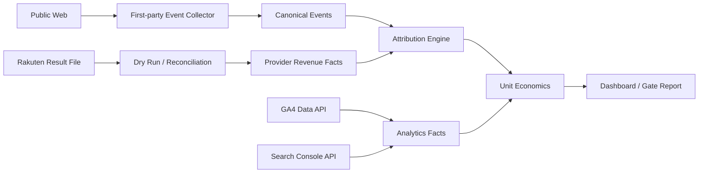

> **状態の読み方**  
> 本書は実装可能な設計として承認済みです。ただし、`IMPLEMENTED`、`VALIDATED`、`DEPLOYED`を意味しません。  
> 特に明記しない限り、アプリケーション実装、実DB適用、外部API実接続、Runtime Test、本番設定は **未実施** です。

# 1. 目的

本書は、検索、記事閲覧、比較行動、楽天送客、Provider成果、費用を同じ定義で追跡し、確定貢献利益と事業Gateを評価するためのMeasurement Architectureを定義する。Eventは20件、KPIは30件を初期契約とする。

# 2. Measurement原則

- Providerが返した成果事実をRAOS推定で上書きしない。
- 発生、確定、取消を別状態・別時点として扱う。
- Direct、Estimated、Unattributedを分離する。
- 計測不能を0成果や0クリックへ変換しない。
- Event名、Parameter、KPI式、Attribution MethodをVersion管理する。
- 個人を追跡するためのFingerprintingを行わない。
- 記事内RecommendationへFinance指標をFeed backしない。
- Dashboardは値だけでなく、Data source、期間、Freshness、Basis、Qualityを表示する。

# 3. Data Flow

# 4. Event Collection

Public Eventは、ClickをBlockingしない`sendBeacon`または`fetch keepalive`を使用する。ただし楽天への直接遷移を常に優先する。Collector障害時にAffiliate URLを中継したり、利用者をError Pageへ送ったりしない。

Client Eventは信用せず、ServerでSchema、Timestamp範囲、Site/Snapshot/CTA存在、Rate、重複を検査する。Bot/Preview/Admin trafficは明示的に分類する。

# 5. GA4とFirst-partyの関係

GA4は集計・探索の補助Providerであり、RAOSの財務正本ではない。GA4へ送るEventはConsent/Privacy方針に従い、Canonical Event IDと個人情報を混同しない。Provider Reporting Identity等の設定が結果へ影響するため、Property設定SnapshotをImport Batchへ記録する。

# 6. Search Console

Search Console FactはDate、Query、Page、Country、Device等のDimension Setを明示して保存する。同じClick数でもDimension組合せを跨いだ単純合算が不正確になり得るため、取得Requestと集計粒度を保持する。遅延・再集計を前提に、直近期間を再取込してSupersedeできる設計とする。

# 7. Revenue Import

MVPはCSV等の人間取得Fileを次の順で扱う。

1. File受領、Hash、Size、MIME、Uploader記録
2. Malware/Formula/Encoding/Zip bomb等の検査
3. Schema検出とColumn mapping
4. Dry RunでRow/Status/Amount/Error/Duplicateを表示
5. Provider画面の合計と人間が照合
6. Dry Run input hashと同じFileだけCommit
7. Canonical Provider Factへ冪等取込
8. 後続の帰属・費用配賦を別Jobで実行

実楽天Reportの匿名化サンプルがまだないため、具体的Column mappingは`EXTERNAL_EVIDENCE_REQUIRED`である。Synthetic Fixture合格を実Report対応済みと表示しない。

# 8. Attribution

## 8.1 Provider Fact

Provider Factは、Providerの行識別子または安定したFingerprint、期間、状態、金額、通貨、取込Batch、原本Hashを持つ。取消や訂正は旧Factを書き換えず、状態履歴またはSuperseding Factで表現する。

## 8.2 Direct

ProviderがSub-ID等の検証可能なKeyを提供し、記事/CTAへ一意に接続できる場合だけDirectとする。実際の楽天ReportでそのKeyが取得できることを確認するまではDirect対応を未検証とする。

## 8.3 Estimated

Estimatedは公式帰属ではない。MVP暫定方式は、利用可能な時刻Bucketとeligible clickの重みによる配賦であり、Method Version、Input Hash、Confidence、Reasonを保存する。十分な信号がなければUnattributedに残す。

# 9. KPI Governance

各KPIは次を必須とする。

- ID、名称、式
- Numerator/DenominatorのSource
- Time grainとCohort
- Included/Excluded traffic
- Attribution basis
- FreshnessとLast successful import
- Unknown/zero/division-by-zeroの扱い
- OwnerとDecision用途

`confirmed_epc`等はDirect/Estimated/All attributedを同じ数字として表示せず、Basis別に切替・内訳表示する。

# 10. Gateへの利用

- GATE-1: 記事、品質、Evidence、公開技術の検証。収益を必須にしない。
- GATE-2: Index、検索表示、Qualified session、送客、Freshnessを観測。
- GATE-3: Confirmed commission、EPC、RPM、Contribution profit、Paybackを評価。
- GATE-4: 複数カテゴリで再現性、集中度、品質維持、運用費を評価。

Gate ReportはSnapshot化し、後からKPI定義が変わっても当時の判定を再現できるようDefinition Versionを保存する。

# 11. Data Quality

最低限、次を監視する。

- Event schema invalid/duplicate/late/future timestamp
- Article/Snapshot/CTA参照不能
- Beacon delivery dropの急変
- GA4/GSC Importの欠落、重複、Dimension drift
- Revenue row/amount/status reconciliation
- Currency/period mismatch
- Direct/Estimated/Unattributed totalとProvider totalの一致
- Cost allocationの未配賦
- KPI denominatorゼロまたはUnknown

# 12. Privacy

- Raw IPを長期分析Keyにしない。
- User-Agent全文を分析Factへ保存せずClassへ正規化する。
- Analytics EventへEmail、氏名、電話、自由入力本文を送らない。
- Consent未確定時は、法的・事業的に必須でないProvider trackingを無効化できる設計にする。
- Security LogとProduct Analyticsの目的・保持・Accessを分離する。

# 13. 受入条件

- 同一Event再送で二重計上しない
- Click Collector障害でも楽天への直接遷移が成功する
- Revenue Dry RunとCommitのFile Hashが一致する
- Provider totalとCanonical totalがReconciliation tolerance内で一致する
- Attribution classとconfidenceが全配賦行に存在する
- KPI式をFixtureから再現できる
- DashboardがFreshness/Data quality/Basisを表示する
- PII/SecretをEvent SchemaとLogへ含めない

# 14. 明示的な未実施

- GA4 Property/Consent Modeの実設定
- Search Console Propertyの権限・実取込
- 楽天成果Report実サンプルの確認
- First-party Collector実装
- 実Click/Conversion計測
- Attribution精度の実データ校正
- Dashboard実装
- KPI閾値の事業実績による校正

これらは設計済みであるが、すべて`NOT_STARTED`または`NOT_EXECUTED`である。
