# RAOS-DATA-001 データモデル・PostgreSQL設計書

| 項目 | 内容 |
|---|---|
| 文書ID | `RAOS-DATA-001` |
| Version | `0.1` |
| 作成日 | `2026-07-30` |
| Status | Baseline Candidate / Codex implementation input |
| 上位文書 | `RAOS-REQ-001 v0.1`, `RAOS-ARCH-001 v0.1` |
| 対象DB | PostgreSQL `18.4` / Amazon RDS for PostgreSQL reference deployment |
| Timezone | DB instantはUTC、事業日付はsite timezone `Asia/Tokyo` |

> 本書は論理モデル、物理モデル、DDL、保持・監査、権限、移行、品質検査を一つの正本として定義する。法定保存期間・個人情報保持期間はproduction有効化前に日本法・税務・プライバシーの専門確認を行う。

## 1. Executive decision

RAOSのデータ層は「記事を保存するDB」ではない。外部の商品事実、根拠、AI処理、人間判断、公開物、匿名計測、楽天側成果、費用、運用監査を、相互に混同せず再現できる意思決定台帳である。

最重要の設計判断は次のとおり。

1. **単一PostgreSQL・複数Schema**をMVPの整合性境界とし、モジュール間の直接更新を権限とService boundaryで制限する。
2. **UUIDv7**を内部IDの標準とし、外部Provider IDを主キーにしない。
3. API原本、AI入出力、Source Packet、公開Snapshot、成果原本等の大きな不変PayloadはObject Storageへ置き、DBにはURI・Version・SHA-256・分類・保持Policyを登録する。
4. 外部情報はObservationとして追記し、Current Projectionは再生成可能にする。
5. 推薦順位はAffiliate rate・Commission・Revenue・Profitを読めない構造にする。
6. 公開はHuman approval済みArticle Versionからimmutable Publication Snapshotを生成し、Public Webは`readmodel`だけを読む。
7. Analyticsの観測、Providerの成果事実、直接帰属、推定帰属、未帰属を区別する。経営指標は確定成果報酬を正本とする。
8. Outbox/Inbox、Idempotency、Job leaseをDBモデルへ含め、at-least-once deliveryを前提にする。
9. Kill SwitchはPublicationとAffiliate Linkを分離し、公開DBにも低Latency Projectionを持つ。
10. Partitioningは最初から乱用せず、件数・Maintenance時間・Query planで閾値を満たしたFact tableだけに導入する。

## 2. Scope and acceptance

### 2.1 Included

- 13 PostgreSQL Schemaと全Table/Column/Constraint/Index/FK
- Object Artifact registry、Outbox/Inbox、Job、Audit、Incident、Kill Switch
- Portfolio、楽天Catalog、Evidence、Editorial、AI、Policy、Publishing
- Freshness、Analytics、Finance、Public Read Model
- DB Role/Grant、Reference seed、Post-deploy validation SQL
- Retention matrix、Data quality rules、Migration playbook、ER diagrams

### 2.2 Excluded from this baseline

- CMS固有テーブル、WordPress内部Schema
- 楽天レビュー本文・投稿者情報・レビュー転載データ
- Customer account、会員プロフィール、決済、注文処理
- Raw IP address、raw user agent、email等を含む行動ログ
- Dedicated vector database、Kafka、Kubernetes、cross-region active/active
- 検索順位SERPの無許諾スクレイピングデータ

### 2.3 Quantitative baseline

| Metric | Count |
|---|---:|
| Schemas | 13 |
| Tables | 130 |
| Columns | 1772 |
| Foreign keys | 357 |
| Explicit/generated indexes | 406 |
| Unique constraints | 135 |
| Check constraints | 549 |
| Hard immutable tables | 21 |
| Data quality rules | 55 |

Acceptanceは、YAML構文、参照整合性、FK索引、要求追跡、禁止Column、identifier長、DDL構造、ZIP checksumが全てPASSし、さらに実環境PostgreSQL 18.4でMigration/rollback/restore/permission integration testを通過した時点とする。

## 3. Context and lineage architecture

```mermaid
flowchart LR
  R[楽天API・許諾済みSource] --> A[ops.object_artifact]
  A --> C[catalog Observation]
  A --> E[evidence Source Snapshot / Fact]
  C --> P[evidence Source Packet Version]
  E --> P
  P --> J[ai.ai_job / ai.ai_attempt]
  J --> V[editorial.article_version]
  P --> V
  V --> Q[policy.quality_check_run]
  Q --> H[publishing Human Review / Approval]
  H --> S[publishing.publication_snapshot]
  S --> M[readmodel Public Projection]
  M --> X[Public Web]
  X --> N[analytics Anonymous/Click Facts]
  F[楽天成果原本] --> CF[finance Commission Facts]
  N --> AT[Direct / Estimated / Unattributed]
  CF --> AT
  CF --> U[finance Unit Economics]
  AT --> U
```

各矢印は「参照可能」を意味し、逆方向の権限を意味しない。特にPublic WebからEditorial/Evidence/Financeへ到達するDB Roleは存在しない。

## 4. PostgreSQL platform baseline

- Target major/minor baseline: PostgreSQL `18.4`.
- `uuidv7()`を組み込み関数として使用するため、baseline DDLはserver_version_num 180000未満を拒否する。
- 全identifierは63 byte以下へ決定的に短縮し、末尾にhashを付ける。
- Extension依存はMVP baselineでゼロとする。`pgcrypto`や`uuid-ossp`へID生成を依存させない。
- Transactional DDLを基本とし、`CREATE INDEX CONCURRENTLY`が必要な本番拡張MigrationはTransaction外の別Revisionとする。
- Foreign keyは参照側Indexを自動生成しないため、本設計Generatorが全FKのleft-prefix Indexを検査・追加する。

## 5. Universal data conventions

### 5.1 IDs

- 内部Entity/Fact/Event IDは`uuid DEFAULT uuidv7()`。時系列順は運用上有用だが、IDの時刻を業務時刻の正本にしない。
- 外部IDは`provider_code`等と組み合わせてUniqueにし、変更・再利用・Provider移行へ耐える。
- UI/問い合わせ用には`display_id`を別に持ち、UUIDを一般利用者へ露出しない。
- Polymorphic IDは限定的に使用し、`target_type`等のEnumとService-level validatorを必須にする。

### 5.2 Time

- Instantは`timestamp with time zone`。Connection timezoneはUTC。
- 楽天成果や日次KPIの`business_date`/`business_month`はsite timezoneで算出し、日付だけを保存する。
- `created_at`は生成時刻、`occurred_at`は事象時刻、`observed_at`は観測時刻、`received_at`は受信時刻を意味し、代替使用しない。

### 5.3 Money, rates, unknown values

- JPY金額は`bigint`で円単位。浮動小数点型を使わない。
- 比率は意味ごとに`numeric(p,s)`を明示する。0、NULL、UNKNOWNを同一視しない。
- Revenueの発生・確定・取消、売上金額・報酬金額、Provider Fact・推定配賦を別Column/Recordで保持する。

### 5.4 JSONB

- JSONBは外部Payload、Evidence locator、Versioned setting、Renderer payload等に限定する。
- Core join、状態、金額、時刻、検索・制約対象はtyped columnにする。
- JSONB object/arrayのtop-level typeをCHECKし、Schema versionまたはPrompt/Output schema versionへ紐付ける。
- 秘密、レビュー本文、任意のHTML、個人識別子を「柔軟だから」という理由でJSONBへ逃がさない。

### 5.5 Null semantics

- NULLはunknown/not applicableを意味する。0、false、empty stringの代用にしない。
- Nullable business keyの一意性が必要な箇所はPostgreSQLの`NULLS NOT DISTINCT` unique indexを使用する。

## 6. Schema ownership map

| Schema | Module | Tables | Purpose |
|---|---|---:|---|
| `ops` | Operations | 16 | ジョブ、原本レジストリ、監査、障害、Kill Switch、実行時設定 |
| `iam` | Identity and Access | 9 | OIDC主体、アプリケーションRole、権限、緊急アクセス |
| `portfolio` | Portfolio | 8 | サイト、カテゴリ、検索意図、キーワード、機会評価、優先アクション |
| `catalog` | Catalog | 18 | 楽天取得、商品同定、ショップ、Offer、外部事実Observation、Current Projection |
| `evidence` | Evidence | 10 | Source、Snapshot、Fact、Source Packet、Claim、根拠対応 |
| `editorial` | Editorial | 13 | 記事企画、構造化記事版、比較、推薦、レビューコメント、内部リンク |
| `ai` | AI Orchestration | 9 | AI Task、Prompt、Schema、Model Route、Job、Attempt、Token・費用、評価 |
| `policy` | Quality and Policy | 8 | Policy Bundle、Rule、品質検査、Finding、Score、Waiver、Gate |
| `publishing` | Publishing | 9 | 人間Review、Approval、Publication Snapshot、公開状態、Route、Rollback |
| `freshness` | Freshness | 6 | 鮮度SLA、Refresh、Staleness、Affiliate Link検査、影響分析 |
| `analytics` | Analytics | 8 | 匿名行動、楽天クリック、GSC・GA4取込、帰属推定、日次指標 |
| `finance` | Finance | 10 | 成果原本取込、発生・確定・取消、費用配賦、確定ユニットエコノミクス |
| `readmodel` | Public Read Model | 6 | 公開Rendererが読む安全な再生成可能Projection |

## 7. Transaction and consistency boundaries

### 7.1 Command transaction

Domain Aggregateの変更と`ops.outbox_event`のInsertは同一Transactionでcommitする。外部API、LLM、Object Storage upload、通知はTransaction内で実行しない。大きなArtifactは先にupload・digest検証し、その参照だけを短いDB Transactionへ登録する。

### 7.2 Worker idempotency

`ops.job.idempotency_key`、`ops.inbox_receipt`、Provider event hash、Artifact SHA-256、Publication request keyを使い、同じMessage/CSV/API responseが再処理されても副作用が一度だけになるようにする。

### 7.3 Snapshot transaction

Publication Snapshot buildは、対象Article Version、Source Packet、Policy Bundle、Quality Run、Final Approvalを固定し、Object Artifact upload成功後にSnapshot manifestとCandidate状態を同一Transactionで確定する。Public projectionはSnapshot IDを入力に別Jobで再生成する。

### 7.4 Finance import transaction

成果原本はUpload→scan→parse→dry run→human confirm→canonical import→reconcileの段階を分ける。Provider rowとCommission eventの冪等Keyを先に確定し、推定帰属をCommission本体へ書き戻さない。

## 8. Immutability and correction model

不変とは「誤りを放置する」ことではない。訂正は旧Recordを変更せず、新Record、supersedes relation、correction event、current projection更新で表現する。Baseline DDLでは特に重要な21 TableにUPDATE/DELETE拒否Triggerを設定する。Retention/法的削除は`raos_migrator`かつ明示的maintenance settingの二条件がなければ実行できない。

**不変対象の代表例:**

- `analytics.affiliate_click_event`
- `analytics.anonymous_event`
- `catalog.affiliate_link_observation`
- `catalog.availability_observation`
- `catalog.grouping_decision`
- `catalog.price_observation`
- `catalog.review_aggregate_observation`
- `evidence.claim_evidence_link`
- `evidence.fact`
- `evidence.fact_derivation`
- `evidence.source_packet_fact`
- `evidence.source_packet_product`
- `evidence.source_snapshot`
- `finance.commission_event`
- `finance.cost_allocation`
- `ops.audit_event`
- `ops.kill_switch_change`
- `ops.object_artifact`
- `publishing.publication_event`
- `publishing.publication_snapshot`
- `publishing.review_decision`

## 9. Security, privacy, and segregation of duties

- DB Login roleとGroup roleを分離する。生成SQLはNOLOGIN group roleのみを作る。CredentialはSecrets Manager/OIDC/IAM authentication等の外部Secret boundaryで管理する。
- `raos_public_ro`は`readmodel`のみUSAGE/SELECT。
- `raos_projection_rw`だけがreadmodelを書き換え、Public Webは書き込まない。
- Final approval、Revenue import confirmation、Waiver、Kill Switch、RollbackはCRITICAL permission。
- Audit readerは決定証拠を読めるが業務Recordを更新できない。
- Raw analyticsではIP、raw UA、email、URL query、自由入力Identifierを受けない。PseudonymはSHA-256等の一方向値と短い保持期間を使う。
- IAM emailはRESTRICTED PIIであり、行動・記事・収益分析のjoin keyにしない。

## 10. Publication database invariants

DB Triggerは最終防衛線として以下を検査する。Application serviceは同じ検査を先に実施し、利用者へ理解可能なErrorを返す。

1. AI JobのSource Packet Versionは`APPROVED`。
2. Final approval actorはactiveなHuman USER principal。
3. Quality Runは対象Article Versionと一致し`PASSED`、mandatory subscoreを満たす。
4. Open blocking findingは0。
5. Final Approvalは失効・取消されていない。
6. Publication Kill SwitchがGlobal/Site/Category/Articleのいずれにもengagedでない。
7. Publication state=`PUBLISHED`にはCurrent Snapshotが必要。
8. Public Read ModelはCurrent Publication Snapshotからのみ生成する。

## 11. Catalog and evidence semantics

### 11.1 Product identity

楽天の商品ListingをそのままCanonical Productとみなさない。`product_candidate`がProvider由来候補、`grouping_decision`がmerge/split判断、`product_group_membership`が有効期間付き関係、`canonical_product`が比較対象となる商品概念、`offer`がショップ単位の販売Listingである。

### 11.2 Observations and current projection

価格、在庫、レビュー件数/平均、Affiliate URLは取得時点のObservationとして追記する。`offer_current_projection`は最新の受理済みObservationを指すだけで、過去を破壊しない。レビュー本文は保持しない。

### 11.3 Facts, claims, and support

`source_snapshot`は原本、`fact`は正規化事実、`source_packet_version`は生成時の入力集合、`claim`は記事内主張、`claim_evidence_link`はSUPPORTS/CONTRADICTS/QUALIFIESの関係である。Public claimはSource Packet IDと具体的Fact/Source locatorを辿れることを必須とする。

## 12. Analytics and finance truth model

| Layer | Authority | Example | May drive North Star directly |
|---|---|---|---:|
| First-party observation | 自サイトで観測 | page view / affiliate click | No |
| Provider fact | 楽天成果原本 | generated / confirmed / cancelled commission | **Yes, confirmed only** |
| Direct attribution | Providerが提供する直接Key | article/sub-ID等へ直接対応 | Yes, with label |
| Estimated attribution | RAOS model | time-window/statistical allocation | No; separate display |
| Unattributed | 合理的配賦不能 | Site total only | Site total only |

記事別貢献利益はapproved attributionと配賦済みcostで計算する。推定値をProvider Factとして表示せず、計算Version・Confidence・Signalを保存する。

## 13. Index strategy

- PK/UniqueはPostgreSQLがB-tree indexを作る。FK参照側は自動作成されないため全FKをstatic lintしleft-prefix Indexを生成する。
- Job queue、Outbox、Review queue、Open finding、Active route等はpartial indexを使う。
- High-cardinality Observationは`entity_id, observed_at`順。Date-only分析は日/月列を先頭にした別Indexを必要Queryで追加する。
- JSONB GIN indexはAccess patternが証明されるまで作らない。Payload全体GINはwrite amplificationとindex bloatを招くため禁止を既定とする。
- Covering INCLUDE indexはEXPLAIN/BUFFERSと実測Read pathで決める。
- Index追加はproductionで`CREATE INDEX CONCURRENTLY`、失敗index cleanup、replica lag監視を含む専用Migrationにする。

## 14. Partition strategy

MVPの30〜45記事規模で全TableをPartition化する必要はない。Partition candidateはRaw event、Affiliate click、GSC/GA4 Observation、価格・Link check、Commission event等の時間系列Factである。

**導入条件:**

- 1 Tableが50 million rows、または100 GB、またはretention deleteが30分超、またはvacuum/index maintenanceがSLOへ影響する。
- Target queryがpartition keyを含み、EXPLAINでpruningが確認できる。
- Global uniqueness/FK制約の制限を受け入れられる。
- 事前にfuture/default partition、late event、detach/archive、partition creation alertを実装する。

Metadataの`partitioning`は将来方針であり、baseline DDLは通常Tableを作成する。初日からのpartitioning指定があるanonymous/click eventも、Codex実装時に負荷試験と運用能力を確認し、Migration Waveで最終選択する。

## 15. Retention and deletion

保持期間は技術値ではなくPolicy Versionで管理する。`ops.retention_policy`がEffective date、Scope、Action、Hold条件を持ち、JobはDry Run report→Approver→Deletion/Anonymization→Audit Eventの順で実行する。

| Retention class | Minimum / maximum | Default action | Legal review |
|---|---|---|---:|
| `AI_CONFIG_7Y` | 7 years after last use | retain prompt/schema/model-route version | YES |
| `AI_EVAL_3Y` | 37 months | retain aggregate evaluation and sampled evidence | YES |
| `AI_RUN_3Y` | 37 months online; longer artifact retention where publication-referenced | aggregate usage; retain referenced I/O by artifact policy | YES |
| `ANALYTICS_25M` | 25 months | roll up/archive | YES |
| `ANALYTICS_AGG_25M` | 25 months online; longer aggregate archive optional | roll up or archive | YES |
| `ANALYTICS_CLICK_25M` | 25 months (provisional) | retain pseudonymous click facts; delete on approved schedule | YES |
| `ANALYTICS_RAW_90D` | 90 days maximum by default | aggregate then hard delete | YES |
| `AUDIT_7Y_PROVISIONAL` | 7 years (provisional) | WORM archive; no routine mutation | YES |
| `BUSINESS_CORE` | active lifetime + 7 years (provisional) | archive then reviewed delete/anonymize | YES |
| `BY_ARTIFACT_KIND` | policy by artifact_kind | object lock/archive/delete per registered policy | YES |
| `CATALOG_CURRENT` | while provider taxonomy is active + 25 months | retain superseded taxonomy for lineage | NO |
| `CATALOG_HISTORY` | site lifetime + 7 years (provisional) | archive inactive entities; never break publication lineage | YES |
| `CONFIG_7Y` | 7 years after supersession | archive; preserve versions used by retained decisions | YES |
| `CONFIG_PERMANENT` | indefinite | retain all versions | NO |
| `CONTENT_7Y_PROVISIONAL` | 7 years after last use/publication (provisional) | archive; delete only after hold check | YES |
| `EVIDENCE_7Y_PROVISIONAL` | 7 years after last referenced publication (provisional) | archive with hashes and lineage | YES |
| `FINANCE_7Y_PROVISIONAL` | 7 fiscal years or longer where required (provisional) | archive; delete only after finance/legal approval | YES |
| `IAM_LIFECYCLE` | account lifetime + 7 years (provisional) | pseudonymize contact data when no longer needed; retain audit key | YES |
| `IAM_SESSION_2Y` | 25 months maximum | delete after security horizon | YES |
| `IDEMPOTENCY_UNTIL_EXPIRY` | record expires_at plus safety buffer | delete after related workflow reaches terminal state | NO |
| `INBOX_400D` | 400 days | delete after deduplication horizon | NO |
| `INCIDENT_7Y_PROVISIONAL` | 7 years after closure (provisional) | retain with audit/legal hold | YES |
| `OBSERVATION_3Y` | 37 months online/nearline | retain monthly rollups longer where needed | YES |
| `OPS_2Y_PROVISIONAL` | 25 months (provisional) | aggregate then delete after incident/legal hold check | YES |
| `OPS_ALERT_2Y` | 25 months | archive aggregate and delete details | NO |
| `OPS_JOB_2Y` | 25 months (provisional) | retain summary; expire large payload artifacts separately | YES |
| `OUTBOX_180D` | 180 days after successful publication | delete after consumer reconciliation and audit export | NO |
| `POLICY_7Y` | 7 years after supersession | retain all policy/rule versions used for decisions | YES |
| `PUBLICATION_PERMANENT` | indefinite while site exists | retain immutable snapshot and hash | YES |
| `RAW_PROVIDER_2Y` | 25 months unless source-specific policy is longer | archive or delete after normalized reconciliation | YES |
| `REBUILDABLE` | recovery window only | truncate/rebuild | NO |
| `REGENERABLE` | none beyond recovery window | truncate and rebuild from immutable source | NO |
| `RELEASE_7Y` | 7 years | retain manifest, digest and rollback lineage | YES |
| `SOURCE_SNAPSHOT_7Y_PROVISIONAL` | 7 years after last referenced publication (provisional) | WORM archive; delete only after lineage/hold check | YES |

Retention Jobはopen incident、legal hold、audit request、financial close未完、publication lineage参照、disputeを検査し、一件でも該当すれば削除しない。Object StorageとDB rowの削除順はDB tombstone/plan→object delete→verification→registry finalizationとし、孤児検査を日次実行する。

## 16. Migration strategy

詳細は同梱のMigration Playbookを正本とする。原則はExpand → Backfill → Dual-read/write → Validate → Cutover → Contractであり、Applicationの一つ前のReleaseと後方互換を維持する。Large tableへFK/CHECKを追加する際は可能な場合`NOT VALID`で追加し、別工程で`VALIDATE CONSTRAINT`する。UniqueはCONCURRENTLY indexを作成後、必要ならConstraintへattachする。

## 17. Test strategy

### 17.1 Static model tests

- Table/Column/Index/Constraint ID重複、63-byte limit、FK target/type/key、FK supporting index
- 禁止Secret field、楽天Review本文field、Editorial/ReadmodelのAffiliate economics field
- FR-001〜FR-020のTable trace coverage、Retention/Class coverage
- YAML parse、CSV row count、DDL lexical balance、Manifest checksum

### 17.2 PostgreSQL integration tests

- Baseline DDL fresh install、seed rerun、post-deploy validation
- Circular FK transaction、immutable guard、maintenance override
- AI packet approval guard、Final approval guard、Kill Switch guard
- Role privilege positive/negative tests
- Outbox atomicity、Inbox duplicate delivery、Job lease races
- Publication Snapshot exact rollback、readmodel full rebuild
- Revenue duplicate import、Commission state transition、allocation reconciliation
- PITR restore、Object artifact hash restore、quarterly disaster recovery drill

### 17.3 Performance tests

- Public route/article/product/offer read P95/P99 under expected CDN miss load
- Queue claim with competing workers
- Offer current projection refresh
- GSC/GA4 and revenue batch import throughput
- 10x expected GATE-4 data EXPLAIN/BUFFERS and bloat/vacuum behavior

## 18. Codex implementation sequence

### MIG-001: Foundation schemas and shared operations

- Schemas: `ops`, `iam`
- Architecture slices: `SLICE-003`, `SLICE-004`, `SLICE-005`, `SLICE-007`
- Deliverables: Alembic revision(s), SQLAlchemy models, repository/transaction tests, permission tests, migration README.

### MIG-002: Portfolio planning

- Schemas: `portfolio`
- Architecture slices: `SLICE-006`
- Deliverables: Alembic revision(s), SQLAlchemy models, repository/transaction tests, permission tests, migration README.

### MIG-003: Rakuten catalog and observations

- Schemas: `catalog`
- Architecture slices: `SLICE-008`, `SLICE-009`
- Deliverables: Alembic revision(s), SQLAlchemy models, repository/transaction tests, permission tests, migration README.

### MIG-004: Evidence lineage

- Schemas: `evidence`
- Architecture slices: `SLICE-010`
- Deliverables: Alembic revision(s), SQLAlchemy models, repository/transaction tests, permission tests, migration README.

### MIG-005: AI and structured editorial

- Schemas: `ai`, `editorial`
- Architecture slices: `SLICE-011`, `SLICE-012`
- Deliverables: Alembic revision(s), SQLAlchemy models, repository/transaction tests, permission tests, migration README.

### MIG-006: Policy, human approval, and publication

- Schemas: `policy`, `publishing`
- Architecture slices: `SLICE-013`, `SLICE-014`, `SLICE-015`
- Deliverables: Alembic revision(s), SQLAlchemy models, repository/transaction tests, permission tests, migration README.

### MIG-007: Public projection and freshness

- Schemas: `readmodel`, `freshness`
- Architecture slices: `SLICE-016`, `SLICE-018`, `SLICE-022`
- Deliverables: Alembic revision(s), SQLAlchemy models, repository/transaction tests, permission tests, migration README.

### MIG-008: Analytics and finance

- Schemas: `analytics`, `finance`
- Architecture slices: `SLICE-017`, `SLICE-019`, `SLICE-020`, `SLICE-021`
- Deliverables: Alembic revision(s), SQLAlchemy models, repository/transaction tests, permission tests, migration README.

### MIG-009: Operational hardening and validation

- Schemas: `ops`, `iam`, `portfolio`, `catalog`, `evidence`, `editorial`, `ai`, `policy`, `publishing`, `freshness`, `analytics`, `finance`, `readmodel`
- Architecture slices: `SLICE-023`, `SLICE-024`, `SLICE-025`
- Deliverables: Alembic revision(s), SQLAlchemy models, repository/transaction tests, permission tests, migration README.

Codexは一度に全130 Tableを実装せず、各WaveをPR分割する。各PRはmigration upgrade/downgrade、model、repository contract、fixture、unit/integration test、generated catalog drift testを含む。DDL正本とORM modelが不一致ならCIを失敗させる。

## 19. Data quality rules

機械可読正本は`RAOS_03_data_quality_rules_v0.1.yaml`。全55 RuleをRule IDでMonitoring、Gate、Runbookへ接続する。

| ID | Severity | Scope | Enforcement | Assertion |
|---|---|---|---|---|
| `DQ-001` | `CRITICAL` | `ALL_TABLES` | `DDL` | Every table has a non-null primary key. |
| `DQ-002` | `CRITICAL` | `ALL_FK` | `DDL` | Every FK targets a PK/unique key of compatible types. |
| `DQ-003` | `HIGH` | `ALL_FK` | `STATIC_LINT` | Every FK column tuple is a left-prefix of an index/PK/unique key. |
| `DQ-004` | `CRITICAL` | `ops.object_artifact` | `CHECK+SERVICE` | sha256 is lowercase 64 hex and the object digest matches. |
| `DQ-005` | `CRITICAL` | `ALL_COLUMNS` | `STATIC_LINT` | No password, access key, secret, private key, or bearer token column exists. |
| `DQ-006` | `CRITICAL` | `catalog` | `STATIC_LINT+POLICY` | No review body, author, text, or copied review content field is stored. |
| `DQ-007` | `CRITICAL` | `editorial,readmodel` | `STATIC_LINT` | No affiliate_rate, commission, revenue, or profit field is present. |
| `DQ-008` | `CRITICAL` | `ai.ai_job` | `TRIGGER` | AI job source packet version is APPROVED before insertion or reroute. |
| `DQ-009` | `CRITICAL` | `evidence.claim` | `BATCH_GATE` | Every publishable factual/quantitative/recommendation claim has at least one valid support link. |
| `DQ-010` | `CRITICAL` | `evidence.claim_evidence_link` | `BATCH_GATE` | No publishable claim has an unresolved CONTRADICTS relation. |
| `DQ-011` | `CRITICAL` | `evidence.source_packet_version` | `ARTIFACT_HASH` | Approved packet content hash and artifact are never mutated. |
| `DQ-012` | `HIGH` | `editorial.article_version` | `UNIQUE+SERVICE` | Version numbers start at one and are contiguous per article. |
| `DQ-013` | `HIGH` | `editorial.article_block` | `UNIQUE` | block_key and position are unique within article version. |
| `DQ-014` | `CRITICAL` | `editorial.recommendation` | `CODE_REVIEW+STATIC_LINT` | Rank computation does not read affiliate rate or finance tables. |
| `DQ-015` | `CRITICAL` | `policy.quality_score` | `CHECK` | passed requires total >= pass score, factual >=18/20, disclosure=5/5. |
| `DQ-016` | `CRITICAL` | `publishing` | `TRIGGER` | Final approval and publication candidate have no unresolved blocking finding. |
| `DQ-017` | `CRITICAL` | `publishing.approval` | `TRIGGER+RBAC` | Final APPROVED decision is made by an active USER principal. |
| `DQ-018` | `CRITICAL` | `publishing.approval` | `TRIGGER` | Publication cannot use an approval superseded by REVOKED. |
| `DQ-019` | `CRITICAL` | `publishing` | `TRIGGER+SERVICE` | No publish transition occurs while an applicable publication switch is engaged. |
| `DQ-020` | `CRITICAL` | `publishing.publication_snapshot` | `HASH+CONTRACT_TEST` | Manifest digest equals stored artifact bytes and rendered projection input. |
| `DQ-021` | `CRITICAL` | `readmodel` | `FK+PROJECTION_TEST` | Every public row traces to the current approved publication snapshot. |
| `DQ-022` | `CRITICAL` | `raos_public_ro` | `GRANT_TEST` | Public role can SELECT only readmodel objects and safe functions. |
| `DQ-023` | `CRITICAL` | `catalog.affiliate_link_observation` | `CHECK+ADAPTER_TEST` | Affiliate URL is HTTPS, API returned, and has valid destination host/hash. |
| `DQ-024` | `CRITICAL` | `analytics.affiliate_click_event` | `ARCH_TEST` | Click analytics is a side-channel beacon and never becomes the outbound URL. |
| `DQ-025` | `HIGH` | `catalog.price_observation` | `CHECK` | Price and shipping amounts are nonnegative JPY integers or unknown. |
| `DQ-026` | `HIGH` | `catalog observations` | `CHECK+BATCH` | valid_until is after observed_at and current projection picks latest accepted observation. |
| `DQ-027` | `HIGH` | `catalog.grouping_decision` | `WORKFLOW` | Merge/split decisions retain actor, evidence, method, and supersession chain. |
| `DQ-028` | `CRITICAL` | `freshness.staleness_assessment` | `EVENT_HANDLER` | Critical price/link/source staleness applies configured block or disable action. |
| `DQ-029` | `CRITICAL` | `freshness.link_check` | `SERVICE+BATCH` | CTA is disabled for unsafe or unexpected destination hosts. |
| `DQ-030` | `CRITICAL` | `analytics.anonymous_event` | `SCHEMA+INGEST_ALLOWLIST` | No raw IP, full user agent, email, URL query, or free-form identifier is accepted. |
| `DQ-031` | `CRITICAL` | `analytics.anonymous_event` | `RETENTION_JOB` | Raw anonymous events older than configured maximum are deleted after aggregate verification. |
| `DQ-032` | `HIGH` | `analytics.gsc_observation` | `IMPORT_TEST` | Provider suppression/threshold flags are preserved and query is sanitized. |
| `DQ-033` | `HIGH` | `analytics` | `UNIQUE` | Source/date/dimension grain cannot be imported twice. |
| `DQ-034` | `CRITICAL` | `analytics.attribution_estimate` | `CHECK+UI` | DIRECT, ESTIMATED, and UNATTRIBUTED remain visibly distinct. |
| `DQ-035` | `HIGH` | `analytics.attribution_estimate` | `BATCH` | Approved allocations per commission sum to one within decimal tolerance. |
| `DQ-036` | `CRITICAL` | `finance.revenue_import` | `UNIQUE+HASH` | Same provider source artifact cannot be canonically imported twice. |
| `DQ-037` | `CRITICAL` | `finance.revenue_import` | `WORKFLOW` | Canonical import requires malware/format pass, dry-run, and human confirmation. |
| `DQ-038` | `CRITICAL` | `finance.commission_event` | `UNIQUE+HASH` | Same provider event cannot create duplicate commission transitions. |
| `DQ-039` | `CRITICAL` | `finance.commission` | `CALCULATION_POLICY` | North-star revenue uses confirmed commission, never generated commission. |
| `DQ-040` | `CRITICAL` | `finance.cost_allocation` | `BATCH` | Allocated amounts and ratios reconcile to each source cost. |
| `DQ-041` | `CRITICAL` | `finance.unit_economics_snapshot` | `CHECK` | confirmed commission - external cost - human cost equals contribution profit. |
| `DQ-042` | `HIGH` | `money fields` | `SCHEMA_LINT` | JPY amounts use bigint integers; rates use explicit numeric scales. |
| `DQ-043` | `HIGH` | `time fields` | `CONTRACT_TEST` | Instants are timestamptz UTC; business_date/month is derived using site Asia/Tokyo policy. |
| `DQ-044` | `CRITICAL` | `ops.outbox_event` | `INTEGRATION_TEST` | Domain state and outbox insert commit in one transaction. |
| `DQ-045` | `CRITICAL` | `ops.inbox_receipt` | `UNIQUE+INTEGRATION_TEST` | Duplicate delivery does not repeat domain side effects. |
| `DQ-046` | `CRITICAL` | `ops.job` | `CHECK+CONCURRENCY_TEST` | Only current lease owner may complete a running job; expired jobs can be recovered. |
| `DQ-047` | `HIGH` | `ops.audit_event` | `BATCH` | Audit export count/hash reconciles to source range and object artifact. |
| `DQ-048` | `CRITICAL` | `ops.kill_switch` | `TRIGGER` | Each state change increments generation and emits immutable change/audit records. |
| `DQ-049` | `MEDIUM` | `jsonb columns` | `QUERY_REVIEW` | Core joins/filters use typed columns; JSONB is payload/evidence, not hidden relational schema. |
| `DQ-050` | `MEDIUM` | `large facts` | `CAPACITY_REVIEW` | Partition only at documented thresholds and prove pruning/maintenance benefit. |
| `DQ-051` | `CRITICAL` | `all migrations` | `CI` | Expand/migrate/contract sequence supports at least one previous application release. |
| `DQ-052` | `HIGH` | `large tables` | `MIGRATION_REVIEW` | Use NOT VALID then VALIDATE where supported and needed to avoid long blocking scans. |
| `DQ-053` | `CRITICAL` | `database+objects` | `OPERATIONS` | Quarterly restore verifies RPO/RTO, artifact hashes, and projection rebuild. |
| `DQ-054` | `HIGH` | `database` | `CI+DAILY_JOB` | Live catalog matches approved migration digest except approved emergency changes. |
| `DQ-055` | `CRITICAL` | `retention` | `RETENTION_JOB` | Deletion is blocked by open incident, dispute, audit, finance close, or legal hold. |

## 20. Open production decisions

以下は設計不足ではなく、production contextで確定すべき明示的Decisionである。暫定値をCodeへ埋め込まない。

1. RDS instance class、Multi-AZ、storage type/IOPS、backup window、PITR retention。
2. IAM DB authenticationかrotating passwordか、connection poolerの採否。
3. Anonymous analyticsの同意要件、Salt rotation、最大保持日数。
4. Finance/Tax recordの最終法定保持期間とlegal hold process。
5. GSC query textを保存するか、hash/aggregateだけにするか。
6. GATE-4でのPartitioning閾値とArchive storage class。
7. Public rendererでHTMLを保存するかcomponent JSONのみとするか。Baselineはsanitize済みHTMLとallowlist JSONの両方を許容する。
8. Product同定のhuman review thresholdと誤merge correction SLO。
9. Direct attribution用の楽天側提供field/sub-IDの最終可用性。
10. RLSの導入。MVPはSchema/Role/Service authorizationを主境界とし、複数Tenant化時に再評価する。

## 21. Schema and table specification

以下がTable/Columnレベルの物理正本である。SQL DDLとYAML Catalogはこの定義から生成する。

## 21.1 `ops` — Operations

ジョブ、原本レジストリ、監査、障害、Kill Switch、実行時設定

| Table | Responsibility | Pattern | Class | Retention | Gate-1 / Gate-4 | Slice |
|---|---|---|---|---|---:|---|
| `ops.object_artifact` | S3互換Object Storage上の原本・入力・出力・公開Snapshotを登録する不変レジストリ。 | `APPEND_ONLY` | `CONFIDENTIAL` | `BY_ARTIFACT_KIND` | <10k / <10m | `SLICE-007` |
| `ops.job` | 非同期作業の業務上の正本。Scheduler、API、Eventから作成され、Attemptとは分離する。 | `MUTABLE` | `CONFIDENTIAL` | `OPS_JOB_2Y` | <50k / <50m | `SLICE-004` |
| `ops.job_attempt` | Jobの各実行Attemptを追記保存し、Retry、Provider call、入出力Artifact、失敗原因を再現可能にする。 | `LIFECYCLE` | `CONFIDENTIAL` | `OPS_JOB_2Y` | <100k / <100m | `SLICE-004` |
| `ops.outbox_event` | 業務TransactionとEvent発行を原子的に接続するTransactional Outbox。 | `MUTABLE` | `CONFIDENTIAL` | `OUTBOX_180D` | <100k / <100m | `SLICE-004` |
| `ops.inbox_receipt` | Consumer単位でEvent処理済みを記録し、at-least-once配送の重複を無害化する。 | `APPEND_ONLY` | `INTERNAL` | `INBOX_400D` | <100k / <100m | `SLICE-004` |
| `ops.idempotency_record` | HTTP Command等の二重送信を検出し、同じKey＋同じpayloadへ同じ結果を返す。 | `MUTABLE` | `CONFIDENTIAL` | `IDEMPOTENCY_UNTIL_EXPIRY` | <50k / <10m | `SLICE-004` |
| `ops.audit_event` | 管理操作・自動化操作・権限変更・公開・Kill Switch等を追記記録する監査正本。 | `APPEND_ONLY` | `RESTRICTED` | `AUDIT_7Y_PROVISIONAL` | <500k / <500m | `SLICE-004` |
| `ops.audit_export` | Audit Eventの定期不変Export、件数、範囲、manifest hashを登録する。 | `LIFECYCLE` | `RESTRICTED` | `AUDIT_7Y_PROVISIONAL` | <1k / <100k | `SLICE-023` |
| `ops.alert` | 監視・契約変更・データ品質・鮮度・SecurityのAlertを重複集約する。 | `MUTABLE` | `CONFIDENTIAL` | `OPS_ALERT_2Y` | <10k / <1m | `SLICE-023` |
| `ops.incident` | 重大障害・規約・誤送客・Security事象のライフサイクル正本。 | `MUTABLE` | `RESTRICTED` | `INCIDENT_7Y_PROVISIONAL` | <1k / <100k | `SLICE-022` |
| `ops.incident_event` | IncidentのContainment、判断、復旧、再発防止等の時系列イベント。 | `APPEND_ONLY` | `RESTRICTED` | `INCIDENT_7Y_PROVISIONAL` | <10k / <1m | `SLICE-022` |
| `ops.kill_switch` | Publication、Affiliate Link、Providerをglobal/site/category/article/provider scopeで緊急停止する現在状態。 | `MUTABLE` | `RESTRICTED` | `BUSINESS_CORE` | <1k / <100k | `SLICE-022` |
| `ops.kill_switch_change` | Kill Switch変更を追記保存し、誰が、なぜ、どのgenerationへ変更したかを残す。 | `APPEND_ONLY` | `RESTRICTED` | `AUDIT_7Y_PROVISIONAL` | <10k / <1m | `SLICE-022` |
| `ops.runtime_setting_version` | Feature Flag、閾値、Provider version、SLA等の非秘密設定をVersion管理する。 | `LIFECYCLE` | `CONFIDENTIAL` | `CONFIG_7Y` | <10k / <1m | `SLICE-004` |
| `ops.retention_policy` | Data Classごとの保持、匿名化、削除、Legal Hold可否をVersion付きで定義する。 | `LIFECYCLE` | `CONFIDENTIAL` | `CONFIG_7Y` | <1k / <10k | `SLICE-025` |
| `ops.release` | Git SHA、Container image、DB revision、環境、Rollback関係を記録するRelease台帳。 | `LIFECYCLE` | `CONFIDENTIAL` | `RELEASE_7Y` | <1k / <100k | `SLICE-024` |

### `ops.object_artifact`

S3互換Object Storage上の原本・入力・出力・公開Snapshotを登録する不変レジストリ。

- **Owner:** `ops`
- **Write pattern:** `APPEND_ONLY`; database mutation guard enabled
- **Classification:** `CONFIDENTIAL`
- **Retention:** `BY_ARTIFACT_KIND` — policy by artifact_kind
- **Expected rows:** GATE-1 <10k; GATE-4 <10m
- **Partitioning:** NONE_MVP
- **Requirement trace:** `FR-002`, `FR-004`, `FR-018`, `FR-020`, `NFR-DATA-001`, `NFR-BACKUP-001`
- **Implementation slice:** `SLICE-007`

**Design notes**

- DBには原本本文を保存せず、URI・Version・hash・metadataのみを保存する。

| Column | PostgreSQL type | Null | Default | Class | Description |
|---|---|---:|---|---|---|
| `id` | `uuid` | NO | `uuidv7()` | `INTERNAL` | 内部主キー。PostgreSQL 18のuuidv7()で生成する時系列順UUID。 |
| `display_id` | `text` | NO | `—` | `INTERNAL` | OBJ-接頭辞を持つアプリケーション生成の不変表示ID。 |
| `artifact_kind` | `text` | NO | `—` | `INTERNAL` | raw_provider_response、source_snapshot、source_packet、ai_input、ai_output、publication_snapshot、revenue_original、audit_export等。 |
| `storage_provider` | `text` | NO | `'s3'` | `INTERNAL` | storage provider |
| `bucket_name` | `text` | NO | `—` | `INTERNAL` | bucket name |
| `object_key` | `text` | NO | `—` | `INTERNAL` | object key |
| `object_version` | `text` | YES | `—` | `INTERNAL` | Object VersioningのVersion ID。ローカル環境ではNULL可。 |
| `content_type` | `text` | NO | `—` | `INTERNAL` | content type |
| `byte_size` | `bigint` | NO | `—` | `INTERNAL` | byte size |
| `sha256` | `text` | NO | `—` | `INTERNAL` | sha256 |
| `encryption_state` | `text` | NO | `—` | `INTERNAL` | encryption state |
| `retention_class` | `text` | NO | `—` | `INTERNAL` | retention class |
| `is_immutable` | `boolean` | NO | `true` | `INTERNAL` | is immutable |
| `source_system` | `text` | NO | `—` | `INTERNAL` | source system |
| `acquired_at` | `timestamptz` | YES | `—` | `INTERNAL` | acquired at |
| `created_by_principal_id` | `uuid` | YES | `—` | `CONFIDENTIAL` | 作成操作を行ったIAM Principal。 |
| `metadata` | `jsonb` | NO | `'{}'::jsonb` | `INTERNAL` | Objectタグ、parser、provider request ID等。秘密・原本文は含めない。 |
| `created_at` | `timestamptz` | NO | `CURRENT_TIMESTAMP` | `INTERNAL` | レコード作成時刻。UTCのtimestamptz。 |

**Primary key:** `id`

**Unique constraints**

- `uq_ops_object_artifact_display_id`: (`display_id`)

**Check constraints**

- `ck_ops_object_artifact_kind`: `artifact_kind IN ('raw_provider_response', 'raw_primary_source', 'source_snapshot', 'source_packet', 'ai_input', 'ai_output', 'publication_snapshot', 'revenue_original', 'revenue_rejects', 'audit_export', 'quality_report', 'diff', 'import_report', 'other')`
- `ck_ops_object_artifact_size`: `byte_size >= 0`
- `ck_ops_object_artifact_sha`: `sha256 ~ '^[0-9a-f]{64}$'`
- `ck_ops_object_artifact_enc`: `encryption_state IN ('SSE_KMS', 'SSE_S3', 'LOCAL_DEV')`
- `ck_ops_object_artifact_meta`: `jsonb_typeof(metadata) = 'object'`

**Indexes**

- `uq_ops_object_artifact_location` on (`bucket_name, object_key, object_version`) — UNIQUE; btree; NULLS NOT DISTINCT
- `ix_ops_object_artifact_sha` on (`sha256`) — NONUNIQUE; btree
- `ix_ops_object_artifact_kind_created` on (`artifact_kind, created_at`) — NONUNIQUE; btree

### `ops.job`

非同期作業の業務上の正本。Scheduler、API、Eventから作成され、Attemptとは分離する。

- **Owner:** `ops`
- **Write pattern:** `MUTABLE`
- **Classification:** `CONFIDENTIAL`
- **Retention:** `OPS_JOB_2Y` — 25 months (provisional)
- **Expected rows:** GATE-1 <50k; GATE-4 <50m
- **Partitioning:** CANDIDATE_BY_CREATED_AT_AFTER_10M
- **Requirement trace:** `NFR-REL-001`, `NFR-REL-002`, `FR-018`, `FR-020`
- **Implementation slice:** `SLICE-004`

| Column | PostgreSQL type | Null | Default | Class | Description |
|---|---|---:|---|---|---|
| `id` | `uuid` | NO | `uuidv7()` | `INTERNAL` | 内部主キー。PostgreSQL 18のuuidv7()で生成する時系列順UUID。 |
| `display_id` | `text` | NO | `—` | `INTERNAL` | JOB-接頭辞を持つアプリケーション生成の不変表示ID。 |
| `job_type` | `text` | NO | `—` | `INTERNAL` | job type |
| `queue_name` | `text` | NO | `—` | `INTERNAL` | queue name |
| `status` | `text` | NO | `'PENDING'` | `INTERNAL` | 業務状態を示す安定Enum文字列。 |
| `priority` | `smallint` | NO | `50` | `INTERNAL` | priority |
| `idempotency_key` | `text` | YES | `—` | `INTERNAL` | idempotency key |
| `site_id` | `uuid` | YES | `—` | `INTERNAL` | 対象サイト。MVPは1サイトだが将来の複数サイトを識別可能にする。 |
| `aggregate_type` | `text` | YES | `—` | `INTERNAL` | aggregate type |
| `aggregate_id` | `uuid` | YES | `—` | `INTERNAL` | aggregate id |
| `payload` | `jsonb` | NO | `'{}'::jsonb` | `INTERNAL` | 小さなCommand payload。大容量入力はpayload_artifact_idへ分離する。 |
| `payload_artifact_id` | `uuid` | YES | `—` | `INTERNAL` | payload artifact id |
| `scheduled_at` | `timestamptz` | YES | `—` | `INTERNAL` | scheduled at |
| `available_at` | `timestamptz` | NO | `CURRENT_TIMESTAMP` | `INTERNAL` | available at |
| `started_at` | `timestamptz` | YES | `—` | `INTERNAL` | started at |
| `completed_at` | `timestamptz` | YES | `—` | `INTERNAL` | completed at |
| `max_attempts` | `smallint` | NO | `5` | `INTERNAL` | max attempts |
| `attempt_count` | `smallint` | NO | `0` | `INTERNAL` | attempt count |
| `lease_owner` | `text` | YES | `—` | `INTERNAL` | lease owner |
| `lease_expires_at` | `timestamptz` | YES | `—` | `INTERNAL` | lease expires at |
| `correlation_id` | `uuid` | NO | `uuidv7()` | `INTERNAL` | 要求・Job・Eventを横断して追跡するCorrelation ID。 |
| `causation_id` | `uuid` | YES | `—` | `INTERNAL` | この事実を直接発生させたCommand/Event/Job ID。 |
| `parent_job_id` | `uuid` | YES | `—` | `INTERNAL` | parent job id |
| `budget_jpy` | `bigint` | YES | `—` | `INTERNAL` | budget jpy |
| `created_by_actor_type` | `text` | NO | `—` | `INTERNAL` | created by actor type |
| `created_by_actor_id` | `uuid` | YES | `—` | `INTERNAL` | created by actor id |
| `last_error_class` | `text` | YES | `—` | `INTERNAL` | last error class |
| `last_error_code` | `text` | YES | `—` | `INTERNAL` | last error code |
| `last_error_message` | `text` | YES | `—` | `CONFIDENTIAL` | last error message |
| `created_at` | `timestamptz` | NO | `CURRENT_TIMESTAMP` | `INTERNAL` | レコード作成時刻。UTCのtimestamptz。 |
| `updated_at` | `timestamptz` | NO | `CURRENT_TIMESTAMP` | `INTERNAL` | 最終更新時刻。UTCのtimestamptz。 |
| `lock_version` | `bigint` | NO | `0` | `INTERNAL` | 楽観的排他制御用の単調増加Version。 |

**Primary key:** `id`

**Unique constraints**

- `uq_ops_job_display_id`: (`display_id`)

**Foreign keys**

- (`payload_artifact_id`) → `ops.object_artifact` (`id`); ON DELETE `RESTRICT`
- (`parent_job_id`) → `ops.job` (`id`); ON DELETE `SET NULL`
- (`site_id`) → `portfolio.site` (`id`); ON DELETE `RESTRICT`

**Check constraints**

- `ck_ops_job_status`: `status IN ('PENDING', 'READY', 'RUNNING', 'SUCCEEDED', 'FAILED', 'CANCELLED', 'QUARANTINED')`
- `ck_ops_job_priority`: `priority BETWEEN 0 AND 100`
- `ck_ops_job_attempts`: `max_attempts BETWEEN 1 AND 50 AND attempt_count BETWEEN 0 AND max_attempts`
- `ck_ops_job_budget`: `budget_jpy IS NULL OR budget_jpy >= 0`
- `ck_ops_job_payload`: `jsonb_typeof(payload) = 'object'`
- `ck_ops_job_lease_pair`: `(lease_owner IS NULL) = (lease_expires_at IS NULL)`
- `ck_ops_job_completion`: `status NOT IN ('SUCCEEDED','FAILED','CANCELLED','QUARANTINED') OR completed_at IS NOT NULL`
- `ck_ops_job_version`: `lock_version >= 0`

**Indexes**

- `uq_ops_job_idempotency` on (`job_type, idempotency_key`) — UNIQUE; btree; WHERE idempotency_key IS NOT NULL
- `ix_ops_job_ready` on (`queue_name, priority, available_at`) — NONUNIQUE; btree; WHERE status IN ('PENDING','READY')
- `ix_ops_job_lease` on (`lease_expires_at`) — NONUNIQUE; btree; WHERE status = 'RUNNING'
- `ix_ops_job_aggregate` on (`aggregate_type, aggregate_id`) — NONUNIQUE; btree
- `ix_ops_job_correlation` on (`correlation_id`) — NONUNIQUE; btree
- `ix_ops_job_payload_artifact_id` on (`payload_artifact_id`) — NONUNIQUE; btree
- `ix_ops_job_parent_job_id` on (`parent_job_id`) — NONUNIQUE; btree
- `ix_ops_job_site_id` on (`site_id`) — NONUNIQUE; btree

### `ops.job_attempt`

Jobの各実行Attemptを追記保存し、Retry、Provider call、入出力Artifact、失敗原因を再現可能にする。

- **Owner:** `ops`
- **Write pattern:** `LIFECYCLE`
- **Classification:** `CONFIDENTIAL`
- **Retention:** `OPS_JOB_2Y` — 25 months (provisional)
- **Expected rows:** GATE-1 <100k; GATE-4 <100m
- **Partitioning:** CANDIDATE_BY_STARTED_AT_AFTER_20M
- **Requirement trace:** `NFR-REL-001`, `NFR-OBS-001`, `FR-018`
- **Implementation slice:** `SLICE-004`

| Column | PostgreSQL type | Null | Default | Class | Description |
|---|---|---:|---|---|---|
| `id` | `uuid` | NO | `uuidv7()` | `INTERNAL` | 内部主キー。PostgreSQL 18のuuidv7()で生成する時系列順UUID。 |
| `job_id` | `uuid` | NO | `—` | `INTERNAL` | 非同期Job。 |
| `attempt_no` | `smallint` | NO | `—` | `INTERNAL` | attempt no |
| `status` | `text` | NO | `—` | `INTERNAL` | 業務状態を示す安定Enum文字列。 |
| `worker_id` | `text` | NO | `—` | `INTERNAL` | worker id |
| `handler_version` | `text` | NO | `—` | `INTERNAL` | handler version |
| `started_at` | `timestamptz` | NO | `—` | `INTERNAL` | started at |
| `completed_at` | `timestamptz` | YES | `—` | `INTERNAL` | completed at |
| `provider_request_id` | `text` | YES | `—` | `INTERNAL` | provider request id |
| `input_artifact_id` | `uuid` | YES | `—` | `INTERNAL` | input artifact id |
| `output_artifact_id` | `uuid` | YES | `—` | `INTERNAL` | output artifact id |
| `error_class` | `text` | YES | `—` | `INTERNAL` | error class |
| `error_code` | `text` | YES | `—` | `INTERNAL` | error code |
| `error_message` | `text` | YES | `—` | `CONFIDENTIAL` | error message |
| `retry_after_at` | `timestamptz` | YES | `—` | `INTERNAL` | retry after at |
| `metrics` | `jsonb` | NO | `'{}'::jsonb` | `INTERNAL` | Duration、row count、provider quota等の低カーディナリティ指標。 |
| `created_at` | `timestamptz` | NO | `CURRENT_TIMESTAMP` | `INTERNAL` | レコード作成時刻。UTCのtimestamptz。 |

**Primary key:** `id`

**Unique constraints**

- `uq_ops_job_attempt_no`: (`job_id, attempt_no`)

**Foreign keys**

- (`job_id`) → `ops.job` (`id`); ON DELETE `RESTRICT`
- (`input_artifact_id`) → `ops.object_artifact` (`id`); ON DELETE `RESTRICT`
- (`output_artifact_id`) → `ops.object_artifact` (`id`); ON DELETE `RESTRICT`

**Check constraints**

- `ck_ops_job_attempt_status`: `status IN ('RUNNING', 'SUCCEEDED', 'FAILED', 'CANCELLED', 'TIMED_OUT')`
- `ck_ops_job_attempt_no`: `attempt_no >= 1`
- `ck_ops_job_attempt_metrics`: `jsonb_typeof(metrics) = 'object'`
- `ck_ops_job_attempt_end`: `status = 'RUNNING' OR completed_at IS NOT NULL`

**Indexes**

- `ix_ops_job_attempt_started` on (`started_at`) — NONUNIQUE; btree
- `ix_ops_job_attempt_status` on (`status, started_at`) — NONUNIQUE; btree
- `ix_ops_job_attempt_input_artifact_id` on (`input_artifact_id`) — NONUNIQUE; btree
- `ix_ops_job_attempt_output_artifact_id` on (`output_artifact_id`) — NONUNIQUE; btree

### `ops.outbox_event`

業務TransactionとEvent発行を原子的に接続するTransactional Outbox。

- **Owner:** `ops`
- **Write pattern:** `MUTABLE`
- **Classification:** `CONFIDENTIAL`
- **Retention:** `OUTBOX_180D` — 180 days after successful publication
- **Expected rows:** GATE-1 <100k; GATE-4 <100m
- **Partitioning:** CANDIDATE_MONTHLY_AFTER_20M
- **Requirement trace:** `NFR-REL-001`, `FR-020`
- **Implementation slice:** `SLICE-004`

| Column | PostgreSQL type | Null | Default | Class | Description |
|---|---|---:|---|---|---|
| `id` | `uuid` | NO | `uuidv7()` | `INTERNAL` | 内部主キー。PostgreSQL 18のuuidv7()で生成する時系列順UUID。 |
| `event_type` | `text` | NO | `—` | `INTERNAL` | event type |
| `event_version` | `integer` | NO | `1` | `INTERNAL` | event version |
| `producer` | `text` | NO | `—` | `INTERNAL` | producer |
| `aggregate_type` | `text` | NO | `—` | `INTERNAL` | aggregate type |
| `aggregate_id` | `uuid` | NO | `—` | `INTERNAL` | aggregate id |
| `aggregate_version` | `bigint` | NO | `—` | `INTERNAL` | aggregate version |
| `correlation_id` | `uuid` | NO | `—` | `INTERNAL` | 要求・Job・Eventを横断して追跡するCorrelation ID。 |
| `causation_id` | `uuid` | YES | `—` | `INTERNAL` | この事実を直接発生させたCommand/Event/Job ID。 |
| `actor_type` | `text` | NO | `—` | `INTERNAL` | actor type |
| `actor_id` | `uuid` | YES | `—` | `INTERNAL` | actor id |
| `payload` | `jsonb` | NO | `'{}'::jsonb` | `INTERNAL` | Version付きEvent payload。秘密・大容量原本を含めない。 |
| `payload_schema_hash` | `text` | NO | `—` | `INTERNAL` | payload schema hash |
| `status` | `text` | NO | `'PENDING'` | `INTERNAL` | 業務状態を示す安定Enum文字列。 |
| `available_at` | `timestamptz` | NO | `CURRENT_TIMESTAMP` | `INTERNAL` | available at |
| `published_at` | `timestamptz` | YES | `—` | `INTERNAL` | published at |
| `publish_attempts` | `smallint` | NO | `0` | `INTERNAL` | publish attempts |
| `last_error` | `text` | YES | `—` | `CONFIDENTIAL` | last error |
| `created_at` | `timestamptz` | NO | `CURRENT_TIMESTAMP` | `INTERNAL` | レコード作成時刻。UTCのtimestamptz。 |

**Primary key:** `id`

**Check constraints**

- `ck_ops_outbox_event_version`: `event_version >= 1 AND aggregate_version >= 0`
- `ck_ops_outbox_payload`: `jsonb_typeof(payload) = 'object'`
- `ck_ops_outbox_hash`: `payload_schema_hash ~ '^[0-9a-f]{64}$'`
- `ck_ops_outbox_status`: `status IN ('PENDING', 'DISPATCHING', 'PUBLISHED', 'FAILED', 'DEAD')`
- `ck_ops_outbox_attempts`: `publish_attempts >= 0`
- `ck_ops_outbox_published`: `status <> 'PUBLISHED' OR published_at IS NOT NULL`

**Indexes**

- `ix_ops_outbox_ready` on (`status, available_at`) — NONUNIQUE; btree; WHERE status IN ('PENDING','FAILED')
- `ix_ops_outbox_aggregate` on (`aggregate_type, aggregate_id, aggregate_version`) — NONUNIQUE; btree
- `ix_ops_outbox_correlation` on (`correlation_id`) — NONUNIQUE; btree
- `ix_ops_outbox_created_brin` on (`created_at`) — NONUNIQUE; brin

### `ops.inbox_receipt`

Consumer単位でEvent処理済みを記録し、at-least-once配送の重複を無害化する。

- **Owner:** `ops`
- **Write pattern:** `APPEND_ONLY`
- **Classification:** `INTERNAL`
- **Retention:** `INBOX_400D` — 400 days
- **Expected rows:** GATE-1 <100k; GATE-4 <100m
- **Partitioning:** CANDIDATE_MONTHLY_AFTER_20M
- **Requirement trace:** `NFR-REL-001`
- **Implementation slice:** `SLICE-004`

| Column | PostgreSQL type | Null | Default | Class | Description |
|---|---|---:|---|---|---|
| `id` | `uuid` | NO | `uuidv7()` | `INTERNAL` | 内部主キー。PostgreSQL 18のuuidv7()で生成する時系列順UUID。 |
| `consumer_name` | `text` | NO | `—` | `INTERNAL` | consumer name |
| `handler_version` | `text` | NO | `—` | `INTERNAL` | handler version |
| `event_id` | `uuid` | NO | `—` | `INTERNAL` | event id |
| `status` | `text` | NO | `—` | `INTERNAL` | 業務状態を示す安定Enum文字列。 |
| `received_at` | `timestamptz` | NO | `CURRENT_TIMESTAMP` | `INTERNAL` | received at |
| `processed_at` | `timestamptz` | YES | `—` | `INTERNAL` | processed at |
| `result_hash` | `text` | YES | `—` | `INTERNAL` | result hash |
| `error_code` | `text` | YES | `—` | `INTERNAL` | error code |
| `created_at` | `timestamptz` | NO | `CURRENT_TIMESTAMP` | `INTERNAL` | レコード作成時刻。UTCのtimestamptz。 |

**Primary key:** `id`

**Unique constraints**

- `uq_ops_inbox_receipt`: (`consumer_name, handler_version, event_id`)

**Check constraints**

- `ck_ops_inbox_status`: `status IN ('PROCESSING', 'PROCESSED', 'FAILED', 'IGNORED')`
- `ck_ops_inbox_hash`: `result_hash IS NULL OR result_hash ~ '^[0-9a-f]{64}$'`
- `ck_ops_inbox_processed`: `status = 'PROCESSING' OR processed_at IS NOT NULL`

**Indexes**

- `ix_ops_inbox_event` on (`event_id`) — NONUNIQUE; btree
- `ix_ops_inbox_received` on (`received_at`) — NONUNIQUE; btree

### `ops.idempotency_record`

HTTP Command等の二重送信を検出し、同じKey＋同じpayloadへ同じ結果を返す。

- **Owner:** `ops`
- **Write pattern:** `MUTABLE`
- **Classification:** `CONFIDENTIAL`
- **Retention:** `IDEMPOTENCY_UNTIL_EXPIRY` — record expires_at plus safety buffer
- **Expected rows:** GATE-1 <50k; GATE-4 <10m
- **Partitioning:** NONE_MVP
- **Requirement trace:** `NFR-REL-001`
- **Implementation slice:** `SLICE-004`

| Column | PostgreSQL type | Null | Default | Class | Description |
|---|---|---:|---|---|---|
| `id` | `uuid` | NO | `uuidv7()` | `INTERNAL` | 内部主キー。PostgreSQL 18のuuidv7()で生成する時系列順UUID。 |
| `actor_fingerprint` | `text` | NO | `—` | `CONFIDENTIAL` | actor fingerprint |
| `route_key` | `text` | NO | `—` | `INTERNAL` | route key |
| `idempotency_key` | `text` | NO | `—` | `INTERNAL` | idempotency key |
| `request_hash` | `text` | NO | `—` | `INTERNAL` | request hash |
| `status` | `text` | NO | `'IN_PROGRESS'` | `INTERNAL` | 業務状態を示す安定Enum文字列。 |
| `response_status` | `integer` | YES | `—` | `INTERNAL` | response status |
| `response_body` | `jsonb` | YES | `—` | `INTERNAL` | 小さな再送応答。大きい応答はArtifactへ保存。 |
| `response_artifact_id` | `uuid` | YES | `—` | `INTERNAL` | response artifact id |
| `resource_type` | `text` | YES | `—` | `INTERNAL` | resource type |
| `resource_id` | `uuid` | YES | `—` | `INTERNAL` | resource id |
| `expires_at` | `timestamptz` | NO | `—` | `INTERNAL` | expires at |
| `completed_at` | `timestamptz` | YES | `—` | `INTERNAL` | completed at |
| `created_at` | `timestamptz` | NO | `CURRENT_TIMESTAMP` | `INTERNAL` | レコード作成時刻。UTCのtimestamptz。 |

**Primary key:** `id`

**Unique constraints**

- `uq_ops_idempotency`: (`actor_fingerprint, route_key, idempotency_key`)

**Foreign keys**

- (`response_artifact_id`) → `ops.object_artifact` (`id`); ON DELETE `RESTRICT`

**Check constraints**

- `ck_ops_idem_request_hash`: `request_hash ~ '^[0-9a-f]{64}$'`
- `ck_ops_idem_status`: `status IN ('IN_PROGRESS', 'COMPLETED', 'FAILED')`
- `ck_ops_idem_response`: `status = 'IN_PROGRESS' OR response_status IS NOT NULL`
- `ck_ops_idem_expiry`: `expires_at > created_at`
- `ck_ops_idem_response_body`: `response_body IS NULL OR jsonb_typeof(response_body) = 'object'`

**Indexes**

- `ix_ops_idempotency_expiry` on (`expires_at`) — NONUNIQUE; btree
- `ix_ops_idempotency_record_response_artifact_id` on (`response_artifact_id`) — NONUNIQUE; btree

### `ops.audit_event`

管理操作・自動化操作・権限変更・公開・Kill Switch等を追記記録する監査正本。

- **Owner:** `ops`
- **Write pattern:** `APPEND_ONLY`; database mutation guard enabled
- **Classification:** `RESTRICTED`
- **Retention:** `AUDIT_7Y_PROVISIONAL` — 7 years (provisional)
- **Expected rows:** GATE-1 <500k; GATE-4 <500m
- **Partitioning:** MONTHLY_AT_GATE3_OR_20M_ROWS
- **Requirement trace:** `FR-020`, `NFR-AUD-001`
- **Implementation slice:** `SLICE-004`

**Design notes**

- raw IPアドレス、完全なUser-Agent、Secretを保存しない。

| Column | PostgreSQL type | Null | Default | Class | Description |
|---|---|---:|---|---|---|
| `id` | `uuid` | NO | `uuidv7()` | `INTERNAL` | 内部主キー。PostgreSQL 18のuuidv7()で生成する時系列順UUID。 |
| `occurred_at` | `timestamptz` | NO | `—` | `INTERNAL` | occurred at |
| `actor_type` | `text` | NO | `—` | `INTERNAL` | actor type |
| `actor_id` | `uuid` | YES | `—` | `CONFIDENTIAL` | actor id |
| `action` | `text` | NO | `—` | `INTERNAL` | action |
| `target_type` | `text` | NO | `—` | `INTERNAL` | target type |
| `target_id` | `uuid` | YES | `—` | `INTERNAL` | target id |
| `outcome` | `text` | NO | `—` | `INTERNAL` | outcome |
| `severity` | `text` | NO | `'INFO'` | `INTERNAL` | severity |
| `correlation_id` | `uuid` | NO | `—` | `INTERNAL` | 要求・Job・Eventを横断して追跡するCorrelation ID。 |
| `request_id` | `text` | YES | `—` | `INTERNAL` | request id |
| `before_hash` | `text` | YES | `—` | `INTERNAL` | before hash |
| `after_hash` | `text` | YES | `—` | `INTERNAL` | after hash |
| `details` | `jsonb` | NO | `'{}'::jsonb` | `CONFIDENTIAL` | 差分要約、理由、Policy/Prompt版。秘密、原文、raw IPは含めない。 |
| `created_at` | `timestamptz` | NO | `CURRENT_TIMESTAMP` | `INTERNAL` | レコード作成時刻。UTCのtimestamptz。 |

**Primary key:** `id`

**Check constraints**

- `ck_ops_audit_actor`: `actor_type IN ('USER', 'SERVICE', 'SCHEDULE', 'SYSTEM', 'ANONYMOUS')`
- `ck_ops_audit_outcome`: `outcome IN ('SUCCESS', 'DENIED', 'FAILED', 'NOOP')`
- `ck_ops_audit_severity`: `severity IN ('INFO', 'NOTICE', 'WARNING', 'CRITICAL')`
- `ck_ops_audit_before_hash`: `before_hash IS NULL OR before_hash ~ '^[0-9a-f]{64}$'`
- `ck_ops_audit_after_hash`: `after_hash IS NULL OR after_hash ~ '^[0-9a-f]{64}$'`
- `ck_ops_audit_details`: `jsonb_typeof(details) = 'object'`

**Indexes**

- `ix_ops_audit_occurred` on (`occurred_at`) — NONUNIQUE; btree
- `ix_ops_audit_actor` on (`actor_type, actor_id, occurred_at`) — NONUNIQUE; btree
- `ix_ops_audit_target` on (`target_type, target_id, occurred_at`) — NONUNIQUE; btree
- `ix_ops_audit_corr` on (`correlation_id`) — NONUNIQUE; btree
- `ix_ops_audit_occurred_brin` on (`occurred_at`) — NONUNIQUE; brin

### `ops.audit_export`

Audit Eventの定期不変Export、件数、範囲、manifest hashを登録する。

- **Owner:** `ops`
- **Write pattern:** `LIFECYCLE`
- **Classification:** `RESTRICTED`
- **Retention:** `AUDIT_7Y_PROVISIONAL` — 7 years (provisional)
- **Expected rows:** GATE-1 <1k; GATE-4 <100k
- **Partitioning:** NONE_MVP
- **Requirement trace:** `NFR-AUD-001`, `NFR-BACKUP-001`
- **Implementation slice:** `SLICE-023`

| Column | PostgreSQL type | Null | Default | Class | Description |
|---|---|---:|---|---|---|
| `id` | `uuid` | NO | `uuidv7()` | `INTERNAL` | 内部主キー。PostgreSQL 18のuuidv7()で生成する時系列順UUID。 |
| `display_id` | `text` | NO | `—` | `INTERNAL` | AEX-接頭辞を持つアプリケーション生成の不変表示ID。 |
| `period_start` | `timestamptz` | NO | `—` | `INTERNAL` | period start |
| `period_end` | `timestamptz` | NO | `—` | `INTERNAL` | period end |
| `artifact_id` | `uuid` | NO | `—` | `INTERNAL` | S3互換Object Storage上の不変Artifactレジストリ。 |
| `event_count` | `bigint` | NO | `—` | `INTERNAL` | event count |
| `first_event_id` | `uuid` | YES | `—` | `INTERNAL` | first event id |
| `last_event_id` | `uuid` | YES | `—` | `INTERNAL` | last event id |
| `manifest_sha256` | `text` | NO | `—` | `INTERNAL` | manifest sha256 |
| `status` | `text` | NO | `—` | `INTERNAL` | 業務状態を示す安定Enum文字列。 |
| `completed_at` | `timestamptz` | YES | `—` | `INTERNAL` | completed at |
| `created_at` | `timestamptz` | NO | `CURRENT_TIMESTAMP` | `INTERNAL` | レコード作成時刻。UTCのtimestamptz。 |

**Primary key:** `id`

**Unique constraints**

- `uq_ops_audit_export_display`: (`display_id`)
- `uq_ops_audit_export_period`: (`period_start, period_end`)

**Foreign keys**

- (`artifact_id`) → `ops.object_artifact` (`id`); ON DELETE `RESTRICT`

**Check constraints**

- `ck_ops_audit_export_period`: `period_end > period_start`
- `ck_ops_audit_export_count`: `event_count >= 0`
- `ck_ops_audit_export_hash`: `manifest_sha256 ~ '^[0-9a-f]{64}$'`
- `ck_ops_audit_export_status`: `status IN ('CREATING', 'COMPLETED', 'FAILED', 'VERIFIED')`

**Indexes**

- `ix_ops_audit_export_artifact_id` on (`artifact_id`) — NONUNIQUE; btree

### `ops.alert`

監視・契約変更・データ品質・鮮度・SecurityのAlertを重複集約する。

- **Owner:** `ops`
- **Write pattern:** `MUTABLE`
- **Classification:** `CONFIDENTIAL`
- **Retention:** `OPS_ALERT_2Y` — 25 months
- **Expected rows:** GATE-1 <10k; GATE-4 <1m
- **Partitioning:** NONE_MVP
- **Requirement trace:** `NFR-OBS-001`, `FR-019`
- **Implementation slice:** `SLICE-023`

| Column | PostgreSQL type | Null | Default | Class | Description |
|---|---|---:|---|---|---|
| `id` | `uuid` | NO | `uuidv7()` | `INTERNAL` | 内部主キー。PostgreSQL 18のuuidv7()で生成する時系列順UUID。 |
| `alert_key` | `text` | NO | `—` | `INTERNAL` | alert key |
| `severity` | `text` | NO | `—` | `INTERNAL` | severity |
| `status` | `text` | NO | `'OPEN'` | `INTERNAL` | 業務状態を示す安定Enum文字列。 |
| `source` | `text` | NO | `—` | `INTERNAL` | source |
| `title` | `text` | NO | `—` | `INTERNAL` | title |
| `description` | `text` | NO | `—` | `CONFIDENTIAL` | description |
| `first_seen_at` | `timestamptz` | NO | `—` | `INTERNAL` | first seen at |
| `last_seen_at` | `timestamptz` | NO | `—` | `INTERNAL` | last seen at |
| `occurrence_count` | `bigint` | NO | `1` | `INTERNAL` | occurrence count |
| `incident_id` | `uuid` | YES | `—` | `INTERNAL` | incident id |
| `metadata` | `jsonb` | NO | `'{}'::jsonb` | `CONFIDENTIAL` | 検索対象を限定した補助メタデータ。原本や秘密を格納しない。 |
| `acknowledged_by_principal_id` | `uuid` | YES | `—` | `INTERNAL` | acknowledged by principal id |
| `acknowledged_at` | `timestamptz` | YES | `—` | `INTERNAL` | acknowledged at |
| `resolved_at` | `timestamptz` | YES | `—` | `INTERNAL` | resolved at |
| `created_at` | `timestamptz` | NO | `CURRENT_TIMESTAMP` | `INTERNAL` | レコード作成時刻。UTCのtimestamptz。 |
| `updated_at` | `timestamptz` | NO | `CURRENT_TIMESTAMP` | `INTERNAL` | 最終更新時刻。UTCのtimestamptz。 |
| `lock_version` | `bigint` | NO | `0` | `INTERNAL` | 楽観的排他制御用の単調増加Version。 |

**Primary key:** `id`

**Foreign keys**

- (`incident_id`) → `ops.incident` (`id`); ON DELETE `SET NULL`
- (`acknowledged_by_principal_id`) → `iam.principal` (`id`); ON DELETE `RESTRICT`

**Check constraints**

- `ck_ops_alert_severity`: `severity IN ('P0', 'P1', 'P2', 'P3')`
- `ck_ops_alert_status`: `status IN ('OPEN', 'ACKNOWLEDGED', 'RESOLVED', 'SUPPRESSED')`
- `ck_ops_alert_count`: `occurrence_count >= 1`
- `ck_ops_alert_times`: `last_seen_at >= first_seen_at`
- `ck_ops_alert_meta`: `jsonb_typeof(metadata) = 'object'`

**Indexes**

- `uq_ops_alert_open_key` on (`alert_key`) — UNIQUE; btree; WHERE status IN ('OPEN','ACKNOWLEDGED')
- `ix_ops_alert_status` on (`status, severity, last_seen_at`) — NONUNIQUE; btree
- `ix_ops_alert_incident_id` on (`incident_id`) — NONUNIQUE; btree
- `ix_ops_alert_acknowledged_by_principal_id` on (`acknowledged_by_principal_id`) — NONUNIQUE; btree

### `ops.incident`

重大障害・規約・誤送客・Security事象のライフサイクル正本。

- **Owner:** `ops`
- **Write pattern:** `MUTABLE`
- **Classification:** `RESTRICTED`
- **Retention:** `INCIDENT_7Y_PROVISIONAL` — 7 years after closure (provisional)
- **Expected rows:** GATE-1 <1k; GATE-4 <100k
- **Partitioning:** NONE_MVP
- **Requirement trace:** `FR-019`, `FR-020`
- **Implementation slice:** `SLICE-022`

| Column | PostgreSQL type | Null | Default | Class | Description |
|---|---|---:|---|---|---|
| `id` | `uuid` | NO | `uuidv7()` | `INTERNAL` | 内部主キー。PostgreSQL 18のuuidv7()で生成する時系列順UUID。 |
| `display_id` | `text` | NO | `—` | `INTERNAL` | INC-接頭辞を持つアプリケーション生成の不変表示ID。 |
| `severity` | `text` | NO | `—` | `INTERNAL` | severity |
| `status` | `text` | NO | `—` | `INTERNAL` | 業務状態を示す安定Enum文字列。 |
| `title` | `text` | NO | `—` | `INTERNAL` | title |
| `summary` | `text` | NO | `—` | `RESTRICTED` | summary |
| `declared_at` | `timestamptz` | NO | `—` | `INTERNAL` | declared at |
| `declared_by_principal_id` | `uuid` | NO | `—` | `INTERNAL` | declared by principal id |
| `commander_principal_id` | `uuid` | YES | `—` | `INTERNAL` | commander principal id |
| `contained_at` | `timestamptz` | YES | `—` | `INTERNAL` | contained at |
| `recovered_at` | `timestamptz` | YES | `—` | `INTERNAL` | recovered at |
| `closed_at` | `timestamptz` | YES | `—` | `INTERNAL` | closed at |
| `root_cause` | `text` | YES | `—` | `RESTRICTED` | root cause |
| `impact` | `jsonb` | NO | `'{}'::jsonb` | `RESTRICTED` | 影響ページ、期間、件数、金額、ユーザー影響の構造化要約。 |
| `created_at` | `timestamptz` | NO | `CURRENT_TIMESTAMP` | `INTERNAL` | レコード作成時刻。UTCのtimestamptz。 |
| `updated_at` | `timestamptz` | NO | `CURRENT_TIMESTAMP` | `INTERNAL` | 最終更新時刻。UTCのtimestamptz。 |
| `lock_version` | `bigint` | NO | `0` | `INTERNAL` | 楽観的排他制御用の単調増加Version。 |

**Primary key:** `id`

**Unique constraints**

- `uq_ops_incident_display`: (`display_id`)

**Foreign keys**

- (`declared_by_principal_id`) → `iam.principal` (`id`); ON DELETE `RESTRICT`
- (`commander_principal_id`) → `iam.principal` (`id`); ON DELETE `RESTRICT`

**Check constraints**

- `ck_ops_incident_severity`: `severity IN ('P0', 'P1', 'P2', 'P3')`
- `ck_ops_incident_status`: `status IN ('DECLARED', 'CONTAINING', 'CONTAINED', 'RECOVERING', 'MONITORING', 'CLOSED', 'REOPENED')`
- `ck_ops_incident_impact`: `jsonb_typeof(impact) = 'object'`
- `ck_ops_incident_version`: `lock_version >= 0`

**Indexes**

- `ix_ops_incident_status` on (`status, severity, declared_at`) — NONUNIQUE; btree
- `ix_ops_incident_declared_by_principal_id` on (`declared_by_principal_id`) — NONUNIQUE; btree
- `ix_ops_incident_commander_principal_id` on (`commander_principal_id`) — NONUNIQUE; btree

### `ops.incident_event`

IncidentのContainment、判断、復旧、再発防止等の時系列イベント。

- **Owner:** `ops`
- **Write pattern:** `APPEND_ONLY`
- **Classification:** `RESTRICTED`
- **Retention:** `INCIDENT_7Y_PROVISIONAL` — 7 years after closure (provisional)
- **Expected rows:** GATE-1 <10k; GATE-4 <1m
- **Partitioning:** NONE_MVP
- **Requirement trace:** `FR-019`, `FR-020`
- **Implementation slice:** `SLICE-022`

| Column | PostgreSQL type | Null | Default | Class | Description |
|---|---|---:|---|---|---|
| `id` | `uuid` | NO | `uuidv7()` | `INTERNAL` | 内部主キー。PostgreSQL 18のuuidv7()で生成する時系列順UUID。 |
| `incident_id` | `uuid` | NO | `—` | `INTERNAL` | incident id |
| `event_type` | `text` | NO | `—` | `INTERNAL` | event type |
| `note` | `text` | NO | `—` | `RESTRICTED` | note |
| `actor_principal_id` | `uuid` | NO | `—` | `INTERNAL` | actor principal id |
| `metadata` | `jsonb` | NO | `'{}'::jsonb` | `RESTRICTED` | 検索対象を限定した補助メタデータ。原本や秘密を格納しない。 |
| `occurred_at` | `timestamptz` | NO | `—` | `INTERNAL` | occurred at |
| `created_at` | `timestamptz` | NO | `CURRENT_TIMESTAMP` | `INTERNAL` | レコード作成時刻。UTCのtimestamptz。 |

**Primary key:** `id`

**Foreign keys**

- (`incident_id`) → `ops.incident` (`id`); ON DELETE `RESTRICT`
- (`actor_principal_id`) → `iam.principal` (`id`); ON DELETE `RESTRICT`

**Check constraints**

- `ck_ops_incident_event_type`: `event_type IN ('NOTE', 'STATUS_CHANGE', 'CONTAINMENT', 'DECISION', 'RECOVERY', 'EVIDENCE', 'ACTION_ITEM')`
- `ck_ops_incident_event_meta`: `jsonb_typeof(metadata) = 'object'`

**Indexes**

- `ix_ops_incident_event_timeline` on (`incident_id, occurred_at`) — NONUNIQUE; btree
- `ix_ops_incident_event_actor_principal_id` on (`actor_principal_id`) — NONUNIQUE; btree

### `ops.kill_switch`

Publication、Affiliate Link、Providerをglobal/site/category/article/provider scopeで緊急停止する現在状態。

- **Owner:** `ops`
- **Write pattern:** `MUTABLE`
- **Classification:** `RESTRICTED`
- **Retention:** `BUSINESS_CORE` — active lifetime + 7 years (provisional)
- **Expected rows:** GATE-1 <1k; GATE-4 <100k
- **Partitioning:** NONE_MVP
- **Requirement trace:** `FR-019`
- **Implementation slice:** `SLICE-022`

**Design notes**

- PublicationとAffiliate Linkの停止は必ず別レコード・別switch_typeで管理する。

| Column | PostgreSQL type | Null | Default | Class | Description |
|---|---|---:|---|---|---|
| `id` | `uuid` | NO | `uuidv7()` | `INTERNAL` | 内部主キー。PostgreSQL 18のuuidv7()で生成する時系列順UUID。 |
| `scope_type` | `text` | NO | `—` | `INTERNAL` | scope type |
| `scope_id` | `uuid` | YES | `—` | `INTERNAL` | scope id |
| `switch_type` | `text` | NO | `—` | `INTERNAL` | switch type |
| `is_engaged` | `boolean` | NO | `false` | `INTERNAL` | is engaged |
| `generation` | `bigint` | NO | `0` | `INTERNAL` | generation |
| `reason` | `text` | YES | `—` | `RESTRICTED` | reason |
| `incident_id` | `uuid` | YES | `—` | `INTERNAL` | incident id |
| `changed_at` | `timestamptz` | NO | `CURRENT_TIMESTAMP` | `INTERNAL` | changed at |
| `changed_by_principal_id` | `uuid` | YES | `—` | `INTERNAL` | changed by principal id |
| `expires_at` | `timestamptz` | YES | `—` | `INTERNAL` | expires at |
| `created_at` | `timestamptz` | NO | `CURRENT_TIMESTAMP` | `INTERNAL` | レコード作成時刻。UTCのtimestamptz。 |
| `updated_at` | `timestamptz` | NO | `CURRENT_TIMESTAMP` | `INTERNAL` | 最終更新時刻。UTCのtimestamptz。 |
| `lock_version` | `bigint` | NO | `0` | `INTERNAL` | 楽観的排他制御用の単調増加Version。 |

**Primary key:** `id`

**Foreign keys**

- (`incident_id`) → `ops.incident` (`id`); ON DELETE `SET NULL`
- (`changed_by_principal_id`) → `iam.principal` (`id`); ON DELETE `RESTRICT`

**Check constraints**

- `ck_ops_kill_scope`: `scope_type IN ('GLOBAL', 'SITE', 'CATEGORY', 'ARTICLE', 'PROVIDER')`
- `ck_ops_kill_scope_id`: `(scope_type = 'GLOBAL' AND scope_id IS NULL) OR (scope_type <> 'GLOBAL' AND scope_id IS NOT NULL)`
- `ck_ops_kill_type`: `switch_type IN ('PUBLICATION', 'AFFILIATE_LINK', 'PROVIDER_CALL')`
- `ck_ops_kill_generation`: `generation >= 0`
- `ck_ops_kill_version`: `lock_version >= 0`

**Indexes**

- `uq_ops_kill_scope` on (`scope_type, scope_id, switch_type`) — UNIQUE; btree; NULLS NOT DISTINCT
- `ix_ops_kill_engaged` on (`switch_type, is_engaged`) — NONUNIQUE; btree; WHERE is_engaged = true
- `ix_ops_kill_switch_incident_id` on (`incident_id`) — NONUNIQUE; btree
- `ix_ops_kill_switch_changed_by_principal_id` on (`changed_by_principal_id`) — NONUNIQUE; btree

### `ops.kill_switch_change`

Kill Switch変更を追記保存し、誰が、なぜ、どのgenerationへ変更したかを残す。

- **Owner:** `ops`
- **Write pattern:** `APPEND_ONLY`; database mutation guard enabled
- **Classification:** `RESTRICTED`
- **Retention:** `AUDIT_7Y_PROVISIONAL` — 7 years (provisional)
- **Expected rows:** GATE-1 <10k; GATE-4 <1m
- **Partitioning:** NONE_MVP
- **Requirement trace:** `FR-019`, `FR-020`
- **Implementation slice:** `SLICE-022`

| Column | PostgreSQL type | Null | Default | Class | Description |
|---|---|---:|---|---|---|
| `id` | `uuid` | NO | `uuidv7()` | `INTERNAL` | 内部主キー。PostgreSQL 18のuuidv7()で生成する時系列順UUID。 |
| `kill_switch_id` | `uuid` | NO | `—` | `INTERNAL` | kill switch id |
| `previous_engaged` | `boolean` | NO | `—` | `INTERNAL` | previous engaged |
| `new_engaged` | `boolean` | NO | `—` | `INTERNAL` | new engaged |
| `previous_generation` | `bigint` | NO | `—` | `INTERNAL` | previous generation |
| `new_generation` | `bigint` | NO | `—` | `INTERNAL` | new generation |
| `reason` | `text` | NO | `—` | `RESTRICTED` | reason |
| `incident_id` | `uuid` | YES | `—` | `INTERNAL` | incident id |
| `actor_principal_id` | `uuid` | NO | `—` | `INTERNAL` | actor principal id |
| `occurred_at` | `timestamptz` | NO | `—` | `INTERNAL` | occurred at |
| `created_at` | `timestamptz` | NO | `CURRENT_TIMESTAMP` | `INTERNAL` | レコード作成時刻。UTCのtimestamptz。 |

**Primary key:** `id`

**Foreign keys**

- (`kill_switch_id`) → `ops.kill_switch` (`id`); ON DELETE `RESTRICT`
- (`incident_id`) → `ops.incident` (`id`); ON DELETE `SET NULL`
- (`actor_principal_id`) → `iam.principal` (`id`); ON DELETE `RESTRICT`

**Check constraints**

- `ck_ops_kill_change_generation`: `new_generation = previous_generation + 1`
- `ck_ops_kill_change_state`: `new_engaged <> previous_engaged`

**Indexes**

- `ix_ops_kill_change_timeline` on (`kill_switch_id, occurred_at`) — NONUNIQUE; btree
- `ix_ops_kill_switch_change_incident_id` on (`incident_id`) — NONUNIQUE; btree
- `ix_ops_kill_switch_change_actor_principal_id` on (`actor_principal_id`) — NONUNIQUE; btree

### `ops.runtime_setting_version`

Feature Flag、閾値、Provider version、SLA等の非秘密設定をVersion管理する。

- **Owner:** `ops`
- **Write pattern:** `LIFECYCLE`
- **Classification:** `CONFIDENTIAL`
- **Retention:** `CONFIG_7Y` — 7 years after supersession
- **Expected rows:** GATE-1 <10k; GATE-4 <1m
- **Partitioning:** NONE_MVP
- **Requirement trace:** `NFR-MAINT-001`, `FR-019`, `FR-020`
- **Implementation slice:** `SLICE-004`

**Design notes**

- Secret値はSecrets Managerへ置き、本テーブルでのsetting_class=SECRETを禁止する。

| Column | PostgreSQL type | Null | Default | Class | Description |
|---|---|---:|---|---|---|
| `id` | `uuid` | NO | `uuidv7()` | `INTERNAL` | 内部主キー。PostgreSQL 18のuuidv7()で生成する時系列順UUID。 |
| `setting_key` | `text` | NO | `—` | `INTERNAL` | setting key |
| `scope_type` | `text` | NO | `—` | `INTERNAL` | scope type |
| `scope_id` | `uuid` | YES | `—` | `INTERNAL` | scope id |
| `version_no` | `integer` | NO | `—` | `INTERNAL` | Aggregate内で1から増加する不変Version番号。 |
| `setting_class` | `text` | NO | `—` | `INTERNAL` | setting class |
| `value` | `jsonb` | NO | `'{}'::jsonb` | `CONFIDENTIAL` | value |
| `value_sha256` | `text` | NO | `—` | `INTERNAL` | value sha256 |
| `status` | `text` | NO | `—` | `INTERNAL` | 業務状態を示す安定Enum文字列。 |
| `effective_from` | `timestamptz` | YES | `—` | `INTERNAL` | 設定・関係が有効になる時刻。 |
| `effective_to` | `timestamptz` | YES | `—` | `INTERNAL` | 設定・関係の有効終了時刻。NULLは終了未定。 |
| `created_by_principal_id` | `uuid` | NO | `—` | `INTERNAL` | 作成操作を行ったIAM Principal。 |
| `approved_by_principal_id` | `uuid` | YES | `—` | `INTERNAL` | approved by principal id |
| `approval_reason` | `text` | YES | `—` | `INTERNAL` | approval reason |
| `created_at` | `timestamptz` | NO | `CURRENT_TIMESTAMP` | `INTERNAL` | レコード作成時刻。UTCのtimestamptz。 |

**Primary key:** `id`

**Unique constraints**

- `uq_ops_setting_version`: (`setting_key, scope_type, scope_id, version_no`)

**Foreign keys**

- (`created_by_principal_id`) → `iam.principal` (`id`); ON DELETE `RESTRICT`
- (`approved_by_principal_id`) → `iam.principal` (`id`); ON DELETE `RESTRICT`

**Check constraints**

- `ck_ops_setting_scope`: `scope_type IN ('GLOBAL', 'SITE', 'CATEGORY', 'ARTICLE', 'PROVIDER', 'TASK')`
- `ck_ops_setting_scope_id`: `(scope_type = 'GLOBAL' AND scope_id IS NULL) OR (scope_type <> 'GLOBAL' AND scope_id IS NOT NULL)`
- `ck_ops_setting_version`: `version_no >= 1`
- `ck_ops_setting_class`: `setting_class IN ('FEATURE_FLAG', 'THRESHOLD', 'PROVIDER', 'FRESHNESS', 'BUDGET', 'UI', 'OTHER')`
- `ck_ops_setting_no_secret`: `setting_class <> 'SECRET'`
- `ck_ops_setting_value`: `jsonb_typeof(value) = 'object'`
- `ck_ops_setting_hash`: `value_sha256 ~ '^[0-9a-f]{64}$'`
- `ck_ops_setting_status`: `status IN ('DRAFT', 'ACTIVE', 'RETIRED', 'REJECTED')`
- `ck_ops_setting_window`: `effective_to IS NULL OR effective_from IS NULL OR effective_to > effective_from`

**Indexes**

- `uq_ops_setting_active` on (`setting_key, scope_type, scope_id`) — UNIQUE; btree; NULLS NOT DISTINCT; WHERE status = 'ACTIVE'
- `ix_ops_setting_lookup` on (`setting_key, status, effective_from`) — NONUNIQUE; btree
- `ix_ops_runtime_setting_version_created_by_principal_id` on (`created_by_principal_id`) — NONUNIQUE; btree
- `ix_ops_runtime_setting_version_approved_by_principal_id` on (`approved_by_principal_id`) — NONUNIQUE; btree

### `ops.retention_policy`

Data Classごとの保持、匿名化、削除、Legal Hold可否をVersion付きで定義する。

- **Owner:** `ops`
- **Write pattern:** `LIFECYCLE`
- **Classification:** `CONFIDENTIAL`
- **Retention:** `CONFIG_7Y` — 7 years after supersession
- **Expected rows:** GATE-1 <1k; GATE-4 <10k
- **Partitioning:** NONE_MVP
- **Requirement trace:** `NFR-DATA-001`, `NFR-BACKUP-001`
- **Implementation slice:** `SLICE-025`

**Design notes**

- 法務・税務確認前の年数はProvisionalとして扱い、コード固定しない。

| Column | PostgreSQL type | Null | Default | Class | Description |
|---|---|---:|---|---|---|
| `id` | `uuid` | NO | `uuidv7()` | `INTERNAL` | 内部主キー。PostgreSQL 18のuuidv7()で生成する時系列順UUID。 |
| `retention_class` | `text` | NO | `—` | `INTERNAL` | retention class |
| `policy_version` | `integer` | NO | `—` | `INTERNAL` | policy version |
| `data_classification` | `text` | NO | `—` | `INTERNAL` | data classification |
| `duration_days` | `integer` | YES | `—` | `INTERNAL` | duration days |
| `delete_mode` | `text` | NO | `—` | `INTERNAL` | delete mode |
| `legal_hold_supported` | `boolean` | NO | `true` | `INTERNAL` | legal hold supported |
| `status` | `text` | NO | `—` | `INTERNAL` | 業務状態を示す安定Enum文字列。 |
| `notes` | `text` | YES | `—` | `CONFIDENTIAL` | notes |
| `effective_from` | `timestamptz` | NO | `—` | `INTERNAL` | 設定・関係が有効になる時刻。 |
| `effective_to` | `timestamptz` | YES | `—` | `INTERNAL` | 設定・関係の有効終了時刻。NULLは終了未定。 |
| `approved_by_principal_id` | `uuid` | YES | `—` | `INTERNAL` | approved by principal id |
| `created_at` | `timestamptz` | NO | `CURRENT_TIMESTAMP` | `INTERNAL` | レコード作成時刻。UTCのtimestamptz。 |

**Primary key:** `id`

**Unique constraints**

- `uq_ops_retention_version`: (`retention_class, policy_version`)

**Foreign keys**

- (`approved_by_principal_id`) → `iam.principal` (`id`); ON DELETE `RESTRICT`

**Check constraints**

- `ck_ops_retention_version`: `policy_version >= 1`
- `ck_ops_retention_duration`: `duration_days IS NULL OR duration_days >= 1`
- `ck_ops_retention_classification`: `data_classification IN ('PUBLIC', 'INTERNAL', 'CONFIDENTIAL', 'RESTRICTED')`
- `ck_ops_retention_mode`: `delete_mode IN ('HARD_DELETE', 'ANONYMIZE', 'ARCHIVE_THEN_DELETE', 'RETAIN')`
- `ck_ops_retention_status`: `status IN ('DRAFT', 'ACTIVE', 'RETIRED')`
- `ck_ops_retention_window`: `effective_to IS NULL OR effective_to > effective_from`

**Indexes**

- `uq_ops_retention_active` on (`retention_class`) — UNIQUE; btree; WHERE status = 'ACTIVE'
- `ix_ops_retention_policy_approved_by_principal_id` on (`approved_by_principal_id`) — NONUNIQUE; btree

### `ops.release`

Git SHA、Container image、DB revision、環境、Rollback関係を記録するRelease台帳。

- **Owner:** `ops`
- **Write pattern:** `LIFECYCLE`
- **Classification:** `CONFIDENTIAL`
- **Retention:** `RELEASE_7Y` — 7 years
- **Expected rows:** GATE-1 <1k; GATE-4 <100k
- **Partitioning:** NONE_MVP
- **Requirement trace:** `NFR-MAINT-001`, `NFR-AUD-001`
- **Implementation slice:** `SLICE-024`

| Column | PostgreSQL type | Null | Default | Class | Description |
|---|---|---:|---|---|---|
| `id` | `uuid` | NO | `uuidv7()` | `INTERNAL` | 内部主キー。PostgreSQL 18のuuidv7()で生成する時系列順UUID。 |
| `display_id` | `text` | NO | `—` | `INTERNAL` | REL-接頭辞を持つアプリケーション生成の不変表示ID。 |
| `release_version` | `text` | NO | `—` | `INTERNAL` | release version |
| `git_sha` | `text` | NO | `—` | `INTERNAL` | git sha |
| `image_digests` | `jsonb` | NO | `'{}'::jsonb` | `INTERNAL` | web/api/worker image digest。 |
| `database_revision` | `text` | NO | `—` | `INTERNAL` | database revision |
| `environment` | `text` | NO | `—` | `INTERNAL` | environment |
| `status` | `text` | NO | `—` | `INTERNAL` | 業務状態を示す安定Enum文字列。 |
| `deployed_at` | `timestamptz` | YES | `—` | `INTERNAL` | deployed at |
| `deployed_by_principal_id` | `uuid` | YES | `—` | `INTERNAL` | deployed by principal id |
| `rollback_of_release_id` | `uuid` | YES | `—` | `INTERNAL` | rollback of release id |
| `manifest_artifact_id` | `uuid` | YES | `—` | `INTERNAL` | manifest artifact id |
| `created_at` | `timestamptz` | NO | `CURRENT_TIMESTAMP` | `INTERNAL` | レコード作成時刻。UTCのtimestamptz。 |

**Primary key:** `id`

**Unique constraints**

- `uq_ops_release_display`: (`display_id`)
- `uq_ops_release_env_version`: (`environment, release_version`)

**Foreign keys**

- (`deployed_by_principal_id`) → `iam.principal` (`id`); ON DELETE `RESTRICT`
- (`rollback_of_release_id`) → `ops.release` (`id`); ON DELETE `SET NULL`
- (`manifest_artifact_id`) → `ops.object_artifact` (`id`); ON DELETE `RESTRICT`

**Check constraints**

- `ck_ops_release_git`: `git_sha ~ '^[0-9a-f]{40,64}$'`
- `ck_ops_release_images`: `jsonb_typeof(image_digests) = 'object'`
- `ck_ops_release_env`: `environment IN ('LOCAL', 'CI', 'STAGING', 'PRODUCTION')`
- `ck_ops_release_status`: `status IN ('BUILT', 'DEPLOYING', 'DEPLOYED', 'FAILED', 'ROLLED_BACK')`

**Indexes**

- `ix_ops_release_env_deployed` on (`environment, deployed_at`) — NONUNIQUE; btree
- `ix_ops_release_deployed_by_principal_id` on (`deployed_by_principal_id`) — NONUNIQUE; btree
- `ix_ops_release_rollback_of_release_id` on (`rollback_of_release_id`) — NONUNIQUE; btree
- `ix_ops_release_manifest_artifact_id` on (`manifest_artifact_id`) — NONUNIQUE; btree

## 21.2 `iam` — Identity and Access

OIDC主体、アプリケーションRole、権限、緊急アクセス

| Table | Responsibility | Pattern | Class | Retention | Gate-1 / Gate-4 | Slice |
|---|---|---|---|---|---:|---|
| `iam.principal` | 管理ユーザーとService Principalを共通IDで表すIAM Root。PasswordやSecretは保持しない。 | `MUTABLE` | `RESTRICTED` | `IAM_LIFECYCLE` | <100 / <10k | `SLICE-005` |
| `iam.user_account` | OIDC UserのIssuer/Subject、表示用Email、MFA claim等をPrincipalへ紐付ける。 | `MUTABLE` | `RESTRICTED` | `IAM_LIFECYCLE` | <100 / <10k | `SLICE-005` |
| `iam.service_principal` | Worker、Dispatcher、CI等のWorkload IdentityをPrincipalへ紐付ける。Credential本体はSecrets Manager/OIDCに置く。 | `MUTABLE` | `RESTRICTED` | `IAM_LIFECYCLE` | <100 / <10k | `SLICE-005` |
| `iam.role` | RAOSアプリケーション内Roleの定義。DB Roleとは分離する。 | `REFERENCE` | `INTERNAL` | `CONFIG_7Y` | <100 / <1k | `SLICE-005` |
| `iam.permission` | API/Command単位の安定Permission code。 | `REFERENCE` | `INTERNAL` | `CONFIG_7Y` | <500 / <5k | `SLICE-005` |
| `iam.role_permission` | RoleとPermissionの多対多対応。 | `REFERENCE` | `INTERNAL` | `CONFIG_7Y` | <5k / <50k | `SLICE-005` |
| `iam.principal_role_assignment` | Principalへglobal/site/category/article scopeのRoleを期限付き付与する。 | `LIFECYCLE` | `RESTRICTED` | `AUDIT_7Y_PROVISIONAL` | <1k / <100k | `SLICE-005` |
| `iam.session_revocation` | PrincipalまたはOIDC Subjectのrevoke-beforeを保持し、既存Sessionを無効化する。 | `APPEND_ONLY` | `RESTRICTED` | `IAM_SESSION_2Y` | <1k / <100k | `SLICE-005` |
| `iam.break_glass_record` | 緊急権限の理由、Incident、承認、権限集合、有効期間、終了を記録する。 | `APPEND_ONLY` | `RESTRICTED` | `AUDIT_7Y_PROVISIONAL` | <100 / <10k | `SLICE-005` |

### `iam.principal`

管理ユーザーとService Principalを共通IDで表すIAM Root。PasswordやSecretは保持しない。

- **Owner:** `iam`
- **Write pattern:** `MUTABLE`
- **Classification:** `RESTRICTED`
- **Retention:** `IAM_LIFECYCLE` — account lifetime + 7 years (provisional)
- **Expected rows:** GATE-1 <100; GATE-4 <10k
- **Partitioning:** NONE_MVP
- **Requirement trace:** `NFR-SEC-002`, `FR-020`
- **Implementation slice:** `SLICE-005`

| Column | PostgreSQL type | Null | Default | Class | Description |
|---|---|---:|---|---|---|
| `id` | `uuid` | NO | `uuidv7()` | `INTERNAL` | 内部主キー。PostgreSQL 18のuuidv7()で生成する時系列順UUID。 |
| `display_id` | `text` | NO | `—` | `INTERNAL` | PRN-接頭辞を持つアプリケーション生成の不変表示ID。 |
| `principal_type` | `text` | NO | `—` | `INTERNAL` | principal type |
| `status` | `text` | NO | `'ACTIVE'` | `INTERNAL` | 業務状態を示す安定Enum文字列。 |
| `display_name` | `text` | NO | `—` | `INTERNAL` | display name |
| `deactivated_at` | `timestamptz` | YES | `—` | `INTERNAL` | deactivated at |
| `deactivation_reason` | `text` | YES | `—` | `RESTRICTED` | deactivation reason |
| `created_at` | `timestamptz` | NO | `CURRENT_TIMESTAMP` | `INTERNAL` | レコード作成時刻。UTCのtimestamptz。 |
| `updated_at` | `timestamptz` | NO | `CURRENT_TIMESTAMP` | `INTERNAL` | 最終更新時刻。UTCのtimestamptz。 |
| `lock_version` | `bigint` | NO | `0` | `INTERNAL` | 楽観的排他制御用の単調増加Version。 |

**Primary key:** `id`

**Unique constraints**

- `uq_iam_principal_display`: (`display_id`)

**Check constraints**

- `ck_iam_principal_type`: `principal_type IN ('USER', 'SERVICE')`
- `ck_iam_principal_status`: `status IN ('ACTIVE', 'SUSPENDED', 'DEACTIVATED')`
- `ck_iam_principal_deactivation`: `status <> 'DEACTIVATED' OR deactivated_at IS NOT NULL`
- `ck_iam_principal_version`: `lock_version >= 0`

**Indexes**

- `ix_iam_principal_status` on (`status, principal_type`) — NONUNIQUE; btree

### `iam.user_account`

OIDC UserのIssuer/Subject、表示用Email、MFA claim等をPrincipalへ紐付ける。

- **Owner:** `iam`
- **Write pattern:** `MUTABLE`
- **Classification:** `RESTRICTED`
- **Retention:** `IAM_LIFECYCLE` — account lifetime + 7 years (provisional)
- **Expected rows:** GATE-1 <100; GATE-4 <10k
- **Partitioning:** NONE_MVP
- **Requirement trace:** `NFR-SEC-002`
- **Implementation slice:** `SLICE-005`

**Design notes**

- EmailはRecipient解決・表示の補助であり認証正本はIssuer+Subject。

| Column | PostgreSQL type | Null | Default | Class | Description |
|---|---|---:|---|---|---|
| `principal_id` | `uuid` | NO | `—` | `INTERNAL` | principal id |
| `oidc_issuer` | `text` | NO | `—` | `RESTRICTED` | oidc issuer |
| `oidc_subject` | `text` | NO | `—` | `RESTRICTED` | oidc subject |
| `email` | `text` | YES | `—` | `RESTRICTED` | email |
| `email_verified` | `boolean` | NO | `false` | `INTERNAL` | email verified |
| `mfa_required` | `boolean` | NO | `true` | `INTERNAL` | mfa required |
| `last_login_at` | `timestamptz` | YES | `—` | `INTERNAL` | last login at |
| `last_mfa_at` | `timestamptz` | YES | `—` | `INTERNAL` | last mfa at |
| `created_at` | `timestamptz` | NO | `CURRENT_TIMESTAMP` | `INTERNAL` | レコード作成時刻。UTCのtimestamptz。 |

**Primary key:** `principal_id`

**Unique constraints**

- `uq_iam_user_oidc`: (`oidc_issuer, oidc_subject`)

**Foreign keys**

- (`principal_id`) → `iam.principal` (`id`); ON DELETE `RESTRICT`

**Check constraints**

- `ck_iam_user_https_issuer`: `oidc_issuer ~ '^https://'`

**Indexes**

- `ix_iam_user_email_lower` on (`lower(email)`) — NONUNIQUE; btree; WHERE email IS NOT NULL

### `iam.service_principal`

Worker、Dispatcher、CI等のWorkload IdentityをPrincipalへ紐付ける。Credential本体はSecrets Manager/OIDCに置く。

- **Owner:** `iam`
- **Write pattern:** `MUTABLE`
- **Classification:** `RESTRICTED`
- **Retention:** `IAM_LIFECYCLE` — account lifetime + 7 years (provisional)
- **Expected rows:** GATE-1 <100; GATE-4 <10k
- **Partitioning:** NONE_MVP
- **Requirement trace:** `NFR-SEC-001`, `NFR-SEC-002`
- **Implementation slice:** `SLICE-005`

| Column | PostgreSQL type | Null | Default | Class | Description |
|---|---|---:|---|---|---|
| `principal_id` | `uuid` | NO | `—` | `INTERNAL` | principal id |
| `service_code` | `text` | NO | `—` | `INTERNAL` | service code |
| `workload_identity` | `text` | NO | `—` | `RESTRICTED` | workload identity |
| `allowed_environment` | `text` | NO | `—` | `INTERNAL` | allowed environment |
| `credential_rotated_at` | `timestamptz` | YES | `—` | `INTERNAL` | credential rotated at |
| `last_used_at` | `timestamptz` | YES | `—` | `INTERNAL` | last used at |
| `created_at` | `timestamptz` | NO | `CURRENT_TIMESTAMP` | `INTERNAL` | レコード作成時刻。UTCのtimestamptz。 |

**Primary key:** `principal_id`

**Unique constraints**

- `uq_iam_service_code`: (`service_code`)
- `uq_iam_service_workload`: (`workload_identity, allowed_environment`)

**Foreign keys**

- (`principal_id`) → `iam.principal` (`id`); ON DELETE `RESTRICT`

**Check constraints**

- `ck_iam_service_env`: `allowed_environment IN ('LOCAL', 'CI', 'STAGING', 'PRODUCTION')`

### `iam.role`

RAOSアプリケーション内Roleの定義。DB Roleとは分離する。

- **Owner:** `iam`
- **Write pattern:** `REFERENCE`
- **Classification:** `INTERNAL`
- **Retention:** `CONFIG_7Y` — 7 years after supersession
- **Expected rows:** GATE-1 <100; GATE-4 <1k
- **Partitioning:** NONE_MVP
- **Requirement trace:** `NFR-SEC-002`
- **Implementation slice:** `SLICE-005`

| Column | PostgreSQL type | Null | Default | Class | Description |
|---|---|---:|---|---|---|
| `id` | `uuid` | NO | `uuidv7()` | `INTERNAL` | 内部主キー。PostgreSQL 18のuuidv7()で生成する時系列順UUID。 |
| `role_code` | `text` | NO | `—` | `INTERNAL` | role code |
| `name` | `text` | NO | `—` | `INTERNAL` | name |
| `description` | `text` | NO | `—` | `INTERNAL` | description |
| `is_system_role` | `boolean` | NO | `true` | `INTERNAL` | is system role |
| `status` | `text` | NO | `'ACTIVE'` | `INTERNAL` | 業務状態を示す安定Enum文字列。 |
| `created_at` | `timestamptz` | NO | `CURRENT_TIMESTAMP` | `INTERNAL` | レコード作成時刻。UTCのtimestamptz。 |

**Primary key:** `id`

**Unique constraints**

- `uq_iam_role_code`: (`role_code`)

**Check constraints**

- `ck_iam_role_status`: `status IN ('ACTIVE', 'RETIRED')`

### `iam.permission`

API/Command単位の安定Permission code。

- **Owner:** `iam`
- **Write pattern:** `REFERENCE`
- **Classification:** `INTERNAL`
- **Retention:** `CONFIG_7Y` — 7 years after supersession
- **Expected rows:** GATE-1 <500; GATE-4 <5k
- **Partitioning:** NONE_MVP
- **Requirement trace:** `NFR-SEC-002`
- **Implementation slice:** `SLICE-005`

| Column | PostgreSQL type | Null | Default | Class | Description |
|---|---|---:|---|---|---|
| `id` | `uuid` | NO | `uuidv7()` | `INTERNAL` | 内部主キー。PostgreSQL 18のuuidv7()で生成する時系列順UUID。 |
| `permission_code` | `text` | NO | `—` | `INTERNAL` | permission code |
| `description` | `text` | NO | `—` | `INTERNAL` | description |
| `risk_level` | `text` | NO | `—` | `INTERNAL` | risk level |
| `status` | `text` | NO | `'ACTIVE'` | `INTERNAL` | 業務状態を示す安定Enum文字列。 |
| `created_at` | `timestamptz` | NO | `CURRENT_TIMESTAMP` | `INTERNAL` | レコード作成時刻。UTCのtimestamptz。 |

**Primary key:** `id`

**Unique constraints**

- `uq_iam_permission_code`: (`permission_code`)

**Check constraints**

- `ck_iam_permission_risk`: `risk_level IN ('LOW', 'MEDIUM', 'HIGH', 'CRITICAL')`
- `ck_iam_permission_status`: `status IN ('ACTIVE', 'RETIRED')`

### `iam.role_permission`

RoleとPermissionの多対多対応。

- **Owner:** `iam`
- **Write pattern:** `REFERENCE`
- **Classification:** `INTERNAL`
- **Retention:** `CONFIG_7Y` — 7 years after supersession
- **Expected rows:** GATE-1 <5k; GATE-4 <50k
- **Partitioning:** NONE_MVP
- **Requirement trace:** `NFR-SEC-002`
- **Implementation slice:** `SLICE-005`

| Column | PostgreSQL type | Null | Default | Class | Description |
|---|---|---:|---|---|---|
| `role_id` | `uuid` | NO | `—` | `INTERNAL` | role id |
| `permission_id` | `uuid` | NO | `—` | `INTERNAL` | permission id |
| `created_at` | `timestamptz` | NO | `CURRENT_TIMESTAMP` | `INTERNAL` | レコード作成時刻。UTCのtimestamptz。 |

**Primary key:** `role_id, permission_id`

**Foreign keys**

- (`role_id`) → `iam.role` (`id`); ON DELETE `RESTRICT`
- (`permission_id`) → `iam.permission` (`id`); ON DELETE `RESTRICT`

**Indexes**

- `ix_iam_role_permission_permission_id` on (`permission_id`) — NONUNIQUE; btree

### `iam.principal_role_assignment`

Principalへglobal/site/category/article scopeのRoleを期限付き付与する。

- **Owner:** `iam`
- **Write pattern:** `LIFECYCLE`
- **Classification:** `RESTRICTED`
- **Retention:** `AUDIT_7Y_PROVISIONAL` — 7 years (provisional)
- **Expected rows:** GATE-1 <1k; GATE-4 <100k
- **Partitioning:** NONE_MVP
- **Requirement trace:** `NFR-SEC-002`, `FR-020`
- **Implementation slice:** `SLICE-005`

| Column | PostgreSQL type | Null | Default | Class | Description |
|---|---|---:|---|---|---|
| `id` | `uuid` | NO | `uuidv7()` | `INTERNAL` | 内部主キー。PostgreSQL 18のuuidv7()で生成する時系列順UUID。 |
| `principal_id` | `uuid` | NO | `—` | `INTERNAL` | principal id |
| `role_id` | `uuid` | NO | `—` | `INTERNAL` | role id |
| `scope_type` | `text` | NO | `—` | `INTERNAL` | scope type |
| `scope_id` | `uuid` | YES | `—` | `INTERNAL` | scope id |
| `valid_from` | `timestamptz` | NO | `CURRENT_TIMESTAMP` | `INTERNAL` | valid from |
| `valid_to` | `timestamptz` | YES | `—` | `INTERNAL` | valid to |
| `assigned_by_principal_id` | `uuid` | NO | `—` | `INTERNAL` | assigned by principal id |
| `assignment_reason` | `text` | NO | `—` | `RESTRICTED` | assignment reason |
| `revoked_at` | `timestamptz` | YES | `—` | `INTERNAL` | revoked at |
| `revoked_by_principal_id` | `uuid` | YES | `—` | `INTERNAL` | revoked by principal id |
| `revocation_reason` | `text` | YES | `—` | `RESTRICTED` | revocation reason |
| `created_at` | `timestamptz` | NO | `CURRENT_TIMESTAMP` | `INTERNAL` | レコード作成時刻。UTCのtimestamptz。 |

**Primary key:** `id`

**Foreign keys**

- (`principal_id`) → `iam.principal` (`id`); ON DELETE `RESTRICT`
- (`role_id`) → `iam.role` (`id`); ON DELETE `RESTRICT`
- (`assigned_by_principal_id`) → `iam.principal` (`id`); ON DELETE `RESTRICT`
- (`revoked_by_principal_id`) → `iam.principal` (`id`); ON DELETE `RESTRICT`

**Check constraints**

- `ck_iam_assignment_scope`: `scope_type IN ('GLOBAL', 'SITE', 'CATEGORY', 'ARTICLE')`
- `ck_iam_assignment_scope_id`: `(scope_type = 'GLOBAL' AND scope_id IS NULL) OR (scope_type <> 'GLOBAL' AND scope_id IS NOT NULL)`
- `ck_iam_assignment_window`: `valid_to IS NULL OR valid_to > valid_from`
- `ck_iam_assignment_revoke_pair`: `(revoked_at IS NULL) = (revoked_by_principal_id IS NULL)`

**Indexes**

- `uq_iam_assignment_active` on (`principal_id, role_id, scope_type, scope_id`) — UNIQUE; btree; NULLS NOT DISTINCT; WHERE revoked_at IS NULL
- `ix_iam_assignment_lookup` on (`principal_id, scope_type, scope_id, valid_from`) — NONUNIQUE; btree
- `ix_iam_principal_role_assignment_role_id` on (`role_id`) — NONUNIQUE; btree
- `ix_iam_principal_role_assignment_assigned_by_principal_id` on (`assigned_by_principal_id`) — NONUNIQUE; btree
- `ix_iam_principal_role_assignment_revoked_by_principal_id` on (`revoked_by_principal_id`) — NONUNIQUE; btree

### `iam.session_revocation`

PrincipalまたはOIDC Subjectのrevoke-beforeを保持し、既存Sessionを無効化する。

- **Owner:** `iam`
- **Write pattern:** `APPEND_ONLY`
- **Classification:** `RESTRICTED`
- **Retention:** `IAM_SESSION_2Y` — 25 months maximum
- **Expected rows:** GATE-1 <1k; GATE-4 <100k
- **Partitioning:** NONE_MVP
- **Requirement trace:** `NFR-SEC-002`
- **Implementation slice:** `SLICE-005`

| Column | PostgreSQL type | Null | Default | Class | Description |
|---|---|---:|---|---|---|
| `id` | `uuid` | NO | `uuidv7()` | `INTERNAL` | 内部主キー。PostgreSQL 18のuuidv7()で生成する時系列順UUID。 |
| `principal_id` | `uuid` | NO | `—` | `INTERNAL` | principal id |
| `oidc_issuer` | `text` | NO | `—` | `RESTRICTED` | oidc issuer |
| `oidc_subject` | `text` | NO | `—` | `RESTRICTED` | oidc subject |
| `revoke_before` | `timestamptz` | NO | `—` | `INTERNAL` | revoke before |
| `reason` | `text` | NO | `—` | `RESTRICTED` | reason |
| `created_by_principal_id` | `uuid` | NO | `—` | `INTERNAL` | 作成操作を行ったIAM Principal。 |
| `expires_at` | `timestamptz` | YES | `—` | `INTERNAL` | expires at |
| `created_at` | `timestamptz` | NO | `CURRENT_TIMESTAMP` | `INTERNAL` | レコード作成時刻。UTCのtimestamptz。 |

**Primary key:** `id`

**Foreign keys**

- (`principal_id`) → `iam.principal` (`id`); ON DELETE `RESTRICT`
- (`created_by_principal_id`) → `iam.principal` (`id`); ON DELETE `RESTRICT`

**Check constraints**

- `ck_iam_session_issuer`: `oidc_issuer ~ '^https://'`
- `ck_iam_session_expiry`: `expires_at IS NULL OR expires_at > revoke_before`

**Indexes**

- `ix_iam_session_revocation_lookup` on (`oidc_issuer, oidc_subject, revoke_before`) — NONUNIQUE; btree
- `ix_iam_session_revocation_principal_id` on (`principal_id`) — NONUNIQUE; btree
- `ix_iam_session_revocation_created_by_principal_id` on (`created_by_principal_id`) — NONUNIQUE; btree

### `iam.break_glass_record`

緊急権限の理由、Incident、承認、権限集合、有効期間、終了を記録する。

- **Owner:** `iam`
- **Write pattern:** `APPEND_ONLY`
- **Classification:** `RESTRICTED`
- **Retention:** `AUDIT_7Y_PROVISIONAL` — 7 years (provisional)
- **Expected rows:** GATE-1 <100; GATE-4 <10k
- **Partitioning:** NONE_MVP
- **Requirement trace:** `NFR-SEC-002`, `FR-020`
- **Implementation slice:** `SLICE-005`

| Column | PostgreSQL type | Null | Default | Class | Description |
|---|---|---:|---|---|---|
| `id` | `uuid` | NO | `uuidv7()` | `INTERNAL` | 内部主キー。PostgreSQL 18のuuidv7()で生成する時系列順UUID。 |
| `display_id` | `text` | NO | `—` | `INTERNAL` | BGA-接頭辞を持つアプリケーション生成の不変表示ID。 |
| `principal_id` | `uuid` | NO | `—` | `INTERNAL` | principal id |
| `incident_id` | `uuid` | NO | `—` | `INTERNAL` | incident id |
| `reason` | `text` | NO | `—` | `RESTRICTED` | reason |
| `approved_by_principal_id` | `uuid` | NO | `—` | `INTERNAL` | approved by principal id |
| `permissions` | `jsonb` | NO | `'{}'::jsonb` | `RESTRICTED` | 緊急時に一時付与したPermission code集合。 |
| `started_at` | `timestamptz` | NO | `—` | `INTERNAL` | started at |
| `expires_at` | `timestamptz` | NO | `—` | `INTERNAL` | expires at |
| `ended_at` | `timestamptz` | YES | `—` | `INTERNAL` | ended at |
| `end_reason` | `text` | YES | `—` | `RESTRICTED` | end reason |
| `created_at` | `timestamptz` | NO | `CURRENT_TIMESTAMP` | `INTERNAL` | レコード作成時刻。UTCのtimestamptz。 |

**Primary key:** `id`

**Unique constraints**

- `uq_iam_break_glass_display`: (`display_id`)

**Foreign keys**

- (`principal_id`) → `iam.principal` (`id`); ON DELETE `RESTRICT`
- (`incident_id`) → `ops.incident` (`id`); ON DELETE `RESTRICT`
- (`approved_by_principal_id`) → `iam.principal` (`id`); ON DELETE `RESTRICT`

**Check constraints**

- `ck_iam_break_glass_window`: `expires_at > started_at AND (ended_at IS NULL OR ended_at >= started_at)`
- `ck_iam_break_glass_permissions`: `jsonb_typeof(permissions) = 'object'`

**Indexes**

- `ix_iam_break_glass_active` on (`expires_at`) — NONUNIQUE; btree; WHERE ended_at IS NULL
- `ix_iam_break_glass_record_principal_id` on (`principal_id`) — NONUNIQUE; btree
- `ix_iam_break_glass_record_incident_id` on (`incident_id`) — NONUNIQUE; btree
- `ix_iam_break_glass_record_approved_by_principal_id` on (`approved_by_principal_id`) — NONUNIQUE; btree

## 21.3 `portfolio` — Portfolio

サイト、カテゴリ、検索意図、キーワード、機会評価、優先アクション

| Table | Responsibility | Pattern | Class | Retention | Gate-1 / Gate-4 | Slice |
|---|---|---|---|---|---:|---|
| `portfolio.site` | RAOSが運営するMedia SiteのRoot。MVPは1件だがCategory、Article、Analytics、Financeのscope基準となる。 | `MUTABLE` | `INTERNAL` | `BUSINESS_CORE` | 1 / <100 | `SLICE-006` |
| `portfolio.category` | 運営上のCategory階層、Risk、Gate stage、公開上限、承認を管理する。 | `MUTABLE` | `INTERNAL` | `BUSINESS_CORE` | <20 / <10k | `SLICE-006` |
| `portfolio.intent_cluster` | Category内の検索意図Cluster。Article PlanとKeywordを結び、同一意図の重複記事を防ぐ。 | `MUTABLE` | `INTERNAL` | `BUSINESS_CORE` | <20 / <100k | `SLICE-006` |
| `portfolio.keyword` | 検索Queryを表示形と正規化形に分け、文字列変更に依存しないStable IDを付与する。 | `MUTABLE` | `CONFIDENTIAL` | `BUSINESS_CORE` | <5k / <10m | `SLICE-006` |
| `portfolio.intent_cluster_keyword` | Intent Cluster内でKeywordをprimary、secondary、question、exclusionに分類する。 | `REFERENCE` | `INTERNAL` | `BUSINESS_CORE` | <10k / <20m | `SLICE-006` |
| `portfolio.keyword_metric_observation` | 許諾済みProviderまたはCSVから得た検索需要、競争、順位、Trend等の時点Observation。 | `APPEND_ONLY` | `CONFIDENTIAL` | `ANALYTICS_25M` | <100k / <100m | `SLICE-006` |
| `portfolio.opportunity_assessment` | Editorial feasibility、Business opportunity、Compliance riskを混合せず別Column・別根拠で評価する版付き判断。 | `APPEND_ONLY` | `CONFIDENTIAL` | `BUSINESS_CORE` | <10k / <10m | `SLICE-006` |
| `portfolio.action_candidate` | 新規作成・更新・統合・削除・保留の候補を、期待増分利益・緊急度・信頼度とともに管理する。 | `MUTABLE` | `CONFIDENTIAL` | `BUSINESS_CORE` | <50k / <50m | `SLICE-021` |

### `portfolio.site`

RAOSが運営するMedia SiteのRoot。MVPは1件だがCategory、Article、Analytics、Financeのscope基準となる。

- **Owner:** `portfolio`
- **Write pattern:** `MUTABLE`
- **Classification:** `INTERNAL`
- **Retention:** `BUSINESS_CORE` — active lifetime + 7 years (provisional)
- **Expected rows:** GATE-1 1; GATE-4 <100
- **Partitioning:** NONE_MVP
- **Requirement trace:** `FR-001`
- **Implementation slice:** `SLICE-006`

| Column | PostgreSQL type | Null | Default | Class | Description |
|---|---|---:|---|---|---|
| `id` | `uuid` | NO | `uuidv7()` | `INTERNAL` | 内部主キー。PostgreSQL 18のuuidv7()で生成する時系列順UUID。 |
| `display_id` | `text` | NO | `—` | `INTERNAL` | SITE-接頭辞を持つアプリケーション生成の不変表示ID。 |
| `site_code` | `text` | NO | `—` | `INTERNAL` | site code |
| `name` | `text` | NO | `—` | `INTERNAL` | name |
| `primary_domain` | `text` | NO | `—` | `INTERNAL` | primary domain |
| `brand_name` | `text` | NO | `—` | `INTERNAL` | brand name |
| `locale` | `text` | NO | `'ja-JP'` | `INTERNAL` | locale |
| `timezone` | `text` | NO | `'Asia/Tokyo'` | `INTERNAL` | timezone |
| `currency` | `text` | NO | `'JPY'` | `INTERNAL` | currency |
| `status` | `text` | NO | `'PLANNING'` | `INTERNAL` | 業務状態を示す安定Enum文字列。 |
| `public_settings` | `jsonb` | NO | `'{}'::jsonb` | `INTERNAL` | 公開表示に安全なSite設定。秘密や内部KPIを含めない。 |
| `created_at` | `timestamptz` | NO | `CURRENT_TIMESTAMP` | `INTERNAL` | レコード作成時刻。UTCのtimestamptz。 |
| `updated_at` | `timestamptz` | NO | `CURRENT_TIMESTAMP` | `INTERNAL` | 最終更新時刻。UTCのtimestamptz。 |
| `lock_version` | `bigint` | NO | `0` | `INTERNAL` | 楽観的排他制御用の単調増加Version。 |

**Primary key:** `id`

**Unique constraints**

- `uq_portfolio_site_display`: (`display_id`)
- `uq_portfolio_site_code`: (`site_code`)
- `uq_portfolio_site_domain`: (`primary_domain`)

**Check constraints**

- `ck_portfolio_site_domain`: `primary_domain ~ '^[a-z0-9.-]+$'`
- `ck_portfolio_site_currency`: `currency ~ '^[A-Z]{3}$'`
- `ck_portfolio_site_status`: `status IN ('PLANNING', 'ACTIVE', 'PAUSED', 'RETIRED')`
- `ck_portfolio_site_settings`: `jsonb_typeof(public_settings) = 'object'`
- `ck_portfolio_site_version`: `lock_version >= 0`

### `portfolio.category`

運営上のCategory階層、Risk、Gate stage、公開上限、承認を管理する。

- **Owner:** `portfolio`
- **Write pattern:** `MUTABLE`
- **Classification:** `INTERNAL`
- **Retention:** `BUSINESS_CORE` — active lifetime + 7 years (provisional)
- **Expected rows:** GATE-1 <20; GATE-4 <10k
- **Partitioning:** NONE_MVP
- **Requirement trace:** `FR-001`, `FR-016`
- **Implementation slice:** `SLICE-006`

| Column | PostgreSQL type | Null | Default | Class | Description |
|---|---|---:|---|---|---|
| `id` | `uuid` | NO | `uuidv7()` | `INTERNAL` | 内部主キー。PostgreSQL 18のuuidv7()で生成する時系列順UUID。 |
| `display_id` | `text` | NO | `—` | `INTERNAL` | CAT-接頭辞を持つアプリケーション生成の不変表示ID。 |
| `site_id` | `uuid` | NO | `—` | `INTERNAL` | 対象サイト。MVPは1サイトだが将来の複数サイトを識別可能にする。 |
| `parent_category_id` | `uuid` | YES | `—` | `INTERNAL` | parent category id |
| `category_code` | `text` | NO | `—` | `INTERNAL` | category code |
| `name` | `text` | NO | `—` | `INTERNAL` | name |
| `description` | `text` | YES | `—` | `INTERNAL` | description |
| `risk_class` | `text` | NO | `—` | `INTERNAL` | risk class |
| `stage` | `text` | NO | `'CANDIDATE'` | `INTERNAL` | stage |
| `article_limit` | `integer` | YES | `—` | `INTERNAL` | article limit |
| `approved_at` | `timestamptz` | YES | `—` | `INTERNAL` | approved at |
| `approved_by_principal_id` | `uuid` | YES | `—` | `INTERNAL` | approved by principal id |
| `entry_criteria` | `jsonb` | NO | `'{}'::jsonb` | `INTERNAL` | 当該Categoryへ参入するための定量・定性基準。 |
| `created_at` | `timestamptz` | NO | `CURRENT_TIMESTAMP` | `INTERNAL` | レコード作成時刻。UTCのtimestamptz。 |
| `updated_at` | `timestamptz` | NO | `CURRENT_TIMESTAMP` | `INTERNAL` | 最終更新時刻。UTCのtimestamptz。 |
| `lock_version` | `bigint` | NO | `0` | `INTERNAL` | 楽観的排他制御用の単調増加Version。 |

**Primary key:** `id`

**Unique constraints**

- `uq_portfolio_category_display`: (`display_id`)
- `uq_portfolio_category_code`: (`site_id, category_code`)

**Foreign keys**

- (`site_id`) → `portfolio.site` (`id`); ON DELETE `RESTRICT`
- (`parent_category_id`) → `portfolio.category` (`id`); ON DELETE `RESTRICT`
- (`approved_by_principal_id`) → `iam.principal` (`id`); ON DELETE `RESTRICT`

**Check constraints**

- `ck_portfolio_category_risk`: `risk_class IN ('LOW', 'MEDIUM', 'HIGH', 'PROHIBITED')`
- `ck_portfolio_category_stage`: `stage IN ('CANDIDATE', 'RESEARCH', 'APPROVED', 'ACTIVE', 'PAUSED', 'RETIRED', 'REJECTED')`
- `ck_portfolio_category_limit`: `article_limit IS NULL OR article_limit >= 0`
- `ck_portfolio_category_entry`: `jsonb_typeof(entry_criteria) = 'object'`
- `ck_portfolio_category_approval`: `stage NOT IN ('APPROVED','ACTIVE') OR (approved_at IS NOT NULL AND approved_by_principal_id IS NOT NULL)`
- `ck_portfolio_category_parent`: `parent_category_id IS NULL OR parent_category_id <> id`
- `ck_portfolio_category_version`: `lock_version >= 0`

**Indexes**

- `ix_portfolio_category_tree` on (`site_id, parent_category_id`) — NONUNIQUE; btree
- `ix_portfolio_category_stage` on (`site_id, stage`) — NONUNIQUE; btree
- `ix_portfolio_category_parent_category_id` on (`parent_category_id`) — NONUNIQUE; btree
- `ix_portfolio_category_approved_by_principal_id` on (`approved_by_principal_id`) — NONUNIQUE; btree

### `portfolio.intent_cluster`

Category内の検索意図Cluster。Article PlanとKeywordを結び、同一意図の重複記事を防ぐ。

- **Owner:** `portfolio`
- **Write pattern:** `MUTABLE`
- **Classification:** `INTERNAL`
- **Retention:** `BUSINESS_CORE` — active lifetime + 7 years (provisional)
- **Expected rows:** GATE-1 <20; GATE-4 <100k
- **Partitioning:** NONE_MVP
- **Requirement trace:** `FR-001`
- **Implementation slice:** `SLICE-006`

| Column | PostgreSQL type | Null | Default | Class | Description |
|---|---|---:|---|---|---|
| `id` | `uuid` | NO | `uuidv7()` | `INTERNAL` | 内部主キー。PostgreSQL 18のuuidv7()で生成する時系列順UUID。 |
| `display_id` | `text` | NO | `—` | `INTERNAL` | INT-接頭辞を持つアプリケーション生成の不変表示ID。 |
| `category_id` | `uuid` | NO | `—` | `INTERNAL` | 対象カテゴリ。 |
| `cluster_code` | `text` | NO | `—` | `INTERNAL` | cluster code |
| `name` | `text` | NO | `—` | `INTERNAL` | name |
| `description` | `text` | NO | `—` | `INTERNAL` | description |
| `intent_type` | `text` | NO | `—` | `INTERNAL` | intent type |
| `status` | `text` | NO | `'ACTIVE'` | `INTERNAL` | 業務状態を示す安定Enum文字列。 |
| `decision_requirements` | `jsonb` | NO | `'{}'::jsonb` | `INTERNAL` | ユーザーが当該意図で判断するために必要な比較軸・疑問・不安。 |
| `created_at` | `timestamptz` | NO | `CURRENT_TIMESTAMP` | `INTERNAL` | レコード作成時刻。UTCのtimestamptz。 |
| `updated_at` | `timestamptz` | NO | `CURRENT_TIMESTAMP` | `INTERNAL` | 最終更新時刻。UTCのtimestamptz。 |
| `lock_version` | `bigint` | NO | `0` | `INTERNAL` | 楽観的排他制御用の単調増加Version。 |

**Primary key:** `id`

**Unique constraints**

- `uq_portfolio_intent_display`: (`display_id`)
- `uq_portfolio_intent_code`: (`category_id, cluster_code`)

**Foreign keys**

- (`category_id`) → `portfolio.category` (`id`); ON DELETE `RESTRICT`

**Check constraints**

- `ck_portfolio_intent_type`: `intent_type IN ('SELECTION_GUIDE', 'USE_CASE', 'COMPARISON', 'MODEL_DIFFERENCE', 'CONDITION_FILTER', 'INFORMATIONAL_SUPPORT')`
- `ck_portfolio_intent_status`: `status IN ('ACTIVE', 'PAUSED', 'RETIRED')`
- `ck_portfolio_intent_requirements`: `jsonb_typeof(decision_requirements) = 'object'`
- `ck_portfolio_intent_version`: `lock_version >= 0`

**Indexes**

- `ix_portfolio_intent_category` on (`category_id, status`) — NONUNIQUE; btree

### `portfolio.keyword`

検索Queryを表示形と正規化形に分け、文字列変更に依存しないStable IDを付与する。

- **Owner:** `portfolio`
- **Write pattern:** `MUTABLE`
- **Classification:** `CONFIDENTIAL`
- **Retention:** `BUSINESS_CORE` — active lifetime + 7 years (provisional)
- **Expected rows:** GATE-1 <5k; GATE-4 <10m
- **Partitioning:** NONE_MVP
- **Requirement trace:** `FR-001`
- **Implementation slice:** `SLICE-006`

| Column | PostgreSQL type | Null | Default | Class | Description |
|---|---|---:|---|---|---|
| `id` | `uuid` | NO | `uuidv7()` | `INTERNAL` | 内部主キー。PostgreSQL 18のuuidv7()で生成する時系列順UUID。 |
| `display_id` | `text` | NO | `—` | `INTERNAL` | KW-接頭辞を持つアプリケーション生成の不変表示ID。 |
| `site_id` | `uuid` | NO | `—` | `INTERNAL` | 対象サイト。MVPは1サイトだが将来の複数サイトを識別可能にする。 |
| `display_text` | `text` | NO | `—` | `INTERNAL` | display text |
| `normalized_text` | `text` | NO | `—` | `INTERNAL` | normalized text |
| `locale` | `text` | NO | `'ja-JP'` | `INTERNAL` | locale |
| `status` | `text` | NO | `'ACTIVE'` | `INTERNAL` | 業務状態を示す安定Enum文字列。 |
| `sensitive_query` | `boolean` | NO | `false` | `INTERNAL` | sensitive query |
| `created_at` | `timestamptz` | NO | `CURRENT_TIMESTAMP` | `INTERNAL` | レコード作成時刻。UTCのtimestamptz。 |
| `updated_at` | `timestamptz` | NO | `CURRENT_TIMESTAMP` | `INTERNAL` | 最終更新時刻。UTCのtimestamptz。 |
| `lock_version` | `bigint` | NO | `0` | `INTERNAL` | 楽観的排他制御用の単調増加Version。 |

**Primary key:** `id`

**Unique constraints**

- `uq_portfolio_keyword_display`: (`display_id`)
- `uq_portfolio_keyword_normalized`: (`site_id, locale, normalized_text`)

**Foreign keys**

- (`site_id`) → `portfolio.site` (`id`); ON DELETE `RESTRICT`

**Check constraints**

- `ck_portfolio_keyword_status`: `status IN ('ACTIVE', 'PAUSED', 'RETIRED', 'BLOCKED')`
- `ck_portfolio_keyword_version`: `lock_version >= 0`

**Indexes**

- `ix_portfolio_keyword_text` on (`lower(display_text)`) — NONUNIQUE; btree

### `portfolio.intent_cluster_keyword`

Intent Cluster内でKeywordをprimary、secondary、question、exclusionに分類する。

- **Owner:** `portfolio`
- **Write pattern:** `REFERENCE`
- **Classification:** `INTERNAL`
- **Retention:** `BUSINESS_CORE` — active lifetime + 7 years (provisional)
- **Expected rows:** GATE-1 <10k; GATE-4 <20m
- **Partitioning:** NONE_MVP
- **Requirement trace:** `FR-001`
- **Implementation slice:** `SLICE-006`

| Column | PostgreSQL type | Null | Default | Class | Description |
|---|---|---:|---|---|---|
| `intent_cluster_id` | `uuid` | NO | `—` | `INTERNAL` | intent cluster id |
| `keyword_id` | `uuid` | NO | `—` | `INTERNAL` | keyword id |
| `keyword_role` | `text` | NO | `—` | `INTERNAL` | keyword role |
| `priority` | `smallint` | NO | `50` | `INTERNAL` | priority |
| `created_at` | `timestamptz` | NO | `CURRENT_TIMESTAMP` | `INTERNAL` | レコード作成時刻。UTCのtimestamptz。 |

**Primary key:** `intent_cluster_id, keyword_id`

**Foreign keys**

- (`intent_cluster_id`) → `portfolio.intent_cluster` (`id`); ON DELETE `RESTRICT`
- (`keyword_id`) → `portfolio.keyword` (`id`); ON DELETE `RESTRICT`

**Check constraints**

- `ck_portfolio_cluster_keyword_role`: `keyword_role IN ('PRIMARY', 'SECONDARY', 'QUESTION', 'EXCLUSION')`
- `ck_portfolio_cluster_keyword_priority`: `priority BETWEEN 0 AND 100`

**Indexes**

- `ix_portfolio_cluster_keyword_role` on (`intent_cluster_id, keyword_role, priority`) — NONUNIQUE; btree
- `ix_portfolio_intent_cluster_keyword_keyword_id` on (`keyword_id`) — NONUNIQUE; btree

### `portfolio.keyword_metric_observation`

許諾済みProviderまたはCSVから得た検索需要、競争、順位、Trend等の時点Observation。

- **Owner:** `portfolio`
- **Write pattern:** `APPEND_ONLY`
- **Classification:** `CONFIDENTIAL`
- **Retention:** `ANALYTICS_25M` — 25 months
- **Expected rows:** GATE-1 <100k; GATE-4 <100m
- **Partitioning:** CANDIDATE_BY_OBSERVED_DATE_AFTER_20M
- **Requirement trace:** `FR-001`, `FR-016`
- **Implementation slice:** `SLICE-006`

| Column | PostgreSQL type | Null | Default | Class | Description |
|---|---|---:|---|---|---|
| `id` | `uuid` | NO | `uuidv7()` | `INTERNAL` | 内部主キー。PostgreSQL 18のuuidv7()で生成する時系列順UUID。 |
| `keyword_id` | `uuid` | NO | `—` | `INTERNAL` | keyword id |
| `provider_code` | `text` | NO | `—` | `INTERNAL` | provider code |
| `metric_type` | `text` | NO | `—` | `INTERNAL` | metric type |
| `metric_value` | `numeric(24,8)` | NO | `—` | `INTERNAL` | metric value |
| `unit` | `text` | NO | `—` | `INTERNAL` | unit |
| `country_code` | `text` | NO | `'JP'` | `INTERNAL` | country code |
| `device` | `text` | NO | `'ALL'` | `INTERNAL` | device |
| `observed_date` | `date` | NO | `—` | `INTERNAL` | observed date |
| `confidence` | `numeric(5,4)` | YES | `—` | `INTERNAL` | confidence |
| `raw_artifact_id` | `uuid` | YES | `—` | `INTERNAL` | raw artifact id |
| `ingested_at` | `timestamptz` | NO | `—` | `INTERNAL` | ingested at |
| `created_at` | `timestamptz` | NO | `CURRENT_TIMESTAMP` | `INTERNAL` | レコード作成時刻。UTCのtimestamptz。 |

**Primary key:** `id`

**Foreign keys**

- (`keyword_id`) → `portfolio.keyword` (`id`); ON DELETE `RESTRICT`
- (`raw_artifact_id`) → `ops.object_artifact` (`id`); ON DELETE `RESTRICT`

**Check constraints**

- `ck_portfolio_kw_metric_type`: `metric_type IN ('SEARCH_VOLUME', 'COMPETITION', 'RANK', 'CPC', 'TREND_INDEX', 'RESULT_COUNT_ESTIMATE')`
- `ck_portfolio_kw_metric_device`: `device IN ('ALL', 'DESKTOP', 'MOBILE', 'TABLET')`
- `ck_portfolio_kw_metric_conf`: `confidence IS NULL OR confidence BETWEEN 0 AND 1`

**Indexes**

- `uq_portfolio_kw_metric_observation` on (`keyword_id, provider_code, metric_type, country_code, device, observed_date`) — UNIQUE; btree
- `ix_portfolio_kw_metric_latest` on (`keyword_id, metric_type, observed_date`) — NONUNIQUE; btree
- `ix_portfolio_keyword_metric_observation_raw_artifact_id` on (`raw_artifact_id`) — NONUNIQUE; btree

### `portfolio.opportunity_assessment`

Editorial feasibility、Business opportunity、Compliance riskを混合せず別Column・別根拠で評価する版付き判断。

- **Owner:** `portfolio`
- **Write pattern:** `APPEND_ONLY`
- **Classification:** `CONFIDENTIAL`
- **Retention:** `BUSINESS_CORE` — active lifetime + 7 years (provisional)
- **Expected rows:** GATE-1 <10k; GATE-4 <10m
- **Partitioning:** NONE_MVP
- **Requirement trace:** `FR-005`, `FR-016`
- **Implementation slice:** `SLICE-006`

**Design notes**

- business_componentsおよびbusiness_opportunity_scoreをEditorial Recommendation QueryへJoinしないことをArchitecture Testで検査する。

| Column | PostgreSQL type | Null | Default | Class | Description |
|---|---|---:|---|---|---|
| `id` | `uuid` | NO | `uuidv7()` | `INTERNAL` | 内部主キー。PostgreSQL 18のuuidv7()で生成する時系列順UUID。 |
| `display_id` | `text` | NO | `—` | `INTERNAL` | OPA-接頭辞を持つアプリケーション生成の不変表示ID。 |
| `category_id` | `uuid` | NO | `—` | `INTERNAL` | 対象カテゴリ。 |
| `intent_cluster_id` | `uuid` | YES | `—` | `INTERNAL` | intent cluster id |
| `keyword_id` | `uuid` | YES | `—` | `INTERNAL` | keyword id |
| `assessment_type` | `text` | NO | `—` | `INTERNAL` | assessment type |
| `formula_version` | `text` | NO | `—` | `INTERNAL` | formula version |
| `editorial_feasibility_score` | `numeric(5,2)` | NO | `—` | `INTERNAL` | editorial feasibility score |
| `business_opportunity_score` | `numeric(5,2)` | NO | `—` | `INTERNAL` | business opportunity score |
| `compliance_risk_score` | `numeric(5,2)` | NO | `—` | `INTERNAL` | compliance risk score |
| `overall_priority_score` | `numeric(5,2)` | NO | `—` | `INTERNAL` | overall priority score |
| `decision` | `text` | NO | `—` | `INTERNAL` | decision |
| `editorial_components` | `jsonb` | NO | `'{}'::jsonb` | `INTERNAL` | Editorialに必要な一次情報、独自価値、比較可能性等。 |
| `business_components` | `jsonb` | NO | `'{}'::jsonb` | `CONFIDENTIAL` | 需要、競争、商品数、想定EPC等。推薦順位には渡さない。 |
| `compliance_components` | `jsonb` | NO | `'{}'::jsonb` | `RESTRICTED` | Category、表示、著作権、規約、YMYL等のRisk。 |
| `assessed_at` | `timestamptz` | NO | `—` | `INTERNAL` | assessed at |
| `assessed_by_actor_type` | `text` | NO | `—` | `INTERNAL` | assessed by actor type |
| `assessed_by_actor_id` | `uuid` | YES | `—` | `INTERNAL` | assessed by actor id |
| `expires_at` | `timestamptz` | YES | `—` | `INTERNAL` | expires at |
| `created_at` | `timestamptz` | NO | `CURRENT_TIMESTAMP` | `INTERNAL` | レコード作成時刻。UTCのtimestamptz。 |

**Primary key:** `id`

**Unique constraints**

- `uq_portfolio_opp_display`: (`display_id`)

**Foreign keys**

- (`category_id`) → `portfolio.category` (`id`); ON DELETE `RESTRICT`
- (`intent_cluster_id`) → `portfolio.intent_cluster` (`id`); ON DELETE `RESTRICT`
- (`keyword_id`) → `portfolio.keyword` (`id`); ON DELETE `RESTRICT`

**Check constraints**

- `ck_portfolio_opp_type`: `assessment_type IN ('CATEGORY', 'CLUSTER', 'KEYWORD', 'ARTICLE_PLAN')`
- `ck_portfolio_opp_editorial`: `editorial_feasibility_score >= 0 AND editorial_feasibility_score <= 100`
- `ck_portfolio_opp_business`: `business_opportunity_score >= 0 AND business_opportunity_score <= 100`
- `ck_portfolio_opp_compliance`: `compliance_risk_score >= 0 AND compliance_risk_score <= 100`
- `ck_portfolio_opp_priority`: `overall_priority_score >= 0 AND overall_priority_score <= 100`
- `ck_portfolio_opp_decision`: `decision IN ('PURSUE', 'RESEARCH', 'HOLD', 'REJECT', 'EXIT')`
- `ck_portfolio_opp_editorial_json`: `jsonb_typeof(editorial_components) = 'object'`
- `ck_portfolio_opp_business_json`: `jsonb_typeof(business_components) = 'object'`
- `ck_portfolio_opp_compliance_json`: `jsonb_typeof(compliance_components) = 'object'`
- `ck_portfolio_opp_expiry`: `expires_at IS NULL OR expires_at > assessed_at`

**Indexes**

- `ix_portfolio_opp_scope` on (`category_id, intent_cluster_id, keyword_id, assessed_at`) — NONUNIQUE; btree
- `ix_portfolio_opp_priority` on (`decision, overall_priority_score`) — NONUNIQUE; btree
- `ix_portfolio_opportunity_assessment_intent_cluster_id` on (`intent_cluster_id`) — NONUNIQUE; btree
- `ix_portfolio_opportunity_assessment_keyword_id` on (`keyword_id`) — NONUNIQUE; btree

### `portfolio.action_candidate`

新規作成・更新・統合・削除・保留の候補を、期待増分利益・緊急度・信頼度とともに管理する。

- **Owner:** `portfolio`
- **Write pattern:** `MUTABLE`
- **Classification:** `CONFIDENTIAL`
- **Retention:** `BUSINESS_CORE` — active lifetime + 7 years (provisional)
- **Expected rows:** GATE-1 <50k; GATE-4 <50m
- **Partitioning:** NONE_MVP
- **Requirement trace:** `FR-016`
- **Implementation slice:** `SLICE-021`

| Column | PostgreSQL type | Null | Default | Class | Description |
|---|---|---:|---|---|---|
| `id` | `uuid` | NO | `uuidv7()` | `INTERNAL` | 内部主キー。PostgreSQL 18のuuidv7()で生成する時系列順UUID。 |
| `display_id` | `text` | NO | `—` | `INTERNAL` | ACT-接頭辞を持つアプリケーション生成の不変表示ID。 |
| `site_id` | `uuid` | NO | `—` | `INTERNAL` | 対象サイト。MVPは1サイトだが将来の複数サイトを識別可能にする。 |
| `category_id` | `uuid` | YES | `—` | `INTERNAL` | 対象カテゴリ。 |
| `action_type` | `text` | NO | `—` | `INTERNAL` | action type |
| `target_entity_type` | `text` | NO | `—` | `INTERNAL` | target entity type |
| `target_entity_id` | `uuid` | YES | `—` | `INTERNAL` | target entity id |
| `secondary_entity_id` | `uuid` | YES | `—` | `INTERNAL` | secondary entity id |
| `source_signal` | `text` | NO | `—` | `INTERNAL` | source signal |
| `expected_incremental_profit_jpy` | `bigint` | YES | `—` | `INTERNAL` | expected incremental profit jpy |
| `urgency_score` | `numeric(5,2)` | NO | `—` | `INTERNAL` | urgency score |
| `confidence` | `numeric(5,4)` | NO | `—` | `INTERNAL` | confidence |
| `priority_score` | `numeric(8,3)` | NO | `—` | `INTERNAL` | priority score |
| `status` | `text` | NO | `'PROPOSED'` | `INTERNAL` | 業務状態を示す安定Enum文字列。 |
| `rationale` | `jsonb` | NO | `'{}'::jsonb` | `CONFIDENTIAL` | rationale |
| `generated_at` | `timestamptz` | NO | `—` | `INTERNAL` | generated at |
| `expires_at` | `timestamptz` | YES | `—` | `INTERNAL` | expires at |
| `decided_by_principal_id` | `uuid` | YES | `—` | `INTERNAL` | decided by principal id |
| `decided_at` | `timestamptz` | YES | `—` | `INTERNAL` | decided at |
| `decision_note` | `text` | YES | `—` | `INTERNAL` | decision note |
| `created_at` | `timestamptz` | NO | `CURRENT_TIMESTAMP` | `INTERNAL` | レコード作成時刻。UTCのtimestamptz。 |
| `updated_at` | `timestamptz` | NO | `CURRENT_TIMESTAMP` | `INTERNAL` | 最終更新時刻。UTCのtimestamptz。 |
| `lock_version` | `bigint` | NO | `0` | `INTERNAL` | 楽観的排他制御用の単調増加Version。 |

**Primary key:** `id`

**Unique constraints**

- `uq_portfolio_action_display`: (`display_id`)

**Foreign keys**

- (`site_id`) → `portfolio.site` (`id`); ON DELETE `RESTRICT`
- (`category_id`) → `portfolio.category` (`id`); ON DELETE `RESTRICT`
- (`decided_by_principal_id`) → `iam.principal` (`id`); ON DELETE `RESTRICT`

**Check constraints**

- `ck_portfolio_action_type`: `action_type IN ('CREATE', 'UPDATE', 'MERGE', 'DELETE', 'ARCHIVE', 'PAUSE', 'HOLD', 'INVESTIGATE')`
- `ck_portfolio_action_target`: `target_entity_type IN ('CATEGORY', 'CLUSTER', 'KEYWORD', 'ARTICLE_PLAN', 'ARTICLE', 'PRODUCT', 'OFFER')`
- `ck_portfolio_action_urgency`: `urgency_score >= 0 AND urgency_score <= 100`
- `ck_portfolio_action_conf`: `confidence BETWEEN 0 AND 1`
- `ck_portfolio_action_status`: `status IN ('PROPOSED', 'ACCEPTED', 'REJECTED', 'IN_PROGRESS', 'COMPLETED', 'EXPIRED')`
- `ck_portfolio_action_rationale`: `jsonb_typeof(rationale) = 'object'`
- `ck_portfolio_action_expiry`: `expires_at IS NULL OR expires_at > generated_at`
- `ck_portfolio_action_decision_pair`: `(decided_by_principal_id IS NULL) = (decided_at IS NULL)`
- `ck_portfolio_action_version`: `lock_version >= 0`

**Indexes**

- `ix_portfolio_action_queue` on (`site_id, status, priority_score, generated_at`) — NONUNIQUE; btree
- `ix_portfolio_action_target` on (`target_entity_type, target_entity_id`) — NONUNIQUE; btree
- `ix_portfolio_action_candidate_category_id` on (`category_id`) — NONUNIQUE; btree
- `ix_portfolio_action_candidate_decided_by_principal_id` on (`decided_by_principal_id`) — NONUNIQUE; btree

## 21.4 `catalog` — Catalog

楽天取得、商品同定、ショップ、Offer、外部事実Observation、Current Projection

| Table | Responsibility | Pattern | Class | Retention | Gate-1 / Gate-4 | Slice |
|---|---|---|---|---|---:|---|
| `catalog.provider_endpoint` | 楽天等のCommerce ProviderとAPI Contract versionを一つのVersion行として管理する。Secretは含めない。 | `LIFECYCLE` | `CONFIDENTIAL` | `CONFIG_7Y` | <100 / <10k | `SLICE-008` |
| `catalog.ingestion_request` | 外部API Request/Responseの契約、raw Artifact、件数、Rate Limit、失敗分類を記録する。 | `LIFECYCLE` | `CONFIDENTIAL` | `RAW_PROVIDER_2Y` | <100k / <100m | `SLICE-008` |
| `catalog.rakuten_genre` | 楽天ジャンルID階層のVersioned current registry。 | `MUTABLE` | `INTERNAL` | `CATALOG_CURRENT` | <100k / <1m | `SLICE-009` |
| `catalog.shop` | Provider内ShopをStable IDへ正規化する。 | `MUTABLE` | `INTERNAL` | `CATALOG_HISTORY` | <100k / <10m | `SLICE-009` |
| `catalog.canonical_product` | 複数Shop Listingを束ねる商品概念。JAN、型番、Brand等は確信度付きIdentityとして扱う。 | `MUTABLE` | `INTERNAL` | `CATALOG_HISTORY` | <100k / <100m | `SLICE-009` |
| `catalog.product_candidate` | Provider Listingから抽出した商品候補。raw本文はArtifactへ置き、比較に必要な正規化項目と許可画像URLのみ保持する。 | `MUTABLE` | `INTERNAL` | `CATALOG_HISTORY` | <1m / <500m | `SLICE-009` |
| `catalog.grouping_decision` | Product CandidateをCanonical Productへ統合・分離・却下した判断とRule版・Score・理由を追記保存する。 | `APPEND_ONLY` | `CONFIDENTIAL` | `CATALOG_HISTORY` | <1m / <1b | `SLICE-009` |
| `catalog.product_group_membership` | Product CandidateがどのCanonical Productへ属したかを有効期間付きで記録する。 | `APPEND_ONLY` | `INTERNAL` | `CATALOG_HISTORY` | <1m / <1b | `SLICE-009` |
| `catalog.attribute_definition` | カテゴリ別の比較可能Attribute定義、型、単位、正規化Ruleを管理する。 | `MUTABLE` | `INTERNAL` | `CONFIG_7Y` | <10k / <1m | `SLICE-009` |
| `catalog.product_attribute_value` | Canonical Productの型付きAttribute値と根拠Fact、有効期間、信頼度を保持する。 | `APPEND_ONLY` | `INTERNAL` | `CATALOG_HISTORY` | <10m / <5b | `SLICE-009` |
| `catalog.product_relation` | 後継、前世代、Variant、Bundle、Equivalent等の商品関係を根拠付きで管理する。 | `APPEND_ONLY` | `INTERNAL` | `CATALOG_HISTORY` | <1m / <500m | `SLICE-009` |
| `catalog.offer` | Shop単位の販売OfferをStable ID化し、Product Candidate・Shop・Canonical Productへ結び付ける。 | `MUTABLE` | `INTERNAL` | `CATALOG_HISTORY` | <1m / <1b | `SLICE-009` |
| `catalog.price_observation` | 価格・送料・Point等の時点事実を上書きせず追記する。 | `APPEND_ONLY` | `INTERNAL` | `OBSERVATION_3Y` | <10m / <10b | `SLICE-009` |
| `catalog.availability_observation` | 在庫・販売終了・Backorder等の時点事実を追記する。 | `APPEND_ONLY` | `INTERNAL` | `OBSERVATION_3Y` | <10m / <10b | `SLICE-009` |
| `catalog.review_aggregate_observation` | 楽天APIが返すReview件数・平均評価のみを保存する。Review本文を保存するColumnは設けない。 | `APPEND_ONLY` | `INTERNAL` | `OBSERVATION_3Y` | <10m / <10b | `SLICE-009` |
| `catalog.affiliate_link_observation` | 公式/API返却Affiliate URL、Destination host、URL hash、料率Observationを追記し、URLを改変しない。 | `APPEND_ONLY` | `CONFIDENTIAL` | `OBSERVATION_3Y` | <10m / <10b | `SLICE-009` |
| `catalog.offer_current_projection` | 最新かつValidなObservationを選択した再生成可能Projection。公開候補はさらにFreshness/Policyを通す。 | `PROJECTION` | `CONFIDENTIAL` | `REBUILDABLE` | <1m / <1b | `SLICE-009` |
| `catalog.category_genre_mapping` | RAOS Categoryと楽天Genreのinclude/exclude/primary関係を有効期間付きで管理する。 | `APPEND_ONLY` | `INTERNAL` | `BUSINESS_CORE` | <10k / <1m | `SLICE-009` |

### `catalog.provider_endpoint`

楽天等のCommerce ProviderとAPI Contract versionを一つのVersion行として管理する。Secretは含めない。

- **Owner:** `catalog`
- **Write pattern:** `LIFECYCLE`
- **Classification:** `CONFIDENTIAL`
- **Retention:** `CONFIG_7Y` — 7 years after supersession
- **Expected rows:** GATE-1 <100; GATE-4 <10k
- **Partitioning:** NONE_MVP
- **Requirement trace:** `FR-002`, `NFR-MAINT-001`
- **Implementation slice:** `SLICE-008`

**Design notes**

- 楽天商品検索API 2026-07-01等をversion rowとして登録する。

| Column | PostgreSQL type | Null | Default | Class | Description |
|---|---|---:|---|---|---|
| `id` | `uuid` | NO | `uuidv7()` | `INTERNAL` | 内部主キー。PostgreSQL 18のuuidv7()で生成する時系列順UUID。 |
| `provider_code` | `text` | NO | `—` | `INTERNAL` | provider code |
| `provider_name` | `text` | NO | `—` | `INTERNAL` | provider name |
| `api_name` | `text` | NO | `—` | `INTERNAL` | api name |
| `api_version` | `text` | NO | `—` | `INTERNAL` | api version |
| `base_host` | `text` | NO | `—` | `INTERNAL` | base host |
| `status` | `text` | NO | `—` | `INTERNAL` | 業務状態を示す安定Enum文字列。 |
| `contract_sha256` | `text` | NO | `—` | `INTERNAL` | contract sha256 |
| `documentation_url` | `text` | YES | `—` | `INTERNAL` | documentation url |
| `non_secret_config` | `jsonb` | NO | `'{}'::jsonb` | `CONFIDENTIAL` | Timeout、page size、field mapping等。Application ID、Access Key、Affiliate IDは含めない。 |
| `effective_from` | `timestamptz` | NO | `—` | `INTERNAL` | 設定・関係が有効になる時刻。 |
| `effective_to` | `timestamptz` | YES | `—` | `INTERNAL` | 設定・関係の有効終了時刻。NULLは終了未定。 |
| `created_at` | `timestamptz` | NO | `CURRENT_TIMESTAMP` | `INTERNAL` | レコード作成時刻。UTCのtimestamptz。 |

**Primary key:** `id`

**Unique constraints**

- `uq_catalog_provider_api_version`: (`provider_code, api_name, api_version`)

**Check constraints**

- `ck_catalog_provider_host`: `base_host ~ '^[a-z0-9.-]+$'`
- `ck_catalog_provider_status`: `status IN ('DRAFT', 'ACTIVE', 'DEPRECATED', 'RETIRED', 'BLOCKED')`
- `ck_catalog_provider_contract_hash`: `contract_sha256 ~ '^[0-9a-f]{64}$'`
- `ck_catalog_provider_config`: `jsonb_typeof(non_secret_config) = 'object'`
- `ck_catalog_provider_window`: `effective_to IS NULL OR effective_to > effective_from`

**Indexes**

- `uq_catalog_provider_active` on (`provider_code, api_name`) — UNIQUE; btree; WHERE status = 'ACTIVE'

### `catalog.ingestion_request`

外部API Request/Responseの契約、raw Artifact、件数、Rate Limit、失敗分類を記録する。

- **Owner:** `catalog`
- **Write pattern:** `LIFECYCLE`
- **Classification:** `CONFIDENTIAL`
- **Retention:** `RAW_PROVIDER_2Y` — 25 months unless source-specific policy is longer
- **Expected rows:** GATE-1 <100k; GATE-4 <100m
- **Partitioning:** CANDIDATE_BY_REQUESTED_AT_AFTER_20M
- **Requirement trace:** `FR-002`, `FR-004`, `NFR-REL-002`
- **Implementation slice:** `SLICE-008`

| Column | PostgreSQL type | Null | Default | Class | Description |
|---|---|---:|---|---|---|
| `id` | `uuid` | NO | `uuidv7()` | `INTERNAL` | 内部主キー。PostgreSQL 18のuuidv7()で生成する時系列順UUID。 |
| `display_id` | `text` | NO | `—` | `INTERNAL` | ING-接頭辞を持つアプリケーション生成の不変表示ID。 |
| `provider_endpoint_id` | `uuid` | NO | `—` | `INTERNAL` | provider endpoint id |
| `job_id` | `uuid` | NO | `—` | `INTERNAL` | 非同期Job。 |
| `request_fingerprint` | `text` | NO | `—` | `INTERNAL` | request fingerprint |
| `request_parameters` | `jsonb` | NO | `'{}'::jsonb` | `CONFIDENTIAL` | Secretを除外したCanonical request parameters。 |
| `requested_at` | `timestamptz` | NO | `—` | `INTERNAL` | requested at |
| `responded_at` | `timestamptz` | YES | `—` | `INTERNAL` | responded at |
| `http_status` | `integer` | YES | `—` | `INTERNAL` | http status |
| `status` | `text` | NO | `—` | `INTERNAL` | 業務状態を示す安定Enum文字列。 |
| `raw_response_artifact_id` | `uuid` | YES | `—` | `INTERNAL` | raw response artifact id |
| `item_count` | `integer` | YES | `—` | `INTERNAL` | item count |
| `rate_limit_observation` | `jsonb` | NO | `'{}'::jsonb` | `INTERNAL` | Remaining、reset時刻等。 |
| `error_class` | `text` | YES | `—` | `INTERNAL` | error class |
| `error_code` | `text` | YES | `—` | `INTERNAL` | error code |
| `error_message` | `text` | YES | `—` | `CONFIDENTIAL` | error message |
| `created_at` | `timestamptz` | NO | `CURRENT_TIMESTAMP` | `INTERNAL` | レコード作成時刻。UTCのtimestamptz。 |

**Primary key:** `id`

**Unique constraints**

- `uq_catalog_ingestion_display`: (`display_id`)
- `uq_catalog_ingestion_job`: (`job_id`)

**Foreign keys**

- (`provider_endpoint_id`) → `catalog.provider_endpoint` (`id`); ON DELETE `RESTRICT`
- (`job_id`) → `ops.job` (`id`); ON DELETE `RESTRICT`
- (`raw_response_artifact_id`) → `ops.object_artifact` (`id`); ON DELETE `RESTRICT`

**Check constraints**

- `ck_catalog_ingestion_fingerprint`: `request_fingerprint ~ '^[0-9a-f]{64}$'`
- `ck_catalog_ingestion_status`: `status IN ('REQUESTED', 'SUCCEEDED', 'FAILED', 'QUARANTINED')`
- `ck_catalog_ingestion_http`: `http_status IS NULL OR http_status BETWEEN 100 AND 599`
- `ck_catalog_ingestion_count`: `item_count IS NULL OR item_count >= 0`
- `ck_catalog_ingestion_params`: `jsonb_typeof(request_parameters) = 'object'`
- `ck_catalog_ingestion_rate`: `jsonb_typeof(rate_limit_observation) = 'object'`
- `ck_catalog_ingestion_response`: `status <> 'SUCCEEDED' OR (responded_at IS NOT NULL AND raw_response_artifact_id IS NOT NULL)`

**Indexes**

- `ix_catalog_ingestion_provider_time` on (`provider_endpoint_id, requested_at`) — NONUNIQUE; btree
- `ix_catalog_ingestion_status` on (`status, requested_at`) — NONUNIQUE; btree
- `ix_catalog_ingestion_request_raw_response_artifact_id` on (`raw_response_artifact_id`) — NONUNIQUE; btree

### `catalog.rakuten_genre`

楽天ジャンルID階層のVersioned current registry。

- **Owner:** `catalog`
- **Write pattern:** `MUTABLE`
- **Classification:** `INTERNAL`
- **Retention:** `CATALOG_CURRENT` — while provider taxonomy is active + 25 months
- **Expected rows:** GATE-1 <100k; GATE-4 <1m
- **Partitioning:** NONE_MVP
- **Requirement trace:** `FR-002`, `FR-004`
- **Implementation slice:** `SLICE-009`

| Column | PostgreSQL type | Null | Default | Class | Description |
|---|---|---:|---|---|---|
| `id` | `uuid` | NO | `uuidv7()` | `INTERNAL` | 内部主キー。PostgreSQL 18のuuidv7()で生成する時系列順UUID。 |
| `provider_endpoint_id` | `uuid` | NO | `—` | `INTERNAL` | provider endpoint id |
| `external_genre_id` | `bigint` | NO | `—` | `INTERNAL` | external genre id |
| `parent_external_genre_id` | `bigint` | YES | `—` | `INTERNAL` | parent external genre id |
| `genre_name` | `text` | NO | `—` | `INTERNAL` | genre name |
| `genre_level` | `smallint` | NO | `—` | `INTERNAL` | genre level |
| `is_leaf` | `boolean` | NO | `—` | `INTERNAL` | is leaf |
| `is_active` | `boolean` | NO | `true` | `INTERNAL` | is active |
| `source_snapshot_id` | `uuid` | NO | `—` | `INTERNAL` | source snapshot id |
| `observed_at` | `timestamptz` | NO | `—` | `INTERNAL` | observed at |
| `created_at` | `timestamptz` | NO | `CURRENT_TIMESTAMP` | `INTERNAL` | レコード作成時刻。UTCのtimestamptz。 |
| `updated_at` | `timestamptz` | NO | `CURRENT_TIMESTAMP` | `INTERNAL` | 最終更新時刻。UTCのtimestamptz。 |
| `lock_version` | `bigint` | NO | `0` | `INTERNAL` | 楽観的排他制御用の単調増加Version。 |

**Primary key:** `id`

**Unique constraints**

- `uq_catalog_rakuten_genre`: (`provider_endpoint_id, external_genre_id`)

**Foreign keys**

- (`provider_endpoint_id`) → `catalog.provider_endpoint` (`id`); ON DELETE `RESTRICT`
- (`source_snapshot_id`) → `evidence.source_snapshot` (`id`); ON DELETE `RESTRICT`

**Check constraints**

- `ck_catalog_rakuten_genre_id`: `external_genre_id > 0`
- `ck_catalog_rakuten_genre_level`: `genre_level >= 0`
- `ck_catalog_rakuten_genre_parent`: `parent_external_genre_id IS NULL OR parent_external_genre_id <> external_genre_id`
- `ck_catalog_rakuten_genre_version`: `lock_version >= 0`

**Indexes**

- `ix_catalog_rakuten_genre_parent` on (`provider_endpoint_id, parent_external_genre_id`) — NONUNIQUE; btree
- `ix_catalog_rakuten_genre_source_snapshot_id` on (`source_snapshot_id`) — NONUNIQUE; btree

### `catalog.shop`

Provider内ShopをStable IDへ正規化する。

- **Owner:** `catalog`
- **Write pattern:** `MUTABLE`
- **Classification:** `INTERNAL`
- **Retention:** `CATALOG_HISTORY` — site lifetime + 7 years (provisional)
- **Expected rows:** GATE-1 <100k; GATE-4 <10m
- **Partitioning:** NONE_MVP
- **Requirement trace:** `FR-003`, `FR-004`
- **Implementation slice:** `SLICE-009`

| Column | PostgreSQL type | Null | Default | Class | Description |
|---|---|---:|---|---|---|
| `id` | `uuid` | NO | `uuidv7()` | `INTERNAL` | 内部主キー。PostgreSQL 18のuuidv7()で生成する時系列順UUID。 |
| `display_id` | `text` | NO | `—` | `INTERNAL` | SHP-接頭辞を持つアプリケーション生成の不変表示ID。 |
| `provider_endpoint_id` | `uuid` | NO | `—` | `INTERNAL` | provider endpoint id |
| `external_shop_code` | `text` | NO | `—` | `INTERNAL` | external shop code |
| `shop_name` | `text` | NO | `—` | `INTERNAL` | shop name |
| `shop_url` | `text` | YES | `—` | `INTERNAL` | shop url |
| `affiliate_capable` | `boolean` | NO | `true` | `INTERNAL` | affiliate capable |
| `status` | `text` | NO | `—` | `INTERNAL` | 業務状態を示す安定Enum文字列。 |
| `first_observed_at` | `timestamptz` | NO | `—` | `INTERNAL` | first observed at |
| `last_observed_at` | `timestamptz` | NO | `—` | `INTERNAL` | last observed at |
| `source_snapshot_id` | `uuid` | NO | `—` | `INTERNAL` | source snapshot id |
| `created_at` | `timestamptz` | NO | `CURRENT_TIMESTAMP` | `INTERNAL` | レコード作成時刻。UTCのtimestamptz。 |
| `updated_at` | `timestamptz` | NO | `CURRENT_TIMESTAMP` | `INTERNAL` | 最終更新時刻。UTCのtimestamptz。 |
| `lock_version` | `bigint` | NO | `0` | `INTERNAL` | 楽観的排他制御用の単調増加Version。 |

**Primary key:** `id`

**Unique constraints**

- `uq_catalog_shop_display`: (`display_id`)
- `uq_catalog_shop_external`: (`provider_endpoint_id, external_shop_code`)

**Foreign keys**

- (`provider_endpoint_id`) → `catalog.provider_endpoint` (`id`); ON DELETE `RESTRICT`
- (`source_snapshot_id`) → `evidence.source_snapshot` (`id`); ON DELETE `RESTRICT`

**Check constraints**

- `ck_catalog_shop_status`: `status IN ('ACTIVE', 'INACTIVE', 'BLOCKED', 'UNKNOWN')`
- `ck_catalog_shop_url`: `shop_url IS NULL OR shop_url ~ '^https://'`
- `ck_catalog_shop_observed`: `last_observed_at >= first_observed_at`
- `ck_catalog_shop_version`: `lock_version >= 0`

**Indexes**

- `ix_catalog_shop_status` on (`provider_endpoint_id, status`) — NONUNIQUE; btree
- `ix_catalog_shop_source_snapshot_id` on (`source_snapshot_id`) — NONUNIQUE; btree

### `catalog.canonical_product`

複数Shop Listingを束ねる商品概念。JAN、型番、Brand等は確信度付きIdentityとして扱う。

- **Owner:** `catalog`
- **Write pattern:** `MUTABLE`
- **Classification:** `INTERNAL`
- **Retention:** `CATALOG_HISTORY` — site lifetime + 7 years (provisional)
- **Expected rows:** GATE-1 <100k; GATE-4 <100m
- **Partitioning:** NONE_MVP
- **Requirement trace:** `FR-003`, `FR-004`
- **Implementation slice:** `SLICE-009`

| Column | PostgreSQL type | Null | Default | Class | Description |
|---|---|---:|---|---|---|
| `id` | `uuid` | NO | `uuidv7()` | `INTERNAL` | 内部主キー。PostgreSQL 18のuuidv7()で生成する時系列順UUID。 |
| `display_id` | `text` | NO | `—` | `INTERNAL` | PRD-接頭辞を持つアプリケーション生成の不変表示ID。 |
| `category_id` | `uuid` | NO | `—` | `INTERNAL` | 対象カテゴリ。 |
| `canonical_name` | `text` | NO | `—` | `INTERNAL` | canonical name |
| `brand_name` | `text` | YES | `—` | `INTERNAL` | brand name |
| `manufacturer_name` | `text` | YES | `—` | `INTERNAL` | manufacturer name |
| `model_number` | `text` | YES | `—` | `INTERNAL` | model number |
| `jan_code` | `text` | YES | `—` | `INTERNAL` | jan code |
| `product_type` | `text` | NO | `—` | `INTERNAL` | product type |
| `lifecycle_status` | `text` | NO | `'ACTIVE'` | `INTERNAL` | lifecycle status |
| `identity_confidence` | `numeric(5,4)` | NO | `—` | `INTERNAL` | identity confidence |
| `identity_attributes` | `jsonb` | NO | `'{}'::jsonb` | `INTERNAL` | 同定に使用した正規化Attribute。 |
| `merged_into_product_id` | `uuid` | YES | `—` | `INTERNAL` | merged into product id |
| `created_at` | `timestamptz` | NO | `CURRENT_TIMESTAMP` | `INTERNAL` | レコード作成時刻。UTCのtimestamptz。 |
| `updated_at` | `timestamptz` | NO | `CURRENT_TIMESTAMP` | `INTERNAL` | 最終更新時刻。UTCのtimestamptz。 |
| `lock_version` | `bigint` | NO | `0` | `INTERNAL` | 楽観的排他制御用の単調増加Version。 |

**Primary key:** `id`

**Unique constraints**

- `uq_catalog_product_display`: (`display_id`)

**Foreign keys**

- (`category_id`) → `portfolio.category` (`id`); ON DELETE `RESTRICT`
- (`merged_into_product_id`) → `catalog.canonical_product` (`id`); ON DELETE `RESTRICT`

**Check constraints**

- `ck_catalog_product_conf`: `identity_confidence BETWEEN 0 AND 1`
- `ck_catalog_product_lifecycle`: `lifecycle_status IN ('ACTIVE', 'DISCONTINUED', 'MERGED', 'SPLIT', 'UNKNOWN')`
- `ck_catalog_product_jan`: `jan_code IS NULL OR jan_code ~ '^[0-9]{8,14}$'`
- `ck_catalog_product_identity`: `jsonb_typeof(identity_attributes) = 'object'`
- `ck_catalog_product_merge`: `merged_into_product_id IS NULL OR merged_into_product_id <> id`
- `ck_catalog_product_version`: `lock_version >= 0`

**Indexes**

- `ix_catalog_product_category` on (`category_id, lifecycle_status`) — NONUNIQUE; btree
- `ix_catalog_product_model` on (`category_id, model_number`) — NONUNIQUE; btree; WHERE model_number IS NOT NULL
- `ix_catalog_product_jan` on (`jan_code`) — NONUNIQUE; btree; WHERE jan_code IS NOT NULL
- `ix_catalog_canonical_product_merged_into_product_id` on (`merged_into_product_id`) — NONUNIQUE; btree

### `catalog.product_candidate`

Provider Listingから抽出した商品候補。raw本文はArtifactへ置き、比較に必要な正規化項目と許可画像URLのみ保持する。

- **Owner:** `catalog`
- **Write pattern:** `MUTABLE`
- **Classification:** `INTERNAL`
- **Retention:** `CATALOG_HISTORY` — site lifetime + 7 years (provisional)
- **Expected rows:** GATE-1 <1m; GATE-4 <500m
- **Partitioning:** CANDIDATE_HASH_PROVIDER_AT_GATE4
- **Requirement trace:** `FR-002`, `FR-003`, `FR-004`, `COMP-RAK-007`
- **Implementation slice:** `SLICE-009`

| Column | PostgreSQL type | Null | Default | Class | Description |
|---|---|---:|---|---|---|
| `id` | `uuid` | NO | `uuidv7()` | `INTERNAL` | 内部主キー。PostgreSQL 18のuuidv7()で生成する時系列順UUID。 |
| `display_id` | `text` | NO | `—` | `INTERNAL` | PCD-接頭辞を持つアプリケーション生成の不変表示ID。 |
| `provider_endpoint_id` | `uuid` | NO | `—` | `INTERNAL` | provider endpoint id |
| `external_item_code` | `text` | NO | `—` | `INTERNAL` | external item code |
| `shop_id` | `uuid` | NO | `—` | `INTERNAL` | shop id |
| `rakuten_genre_id` | `uuid` | YES | `—` | `INTERNAL` | rakuten genre id |
| `item_name` | `text` | NO | `—` | `INTERNAL` | item name |
| `normalized_item_name` | `text` | NO | `—` | `INTERNAL` | normalized item name |
| `model_number_candidate` | `text` | YES | `—` | `INTERNAL` | model number candidate |
| `jan_code_candidate` | `text` | YES | `—` | `INTERNAL` | jan code candidate |
| `image_set` | `jsonb` | NO | `'{}'::jsonb` | `INTERNAL` | APIが返した許可画像URL、order、size。Overlay/Crop後画像は登録しない。 |
| `listing_status` | `text` | NO | `—` | `INTERNAL` | listing status |
| `first_observed_at` | `timestamptz` | NO | `—` | `INTERNAL` | first observed at |
| `last_observed_at` | `timestamptz` | NO | `—` | `INTERNAL` | last observed at |
| `source_snapshot_id` | `uuid` | NO | `—` | `INTERNAL` | source snapshot id |
| `created_at` | `timestamptz` | NO | `CURRENT_TIMESTAMP` | `INTERNAL` | レコード作成時刻。UTCのtimestamptz。 |
| `updated_at` | `timestamptz` | NO | `CURRENT_TIMESTAMP` | `INTERNAL` | 最終更新時刻。UTCのtimestamptz。 |
| `lock_version` | `bigint` | NO | `0` | `INTERNAL` | 楽観的排他制御用の単調増加Version。 |

**Primary key:** `id`

**Unique constraints**

- `uq_catalog_candidate_display`: (`display_id`)
- `uq_catalog_candidate_external`: (`provider_endpoint_id, external_item_code`)

**Foreign keys**

- (`provider_endpoint_id`) → `catalog.provider_endpoint` (`id`); ON DELETE `RESTRICT`
- (`shop_id`) → `catalog.shop` (`id`); ON DELETE `RESTRICT`
- (`rakuten_genre_id`) → `catalog.rakuten_genre` (`id`); ON DELETE `RESTRICT`
- (`source_snapshot_id`) → `evidence.source_snapshot` (`id`); ON DELETE `RESTRICT`

**Check constraints**

- `ck_catalog_candidate_status`: `listing_status IN ('ACTIVE', 'MISSING', 'ENDED', 'BLOCKED', 'UNKNOWN')`
- `ck_catalog_candidate_jan`: `jan_code_candidate IS NULL OR jan_code_candidate ~ '^[0-9]{8,14}$'`
- `ck_catalog_candidate_images`: `jsonb_typeof(image_set) = 'object'`
- `ck_catalog_candidate_observed`: `last_observed_at >= first_observed_at`
- `ck_catalog_candidate_version`: `lock_version >= 0`

**Indexes**

- `ix_catalog_candidate_shop` on (`shop_id, listing_status`) — NONUNIQUE; btree
- `ix_catalog_candidate_genre` on (`rakuten_genre_id, listing_status`) — NONUNIQUE; btree
- `ix_catalog_candidate_model` on (`model_number_candidate`) — NONUNIQUE; btree; WHERE model_number_candidate IS NOT NULL
- `ix_catalog_candidate_jan` on (`jan_code_candidate`) — NONUNIQUE; btree; WHERE jan_code_candidate IS NOT NULL
- `ix_catalog_product_candidate_source_snapshot_id` on (`source_snapshot_id`) — NONUNIQUE; btree

### `catalog.grouping_decision`

Product CandidateをCanonical Productへ統合・分離・却下した判断とRule版・Score・理由を追記保存する。

- **Owner:** `catalog`
- **Write pattern:** `APPEND_ONLY`; database mutation guard enabled
- **Classification:** `CONFIDENTIAL`
- **Retention:** `CATALOG_HISTORY` — site lifetime + 7 years (provisional)
- **Expected rows:** GATE-1 <1m; GATE-4 <1b
- **Partitioning:** CANDIDATE_BY_DECIDED_AT_AFTER_50M
- **Requirement trace:** `FR-003`
- **Implementation slice:** `SLICE-009`

| Column | PostgreSQL type | Null | Default | Class | Description |
|---|---|---:|---|---|---|
| `id` | `uuid` | NO | `uuidv7()` | `INTERNAL` | 内部主キー。PostgreSQL 18のuuidv7()で生成する時系列順UUID。 |
| `product_candidate_id` | `uuid` | NO | `—` | `INTERNAL` | product candidate id |
| `proposed_product_id` | `uuid` | YES | `—` | `INTERNAL` | proposed product id |
| `decision_type` | `text` | NO | `—` | `INTERNAL` | decision type |
| `decision_score` | `numeric(5,4)` | YES | `—` | `INTERNAL` | decision score |
| `rule_version` | `text` | NO | `—` | `INTERNAL` | rule version |
| `reasons` | `jsonb` | NO | `'{}'::jsonb` | `INTERNAL` | 一致・不一致Attribute、閾値、Manual note。 |
| `decided_by_actor_type` | `text` | NO | `—` | `INTERNAL` | decided by actor type |
| `decided_by_actor_id` | `uuid` | YES | `—` | `INTERNAL` | decided by actor id |
| `decided_at` | `timestamptz` | NO | `—` | `INTERNAL` | decided at |
| `supersedes_decision_id` | `uuid` | YES | `—` | `INTERNAL` | supersedes decision id |
| `created_at` | `timestamptz` | NO | `CURRENT_TIMESTAMP` | `INTERNAL` | レコード作成時刻。UTCのtimestamptz。 |

**Primary key:** `id`

**Foreign keys**

- (`product_candidate_id`) → `catalog.product_candidate` (`id`); ON DELETE `RESTRICT`
- (`proposed_product_id`) → `catalog.canonical_product` (`id`); ON DELETE `RESTRICT`
- (`supersedes_decision_id`) → `catalog.grouping_decision` (`id`); ON DELETE `SET NULL`

**Check constraints**

- `ck_catalog_group_decision_type`: `decision_type IN ('AUTO_ACCEPT', 'HUMAN_ACCEPT', 'REJECT', 'SPLIT', 'UNDECIDED')`
- `ck_catalog_group_score`: `decision_score IS NULL OR decision_score BETWEEN 0 AND 1`
- `ck_catalog_group_reasons`: `jsonb_typeof(reasons) = 'object'`
- `ck_catalog_group_target`: `decision_type IN ('REJECT','UNDECIDED') OR proposed_product_id IS NOT NULL`

**Indexes**

- `ix_catalog_group_candidate` on (`product_candidate_id, decided_at`) — NONUNIQUE; btree
- `ix_catalog_group_product` on (`proposed_product_id, decided_at`) — NONUNIQUE; btree
- `ix_catalog_grouping_decision_supersedes_decision_id` on (`supersedes_decision_id`) — NONUNIQUE; btree

### `catalog.product_group_membership`

Product CandidateがどのCanonical Productへ属したかを有効期間付きで記録する。

- **Owner:** `catalog`
- **Write pattern:** `APPEND_ONLY`
- **Classification:** `INTERNAL`
- **Retention:** `CATALOG_HISTORY` — site lifetime + 7 years (provisional)
- **Expected rows:** GATE-1 <1m; GATE-4 <1b
- **Partitioning:** NONE_MVP
- **Requirement trace:** `FR-003`
- **Implementation slice:** `SLICE-009`

| Column | PostgreSQL type | Null | Default | Class | Description |
|---|---|---:|---|---|---|
| `id` | `uuid` | NO | `uuidv7()` | `INTERNAL` | 内部主キー。PostgreSQL 18のuuidv7()で生成する時系列順UUID。 |
| `product_id` | `uuid` | NO | `—` | `INTERNAL` | 正規化されたCanonical Product。 |
| `product_candidate_id` | `uuid` | NO | `—` | `INTERNAL` | product candidate id |
| `grouping_decision_id` | `uuid` | NO | `—` | `INTERNAL` | grouping decision id |
| `valid_from` | `timestamptz` | NO | `—` | `INTERNAL` | valid from |
| `valid_to` | `timestamptz` | YES | `—` | `INTERNAL` | valid to |
| `created_at` | `timestamptz` | NO | `CURRENT_TIMESTAMP` | `INTERNAL` | レコード作成時刻。UTCのtimestamptz。 |

**Primary key:** `id`

**Foreign keys**

- (`product_id`) → `catalog.canonical_product` (`id`); ON DELETE `RESTRICT`
- (`product_candidate_id`) → `catalog.product_candidate` (`id`); ON DELETE `RESTRICT`
- (`grouping_decision_id`) → `catalog.grouping_decision` (`id`); ON DELETE `RESTRICT`

**Check constraints**

- `ck_catalog_membership_window`: `valid_to IS NULL OR valid_to > valid_from`

**Indexes**

- `uq_catalog_membership_current` on (`product_candidate_id`) — UNIQUE; btree; WHERE valid_to IS NULL
- `ix_catalog_membership_product` on (`product_id, valid_from`) — NONUNIQUE; btree
- `ix_catalog_product_group_membership_grouping_decision_id` on (`grouping_decision_id`) — NONUNIQUE; btree

### `catalog.attribute_definition`

カテゴリ別の比較可能Attribute定義、型、単位、正規化Ruleを管理する。

- **Owner:** `catalog`
- **Write pattern:** `MUTABLE`
- **Classification:** `INTERNAL`
- **Retention:** `CONFIG_7Y` — 7 years after supersession
- **Expected rows:** GATE-1 <10k; GATE-4 <1m
- **Partitioning:** NONE_MVP
- **Requirement trace:** `FR-003`, `FR-007`
- **Implementation slice:** `SLICE-009`

| Column | PostgreSQL type | Null | Default | Class | Description |
|---|---|---:|---|---|---|
| `id` | `uuid` | NO | `uuidv7()` | `INTERNAL` | 内部主キー。PostgreSQL 18のuuidv7()で生成する時系列順UUID。 |
| `category_id` | `uuid` | YES | `—` | `INTERNAL` | 対象カテゴリ。 |
| `attribute_code` | `text` | NO | `—` | `INTERNAL` | attribute code |
| `name` | `text` | NO | `—` | `INTERNAL` | name |
| `data_type` | `text` | NO | `—` | `INTERNAL` | data type |
| `unit_family` | `text` | YES | `—` | `INTERNAL` | unit family |
| `is_comparable` | `boolean` | NO | `true` | `INTERNAL` | is comparable |
| `is_required` | `boolean` | NO | `false` | `INTERNAL` | is required |
| `normalization_rule_version` | `text` | NO | `—` | `INTERNAL` | normalization rule version |
| `status` | `text` | NO | `'ACTIVE'` | `INTERNAL` | 業務状態を示す安定Enum文字列。 |
| `created_at` | `timestamptz` | NO | `CURRENT_TIMESTAMP` | `INTERNAL` | レコード作成時刻。UTCのtimestamptz。 |
| `updated_at` | `timestamptz` | NO | `CURRENT_TIMESTAMP` | `INTERNAL` | 最終更新時刻。UTCのtimestamptz。 |
| `lock_version` | `bigint` | NO | `0` | `INTERNAL` | 楽観的排他制御用の単調増加Version。 |

**Primary key:** `id`

**Foreign keys**

- (`category_id`) → `portfolio.category` (`id`); ON DELETE `RESTRICT`

**Check constraints**

- `ck_catalog_attribute_type`: `data_type IN ('TEXT', 'NUMERIC', 'BOOLEAN', 'DATE', 'CODE')`
- `ck_catalog_attribute_status`: `status IN ('ACTIVE', 'RETIRED')`
- `ck_catalog_attribute_version`: `lock_version >= 0`

**Indexes**

- `uq_catalog_attribute_code` on (`category_id, attribute_code`) — UNIQUE; btree; NULLS NOT DISTINCT

### `catalog.product_attribute_value`

Canonical Productの型付きAttribute値と根拠Fact、有効期間、信頼度を保持する。

- **Owner:** `catalog`
- **Write pattern:** `APPEND_ONLY`
- **Classification:** `INTERNAL`
- **Retention:** `CATALOG_HISTORY` — site lifetime + 7 years (provisional)
- **Expected rows:** GATE-1 <10m; GATE-4 <5b
- **Partitioning:** CANDIDATE_HASH_PRODUCT_AT_GATE4
- **Requirement trace:** `FR-003`, `FR-004`, `FR-007`
- **Implementation slice:** `SLICE-009`

| Column | PostgreSQL type | Null | Default | Class | Description |
|---|---|---:|---|---|---|
| `id` | `uuid` | NO | `uuidv7()` | `INTERNAL` | 内部主キー。PostgreSQL 18のuuidv7()で生成する時系列順UUID。 |
| `product_id` | `uuid` | NO | `—` | `INTERNAL` | 正規化されたCanonical Product。 |
| `attribute_definition_id` | `uuid` | NO | `—` | `INTERNAL` | attribute definition id |
| `value_text` | `text` | YES | `—` | `INTERNAL` | value text |
| `value_numeric` | `numeric(30,10)` | YES | `—` | `INTERNAL` | value numeric |
| `value_boolean` | `boolean` | YES | `—` | `INTERNAL` | value boolean |
| `value_date` | `date` | YES | `—` | `INTERNAL` | value date |
| `value_code` | `text` | YES | `—` | `INTERNAL` | value code |
| `unit_code` | `text` | YES | `—` | `INTERNAL` | unit code |
| `source_fact_id` | `uuid` | YES | `—` | `INTERNAL` | source fact id |
| `confidence` | `numeric(5,4)` | NO | `—` | `INTERNAL` | confidence |
| `valid_from` | `timestamptz` | NO | `—` | `INTERNAL` | valid from |
| `valid_to` | `timestamptz` | YES | `—` | `INTERNAL` | valid to |
| `created_at` | `timestamptz` | NO | `CURRENT_TIMESTAMP` | `INTERNAL` | レコード作成時刻。UTCのtimestamptz。 |

**Primary key:** `id`

**Foreign keys**

- (`product_id`) → `catalog.canonical_product` (`id`); ON DELETE `RESTRICT`
- (`attribute_definition_id`) → `catalog.attribute_definition` (`id`); ON DELETE `RESTRICT`
- (`source_fact_id`) → `evidence.fact` (`id`); ON DELETE `RESTRICT`

**Check constraints**

- `ck_catalog_product_attr_one_value`: `num_nonnulls(value_text, value_numeric, value_boolean, value_date, value_code) = 1`
- `ck_catalog_product_attr_conf`: `confidence BETWEEN 0 AND 1`
- `ck_catalog_product_attr_window`: `valid_to IS NULL OR valid_to > valid_from`

**Indexes**

- `uq_catalog_product_attr_current` on (`product_id, attribute_definition_id`) — UNIQUE; btree; WHERE valid_to IS NULL
- `ix_catalog_product_attr_numeric` on (`attribute_definition_id, value_numeric`) — NONUNIQUE; btree; WHERE value_numeric IS NOT NULL
- `ix_catalog_product_attr_code` on (`attribute_definition_id, value_code`) — NONUNIQUE; btree; WHERE value_code IS NOT NULL
- `ix_catalog_product_attribute_value_source_fact_id` on (`source_fact_id`) — NONUNIQUE; btree

### `catalog.product_relation`

後継、前世代、Variant、Bundle、Equivalent等の商品関係を根拠付きで管理する。

- **Owner:** `catalog`
- **Write pattern:** `APPEND_ONLY`
- **Classification:** `INTERNAL`
- **Retention:** `CATALOG_HISTORY` — site lifetime + 7 years (provisional)
- **Expected rows:** GATE-1 <1m; GATE-4 <500m
- **Partitioning:** NONE_MVP
- **Requirement trace:** `FR-003`, `FR-007`
- **Implementation slice:** `SLICE-009`

| Column | PostgreSQL type | Null | Default | Class | Description |
|---|---|---:|---|---|---|
| `id` | `uuid` | NO | `uuidv7()` | `INTERNAL` | 内部主キー。PostgreSQL 18のuuidv7()で生成する時系列順UUID。 |
| `from_product_id` | `uuid` | NO | `—` | `INTERNAL` | from product id |
| `to_product_id` | `uuid` | NO | `—` | `INTERNAL` | to product id |
| `relation_type` | `text` | NO | `—` | `INTERNAL` | relation type |
| `confidence` | `numeric(5,4)` | NO | `—` | `INTERNAL` | confidence |
| `source_fact_id` | `uuid` | YES | `—` | `INTERNAL` | source fact id |
| `valid_from` | `timestamptz` | NO | `—` | `INTERNAL` | valid from |
| `valid_to` | `timestamptz` | YES | `—` | `INTERNAL` | valid to |
| `created_at` | `timestamptz` | NO | `CURRENT_TIMESTAMP` | `INTERNAL` | レコード作成時刻。UTCのtimestamptz。 |

**Primary key:** `id`

**Foreign keys**

- (`from_product_id`) → `catalog.canonical_product` (`id`); ON DELETE `RESTRICT`
- (`to_product_id`) → `catalog.canonical_product` (`id`); ON DELETE `RESTRICT`
- (`source_fact_id`) → `evidence.fact` (`id`); ON DELETE `RESTRICT`

**Check constraints**

- `ck_catalog_product_relation_type`: `relation_type IN ('VARIANT', 'SUCCESSOR', 'PREDECESSOR', 'BUNDLE', 'COMPATIBLE', 'EQUIVALENT', 'ACCESSORY')`
- `ck_catalog_product_relation_self`: `from_product_id <> to_product_id`
- `ck_catalog_product_relation_conf`: `confidence BETWEEN 0 AND 1`
- `ck_catalog_product_relation_window`: `valid_to IS NULL OR valid_to > valid_from`

**Indexes**

- `uq_catalog_product_relation_current` on (`from_product_id, to_product_id, relation_type`) — UNIQUE; btree; WHERE valid_to IS NULL
- `ix_catalog_product_relation_reverse` on (`to_product_id, relation_type`) — NONUNIQUE; btree
- `ix_catalog_product_relation_source_fact_id` on (`source_fact_id`) — NONUNIQUE; btree

### `catalog.offer`

Shop単位の販売OfferをStable ID化し、Product Candidate・Shop・Canonical Productへ結び付ける。

- **Owner:** `catalog`
- **Write pattern:** `MUTABLE`
- **Classification:** `INTERNAL`
- **Retention:** `CATALOG_HISTORY` — site lifetime + 7 years (provisional)
- **Expected rows:** GATE-1 <1m; GATE-4 <1b
- **Partitioning:** CANDIDATE_HASH_PROVIDER_AT_GATE4
- **Requirement trace:** `FR-003`, `FR-012`
- **Implementation slice:** `SLICE-009`

| Column | PostgreSQL type | Null | Default | Class | Description |
|---|---|---:|---|---|---|
| `id` | `uuid` | NO | `uuidv7()` | `INTERNAL` | 内部主キー。PostgreSQL 18のuuidv7()で生成する時系列順UUID。 |
| `display_id` | `text` | NO | `—` | `INTERNAL` | OFF-接頭辞を持つアプリケーション生成の不変表示ID。 |
| `provider_endpoint_id` | `uuid` | NO | `—` | `INTERNAL` | provider endpoint id |
| `external_offer_id` | `text` | NO | `—` | `INTERNAL` | external offer id |
| `product_candidate_id` | `uuid` | NO | `—` | `INTERNAL` | product candidate id |
| `product_id` | `uuid` | YES | `—` | `INTERNAL` | 正規化されたCanonical Product。 |
| `shop_id` | `uuid` | NO | `—` | `INTERNAL` | shop id |
| `item_url` | `text` | NO | `—` | `INTERNAL` | item url |
| `status` | `text` | NO | `—` | `INTERNAL` | 業務状態を示す安定Enum文字列。 |
| `first_observed_at` | `timestamptz` | NO | `—` | `INTERNAL` | first observed at |
| `last_observed_at` | `timestamptz` | NO | `—` | `INTERNAL` | last observed at |
| `created_at` | `timestamptz` | NO | `CURRENT_TIMESTAMP` | `INTERNAL` | レコード作成時刻。UTCのtimestamptz。 |
| `updated_at` | `timestamptz` | NO | `CURRENT_TIMESTAMP` | `INTERNAL` | 最終更新時刻。UTCのtimestamptz。 |
| `lock_version` | `bigint` | NO | `0` | `INTERNAL` | 楽観的排他制御用の単調増加Version。 |

**Primary key:** `id`

**Unique constraints**

- `uq_catalog_offer_display`: (`display_id`)
- `uq_catalog_offer_external`: (`provider_endpoint_id, external_offer_id`)

**Foreign keys**

- (`provider_endpoint_id`) → `catalog.provider_endpoint` (`id`); ON DELETE `RESTRICT`
- (`product_candidate_id`) → `catalog.product_candidate` (`id`); ON DELETE `RESTRICT`
- (`product_id`) → `catalog.canonical_product` (`id`); ON DELETE `RESTRICT`
- (`shop_id`) → `catalog.shop` (`id`); ON DELETE `RESTRICT`

**Check constraints**

- `ck_catalog_offer_url`: `item_url ~ '^https://'`
- `ck_catalog_offer_status`: `status IN ('ACTIVE', 'OUT_OF_STOCK', 'ENDED', 'SUSPENDED', 'BLOCKED', 'UNKNOWN')`
- `ck_catalog_offer_observed`: `last_observed_at >= first_observed_at`
- `ck_catalog_offer_version`: `lock_version >= 0`

**Indexes**

- `ix_catalog_offer_product` on (`product_id, status`) — NONUNIQUE; btree
- `ix_catalog_offer_shop` on (`shop_id, status`) — NONUNIQUE; btree
- `ix_catalog_offer_candidate` on (`product_candidate_id`) — NONUNIQUE; btree

### `catalog.price_observation`

価格・送料・Point等の時点事実を上書きせず追記する。

- **Owner:** `catalog`
- **Write pattern:** `APPEND_ONLY`; database mutation guard enabled
- **Classification:** `INTERNAL`
- **Retention:** `OBSERVATION_3Y` — 37 months online/nearline
- **Expected rows:** GATE-1 <10m; GATE-4 <10b
- **Partitioning:** MONTHLY_AT_GATE3_OR_50M_ROWS
- **Requirement trace:** `FR-004`, `FR-012`
- **Implementation slice:** `SLICE-009`

| Column | PostgreSQL type | Null | Default | Class | Description |
|---|---|---:|---|---|---|
| `id` | `uuid` | NO | `uuidv7()` | `INTERNAL` | 内部主キー。PostgreSQL 18のuuidv7()で生成する時系列順UUID。 |
| `offer_id` | `uuid` | NO | `—` | `INTERNAL` | ショップ単位の販売Offer。 |
| `price_jpy` | `bigint` | NO | `—` | `INTERNAL` | price jpy |
| `tax_included` | `boolean` | NO | `true` | `INTERNAL` | tax included |
| `shipping_fee_jpy` | `bigint` | YES | `—` | `INTERNAL` | shipping fee jpy |
| `shipping_condition` | `text` | NO | `—` | `INTERNAL` | shipping condition |
| `points_rate` | `numeric(9,6)` | YES | `—` | `INTERNAL` | points rate |
| `observed_at` | `timestamptz` | NO | `—` | `INTERNAL` | observed at |
| `ingested_at` | `timestamptz` | NO | `—` | `INTERNAL` | ingested at |
| `valid_until` | `timestamptz` | YES | `—` | `INTERNAL` | valid until |
| `source_snapshot_id` | `uuid` | NO | `—` | `INTERNAL` | source snapshot id |
| `validation_status` | `text` | NO | `—` | `INTERNAL` | validation status |
| `confidence` | `numeric(5,4)` | NO | `—` | `INTERNAL` | confidence |
| `created_at` | `timestamptz` | NO | `CURRENT_TIMESTAMP` | `INTERNAL` | レコード作成時刻。UTCのtimestamptz。 |

**Primary key:** `id`

**Foreign keys**

- (`offer_id`) → `catalog.offer` (`id`); ON DELETE `RESTRICT`
- (`source_snapshot_id`) → `evidence.source_snapshot` (`id`); ON DELETE `RESTRICT`

**Check constraints**

- `ck_catalog_price_nonnegative`: `price_jpy >= 0 AND (shipping_fee_jpy IS NULL OR shipping_fee_jpy >= 0)`
- `ck_catalog_price_shipping`: `shipping_condition IN ('FREE', 'PAID', 'CONDITIONAL', 'INCLUDED', 'UNKNOWN')`
- `ck_catalog_price_points`: `points_rate IS NULL OR points_rate BETWEEN 0 AND 100`
- `ck_catalog_price_valid`: `valid_until IS NULL OR valid_until > observed_at`
- `ck_catalog_price_validation`: `validation_status IN ('VALID', 'SUSPECT', 'INVALID', 'CONFLICT')`
- `ck_catalog_price_conf`: `confidence BETWEEN 0 AND 1`

**Indexes**

- `ix_catalog_price_offer_time` on (`offer_id, observed_at`) — NONUNIQUE; btree
- `ix_catalog_price_observed_brin` on (`observed_at`) — NONUNIQUE; brin
- `ix_catalog_price_observation_source_snapshot_id` on (`source_snapshot_id`) — NONUNIQUE; btree

### `catalog.availability_observation`

在庫・販売終了・Backorder等の時点事実を追記する。

- **Owner:** `catalog`
- **Write pattern:** `APPEND_ONLY`; database mutation guard enabled
- **Classification:** `INTERNAL`
- **Retention:** `OBSERVATION_3Y` — 37 months online/nearline
- **Expected rows:** GATE-1 <10m; GATE-4 <10b
- **Partitioning:** MONTHLY_AT_GATE3_OR_50M_ROWS
- **Requirement trace:** `FR-004`, `FR-012`
- **Implementation slice:** `SLICE-009`

| Column | PostgreSQL type | Null | Default | Class | Description |
|---|---|---:|---|---|---|
| `id` | `uuid` | NO | `uuidv7()` | `INTERNAL` | 内部主キー。PostgreSQL 18のuuidv7()で生成する時系列順UUID。 |
| `offer_id` | `uuid` | NO | `—` | `INTERNAL` | ショップ単位の販売Offer。 |
| `availability` | `text` | NO | `—` | `INTERNAL` | availability |
| `quantity` | `integer` | YES | `—` | `INTERNAL` | quantity |
| `lead_time_text` | `text` | YES | `—` | `INTERNAL` | lead time text |
| `observed_at` | `timestamptz` | NO | `—` | `INTERNAL` | observed at |
| `ingested_at` | `timestamptz` | NO | `—` | `INTERNAL` | ingested at |
| `valid_until` | `timestamptz` | YES | `—` | `INTERNAL` | valid until |
| `source_snapshot_id` | `uuid` | NO | `—` | `INTERNAL` | source snapshot id |
| `validation_status` | `text` | NO | `—` | `INTERNAL` | validation status |
| `confidence` | `numeric(5,4)` | NO | `—` | `INTERNAL` | confidence |
| `created_at` | `timestamptz` | NO | `CURRENT_TIMESTAMP` | `INTERNAL` | レコード作成時刻。UTCのtimestamptz。 |

**Primary key:** `id`

**Foreign keys**

- (`offer_id`) → `catalog.offer` (`id`); ON DELETE `RESTRICT`
- (`source_snapshot_id`) → `evidence.source_snapshot` (`id`); ON DELETE `RESTRICT`

**Check constraints**

- `ck_catalog_avail_type`: `availability IN ('IN_STOCK', 'OUT_OF_STOCK', 'BACKORDER', 'PREORDER', 'DISCONTINUED', 'UNKNOWN')`
- `ck_catalog_avail_qty`: `quantity IS NULL OR quantity >= 0`
- `ck_catalog_avail_valid`: `valid_until IS NULL OR valid_until > observed_at`
- `ck_catalog_avail_validation`: `validation_status IN ('VALID', 'SUSPECT', 'INVALID', 'CONFLICT')`
- `ck_catalog_avail_conf`: `confidence BETWEEN 0 AND 1`

**Indexes**

- `ix_catalog_avail_offer_time` on (`offer_id, observed_at`) — NONUNIQUE; btree
- `ix_catalog_avail_observed_brin` on (`observed_at`) — NONUNIQUE; brin
- `ix_catalog_availability_observation_source_snapshot_id` on (`source_snapshot_id`) — NONUNIQUE; btree

### `catalog.review_aggregate_observation`

楽天APIが返すReview件数・平均評価のみを保存する。Review本文を保存するColumnは設けない。

- **Owner:** `catalog`
- **Write pattern:** `APPEND_ONLY`; database mutation guard enabled
- **Classification:** `INTERNAL`
- **Retention:** `OBSERVATION_3Y` — 37 months online/nearline
- **Expected rows:** GATE-1 <10m; GATE-4 <10b
- **Partitioning:** MONTHLY_AT_GATE3_OR_50M_ROWS
- **Requirement trace:** `FR-004`, `COMP-RAK-006`
- **Implementation slice:** `SLICE-009`

**Design notes**

- review_body、review_text、review_author等のColumn追加をSchema Lintで拒否する。

| Column | PostgreSQL type | Null | Default | Class | Description |
|---|---|---:|---|---|---|
| `id` | `uuid` | NO | `uuidv7()` | `INTERNAL` | 内部主キー。PostgreSQL 18のuuidv7()で生成する時系列順UUID。 |
| `offer_id` | `uuid` | NO | `—` | `INTERNAL` | ショップ単位の販売Offer。 |
| `review_count` | `integer` | NO | `—` | `INTERNAL` | review count |
| `review_average` | `numeric(3,2)` | YES | `—` | `INTERNAL` | review average |
| `observed_at` | `timestamptz` | NO | `—` | `INTERNAL` | observed at |
| `ingested_at` | `timestamptz` | NO | `—` | `INTERNAL` | ingested at |
| `source_snapshot_id` | `uuid` | NO | `—` | `INTERNAL` | source snapshot id |
| `created_at` | `timestamptz` | NO | `CURRENT_TIMESTAMP` | `INTERNAL` | レコード作成時刻。UTCのtimestamptz。 |

**Primary key:** `id`

**Foreign keys**

- (`offer_id`) → `catalog.offer` (`id`); ON DELETE `RESTRICT`
- (`source_snapshot_id`) → `evidence.source_snapshot` (`id`); ON DELETE `RESTRICT`

**Check constraints**

- `ck_catalog_review_count`: `review_count >= 0`
- `ck_catalog_review_average`: `review_average IS NULL OR review_average BETWEEN 0 AND 5`

**Indexes**

- `ix_catalog_review_offer_time` on (`offer_id, observed_at`) — NONUNIQUE; btree
- `ix_catalog_review_aggregate_observation_source_snapshot_id` on (`source_snapshot_id`) — NONUNIQUE; btree

### `catalog.affiliate_link_observation`

公式/API返却Affiliate URL、Destination host、URL hash、料率Observationを追記し、URLを改変しない。

- **Owner:** `catalog`
- **Write pattern:** `APPEND_ONLY`; database mutation guard enabled
- **Classification:** `CONFIDENTIAL`
- **Retention:** `OBSERVATION_3Y` — 37 months online/nearline
- **Expected rows:** GATE-1 <10m; GATE-4 <10b
- **Partitioning:** MONTHLY_AT_GATE3_OR_50M_ROWS
- **Requirement trace:** `COMP-RAK-002`, `COMP-RAK-003`, `FR-011`, `FR-012`
- **Implementation slice:** `SLICE-009`

**Design notes**

- affiliate_rateはCatalog/Finance用途のみ。EditorialおよびReadmodelに同名・同義Columnを置かない。

| Column | PostgreSQL type | Null | Default | Class | Description |
|---|---|---:|---|---|---|
| `id` | `uuid` | NO | `uuidv7()` | `INTERNAL` | 内部主キー。PostgreSQL 18のuuidv7()で生成する時系列順UUID。 |
| `offer_id` | `uuid` | NO | `—` | `INTERNAL` | ショップ単位の販売Offer。 |
| `affiliate_url` | `text` | NO | `—` | `CONFIDENTIAL` | affiliate url |
| `url_sha256` | `text` | NO | `—` | `INTERNAL` | url sha256 |
| `destination_host` | `text` | NO | `—` | `INTERNAL` | destination host |
| `is_api_returned` | `boolean` | NO | `—` | `INTERNAL` | is api returned |
| `affiliate_rate` | `numeric(9,6)` | YES | `—` | `CONFIDENTIAL` | affiliate rate |
| `observed_at` | `timestamptz` | NO | `—` | `INTERNAL` | observed at |
| `valid_until` | `timestamptz` | YES | `—` | `INTERNAL` | valid until |
| `source_snapshot_id` | `uuid` | NO | `—` | `INTERNAL` | source snapshot id |
| `validation_status` | `text` | NO | `—` | `INTERNAL` | validation status |
| `link_contract_version` | `text` | NO | `—` | `INTERNAL` | link contract version |
| `created_at` | `timestamptz` | NO | `CURRENT_TIMESTAMP` | `INTERNAL` | レコード作成時刻。UTCのtimestamptz。 |

**Primary key:** `id`

**Foreign keys**

- (`offer_id`) → `catalog.offer` (`id`); ON DELETE `RESTRICT`
- (`source_snapshot_id`) → `evidence.source_snapshot` (`id`); ON DELETE `RESTRICT`

**Check constraints**

- `ck_catalog_affiliate_url`: `affiliate_url ~ '^https://'`
- `ck_catalog_affiliate_hash`: `url_sha256 ~ '^[0-9a-f]{64}$'`
- `ck_catalog_affiliate_host`: `destination_host ~ '^[a-z0-9.-]+$'`
- `ck_catalog_affiliate_api`: `is_api_returned = true`
- `ck_catalog_affiliate_rate`: `affiliate_rate IS NULL OR affiliate_rate BETWEEN 0 AND 100`
- `ck_catalog_affiliate_valid`: `valid_until IS NULL OR valid_until > observed_at`
- `ck_catalog_affiliate_validation`: `validation_status IN ('VALID', 'UNVERIFIED', 'INVALID', 'EXPIRED', 'BLOCKED')`

**Indexes**

- `ix_catalog_affiliate_offer_time` on (`offer_id, observed_at`) — NONUNIQUE; btree
- `ix_catalog_affiliate_hash` on (`url_sha256`) — NONUNIQUE; btree
- `ix_catalog_affiliate_link_observation_source_snapshot_id` on (`source_snapshot_id`) — NONUNIQUE; btree

### `catalog.offer_current_projection`

最新かつValidなObservationを選択した再生成可能Projection。公開候補はさらにFreshness/Policyを通す。

- **Owner:** `catalog`
- **Write pattern:** `PROJECTION`
- **Classification:** `CONFIDENTIAL`
- **Retention:** `REBUILDABLE` — recovery window only
- **Expected rows:** GATE-1 <1m; GATE-4 <1b
- **Partitioning:** NONE_MVP
- **Requirement trace:** `FR-011`, `FR-012`
- **Implementation slice:** `SLICE-009`

| Column | PostgreSQL type | Null | Default | Class | Description |
|---|---|---:|---|---|---|
| `offer_id` | `uuid` | NO | `—` | `INTERNAL` | ショップ単位の販売Offer。 |
| `product_id` | `uuid` | YES | `—` | `INTERNAL` | 正規化されたCanonical Product。 |
| `price_observation_id` | `uuid` | YES | `—` | `INTERNAL` | price observation id |
| `availability_observation_id` | `uuid` | YES | `—` | `INTERNAL` | availability observation id |
| `review_observation_id` | `uuid` | YES | `—` | `INTERNAL` | review observation id |
| `affiliate_link_observation_id` | `uuid` | YES | `—` | `INTERNAL` | affiliate link observation id |
| `current_price_jpy` | `bigint` | YES | `—` | `INTERNAL` | current price jpy |
| `current_shipping_fee_jpy` | `bigint` | YES | `—` | `INTERNAL` | current shipping fee jpy |
| `current_availability` | `text` | NO | `'UNKNOWN'` | `INTERNAL` | current availability |
| `review_count` | `integer` | YES | `—` | `INTERNAL` | review count |
| `review_average` | `numeric(3,2)` | YES | `—` | `INTERNAL` | review average |
| `affiliate_url` | `text` | YES | `—` | `CONFIDENTIAL` | affiliate url |
| `destination_host` | `text` | YES | `—` | `INTERNAL` | destination host |
| `price_observed_at` | `timestamptz` | YES | `—` | `INTERNAL` | price observed at |
| `availability_observed_at` | `timestamptz` | YES | `—` | `INTERNAL` | availability observed at |
| `link_observed_at` | `timestamptz` | YES | `—` | `INTERNAL` | link observed at |
| `freshness_status` | `text` | NO | `—` | `INTERNAL` | freshness status |
| `projection_version` | `bigint` | NO | `—` | `INTERNAL` | projection version |
| `updated_at` | `timestamptz` | NO | `—` | `INTERNAL` | 最終更新時刻。UTCのtimestamptz。 |

**Primary key:** `offer_id`

**Foreign keys**

- (`offer_id`) → `catalog.offer` (`id`); ON DELETE `RESTRICT`
- (`product_id`) → `catalog.canonical_product` (`id`); ON DELETE `RESTRICT`
- (`price_observation_id`) → `catalog.price_observation` (`id`); ON DELETE `RESTRICT`
- (`availability_observation_id`) → `catalog.availability_observation` (`id`); ON DELETE `RESTRICT`
- (`review_observation_id`) → `catalog.review_aggregate_observation` (`id`); ON DELETE `RESTRICT`
- (`affiliate_link_observation_id`) → `catalog.affiliate_link_observation` (`id`); ON DELETE `RESTRICT`

**Check constraints**

- `ck_catalog_offer_current_price`: `current_price_jpy IS NULL OR current_price_jpy >= 0`
- `ck_catalog_offer_current_ship`: `current_shipping_fee_jpy IS NULL OR current_shipping_fee_jpy >= 0`
- `ck_catalog_offer_current_avail`: `current_availability IN ('IN_STOCK', 'OUT_OF_STOCK', 'BACKORDER', 'PREORDER', 'DISCONTINUED', 'UNKNOWN')`
- `ck_catalog_offer_current_review`: `(review_count IS NULL OR review_count >= 0) AND (review_average IS NULL OR review_average BETWEEN 0 AND 5)`
- `ck_catalog_offer_current_url`: `affiliate_url IS NULL OR affiliate_url ~ '^https://'`
- `ck_catalog_offer_current_fresh`: `freshness_status IN ('FRESH', 'WARNING', 'STALE', 'UNKNOWN', 'CONFLICT')`
- `ck_catalog_offer_current_version`: `projection_version >= 1`

**Indexes**

- `ix_catalog_offer_current_product` on (`product_id, freshness_status`) — NONUNIQUE; btree
- `ix_catalog_offer_current_available` on (`current_availability, freshness_status`) — NONUNIQUE; btree
- `ix_catalog_offer_current_projection_price_observation_id` on (`price_observation_id`) — NONUNIQUE; btree
- `ix_catalog_offer_current_projection_availability_observation_id` on (`availability_observation_id`) — NONUNIQUE; btree
- `ix_catalog_offer_current_projection_review_observation_id` on (`review_observation_id`) — NONUNIQUE; btree
- `ix_catalog_offer_current_projection_affiliate_link_o_2ca582c972` on (`affiliate_link_observation_id`) — NONUNIQUE; btree

### `catalog.category_genre_mapping`

RAOS Categoryと楽天Genreのinclude/exclude/primary関係を有効期間付きで管理する。

- **Owner:** `catalog`
- **Write pattern:** `APPEND_ONLY`
- **Classification:** `INTERNAL`
- **Retention:** `BUSINESS_CORE` — active lifetime + 7 years (provisional)
- **Expected rows:** GATE-1 <10k; GATE-4 <1m
- **Partitioning:** NONE_MVP
- **Requirement trace:** `FR-001`, `FR-002`
- **Implementation slice:** `SLICE-009`

| Column | PostgreSQL type | Null | Default | Class | Description |
|---|---|---:|---|---|---|
| `id` | `uuid` | NO | `uuidv7()` | `INTERNAL` | 内部主キー。PostgreSQL 18のuuidv7()で生成する時系列順UUID。 |
| `category_id` | `uuid` | NO | `—` | `INTERNAL` | 対象カテゴリ。 |
| `rakuten_genre_id` | `uuid` | NO | `—` | `INTERNAL` | rakuten genre id |
| `mapping_role` | `text` | NO | `—` | `INTERNAL` | mapping role |
| `valid_from` | `timestamptz` | NO | `—` | `INTERNAL` | valid from |
| `valid_to` | `timestamptz` | YES | `—` | `INTERNAL` | valid to |
| `decision_reason` | `text` | NO | `—` | `INTERNAL` | decision reason |
| `decided_by_principal_id` | `uuid` | NO | `—` | `INTERNAL` | decided by principal id |
| `created_at` | `timestamptz` | NO | `CURRENT_TIMESTAMP` | `INTERNAL` | レコード作成時刻。UTCのtimestamptz。 |

**Primary key:** `id`

**Foreign keys**

- (`category_id`) → `portfolio.category` (`id`); ON DELETE `RESTRICT`
- (`rakuten_genre_id`) → `catalog.rakuten_genre` (`id`); ON DELETE `RESTRICT`
- (`decided_by_principal_id`) → `iam.principal` (`id`); ON DELETE `RESTRICT`

**Check constraints**

- `ck_catalog_category_genre_role`: `mapping_role IN ('PRIMARY', 'INCLUDE', 'EXCLUDE')`
- `ck_catalog_category_genre_window`: `valid_to IS NULL OR valid_to > valid_from`

**Indexes**

- `uq_catalog_category_genre_current` on (`category_id, rakuten_genre_id, mapping_role`) — UNIQUE; btree; WHERE valid_to IS NULL
- `ix_catalog_genre_categories` on (`rakuten_genre_id, mapping_role`) — NONUNIQUE; btree
- `ix_catalog_category_genre_mapping_decided_by_principal_id` on (`decided_by_principal_id`) — NONUNIQUE; btree

## 21.5 `evidence` — Evidence

Source、Snapshot、Fact、Source Packet、Claim、根拠対応

| Table | Responsibility | Pattern | Class | Retention | Gate-1 / Gate-4 | Slice |
|---|---|---|---|---|---:|---|
| `evidence.source` | Provider API、Manufacturer、Manual entry等の根拠Sourceと利用条件・Authorityを管理する。 | `MUTABLE` | `CONFIDENTIAL` | `CONFIG_7Y` | <1k / <1m | `SLICE-010` |
| `evidence.source_snapshot` | Sourceの特定時点原本をObject Artifactと結び、取得・有効・失効・Parser・Validationを不変保存する。 | `APPEND_ONLY` | `CONFIDENTIAL` | `SOURCE_SNAPSHOT_7Y_PROVISIONAL` | <1m / <1b | `SLICE-010` |
| `evidence.fact` | Source Snapshotから抽出・正規化した型付き事実。subject_type/id、predicate、locator、信頼度、有効期間を持つ。 | `APPEND_ONLY` | `CONFIDENTIAL` | `EVIDENCE_7Y_PROVISIONAL` | <10m / <10b | `SLICE-010` |
| `evidence.fact_derivation` | Derived Factと入力Factを多対多で結び、Algorithm/Formula versionを追跡する。 | `APPEND_ONLY` | `CONFIDENTIAL` | `EVIDENCE_7Y_PROVISIONAL` | <20m / <20b | `SLICE-010` |
| `evidence.source_packet` | Article Plan向けSource PacketのStable Aggregate。Version本文はsource_packet_versionへ置く。 | `MUTABLE` | `CONFIDENTIAL` | `EVIDENCE_7Y_PROVISIONAL` | <10k / <10m | `SLICE-010` |
| `evidence.source_packet_version` | AI/Editorへ渡す許可済み根拠集合の不変Version。Artifact hash、Schema、Review決定を保持する。 | `LIFECYCLE` | `CONFIDENTIAL` | `EVIDENCE_7Y_PROVISIONAL` | <50k / <50m | `SLICE-010` |
| `evidence.source_packet_fact` | Source Packet VersionへFactをrequired/supporting/exclusionとして収録する。 | `APPEND_ONLY` | `CONFIDENTIAL` | `EVIDENCE_7Y_PROVISIONAL` | <5m / <5b | `SLICE-010` |
| `evidence.source_packet_product` | Source Packet Versionに含めるProduct/Offerとcandidate/recommended/compared/excluded roleを固定する。 | `APPEND_ONLY` | `CONFIDENTIAL` | `EVIDENCE_7Y_PROVISIONAL` | <1m / <1b | `SLICE-010` |
| `evidence.claim` | 公開文中の主張単位。Article Version/Block、生成Attempt、Criticality、Support statusを追跡する。 | `APPEND_ONLY` | `CONFIDENTIAL` | `CONTENT_7Y_PROVISIONAL` | <1m / <1b | `SLICE-012` |
| `evidence.claim_evidence_link` | ClaimとFactをsupports/qualifies/contradictsとして結び、Support strengthと注記を保持する。 | `APPEND_ONLY` | `CONFIDENTIAL` | `CONTENT_7Y_PROVISIONAL` | <5m / <5b | `SLICE-012` |

### `evidence.source`

Provider API、Manufacturer、Manual entry等の根拠Sourceと利用条件・Authorityを管理する。

- **Owner:** `evidence`
- **Write pattern:** `MUTABLE`
- **Classification:** `CONFIDENTIAL`
- **Retention:** `CONFIG_7Y` — 7 years after supersession
- **Expected rows:** GATE-1 <1k; GATE-4 <1m
- **Partitioning:** NONE_MVP
- **Requirement trace:** `FR-004`, `FR-006`, `FR-007`
- **Implementation slice:** `SLICE-010`

| Column | PostgreSQL type | Null | Default | Class | Description |
|---|---|---:|---|---|---|
| `id` | `uuid` | NO | `uuidv7()` | `INTERNAL` | 内部主キー。PostgreSQL 18のuuidv7()で生成する時系列順UUID。 |
| `display_id` | `text` | NO | `—` | `INTERNAL` | SRC-接頭辞を持つアプリケーション生成の不変表示ID。 |
| `source_type` | `text` | NO | `—` | `INTERNAL` | source type |
| `provider_endpoint_id` | `uuid` | YES | `—` | `INTERNAL` | provider endpoint id |
| `name` | `text` | NO | `—` | `INTERNAL` | name |
| `base_url` | `text` | YES | `—` | `INTERNAL` | base url |
| `authority_level` | `text` | NO | `—` | `INTERNAL` | authority level |
| `permitted_use` | `text` | NO | `—` | `INTERNAL` | permitted use |
| `terms_checked_at` | `timestamptz` | YES | `—` | `INTERNAL` | terms checked at |
| `terms_checked_by_principal_id` | `uuid` | YES | `—` | `INTERNAL` | terms checked by principal id |
| `status` | `text` | NO | `'ACTIVE'` | `INTERNAL` | 業務状態を示す安定Enum文字列。 |
| `metadata` | `jsonb` | NO | `'{}'::jsonb` | `CONFIDENTIAL` | Contact、acquisition method、robots/terms note等。 |
| `created_at` | `timestamptz` | NO | `CURRENT_TIMESTAMP` | `INTERNAL` | レコード作成時刻。UTCのtimestamptz。 |
| `updated_at` | `timestamptz` | NO | `CURRENT_TIMESTAMP` | `INTERNAL` | 最終更新時刻。UTCのtimestamptz。 |
| `lock_version` | `bigint` | NO | `0` | `INTERNAL` | 楽観的排他制御用の単調増加Version。 |

**Primary key:** `id`

**Unique constraints**

- `uq_evidence_source_display`: (`display_id`)

**Foreign keys**

- (`provider_endpoint_id`) → `catalog.provider_endpoint` (`id`); ON DELETE `RESTRICT`
- (`terms_checked_by_principal_id`) → `iam.principal` (`id`); ON DELETE `RESTRICT`

**Check constraints**

- `ck_evidence_source_type`: `source_type IN ('PROVIDER_API', 'MANUFACTURER', 'OFFICIAL_DOCUMENT', 'MANUAL_VERIFIED', 'INTERNAL_CALCULATION', 'ANALYTICS', 'OTHER')`
- `ck_evidence_source_authority`: `authority_level IN ('PRIMARY', 'OFFICIAL', 'SECONDARY', 'INTERNAL_DERIVED', 'UNVERIFIED')`
- `ck_evidence_source_status`: `status IN ('ACTIVE', 'PAUSED', 'BLOCKED', 'RETIRED')`
- `ck_evidence_source_url`: `base_url IS NULL OR base_url ~ '^https://'`
- `ck_evidence_source_meta`: `jsonb_typeof(metadata) = 'object'`
- `ck_evidence_source_version`: `lock_version >= 0`

**Indexes**

- `ix_evidence_source_type_status` on (`source_type, status`) — NONUNIQUE; btree
- `ix_evidence_source_provider_endpoint_id` on (`provider_endpoint_id`) — NONUNIQUE; btree
- `ix_evidence_source_terms_checked_by_principal_id` on (`terms_checked_by_principal_id`) — NONUNIQUE; btree

### `evidence.source_snapshot`

Sourceの特定時点原本をObject Artifactと結び、取得・有効・失効・Parser・Validationを不変保存する。

- **Owner:** `evidence`
- **Write pattern:** `APPEND_ONLY`; database mutation guard enabled
- **Classification:** `CONFIDENTIAL`
- **Retention:** `SOURCE_SNAPSHOT_7Y_PROVISIONAL` — 7 years after last referenced publication (provisional)
- **Expected rows:** GATE-1 <1m; GATE-4 <1b
- **Partitioning:** CANDIDATE_BY_ACQUIRED_AT_AFTER_50M
- **Requirement trace:** `FR-002`, `FR-004`, `NFR-DATA-001`
- **Implementation slice:** `SLICE-010`

| Column | PostgreSQL type | Null | Default | Class | Description |
|---|---|---:|---|---|---|
| `id` | `uuid` | NO | `uuidv7()` | `INTERNAL` | 内部主キー。PostgreSQL 18のuuidv7()で生成する時系列順UUID。 |
| `display_id` | `text` | NO | `—` | `INTERNAL` | SSN-接頭辞を持つアプリケーション生成の不変表示ID。 |
| `source_id` | `uuid` | NO | `—` | `INTERNAL` | source id |
| `artifact_id` | `uuid` | NO | `—` | `INTERNAL` | S3互換Object Storage上の不変Artifactレジストリ。 |
| `external_reference` | `text` | YES | `—` | `INTERNAL` | external reference |
| `acquired_at` | `timestamptz` | NO | `—` | `INTERNAL` | acquired at |
| `effective_at` | `timestamptz` | YES | `—` | `INTERNAL` | effective at |
| `expires_at` | `timestamptz` | YES | `—` | `INTERNAL` | expires at |
| `content_sha256` | `text` | NO | `—` | `INTERNAL` | content sha256 |
| `parser_version` | `text` | NO | `—` | `INTERNAL` | parser version |
| `validation_status` | `text` | NO | `—` | `INTERNAL` | validation status |
| `validation_message` | `text` | YES | `—` | `CONFIDENTIAL` | validation message |
| `created_at` | `timestamptz` | NO | `CURRENT_TIMESTAMP` | `INTERNAL` | レコード作成時刻。UTCのtimestamptz。 |

**Primary key:** `id`

**Unique constraints**

- `uq_evidence_snapshot_display`: (`display_id`)
- `uq_evidence_snapshot_artifact`: (`artifact_id`)

**Foreign keys**

- (`source_id`) → `evidence.source` (`id`); ON DELETE `RESTRICT`
- (`artifact_id`) → `ops.object_artifact` (`id`); ON DELETE `RESTRICT`

**Check constraints**

- `ck_evidence_snapshot_hash`: `content_sha256 ~ '^[0-9a-f]{64}$'`
- `ck_evidence_snapshot_status`: `validation_status IN ('VALID', 'SUSPECT', 'INVALID', 'QUARANTINED')`
- `ck_evidence_snapshot_expiry`: `expires_at IS NULL OR expires_at > COALESCE(effective_at, acquired_at)`

**Indexes**

- `ix_evidence_snapshot_source_time` on (`source_id, acquired_at`) — NONUNIQUE; btree
- `ix_evidence_snapshot_external` on (`source_id, external_reference`) — NONUNIQUE; btree; WHERE external_reference IS NOT NULL

### `evidence.fact`

Source Snapshotから抽出・正規化した型付き事実。subject_type/id、predicate、locator、信頼度、有効期間を持つ。

- **Owner:** `evidence`
- **Write pattern:** `APPEND_ONLY`; database mutation guard enabled
- **Classification:** `CONFIDENTIAL`
- **Retention:** `EVIDENCE_7Y_PROVISIONAL` — 7 years after last referenced publication (provisional)
- **Expected rows:** GATE-1 <10m; GATE-4 <10b
- **Partitioning:** CANDIDATE_HASH_SUBJECT_AT_GATE4
- **Requirement trace:** `FR-004`, `FR-007`, `NFR-DATA-001`
- **Implementation slice:** `SLICE-010`

| Column | PostgreSQL type | Null | Default | Class | Description |
|---|---|---:|---|---|---|
| `id` | `uuid` | NO | `uuidv7()` | `INTERNAL` | 内部主キー。PostgreSQL 18のuuidv7()で生成する時系列順UUID。 |
| `display_id` | `text` | NO | `—` | `INTERNAL` | FCT-接頭辞を持つアプリケーション生成の不変表示ID。 |
| `source_snapshot_id` | `uuid` | NO | `—` | `INTERNAL` | source snapshot id |
| `subject_type` | `text` | NO | `—` | `INTERNAL` | subject type |
| `subject_id` | `uuid` | NO | `—` | `INTERNAL` | subject id |
| `predicate` | `text` | NO | `—` | `INTERNAL` | predicate |
| `value_text` | `text` | YES | `—` | `INTERNAL` | value text |
| `value_numeric` | `numeric(30,10)` | YES | `—` | `INTERNAL` | value numeric |
| `value_boolean` | `boolean` | YES | `—` | `INTERNAL` | value boolean |
| `value_date` | `date` | YES | `—` | `INTERNAL` | value date |
| `value_timestamp` | `timestamptz` | YES | `—` | `INTERNAL` | value timestamp |
| `value_json` | `jsonb` | YES | `—` | `INTERNAL` | value json |
| `unit_code` | `text` | YES | `—` | `INTERNAL` | unit code |
| `locale` | `text` | YES | `—` | `INTERNAL` | locale |
| `fact_kind` | `text` | NO | `'ASSERTED'` | `INTERNAL` | fact kind |
| `confidence` | `numeric(5,4)` | NO | `—` | `INTERNAL` | confidence |
| `valid_from` | `timestamptz` | YES | `—` | `INTERNAL` | valid from |
| `valid_to` | `timestamptz` | YES | `—` | `INTERNAL` | valid to |
| `locator` | `jsonb` | NO | `'{}'::jsonb` | `INTERNAL` | JSON Pointer、page、section、table cell等の出典内位置。 |
| `created_at` | `timestamptz` | NO | `CURRENT_TIMESTAMP` | `INTERNAL` | レコード作成時刻。UTCのtimestamptz。 |

**Primary key:** `id`

**Unique constraints**

- `uq_evidence_fact_display`: (`display_id`)

**Foreign keys**

- (`source_snapshot_id`) → `evidence.source_snapshot` (`id`); ON DELETE `RESTRICT`

**Check constraints**

- `ck_evidence_fact_subject`: `subject_type IN ('SITE', 'CATEGORY', 'PRODUCT', 'OFFER', 'SHOP', 'ARTICLE', 'KEYWORD', 'OTHER')`
- `ck_evidence_fact_one_value`: `num_nonnulls(value_text, value_numeric, value_boolean, value_date, value_timestamp, value_json) = 1`
- `ck_evidence_fact_kind`: `fact_kind IN ('ASSERTED', 'DERIVED', 'MANUAL_VERIFIED')`
- `ck_evidence_fact_conf`: `confidence BETWEEN 0 AND 1`
- `ck_evidence_fact_window`: `valid_to IS NULL OR valid_from IS NULL OR valid_to > valid_from`
- `ck_evidence_fact_locator`: `jsonb_typeof(locator) = 'object'`
- `ck_evidence_fact_value_json`: `value_json IS NULL OR jsonb_typeof(value_json) IN ('object','array','string','number','boolean','null')`

**Indexes**

- `ix_evidence_fact_subject` on (`subject_type, subject_id, predicate, created_at`) — NONUNIQUE; btree
- `ix_evidence_fact_snapshot` on (`source_snapshot_id`) — NONUNIQUE; btree
- `ix_evidence_fact_predicate_numeric` on (`predicate, value_numeric`) — NONUNIQUE; btree; WHERE value_numeric IS NOT NULL

### `evidence.fact_derivation`

Derived Factと入力Factを多対多で結び、Algorithm/Formula versionを追跡する。

- **Owner:** `evidence`
- **Write pattern:** `APPEND_ONLY`; database mutation guard enabled
- **Classification:** `CONFIDENTIAL`
- **Retention:** `EVIDENCE_7Y_PROVISIONAL` — 7 years after last referenced publication (provisional)
- **Expected rows:** GATE-1 <20m; GATE-4 <20b
- **Partitioning:** NONE_MVP
- **Requirement trace:** `FR-004`, `FR-007`
- **Implementation slice:** `SLICE-010`

| Column | PostgreSQL type | Null | Default | Class | Description |
|---|---|---:|---|---|---|
| `derived_fact_id` | `uuid` | NO | `—` | `INTERNAL` | derived fact id |
| `input_fact_id` | `uuid` | NO | `—` | `INTERNAL` | input fact id |
| `derivation_role` | `text` | NO | `—` | `INTERNAL` | derivation role |
| `algorithm_version` | `text` | NO | `—` | `INTERNAL` | algorithm version |
| `formula_description` | `text` | YES | `—` | `INTERNAL` | formula description |
| `created_at` | `timestamptz` | NO | `CURRENT_TIMESTAMP` | `INTERNAL` | レコード作成時刻。UTCのtimestamptz。 |

**Primary key:** `derived_fact_id, input_fact_id, derivation_role`

**Foreign keys**

- (`derived_fact_id`) → `evidence.fact` (`id`); ON DELETE `RESTRICT`
- (`input_fact_id`) → `evidence.fact` (`id`); ON DELETE `RESTRICT`

**Check constraints**

- `ck_evidence_derivation_role`: `derivation_role IN ('INPUT', 'BASELINE', 'QUALIFIER', 'EXCLUSION')`
- `ck_evidence_derivation_self`: `derived_fact_id <> input_fact_id`

**Indexes**

- `ix_evidence_derivation_input` on (`input_fact_id`) — NONUNIQUE; btree

### `evidence.source_packet`

Article Plan向けSource PacketのStable Aggregate。Version本文はsource_packet_versionへ置く。

- **Owner:** `evidence`
- **Write pattern:** `MUTABLE`
- **Classification:** `CONFIDENTIAL`
- **Retention:** `EVIDENCE_7Y_PROVISIONAL` — 7 years after last referenced publication (provisional)
- **Expected rows:** GATE-1 <10k; GATE-4 <10m
- **Partitioning:** NONE_MVP
- **Requirement trace:** `FR-006`, `FR-007`
- **Implementation slice:** `SLICE-010`

| Column | PostgreSQL type | Null | Default | Class | Description |
|---|---|---:|---|---|---|
| `id` | `uuid` | NO | `uuidv7()` | `INTERNAL` | 内部主キー。PostgreSQL 18のuuidv7()で生成する時系列順UUID。 |
| `display_id` | `text` | NO | `—` | `INTERNAL` | SP-接頭辞を持つアプリケーション生成の不変表示ID。 |
| `article_plan_id` | `uuid` | NO | `—` | `INTERNAL` | article plan id |
| `packet_type` | `text` | NO | `—` | `INTERNAL` | packet type |
| `status` | `text` | NO | `'BUILDING'` | `INTERNAL` | 業務状態を示す安定Enum文字列。 |
| `current_version_no` | `integer` | NO | `0` | `INTERNAL` | current version no |
| `created_at` | `timestamptz` | NO | `CURRENT_TIMESTAMP` | `INTERNAL` | レコード作成時刻。UTCのtimestamptz。 |
| `updated_at` | `timestamptz` | NO | `CURRENT_TIMESTAMP` | `INTERNAL` | 最終更新時刻。UTCのtimestamptz。 |
| `lock_version` | `bigint` | NO | `0` | `INTERNAL` | 楽観的排他制御用の単調増加Version。 |

**Primary key:** `id`

**Unique constraints**

- `uq_evidence_packet_display`: (`display_id`)
- `uq_evidence_packet_plan_type`: (`article_plan_id, packet_type`)

**Foreign keys**

- (`article_plan_id`) → `editorial.article_plan` (`id`); ON DELETE `RESTRICT`

**Check constraints**

- `ck_evidence_packet_type`: `packet_type IN ('ARTICLE_DRAFT', 'ARTICLE_UPDATE', 'COMPARISON', 'QUALITY_REVIEW')`
- `ck_evidence_packet_status`: `status IN ('BUILDING', 'READY', 'IN_REVIEW', 'APPROVED', 'INVALID', 'SUPERSEDED')`
- `ck_evidence_packet_version_no`: `current_version_no >= 0`
- `ck_evidence_packet_lock`: `lock_version >= 0`

**Indexes**

- `ix_evidence_packet_status` on (`status, updated_at`) — NONUNIQUE; btree

### `evidence.source_packet_version`

AI/Editorへ渡す許可済み根拠集合の不変Version。Artifact hash、Schema、Review決定を保持する。

- **Owner:** `evidence`
- **Write pattern:** `LIFECYCLE`
- **Classification:** `CONFIDENTIAL`
- **Retention:** `EVIDENCE_7Y_PROVISIONAL` — 7 years after last referenced publication (provisional)
- **Expected rows:** GATE-1 <50k; GATE-4 <50m
- **Partitioning:** NONE_MVP
- **Requirement trace:** `FR-006`, `FR-007`, `NFR-DATA-001`
- **Implementation slice:** `SLICE-010`

| Column | PostgreSQL type | Null | Default | Class | Description |
|---|---|---:|---|---|---|
| `id` | `uuid` | NO | `uuidv7()` | `INTERNAL` | 内部主キー。PostgreSQL 18のuuidv7()で生成する時系列順UUID。 |
| `display_id` | `text` | NO | `—` | `INTERNAL` | SPV-接頭辞を持つアプリケーション生成の不変表示ID。 |
| `source_packet_id` | `uuid` | NO | `—` | `INTERNAL` | source packet id |
| `version_no` | `integer` | NO | `—` | `INTERNAL` | Aggregate内で1から増加する不変Version番号。 |
| `artifact_id` | `uuid` | NO | `—` | `INTERNAL` | S3互換Object Storage上の不変Artifactレジストリ。 |
| `content_sha256` | `text` | NO | `—` | `INTERNAL` | content sha256 |
| `schema_version` | `integer` | NO | `—` | `INTERNAL` | schema version |
| `status` | `text` | NO | `—` | `INTERNAL` | 業務状態を示す安定Enum文字列。 |
| `built_by_job_id` | `uuid` | YES | `—` | `INTERNAL` | built by job id |
| `reviewed_by_principal_id` | `uuid` | YES | `—` | `INTERNAL` | reviewed by principal id |
| `reviewed_at` | `timestamptz` | YES | `—` | `INTERNAL` | reviewed at |
| `review_note` | `text` | YES | `—` | `CONFIDENTIAL` | review note |
| `created_at` | `timestamptz` | NO | `CURRENT_TIMESTAMP` | `INTERNAL` | レコード作成時刻。UTCのtimestamptz。 |

**Primary key:** `id`

**Unique constraints**

- `uq_evidence_packet_version_display`: (`display_id`)
- `uq_evidence_packet_version_no`: (`source_packet_id, version_no`)
- `uq_evidence_packet_version_artifact`: (`artifact_id`)

**Foreign keys**

- (`source_packet_id`) → `evidence.source_packet` (`id`); ON DELETE `RESTRICT`
- (`artifact_id`) → `ops.object_artifact` (`id`); ON DELETE `RESTRICT`
- (`built_by_job_id`) → `ops.job` (`id`); ON DELETE `RESTRICT`
- (`reviewed_by_principal_id`) → `iam.principal` (`id`); ON DELETE `RESTRICT`

**Check constraints**

- `ck_evidence_packet_version_num`: `version_no >= 1 AND schema_version >= 1`
- `ck_evidence_packet_version_hash`: `content_sha256 ~ '^[0-9a-f]{64}$'`
- `ck_evidence_packet_version_status`: `status IN ('BUILDING', 'READY', 'IN_REVIEW', 'APPROVED', 'REJECTED', 'SUPERSEDED', 'INVALID')`
- `ck_evidence_packet_version_review`: `status NOT IN ('APPROVED','REJECTED') OR (reviewed_by_principal_id IS NOT NULL AND reviewed_at IS NOT NULL)`

**Indexes**

- `ix_evidence_packet_version_status` on (`source_packet_id, status, version_no`) — NONUNIQUE; btree
- `ix_evidence_source_packet_version_built_by_job_id` on (`built_by_job_id`) — NONUNIQUE; btree
- `ix_evidence_source_packet_version_reviewed_by_principal_id` on (`reviewed_by_principal_id`) — NONUNIQUE; btree

### `evidence.source_packet_fact`

Source Packet VersionへFactをrequired/supporting/exclusionとして収録する。

- **Owner:** `evidence`
- **Write pattern:** `APPEND_ONLY`; database mutation guard enabled
- **Classification:** `CONFIDENTIAL`
- **Retention:** `EVIDENCE_7Y_PROVISIONAL` — 7 years after last referenced publication (provisional)
- **Expected rows:** GATE-1 <5m; GATE-4 <5b
- **Partitioning:** NONE_MVP
- **Requirement trace:** `FR-006`, `FR-007`
- **Implementation slice:** `SLICE-010`

| Column | PostgreSQL type | Null | Default | Class | Description |
|---|---|---:|---|---|---|
| `source_packet_version_id` | `uuid` | NO | `—` | `INTERNAL` | source packet version id |
| `fact_id` | `uuid` | NO | `—` | `INTERNAL` | fact id |
| `usage_role` | `text` | NO | `—` | `INTERNAL` | usage role |
| `display_order` | `integer` | NO | `—` | `INTERNAL` | display order |
| `is_required` | `boolean` | NO | `false` | `INTERNAL` | is required |
| `created_at` | `timestamptz` | NO | `CURRENT_TIMESTAMP` | `INTERNAL` | レコード作成時刻。UTCのtimestamptz。 |

**Primary key:** `source_packet_version_id, fact_id`

**Foreign keys**

- (`source_packet_version_id`) → `evidence.source_packet_version` (`id`); ON DELETE `RESTRICT`
- (`fact_id`) → `evidence.fact` (`id`); ON DELETE `RESTRICT`

**Check constraints**

- `ck_evidence_packet_fact_role`: `usage_role IN ('REQUIRED', 'SUPPORTING', 'QUALIFIER', 'EXCLUSION', 'CONTRADICTING')`
- `ck_evidence_packet_fact_order`: `display_order >= 0`

**Indexes**

- `ix_evidence_packet_fact_order` on (`source_packet_version_id, display_order`) — NONUNIQUE; btree
- `ix_evidence_packet_fact_reverse` on (`fact_id`) — NONUNIQUE; btree

### `evidence.source_packet_product`

Source Packet Versionに含めるProduct/Offerとcandidate/recommended/compared/excluded roleを固定する。

- **Owner:** `evidence`
- **Write pattern:** `APPEND_ONLY`; database mutation guard enabled
- **Classification:** `CONFIDENTIAL`
- **Retention:** `EVIDENCE_7Y_PROVISIONAL` — 7 years after last referenced publication (provisional)
- **Expected rows:** GATE-1 <1m; GATE-4 <1b
- **Partitioning:** NONE_MVP
- **Requirement trace:** `FR-006`, `FR-007`
- **Implementation slice:** `SLICE-010`

| Column | PostgreSQL type | Null | Default | Class | Description |
|---|---|---:|---|---|---|
| `source_packet_version_id` | `uuid` | NO | `—` | `INTERNAL` | source packet version id |
| `product_id` | `uuid` | NO | `—` | `INTERNAL` | 正規化されたCanonical Product。 |
| `offer_id` | `uuid` | YES | `—` | `INTERNAL` | ショップ単位の販売Offer。 |
| `product_role` | `text` | NO | `—` | `INTERNAL` | product role |
| `display_order` | `integer` | NO | `—` | `INTERNAL` | display order |
| `created_at` | `timestamptz` | NO | `CURRENT_TIMESTAMP` | `INTERNAL` | レコード作成時刻。UTCのtimestamptz。 |

**Primary key:** `source_packet_version_id, product_id, product_role`

**Foreign keys**

- (`source_packet_version_id`) → `evidence.source_packet_version` (`id`); ON DELETE `RESTRICT`
- (`product_id`) → `catalog.canonical_product` (`id`); ON DELETE `RESTRICT`
- (`offer_id`) → `catalog.offer` (`id`); ON DELETE `RESTRICT`

**Check constraints**

- `ck_evidence_packet_product_role`: `product_role IN ('CANDIDATE', 'RECOMMENDED', 'COMPARED', 'EXCLUDED', 'REFERENCE')`
- `ck_evidence_packet_product_order`: `display_order >= 0`

**Indexes**

- `ix_evidence_packet_product_order` on (`source_packet_version_id, display_order`) — NONUNIQUE; btree
- `ix_evidence_packet_product_reverse` on (`product_id`) — NONUNIQUE; btree
- `ix_evidence_source_packet_product_offer_id` on (`offer_id`) — NONUNIQUE; btree

### `evidence.claim`

公開文中の主張単位。Article Version/Block、生成Attempt、Criticality、Support statusを追跡する。

- **Owner:** `evidence`
- **Write pattern:** `APPEND_ONLY`
- **Classification:** `CONFIDENTIAL`
- **Retention:** `CONTENT_7Y_PROVISIONAL` — 7 years after last use/publication (provisional)
- **Expected rows:** GATE-1 <1m; GATE-4 <1b
- **Partitioning:** NONE_MVP
- **Requirement trace:** `FR-007`, `FR-008`, `PRINCIPLE-03`
- **Implementation slice:** `SLICE-012`

**Design notes**

- EXPERIENCE claimは実機・一次体験Evidenceがない限りBlocking Finding対象。

| Column | PostgreSQL type | Null | Default | Class | Description |
|---|---|---:|---|---|---|
| `id` | `uuid` | NO | `uuidv7()` | `INTERNAL` | 内部主キー。PostgreSQL 18のuuidv7()で生成する時系列順UUID。 |
| `display_id` | `text` | NO | `—` | `INTERNAL` | CLM-接頭辞を持つアプリケーション生成の不変表示ID。 |
| `article_version_id` | `uuid` | NO | `—` | `INTERNAL` | 記事の特定Version。 |
| `block_id` | `uuid` | YES | `—` | `INTERNAL` | block id |
| `claim_key` | `text` | NO | `—` | `INTERNAL` | claim key |
| `claim_type` | `text` | NO | `—` | `INTERNAL` | claim type |
| `claim_text` | `text` | NO | `—` | `INTERNAL` | claim text |
| `criticality` | `text` | NO | `—` | `INTERNAL` | criticality |
| `support_status` | `text` | NO | `'PENDING'` | `INTERNAL` | support status |
| `generated_by_ai_attempt_id` | `uuid` | YES | `—` | `INTERNAL` | generated by ai attempt id |
| `created_at` | `timestamptz` | NO | `CURRENT_TIMESTAMP` | `INTERNAL` | レコード作成時刻。UTCのtimestamptz。 |

**Primary key:** `id`

**Unique constraints**

- `uq_evidence_claim_display`: (`display_id`)
- `uq_evidence_claim_key`: (`article_version_id, claim_key`)

**Foreign keys**

- (`article_version_id`) → `editorial.article_version` (`id`); ON DELETE `RESTRICT`
- (`block_id, article_version_id`) → `editorial.article_block` (`id, article_version_id`); ON DELETE `RESTRICT`
- (`generated_by_ai_attempt_id`) → `ai.ai_attempt` (`id`); ON DELETE `RESTRICT`

**Check constraints**

- `ck_evidence_claim_type`: `claim_type IN ('FACTUAL', 'COMPARATIVE', 'RECOMMENDATION', 'DISCLOSURE', 'EXPERIENCE', 'OPINION')`
- `ck_evidence_claim_criticality`: `criticality IN ('LOW', 'MEDIUM', 'HIGH', 'CRITICAL')`
- `ck_evidence_claim_support`: `support_status IN ('PENDING', 'SUPPORTED', 'PARTIAL', 'UNSUPPORTED', 'CONFLICT', 'NOT_REQUIRED')`

**Indexes**

- `ix_evidence_claim_version_status` on (`article_version_id, support_status, criticality`) — NONUNIQUE; btree
- `ix_evidence_claim_block` on (`block_id`) — NONUNIQUE; btree
- `ix_evidence_claim_block_id_article_version_id` on (`block_id, article_version_id`) — NONUNIQUE; btree
- `ix_evidence_claim_generated_by_ai_attempt_id` on (`generated_by_ai_attempt_id`) — NONUNIQUE; btree

### `evidence.claim_evidence_link`

ClaimとFactをsupports/qualifies/contradictsとして結び、Support strengthと注記を保持する。

- **Owner:** `evidence`
- **Write pattern:** `APPEND_ONLY`; database mutation guard enabled
- **Classification:** `CONFIDENTIAL`
- **Retention:** `CONTENT_7Y_PROVISIONAL` — 7 years after last use/publication (provisional)
- **Expected rows:** GATE-1 <5m; GATE-4 <5b
- **Partitioning:** NONE_MVP
- **Requirement trace:** `FR-007`, `NFR-DATA-001`
- **Implementation slice:** `SLICE-012`

| Column | PostgreSQL type | Null | Default | Class | Description |
|---|---|---:|---|---|---|
| `claim_id` | `uuid` | NO | `—` | `INTERNAL` | claim id |
| `fact_id` | `uuid` | NO | `—` | `INTERNAL` | fact id |
| `support_type` | `text` | NO | `—` | `INTERNAL` | support type |
| `support_strength` | `numeric(5,4)` | NO | `—` | `INTERNAL` | support strength |
| `note` | `text` | YES | `—` | `CONFIDENTIAL` | note |
| `created_at` | `timestamptz` | NO | `CURRENT_TIMESTAMP` | `INTERNAL` | レコード作成時刻。UTCのtimestamptz。 |

**Primary key:** `claim_id, fact_id, support_type`

**Foreign keys**

- (`claim_id`) → `evidence.claim` (`id`); ON DELETE `RESTRICT`
- (`fact_id`) → `evidence.fact` (`id`); ON DELETE `RESTRICT`

**Check constraints**

- `ck_evidence_claim_link_type`: `support_type IN ('SUPPORTS', 'QUALIFIES', 'CONTRADICTS')`
- `ck_evidence_claim_link_strength`: `support_strength BETWEEN 0 AND 1`

**Indexes**

- `ix_evidence_claim_link_fact` on (`fact_id, support_type`) — NONUNIQUE; btree

## 21.6 `editorial` — Editorial

記事企画、構造化記事版、比較、推薦、レビューコメント、内部リンク

| Table | Responsibility | Pattern | Class | Retention | Gate-1 / Gate-4 | Slice |
|---|---|---|---|---|---:|---|
| `editorial.article_plan` | Category・Intent・Primary Keyword・Opportunityを結ぶ記事企画。公開記事より前の意思決定正本。 | `MUTABLE` | `CONFIDENTIAL` | `CONTENT_7Y_PROVISIONAL` | <1k / <10m | `SLICE-006` |
| `editorial.article` | 論理記事Aggregate。SlugやVersionを分離し、current/published Versionはdeferrable FKで指す。 | `MUTABLE` | `CONFIDENTIAL` | `CONTENT_7Y_PROVISIONAL` | <1k / <10m | `SLICE-012` |
| `editorial.article_slug` | Site内Pathの履歴。Slug変更時は既存行を上書きせずvalid_toを閉じ、新行を作る。 | `LIFECYCLE` | `INTERNAL` | `CONTENT_7Y_PROVISIONAL` | <5k / <50m | `SLICE-012` |
| `editorial.article_version` | 構造化記事のVersion。AI Draft、人間Edit、Review、Approvalを上書きせずVersionで管理する。 | `MUTABLE` | `CONFIDENTIAL` | `CONTENT_7Y_PROVISIONAL` | <10k / <100m | `SLICE-012` |
| `editorial.article_block` | Article Version内の順序付き構造化Block。任意HTMLではなくBlock type＋Schema-valid JSONを保存する。 | `APPEND_ONLY` | `CONFIDENTIAL` | `CONTENT_7Y_PROVISIONAL` | <500k / <5b | `SLICE-012` |
| `editorial.article_block_product` | BlockへProduct/Offerをroleとposition付きで結ぶ。 | `APPEND_ONLY` | `CONFIDENTIAL` | `CONTENT_7Y_PROVISIONAL` | <500k / <5b | `SLICE-012` |
| `editorial.comparison_axis` | Article Versionごとの比較軸定義。Product比較表の意味と型・単位・根拠要件を固定する。 | `APPEND_ONLY` | `CONFIDENTIAL` | `CONTENT_7Y_PROVISIONAL` | <100k / <1b | `SLICE-012` |
| `editorial.comparison_value` | 比較軸×Productの型付き値、表示値、根拠Fact、Validation状態。 | `APPEND_ONLY` | `CONFIDENTIAL` | `CONTENT_7Y_PROVISIONAL` | <1m / <10b | `SLICE-012` |
| `editorial.recommendation_set` | 用途・条件別Recommendation groupとMethodologyをArticle Versionへ固定する。 | `APPEND_ONLY` | `CONFIDENTIAL` | `CONTENT_7Y_PROVISIONAL` | <100k / <1b | `SLICE-012` |
| `editorial.recommendation` | Recommendation Set内の商品順位とEditorial Suitability Score。収益・Affiliate rate Columnを持たない。 | `LIFECYCLE` | `CONFIDENTIAL` | `CONTENT_7Y_PROVISIONAL` | <500k / <5b | `SLICE-012` |
| `editorial.recommendation_rationale` | 推薦のfit/non-fit/trade-off/qualifierをClaimまたはFactへ結び、説明可能性を担保する。 | `APPEND_ONLY` | `CONFIDENTIAL` | `CONTENT_7Y_PROVISIONAL` | <1m / <10b | `SLICE-012` |
| `editorial.review_comment` | Article Version、Block、Claimに対するReview thread。修正・解決履歴を上書きせずCommentとして残す。 | `LIFECYCLE` | `CONFIDENTIAL` | `CONTENT_7Y_PROVISIONAL` | <100k / <100m | `SLICE-014` |
| `editorial.article_link` | 記事間のInternal/Related/Canonical link intentを管理し、公開時に安全なRouteへ解決する。 | `MUTABLE` | `INTERNAL` | `CONTENT_7Y_PROVISIONAL` | <100k / <100m | `SLICE-012` |

### `editorial.article_plan`

Category・Intent・Primary Keyword・Opportunityを結ぶ記事企画。公開記事より前の意思決定正本。

- **Owner:** `editorial`
- **Write pattern:** `MUTABLE`
- **Classification:** `CONFIDENTIAL`
- **Retention:** `CONTENT_7Y_PROVISIONAL` — 7 years after last use/publication (provisional)
- **Expected rows:** GATE-1 <1k; GATE-4 <10m
- **Partitioning:** NONE_MVP
- **Requirement trace:** `FR-001`, `FR-005`, `FR-009`
- **Implementation slice:** `SLICE-006`

| Column | PostgreSQL type | Null | Default | Class | Description |
|---|---|---:|---|---|---|
| `id` | `uuid` | NO | `uuidv7()` | `INTERNAL` | 内部主キー。PostgreSQL 18のuuidv7()で生成する時系列順UUID。 |
| `display_id` | `text` | NO | `—` | `INTERNAL` | PLAN-接頭辞を持つアプリケーション生成の不変表示ID。 |
| `site_id` | `uuid` | NO | `—` | `INTERNAL` | 対象サイト。MVPは1サイトだが将来の複数サイトを識別可能にする。 |
| `category_id` | `uuid` | NO | `—` | `INTERNAL` | 対象カテゴリ。 |
| `intent_cluster_id` | `uuid` | NO | `—` | `INTERNAL` | intent cluster id |
| `primary_keyword_id` | `uuid` | NO | `—` | `INTERNAL` | primary keyword id |
| `article_type` | `text` | NO | `—` | `INTERNAL` | article type |
| `working_title` | `text` | NO | `—` | `INTERNAL` | working title |
| `objective` | `text` | NO | `—` | `INTERNAL` | objective |
| `status` | `text` | NO | `'IDEA'` | `INTERNAL` | 業務状態を示す安定Enum文字列。 |
| `priority` | `smallint` | NO | `50` | `INTERNAL` | priority |
| `opportunity_assessment_id` | `uuid` | YES | `—` | `INTERNAL` | opportunity assessment id |
| `created_by_principal_id` | `uuid` | NO | `—` | `INTERNAL` | 作成操作を行ったIAM Principal。 |
| `approved_by_principal_id` | `uuid` | YES | `—` | `INTERNAL` | approved by principal id |
| `approved_at` | `timestamptz` | YES | `—` | `INTERNAL` | approved at |
| `brief` | `jsonb` | NO | `'{}'::jsonb` | `INTERNAL` | Target user、decision questions、required sections、unique value hypothesis。 |
| `created_at` | `timestamptz` | NO | `CURRENT_TIMESTAMP` | `INTERNAL` | レコード作成時刻。UTCのtimestamptz。 |
| `updated_at` | `timestamptz` | NO | `CURRENT_TIMESTAMP` | `INTERNAL` | 最終更新時刻。UTCのtimestamptz。 |
| `lock_version` | `bigint` | NO | `0` | `INTERNAL` | 楽観的排他制御用の単調増加Version。 |

**Primary key:** `id`

**Unique constraints**

- `uq_editorial_plan_display`: (`display_id`)

**Foreign keys**

- (`site_id`) → `portfolio.site` (`id`); ON DELETE `RESTRICT`
- (`category_id`) → `portfolio.category` (`id`); ON DELETE `RESTRICT`
- (`intent_cluster_id`) → `portfolio.intent_cluster` (`id`); ON DELETE `RESTRICT`
- (`primary_keyword_id`) → `portfolio.keyword` (`id`); ON DELETE `RESTRICT`
- (`opportunity_assessment_id`) → `portfolio.opportunity_assessment` (`id`); ON DELETE `RESTRICT`
- (`created_by_principal_id`) → `iam.principal` (`id`); ON DELETE `RESTRICT`
- (`approved_by_principal_id`) → `iam.principal` (`id`); ON DELETE `RESTRICT`

**Check constraints**

- `ck_editorial_plan_type`: `article_type IN ('SELECTION_GUIDE', 'USE_CASE_RECOMMENDATION', 'PRODUCT_COMPARISON', 'MODEL_DIFFERENCE', 'CONDITION_FILTER')`
- `ck_editorial_plan_status`: `status IN ('IDEA', 'PLANNED', 'SOURCES_PENDING', 'PACKET_READY', 'GENERATING', 'DRAFT', 'IN_REVIEW', 'APPROVED', 'CANCELLED', 'ARCHIVED')`
- `ck_editorial_plan_priority`: `priority BETWEEN 0 AND 100`
- `ck_editorial_plan_approval`: `status <> 'APPROVED' OR (approved_by_principal_id IS NOT NULL AND approved_at IS NOT NULL)`
- `ck_editorial_plan_brief`: `jsonb_typeof(brief) = 'object'`
- `ck_editorial_plan_version`: `lock_version >= 0`

**Indexes**

- `ix_editorial_plan_queue` on (`site_id, status, priority, updated_at`) — NONUNIQUE; btree
- `ix_editorial_plan_keyword` on (`primary_keyword_id, status`) — NONUNIQUE; btree
- `ix_editorial_plan_cluster` on (`intent_cluster_id, status`) — NONUNIQUE; btree
- `ix_editorial_article_plan_category_id` on (`category_id`) — NONUNIQUE; btree
- `ix_editorial_article_plan_opportunity_assessment_id` on (`opportunity_assessment_id`) — NONUNIQUE; btree
- `ix_editorial_article_plan_created_by_principal_id` on (`created_by_principal_id`) — NONUNIQUE; btree
- `ix_editorial_article_plan_approved_by_principal_id` on (`approved_by_principal_id`) — NONUNIQUE; btree

### `editorial.article`

論理記事Aggregate。SlugやVersionを分離し、current/published Versionはdeferrable FKで指す。

- **Owner:** `editorial`
- **Write pattern:** `MUTABLE`
- **Classification:** `CONFIDENTIAL`
- **Retention:** `CONTENT_7Y_PROVISIONAL` — 7 years after last use/publication (provisional)
- **Expected rows:** GATE-1 <1k; GATE-4 <10m
- **Partitioning:** NONE_MVP
- **Requirement trace:** `FR-001`, `FR-009`, `FR-010`
- **Implementation slice:** `SLICE-012`

| Column | PostgreSQL type | Null | Default | Class | Description |
|---|---|---:|---|---|---|
| `id` | `uuid` | NO | `uuidv7()` | `INTERNAL` | 内部主キー。PostgreSQL 18のuuidv7()で生成する時系列順UUID。 |
| `display_id` | `text` | NO | `—` | `INTERNAL` | ART-接頭辞を持つアプリケーション生成の不変表示ID。 |
| `site_id` | `uuid` | NO | `—` | `INTERNAL` | 対象サイト。MVPは1サイトだが将来の複数サイトを識別可能にする。 |
| `article_plan_id` | `uuid` | NO | `—` | `INTERNAL` | article plan id |
| `article_type` | `text` | NO | `—` | `INTERNAL` | article type |
| `status` | `text` | NO | `'IDEA'` | `INTERNAL` | 業務状態を示す安定Enum文字列。 |
| `current_version_id` | `uuid` | YES | `—` | `INTERNAL` | current version id |
| `published_version_id` | `uuid` | YES | `—` | `INTERNAL` | published version id |
| `archived_at` | `timestamptz` | YES | `—` | `INTERNAL` | archived at |
| `archive_reason` | `text` | YES | `—` | `INTERNAL` | archive reason |
| `created_at` | `timestamptz` | NO | `CURRENT_TIMESTAMP` | `INTERNAL` | レコード作成時刻。UTCのtimestamptz。 |
| `updated_at` | `timestamptz` | NO | `CURRENT_TIMESTAMP` | `INTERNAL` | 最終更新時刻。UTCのtimestamptz。 |
| `lock_version` | `bigint` | NO | `0` | `INTERNAL` | 楽観的排他制御用の単調増加Version。 |

**Primary key:** `id`

**Unique constraints**

- `uq_editorial_article_display`: (`display_id`)
- `uq_editorial_article_plan`: (`article_plan_id`)

**Foreign keys**

- (`site_id`) → `portfolio.site` (`id`); ON DELETE `RESTRICT`
- (`article_plan_id`) → `editorial.article_plan` (`id`); ON DELETE `RESTRICT`
- (`current_version_id`) → `editorial.article_version` (`id`); ON DELETE `RESTRICT`; DEFERRABLE, INITIALLY DEFERRED
- (`published_version_id`) → `editorial.article_version` (`id`); ON DELETE `RESTRICT`; DEFERRABLE, INITIALLY DEFERRED

**Check constraints**

- `ck_editorial_article_type`: `article_type IN ('SELECTION_GUIDE', 'USE_CASE_RECOMMENDATION', 'PRODUCT_COMPARISON', 'MODEL_DIFFERENCE', 'CONDITION_FILTER')`
- `ck_editorial_article_status`: `status IN ('IDEA', 'PLANNED', 'SOURCES_PENDING', 'PACKET_READY', 'GENERATING', 'DRAFT', 'AUTO_REVIEW', 'HUMAN_REVIEW', 'APPROVED', 'SCHEDULED', 'PUBLISHED', 'UPDATE_PENDING', 'PAUSED', 'ARCHIVED')`
- `ck_editorial_article_archive`: `status <> 'ARCHIVED' OR archived_at IS NOT NULL`
- `ck_editorial_article_version`: `lock_version >= 0`

**Indexes**

- `ix_editorial_article_status` on (`site_id, status, updated_at`) — NONUNIQUE; btree
- `ix_editorial_article_current` on (`current_version_id`) — NONUNIQUE; btree
- `ix_editorial_article_published` on (`published_version_id`) — NONUNIQUE; btree

### `editorial.article_slug`

Site内Pathの履歴。Slug変更時は既存行を上書きせずvalid_toを閉じ、新行を作る。

- **Owner:** `editorial`
- **Write pattern:** `LIFECYCLE`
- **Classification:** `INTERNAL`
- **Retention:** `CONTENT_7Y_PROVISIONAL` — 7 years after last use/publication (provisional)
- **Expected rows:** GATE-1 <5k; GATE-4 <50m
- **Partitioning:** NONE_MVP
- **Requirement trace:** `FR-010`
- **Implementation slice:** `SLICE-012`

| Column | PostgreSQL type | Null | Default | Class | Description |
|---|---|---:|---|---|---|
| `id` | `uuid` | NO | `uuidv7()` | `INTERNAL` | 内部主キー。PostgreSQL 18のuuidv7()で生成する時系列順UUID。 |
| `site_id` | `uuid` | NO | `—` | `INTERNAL` | 対象サイト。MVPは1サイトだが将来の複数サイトを識別可能にする。 |
| `article_id` | `uuid` | NO | `—` | `INTERNAL` | 論理記事ID。 |
| `slug` | `text` | NO | `—` | `INTERNAL` | slug |
| `normalized_path` | `text` | NO | `—` | `INTERNAL` | normalized path |
| `status` | `text` | NO | `—` | `INTERNAL` | 業務状態を示す安定Enum文字列。 |
| `valid_from` | `timestamptz` | NO | `—` | `INTERNAL` | valid from |
| `valid_to` | `timestamptz` | YES | `—` | `INTERNAL` | valid to |
| `created_at` | `timestamptz` | NO | `CURRENT_TIMESTAMP` | `INTERNAL` | レコード作成時刻。UTCのtimestamptz。 |

**Primary key:** `id`

**Foreign keys**

- (`site_id`) → `portfolio.site` (`id`); ON DELETE `RESTRICT`
- (`article_id`) → `editorial.article` (`id`); ON DELETE `RESTRICT`

**Check constraints**

- `ck_editorial_slug_path`: `normalized_path ~ '^/[a-z0-9/_-]*$'`
- `ck_editorial_slug_status`: `status IN ('ACTIVE', 'REDIRECTED', 'RETIRED')`
- `ck_editorial_slug_window`: `valid_to IS NULL OR valid_to > valid_from`

**Indexes**

- `uq_editorial_slug_active_path` on (`site_id, normalized_path`) — UNIQUE; btree; WHERE valid_to IS NULL
- `uq_editorial_slug_active_article` on (`article_id`) — UNIQUE; btree; WHERE valid_to IS NULL AND status = 'ACTIVE'
- `ix_editorial_slug_article_history` on (`article_id, valid_from`) — NONUNIQUE; btree

### `editorial.article_version`

構造化記事のVersion。AI Draft、人間Edit、Review、Approvalを上書きせずVersionで管理する。

- **Owner:** `editorial`
- **Write pattern:** `MUTABLE`
- **Classification:** `CONFIDENTIAL`
- **Retention:** `CONTENT_7Y_PROVISIONAL` — 7 years after last use/publication (provisional)
- **Expected rows:** GATE-1 <10k; GATE-4 <100m
- **Partitioning:** NONE_MVP
- **Requirement trace:** `FR-006`, `FR-007`, `FR-009`, `FR-010`
- **Implementation slice:** `SLICE-012`

**Design notes**

- APPROVED遷移はIntegrity GuardでFinal human approval、Quality pass、approved Source Packetを要求する。

| Column | PostgreSQL type | Null | Default | Class | Description |
|---|---|---:|---|---|---|
| `id` | `uuid` | NO | `uuidv7()` | `INTERNAL` | 内部主キー。PostgreSQL 18のuuidv7()で生成する時系列順UUID。 |
| `display_id` | `text` | NO | `—` | `INTERNAL` | ARV-接頭辞を持つアプリケーション生成の不変表示ID。 |
| `article_id` | `uuid` | NO | `—` | `INTERNAL` | 論理記事ID。 |
| `version_no` | `integer` | NO | `—` | `INTERNAL` | Aggregate内で1から増加する不変Version番号。 |
| `content_schema_version` | `integer` | NO | `—` | `INTERNAL` | content schema version |
| `title` | `text` | NO | `—` | `INTERNAL` | title |
| `meta_title` | `text` | YES | `—` | `INTERNAL` | meta title |
| `meta_description` | `text` | YES | `—` | `INTERNAL` | meta description |
| `excerpt` | `text` | YES | `—` | `INTERNAL` | excerpt |
| `body_sha256` | `text` | NO | `—` | `INTERNAL` | body sha256 |
| `status` | `text` | NO | `'DRAFT'` | `INTERNAL` | 業務状態を示す安定Enum文字列。 |
| `source_packet_version_id` | `uuid` | NO | `—` | `INTERNAL` | source packet version id |
| `based_on_version_id` | `uuid` | YES | `—` | `INTERNAL` | based on version id |
| `ai_job_id` | `uuid` | YES | `—` | `INTERNAL` | ai job id |
| `created_by_actor_type` | `text` | NO | `—` | `INTERNAL` | created by actor type |
| `created_by_actor_id` | `uuid` | YES | `—` | `INTERNAL` | created by actor id |
| `submitted_at` | `timestamptz` | YES | `—` | `INTERNAL` | submitted at |
| `reviewed_at` | `timestamptz` | YES | `—` | `INTERNAL` | reviewed at |
| `created_at` | `timestamptz` | NO | `CURRENT_TIMESTAMP` | `INTERNAL` | レコード作成時刻。UTCのtimestamptz。 |
| `updated_at` | `timestamptz` | NO | `CURRENT_TIMESTAMP` | `INTERNAL` | 最終更新時刻。UTCのtimestamptz。 |
| `lock_version` | `bigint` | NO | `0` | `INTERNAL` | 楽観的排他制御用の単調増加Version。 |

**Primary key:** `id`

**Unique constraints**

- `uq_editorial_article_version_display`: (`display_id`)
- `uq_editorial_article_version_no`: (`article_id, version_no`)

**Foreign keys**

- (`article_id`) → `editorial.article` (`id`); ON DELETE `RESTRICT`; DEFERRABLE, INITIALLY DEFERRED
- (`source_packet_version_id`) → `evidence.source_packet_version` (`id`); ON DELETE `RESTRICT`
- (`based_on_version_id`) → `editorial.article_version` (`id`); ON DELETE `RESTRICT`
- (`ai_job_id`) → `ai.ai_job` (`id`); ON DELETE `RESTRICT`

**Check constraints**

- `ck_editorial_article_version_num`: `version_no >= 1 AND content_schema_version >= 1`
- `ck_editorial_article_version_hash`: `body_sha256 ~ '^[0-9a-f]{64}$'`
- `ck_editorial_article_version_status`: `status IN ('DRAFT', 'AUTO_REVIEW', 'HUMAN_REVIEW', 'APPROVED', 'REJECTED', 'SUPERSEDED')`
- `ck_editorial_article_version_actor`: `created_by_actor_type IN ('USER', 'SERVICE', 'SYSTEM')`
- `ck_editorial_article_version_review`: `status NOT IN ('HUMAN_REVIEW','APPROVED','REJECTED') OR submitted_at IS NOT NULL`
- `ck_editorial_article_version_lock`: `lock_version >= 0`

**Indexes**

- `ix_editorial_article_version_status` on (`article_id, status, version_no`) — NONUNIQUE; btree
- `ix_editorial_article_version_packet` on (`source_packet_version_id`) — NONUNIQUE; btree
- `ix_editorial_article_version_based_on_version_id` on (`based_on_version_id`) — NONUNIQUE; btree
- `ix_editorial_article_version_ai_job_id` on (`ai_job_id`) — NONUNIQUE; btree

### `editorial.article_block`

Article Version内の順序付き構造化Block。任意HTMLではなくBlock type＋Schema-valid JSONを保存する。

- **Owner:** `editorial`
- **Write pattern:** `APPEND_ONLY`
- **Classification:** `CONFIDENTIAL`
- **Retention:** `CONTENT_7Y_PROVISIONAL` — 7 years after last use/publication (provisional)
- **Expected rows:** GATE-1 <500k; GATE-4 <5b
- **Partitioning:** NONE_MVP
- **Requirement trace:** `FR-007`, `FR-008`, `FR-009`
- **Implementation slice:** `SLICE-012`

| Column | PostgreSQL type | Null | Default | Class | Description |
|---|---|---:|---|---|---|
| `id` | `uuid` | NO | `uuidv7()` | `INTERNAL` | 内部主キー。PostgreSQL 18のuuidv7()で生成する時系列順UUID。 |
| `article_version_id` | `uuid` | NO | `—` | `INTERNAL` | 記事の特定Version。 |
| `block_key` | `text` | NO | `—` | `INTERNAL` | block key |
| `block_type` | `text` | NO | `—` | `INTERNAL` | block type |
| `position` | `integer` | NO | `—` | `INTERNAL` | position |
| `heading_level` | `smallint` | YES | `—` | `INTERNAL` | heading level |
| `content` | `jsonb` | NO | `'{}'::jsonb` | `INTERNAL` | Block type別JSON Schemaに適合した構造化本文。 |
| `plain_text` | `text` | NO | `—` | `INTERNAL` | plain text |
| `content_sha256` | `text` | NO | `—` | `INTERNAL` | content sha256 |
| `created_at` | `timestamptz` | NO | `CURRENT_TIMESTAMP` | `INTERNAL` | レコード作成時刻。UTCのtimestamptz。 |

**Primary key:** `id`

**Unique constraints**

- `uq_editorial_block_key`: (`article_version_id, block_key`)
- `uq_editorial_block_position`: (`article_version_id, position`)
- `uq_editorial_block_id_version`: (`id, article_version_id`)

**Foreign keys**

- (`article_version_id`) → `editorial.article_version` (`id`); ON DELETE `RESTRICT`

**Check constraints**

- `ck_editorial_block_type`: `block_type IN ('INTRO', 'HEADING', 'PARAGRAPH', 'SELECTION_CRITERIA', 'COMPARISON_TABLE', 'PRODUCT_CARD', 'RECOMMENDATION', 'FIT_NONFIT', 'FAQ', 'DISCLOSURE', 'SUMMARY', 'CALLOUT', 'INTERNAL_LINKS')`
- `ck_editorial_block_position`: `position >= 0`
- `ck_editorial_block_heading`: `heading_level IS NULL OR heading_level BETWEEN 2 AND 4`
- `ck_editorial_block_content`: `jsonb_typeof(content) = 'object'`
- `ck_editorial_block_hash`: `content_sha256 ~ '^[0-9a-f]{64}$'`

**Indexes**

- `ix_editorial_block_order` on (`article_version_id, position`) — NONUNIQUE; btree

### `editorial.article_block_product`

BlockへProduct/Offerをroleとposition付きで結ぶ。

- **Owner:** `editorial`
- **Write pattern:** `APPEND_ONLY`
- **Classification:** `CONFIDENTIAL`
- **Retention:** `CONTENT_7Y_PROVISIONAL` — 7 years after last use/publication (provisional)
- **Expected rows:** GATE-1 <500k; GATE-4 <5b
- **Partitioning:** NONE_MVP
- **Requirement trace:** `FR-007`, `FR-013`
- **Implementation slice:** `SLICE-012`

| Column | PostgreSQL type | Null | Default | Class | Description |
|---|---|---:|---|---|---|
| `article_block_id` | `uuid` | NO | `—` | `INTERNAL` | article block id |
| `product_id` | `uuid` | NO | `—` | `INTERNAL` | 正規化されたCanonical Product。 |
| `offer_id` | `uuid` | YES | `—` | `INTERNAL` | ショップ単位の販売Offer。 |
| `placement_role` | `text` | NO | `—` | `INTERNAL` | placement role |
| `position` | `integer` | NO | `—` | `INTERNAL` | position |
| `placement_id` | `text` | NO | `—` | `INTERNAL` | placement id |
| `created_at` | `timestamptz` | NO | `CURRENT_TIMESTAMP` | `INTERNAL` | レコード作成時刻。UTCのtimestamptz。 |

**Primary key:** `article_block_id, product_id, placement_role`

**Unique constraints**

- `uq_editorial_block_placement`: (`placement_id`)

**Foreign keys**

- (`article_block_id`) → `editorial.article_block` (`id`); ON DELETE `RESTRICT`
- (`product_id`) → `catalog.canonical_product` (`id`); ON DELETE `RESTRICT`
- (`offer_id`) → `catalog.offer` (`id`); ON DELETE `RESTRICT`

**Check constraints**

- `ck_editorial_block_product_role`: `placement_role IN ('PRIMARY', 'ALTERNATIVE', 'COMPARED', 'MENTIONED', 'EXCLUDED')`
- `ck_editorial_block_product_position`: `position >= 0`

**Indexes**

- `ix_editorial_block_product_order` on (`article_block_id, position`) — NONUNIQUE; btree
- `ix_editorial_block_product_reverse` on (`product_id`) — NONUNIQUE; btree
- `ix_editorial_article_block_product_offer_id` on (`offer_id`) — NONUNIQUE; btree

### `editorial.comparison_axis`

Article Versionごとの比較軸定義。Product比較表の意味と型・単位・根拠要件を固定する。

- **Owner:** `editorial`
- **Write pattern:** `APPEND_ONLY`
- **Classification:** `CONFIDENTIAL`
- **Retention:** `CONTENT_7Y_PROVISIONAL` — 7 years after last use/publication (provisional)
- **Expected rows:** GATE-1 <100k; GATE-4 <1b
- **Partitioning:** NONE_MVP
- **Requirement trace:** `OBJ-USER-001`, `OBJ-USER-002`, `FR-007`
- **Implementation slice:** `SLICE-012`

| Column | PostgreSQL type | Null | Default | Class | Description |
|---|---|---:|---|---|---|
| `id` | `uuid` | NO | `uuidv7()` | `INTERNAL` | 内部主キー。PostgreSQL 18のuuidv7()で生成する時系列順UUID。 |
| `article_version_id` | `uuid` | NO | `—` | `INTERNAL` | 記事の特定Version。 |
| `axis_code` | `text` | NO | `—` | `INTERNAL` | axis code |
| `name` | `text` | NO | `—` | `INTERNAL` | name |
| `description` | `text` | NO | `—` | `INTERNAL` | description |
| `data_type` | `text` | NO | `—` | `INTERNAL` | data type |
| `unit_code` | `text` | YES | `—` | `INTERNAL` | unit code |
| `position` | `integer` | NO | `—` | `INTERNAL` | position |
| `is_required` | `boolean` | NO | `true` | `INTERNAL` | is required |
| `created_at` | `timestamptz` | NO | `CURRENT_TIMESTAMP` | `INTERNAL` | レコード作成時刻。UTCのtimestamptz。 |

**Primary key:** `id`

**Unique constraints**

- `uq_editorial_axis_code`: (`article_version_id, axis_code`)
- `uq_editorial_axis_position`: (`article_version_id, position`)

**Foreign keys**

- (`article_version_id`) → `editorial.article_version` (`id`); ON DELETE `RESTRICT`

**Check constraints**

- `ck_editorial_axis_type`: `data_type IN ('TEXT', 'NUMERIC', 'BOOLEAN', 'DATE', 'CODE')`
- `ck_editorial_axis_position`: `position >= 0`

### `editorial.comparison_value`

比較軸×Productの型付き値、表示値、根拠Fact、Validation状態。

- **Owner:** `editorial`
- **Write pattern:** `APPEND_ONLY`
- **Classification:** `CONFIDENTIAL`
- **Retention:** `CONTENT_7Y_PROVISIONAL` — 7 years after last use/publication (provisional)
- **Expected rows:** GATE-1 <1m; GATE-4 <10b
- **Partitioning:** NONE_MVP
- **Requirement trace:** `OBJ-USER-002`, `FR-007`
- **Implementation slice:** `SLICE-012`

| Column | PostgreSQL type | Null | Default | Class | Description |
|---|---|---:|---|---|---|
| `id` | `uuid` | NO | `uuidv7()` | `INTERNAL` | 内部主キー。PostgreSQL 18のuuidv7()で生成する時系列順UUID。 |
| `comparison_axis_id` | `uuid` | NO | `—` | `INTERNAL` | comparison axis id |
| `product_id` | `uuid` | NO | `—` | `INTERNAL` | 正規化されたCanonical Product。 |
| `value_text` | `text` | YES | `—` | `INTERNAL` | value text |
| `value_numeric` | `numeric(30,10)` | YES | `—` | `INTERNAL` | value numeric |
| `value_boolean` | `boolean` | YES | `—` | `INTERNAL` | value boolean |
| `value_date` | `date` | YES | `—` | `INTERNAL` | value date |
| `value_code` | `text` | YES | `—` | `INTERNAL` | value code |
| `display_value` | `text` | NO | `—` | `INTERNAL` | display value |
| `source_fact_id` | `uuid` | YES | `—` | `INTERNAL` | source fact id |
| `validation_status` | `text` | NO | `—` | `INTERNAL` | validation status |
| `created_at` | `timestamptz` | NO | `CURRENT_TIMESTAMP` | `INTERNAL` | レコード作成時刻。UTCのtimestamptz。 |

**Primary key:** `id`

**Unique constraints**

- `uq_editorial_comparison_value`: (`comparison_axis_id, product_id`)

**Foreign keys**

- (`comparison_axis_id`) → `editorial.comparison_axis` (`id`); ON DELETE `RESTRICT`
- (`product_id`) → `catalog.canonical_product` (`id`); ON DELETE `RESTRICT`
- (`source_fact_id`) → `evidence.fact` (`id`); ON DELETE `RESTRICT`

**Check constraints**

- `ck_editorial_comparison_one_value`: `num_nonnulls(value_text, value_numeric, value_boolean, value_date, value_code) = 1`
- `ck_editorial_comparison_status`: `validation_status IN ('VALID', 'MISSING', 'CONFLICT', 'UNSUPPORTED')`
- `ck_editorial_comparison_evidence`: `validation_status <> 'VALID' OR source_fact_id IS NOT NULL`

**Indexes**

- `ix_editorial_comparison_product` on (`product_id, comparison_axis_id`) — NONUNIQUE; btree
- `ix_editorial_comparison_value_source_fact_id` on (`source_fact_id`) — NONUNIQUE; btree

### `editorial.recommendation_set`

用途・条件別Recommendation groupとMethodologyをArticle Versionへ固定する。

- **Owner:** `editorial`
- **Write pattern:** `APPEND_ONLY`
- **Classification:** `CONFIDENTIAL`
- **Retention:** `CONTENT_7Y_PROVISIONAL` — 7 years after last use/publication (provisional)
- **Expected rows:** GATE-1 <100k; GATE-4 <1b
- **Partitioning:** NONE_MVP
- **Requirement trace:** `OBJ-USER-002`, `PRINCIPLE-04`, `FR-005`
- **Implementation slice:** `SLICE-012`

| Column | PostgreSQL type | Null | Default | Class | Description |
|---|---|---:|---|---|---|
| `id` | `uuid` | NO | `uuidv7()` | `INTERNAL` | 内部主キー。PostgreSQL 18のuuidv7()で生成する時系列順UUID。 |
| `article_version_id` | `uuid` | NO | `—` | `INTERNAL` | 記事の特定Version。 |
| `set_code` | `text` | NO | `—` | `INTERNAL` | set code |
| `name` | `text` | NO | `—` | `INTERNAL` | name |
| `target_segment` | `text` | NO | `—` | `INTERNAL` | target segment |
| `methodology` | `text` | NO | `—` | `INTERNAL` | methodology |
| `editorial_policy_version` | `text` | NO | `—` | `INTERNAL` | editorial policy version |
| `position` | `integer` | NO | `—` | `INTERNAL` | position |
| `created_at` | `timestamptz` | NO | `CURRENT_TIMESTAMP` | `INTERNAL` | レコード作成時刻。UTCのtimestamptz。 |

**Primary key:** `id`

**Unique constraints**

- `uq_editorial_rec_set_code`: (`article_version_id, set_code`)
- `uq_editorial_rec_set_position`: (`article_version_id, position`)

**Foreign keys**

- (`article_version_id`) → `editorial.article_version` (`id`); ON DELETE `RESTRICT`

**Check constraints**

- `ck_editorial_rec_set_position`: `position >= 0`

### `editorial.recommendation`

Recommendation Set内の商品順位とEditorial Suitability Score。収益・Affiliate rate Columnを持たない。

- **Owner:** `editorial`
- **Write pattern:** `LIFECYCLE`
- **Classification:** `CONFIDENTIAL`
- **Retention:** `CONTENT_7Y_PROVISIONAL` — 7 years after last use/publication (provisional)
- **Expected rows:** GATE-1 <500k; GATE-4 <5b
- **Partitioning:** NONE_MVP
- **Requirement trace:** `OBJ-USER-002`, `FR-005`, `PRINCIPLE-04`
- **Implementation slice:** `SLICE-012`

**Design notes**

- Schema Lintでaffiliate_rate、commission、revenue、profit等のColumn追加を禁止する。

| Column | PostgreSQL type | Null | Default | Class | Description |
|---|---|---:|---|---|---|
| `id` | `uuid` | NO | `uuidv7()` | `INTERNAL` | 内部主キー。PostgreSQL 18のuuidv7()で生成する時系列順UUID。 |
| `recommendation_set_id` | `uuid` | NO | `—` | `INTERNAL` | recommendation set id |
| `product_id` | `uuid` | NO | `—` | `INTERNAL` | 正規化されたCanonical Product。 |
| `rank_position` | `integer` | NO | `—` | `INTERNAL` | rank position |
| `suitability_score` | `numeric(5,2)` | NO | `—` | `INTERNAL` | suitability score |
| `status` | `text` | NO | `—` | `INTERNAL` | 業務状態を示す安定Enum文字列。 |
| `created_at` | `timestamptz` | NO | `CURRENT_TIMESTAMP` | `INTERNAL` | レコード作成時刻。UTCのtimestamptz。 |

**Primary key:** `id`

**Unique constraints**

- `uq_editorial_rec_product`: (`recommendation_set_id, product_id`)
- `uq_editorial_rec_rank`: (`recommendation_set_id, rank_position`)

**Foreign keys**

- (`recommendation_set_id`) → `editorial.recommendation_set` (`id`); ON DELETE `RESTRICT`
- (`product_id`) → `catalog.canonical_product` (`id`); ON DELETE `RESTRICT`

**Check constraints**

- `ck_editorial_rec_rank`: `rank_position >= 1`
- `ck_editorial_rec_score`: `suitability_score >= 0 AND suitability_score <= 100`
- `ck_editorial_rec_status`: `status IN ('RECOMMENDED', 'ALTERNATIVE', 'NOT_RECOMMENDED', 'EXCLUDED')`

**Indexes**

- `ix_editorial_rec_product_reverse` on (`product_id`) — NONUNIQUE; btree

### `editorial.recommendation_rationale`

推薦のfit/non-fit/trade-off/qualifierをClaimまたはFactへ結び、説明可能性を担保する。

- **Owner:** `editorial`
- **Write pattern:** `APPEND_ONLY`
- **Classification:** `CONFIDENTIAL`
- **Retention:** `CONTENT_7Y_PROVISIONAL` — 7 years after last use/publication (provisional)
- **Expected rows:** GATE-1 <1m; GATE-4 <10b
- **Partitioning:** NONE_MVP
- **Requirement trace:** `OBJ-USER-002`, `FR-007`
- **Implementation slice:** `SLICE-012`

| Column | PostgreSQL type | Null | Default | Class | Description |
|---|---|---:|---|---|---|
| `id` | `uuid` | NO | `uuidv7()` | `INTERNAL` | 内部主キー。PostgreSQL 18のuuidv7()で生成する時系列順UUID。 |
| `recommendation_id` | `uuid` | NO | `—` | `INTERNAL` | recommendation id |
| `rationale_type` | `text` | NO | `—` | `INTERNAL` | rationale type |
| `rationale_text` | `text` | NO | `—` | `INTERNAL` | rationale text |
| `claim_id` | `uuid` | YES | `—` | `INTERNAL` | claim id |
| `source_fact_id` | `uuid` | YES | `—` | `INTERNAL` | source fact id |
| `position` | `integer` | NO | `—` | `INTERNAL` | position |
| `created_at` | `timestamptz` | NO | `CURRENT_TIMESTAMP` | `INTERNAL` | レコード作成時刻。UTCのtimestamptz。 |

**Primary key:** `id`

**Foreign keys**

- (`recommendation_id`) → `editorial.recommendation` (`id`); ON DELETE `RESTRICT`
- (`claim_id`) → `evidence.claim` (`id`); ON DELETE `RESTRICT`
- (`source_fact_id`) → `evidence.fact` (`id`); ON DELETE `RESTRICT`

**Check constraints**

- `ck_editorial_rationale_type`: `rationale_type IN ('FIT', 'NON_FIT', 'TRADE_OFF', 'QUALIFIER', 'EVIDENCE')`
- `ck_editorial_rationale_source`: `claim_id IS NOT NULL OR source_fact_id IS NOT NULL`
- `ck_editorial_rationale_position`: `position >= 0`

**Indexes**

- `ix_editorial_rationale_order` on (`recommendation_id, position`) — NONUNIQUE; btree
- `ix_editorial_recommendation_rationale_claim_id` on (`claim_id`) — NONUNIQUE; btree
- `ix_editorial_recommendation_rationale_source_fact_id` on (`source_fact_id`) — NONUNIQUE; btree

### `editorial.review_comment`

Article Version、Block、Claimに対するReview thread。修正・解決履歴を上書きせずCommentとして残す。

- **Owner:** `editorial`
- **Write pattern:** `LIFECYCLE`
- **Classification:** `CONFIDENTIAL`
- **Retention:** `CONTENT_7Y_PROVISIONAL` — 7 years after last use/publication (provisional)
- **Expected rows:** GATE-1 <100k; GATE-4 <100m
- **Partitioning:** NONE_MVP
- **Requirement trace:** `FR-009`, `FR-020`
- **Implementation slice:** `SLICE-014`

| Column | PostgreSQL type | Null | Default | Class | Description |
|---|---|---:|---|---|---|
| `id` | `uuid` | NO | `uuidv7()` | `INTERNAL` | 内部主キー。PostgreSQL 18のuuidv7()で生成する時系列順UUID。 |
| `article_version_id` | `uuid` | NO | `—` | `INTERNAL` | 記事の特定Version。 |
| `article_block_id` | `uuid` | YES | `—` | `INTERNAL` | article block id |
| `claim_id` | `uuid` | YES | `—` | `INTERNAL` | claim id |
| `thread_id` | `uuid` | NO | `—` | `INTERNAL` | thread id |
| `parent_comment_id` | `uuid` | YES | `—` | `INTERNAL` | parent comment id |
| `author_principal_id` | `uuid` | NO | `—` | `INTERNAL` | author principal id |
| `comment_text` | `text` | NO | `—` | `CONFIDENTIAL` | comment text |
| `status` | `text` | NO | `'OPEN'` | `INTERNAL` | 業務状態を示す安定Enum文字列。 |
| `resolved_by_principal_id` | `uuid` | YES | `—` | `INTERNAL` | resolved by principal id |
| `resolved_at` | `timestamptz` | YES | `—` | `INTERNAL` | resolved at |
| `created_at` | `timestamptz` | NO | `CURRENT_TIMESTAMP` | `INTERNAL` | レコード作成時刻。UTCのtimestamptz。 |

**Primary key:** `id`

**Foreign keys**

- (`article_version_id`) → `editorial.article_version` (`id`); ON DELETE `RESTRICT`
- (`article_block_id`) → `editorial.article_block` (`id`); ON DELETE `RESTRICT`
- (`claim_id`) → `evidence.claim` (`id`); ON DELETE `RESTRICT`
- (`parent_comment_id`) → `editorial.review_comment` (`id`); ON DELETE `RESTRICT`
- (`author_principal_id`) → `iam.principal` (`id`); ON DELETE `RESTRICT`
- (`resolved_by_principal_id`) → `iam.principal` (`id`); ON DELETE `RESTRICT`

**Check constraints**

- `ck_editorial_review_comment_status`: `status IN ('OPEN', 'RESOLVED', 'WONT_FIX')`
- `ck_editorial_review_comment_target`: `article_block_id IS NOT NULL OR claim_id IS NOT NULL`
- `ck_editorial_review_comment_resolve_pair`: `(resolved_by_principal_id IS NULL) = (resolved_at IS NULL)`

**Indexes**

- `ix_editorial_review_thread` on (`thread_id, created_at`) — NONUNIQUE; btree
- `ix_editorial_review_open` on (`article_version_id, status`) — NONUNIQUE; btree; WHERE status = 'OPEN'
- `ix_editorial_review_comment_article_block_id` on (`article_block_id`) — NONUNIQUE; btree
- `ix_editorial_review_comment_claim_id` on (`claim_id`) — NONUNIQUE; btree
- `ix_editorial_review_comment_parent_comment_id` on (`parent_comment_id`) — NONUNIQUE; btree
- `ix_editorial_review_comment_author_principal_id` on (`author_principal_id`) — NONUNIQUE; btree
- `ix_editorial_review_comment_resolved_by_principal_id` on (`resolved_by_principal_id`) — NONUNIQUE; btree

### `editorial.article_link`

記事間のInternal/Related/Canonical link intentを管理し、公開時に安全なRouteへ解決する。

- **Owner:** `editorial`
- **Write pattern:** `MUTABLE`
- **Classification:** `INTERNAL`
- **Retention:** `CONTENT_7Y_PROVISIONAL` — 7 years after last use/publication (provisional)
- **Expected rows:** GATE-1 <100k; GATE-4 <100m
- **Partitioning:** NONE_MVP
- **Requirement trace:** `FR-016`
- **Implementation slice:** `SLICE-012`

| Column | PostgreSQL type | Null | Default | Class | Description |
|---|---|---:|---|---|---|
| `id` | `uuid` | NO | `uuidv7()` | `INTERNAL` | 内部主キー。PostgreSQL 18のuuidv7()で生成する時系列順UUID。 |
| `from_article_id` | `uuid` | NO | `—` | `INTERNAL` | from article id |
| `to_article_id` | `uuid` | NO | `—` | `INTERNAL` | to article id |
| `link_type` | `text` | NO | `—` | `INTERNAL` | link type |
| `anchor_text` | `text` | YES | `—` | `INTERNAL` | anchor text |
| `source_block_key` | `text` | YES | `—` | `INTERNAL` | source block key |
| `status` | `text` | NO | `'ACTIVE'` | `INTERNAL` | 業務状態を示す安定Enum文字列。 |
| `reason` | `text` | YES | `—` | `INTERNAL` | reason |
| `created_at` | `timestamptz` | NO | `CURRENT_TIMESTAMP` | `INTERNAL` | レコード作成時刻。UTCのtimestamptz。 |
| `updated_at` | `timestamptz` | NO | `CURRENT_TIMESTAMP` | `INTERNAL` | 最終更新時刻。UTCのtimestamptz。 |
| `lock_version` | `bigint` | NO | `0` | `INTERNAL` | 楽観的排他制御用の単調増加Version。 |

**Primary key:** `id`

**Unique constraints**

- `uq_editorial_article_link`: (`from_article_id, to_article_id, link_type`)

**Foreign keys**

- (`from_article_id`) → `editorial.article` (`id`); ON DELETE `RESTRICT`
- (`to_article_id`) → `editorial.article` (`id`); ON DELETE `RESTRICT`

**Check constraints**

- `ck_editorial_article_link_self`: `from_article_id <> to_article_id`
- `ck_editorial_article_link_type`: `link_type IN ('INTERNAL', 'RELATED', 'CANONICAL_REFERENCE')`
- `ck_editorial_article_link_status`: `status IN ('ACTIVE', 'PAUSED', 'REMOVED')`
- `ck_editorial_article_link_version`: `lock_version >= 0`

**Indexes**

- `ix_editorial_article_link_to` on (`to_article_id, status`) — NONUNIQUE; btree

## 21.7 `ai` — AI Orchestration

AI Task、Prompt、Schema、Model Route、Job、Attempt、Token・費用、評価

| Table | Responsibility | Pattern | Class | Retention | Gate-1 / Gate-4 | Slice |
|---|---|---|---|---|---:|---|
| `ai.task_definition` | AI処理のTask type、Risk、Output Schema、予算、人間Review要否を定義する。 | `LIFECYCLE` | `INTERNAL` | `CONFIG_7Y` | <100 / <10k | `SLICE-011` |
| `ai.prompt_version` | Git管理Prompt templateの稼働Version、hash、承認、適用期間を登録する。Prompt本文はDBへ重複保存しない。 | `LIFECYCLE` | `CONFIDENTIAL` | `AI_CONFIG_7Y` | <1k / <100k | `SLICE-011` |
| `ai.output_schema_version` | Structured OutputのJSON Schema version、Git commit、hash、稼働状態を登録する。 | `LIFECYCLE` | `INTERNAL` | `AI_CONFIG_7Y` | <1k / <100k | `SLICE-011` |
| `ai.model_definition` | Provider model ID、Capability、Pricing observation、稼働状態を管理する。API Keyは保持しない。 | `LIFECYCLE` | `CONFIDENTIAL` | `AI_CONFIG_7Y` | <100 / <10k | `SLICE-011` |
| `ai.model_route_version` | TaskごとのPrimary/Fallback model、Timeout、Budget、Retry等の稼働Route version。 | `LIFECYCLE` | `CONFIDENTIAL` | `AI_CONFIG_7Y` | <1k / <100k | `SLICE-011` |
| `ai.ai_job` | AI TaskのCanonical requestと各Version参照を固定し、Ops Jobと1対1で実行状態を管理する。 | `MUTABLE` | `CONFIDENTIAL` | `AI_RUN_3Y` | <100k / <100m | `SLICE-011` |
| `ai.ai_attempt` | Provider callごとの入力/出力Artifact、model、request ID、hash、Refusal、Latency、Errorを不変保存する。 | `LIFECYCLE` | `RESTRICTED` | `AI_RUN_3Y` | <100k / <500m | `SLICE-011` |
| `ai.usage_cost` | AI AttemptのToken usage、Provider原通貨費用、換算Rate、JPY費用を不変記録する。 | `APPEND_ONLY` | `CONFIDENTIAL` | `FINANCE_7Y_PROVISIONAL` | <100k / <500m | `SLICE-011` |
| `ai.evaluation_result` | Model RouteまたはPrompt候補を固定Evaluation suiteで比較したCase/Metric結果。詳細DatasetはArtifactへ置く。 | `APPEND_ONLY` | `CONFIDENTIAL` | `AI_EVAL_3Y` | <100k / <100m | `SLICE-011` |

### `ai.task_definition`

AI処理のTask type、Risk、Output Schema、予算、人間Review要否を定義する。

- **Owner:** `ai`
- **Write pattern:** `LIFECYCLE`
- **Classification:** `INTERNAL`
- **Retention:** `CONFIG_7Y` — 7 years after supersession
- **Expected rows:** GATE-1 <100; GATE-4 <10k
- **Partitioning:** NONE_MVP
- **Requirement trace:** `FR-006`, `FR-008`, `FR-018`
- **Implementation slice:** `SLICE-011`

| Column | PostgreSQL type | Null | Default | Class | Description |
|---|---|---:|---|---|---|
| `id` | `uuid` | NO | `uuidv7()` | `INTERNAL` | 内部主キー。PostgreSQL 18のuuidv7()で生成する時系列順UUID。 |
| `task_code` | `text` | NO | `—` | `INTERNAL` | task code |
| `name` | `text` | NO | `—` | `INTERNAL` | name |
| `description` | `text` | NO | `—` | `INTERNAL` | description |
| `risk_level` | `text` | NO | `—` | `INTERNAL` | risk level |
| `output_schema_code` | `text` | NO | `—` | `INTERNAL` | output schema code |
| `default_max_tokens` | `integer` | NO | `—` | `INTERNAL` | default max tokens |
| `default_max_cost_jpy` | `bigint` | NO | `—` | `INTERNAL` | default max cost jpy |
| `human_review_required` | `boolean` | NO | `true` | `INTERNAL` | human review required |
| `status` | `text` | NO | `'ACTIVE'` | `INTERNAL` | 業務状態を示す安定Enum文字列。 |
| `created_at` | `timestamptz` | NO | `CURRENT_TIMESTAMP` | `INTERNAL` | レコード作成時刻。UTCのtimestamptz。 |

**Primary key:** `id`

**Unique constraints**

- `uq_ai_task_code`: (`task_code`)

**Check constraints**

- `ck_ai_task_risk`: `risk_level IN ('LOW', 'MEDIUM', 'HIGH', 'CRITICAL')`
- `ck_ai_task_tokens`: `default_max_tokens BETWEEN 1 AND 1000000`
- `ck_ai_task_cost`: `default_max_cost_jpy >= 0`
- `ck_ai_task_status`: `status IN ('ACTIVE', 'PAUSED', 'RETIRED')`

### `ai.prompt_version`

Git管理Prompt templateの稼働Version、hash、承認、適用期間を登録する。Prompt本文はDBへ重複保存しない。

- **Owner:** `ai`
- **Write pattern:** `LIFECYCLE`
- **Classification:** `CONFIDENTIAL`
- **Retention:** `AI_CONFIG_7Y` — 7 years after last use
- **Expected rows:** GATE-1 <1k; GATE-4 <100k
- **Partitioning:** NONE_MVP
- **Requirement trace:** `FR-018`, `NFR-MAINT-001`
- **Implementation slice:** `SLICE-011`

| Column | PostgreSQL type | Null | Default | Class | Description |
|---|---|---:|---|---|---|
| `id` | `uuid` | NO | `uuidv7()` | `INTERNAL` | 内部主キー。PostgreSQL 18のuuidv7()で生成する時系列順UUID。 |
| `display_id` | `text` | NO | `—` | `INTERNAL` | PRM-接頭辞を持つアプリケーション生成の不変表示ID。 |
| `task_definition_id` | `uuid` | NO | `—` | `INTERNAL` | task definition id |
| `prompt_code` | `text` | NO | `—` | `INTERNAL` | prompt code |
| `version_no` | `integer` | NO | `—` | `INTERNAL` | Aggregate内で1から増加する不変Version番号。 |
| `git_path` | `text` | NO | `—` | `INTERNAL` | git path |
| `git_commit_sha` | `text` | NO | `—` | `INTERNAL` | git commit sha |
| `template_sha256` | `text` | NO | `—` | `INTERNAL` | template sha256 |
| `status` | `text` | NO | `—` | `INTERNAL` | 業務状態を示す安定Enum文字列。 |
| `effective_from` | `timestamptz` | YES | `—` | `INTERNAL` | 設定・関係が有効になる時刻。 |
| `effective_to` | `timestamptz` | YES | `—` | `INTERNAL` | 設定・関係の有効終了時刻。NULLは終了未定。 |
| `approved_by_principal_id` | `uuid` | YES | `—` | `INTERNAL` | approved by principal id |
| `approved_at` | `timestamptz` | YES | `—` | `INTERNAL` | approved at |
| `created_at` | `timestamptz` | NO | `CURRENT_TIMESTAMP` | `INTERNAL` | レコード作成時刻。UTCのtimestamptz。 |

**Primary key:** `id`

**Unique constraints**

- `uq_ai_prompt_display`: (`display_id`)
- `uq_ai_prompt_version`: (`prompt_code, version_no`)

**Foreign keys**

- (`task_definition_id`) → `ai.task_definition` (`id`); ON DELETE `RESTRICT`
- (`approved_by_principal_id`) → `iam.principal` (`id`); ON DELETE `RESTRICT`

**Check constraints**

- `ck_ai_prompt_version`: `version_no >= 1`
- `ck_ai_prompt_git`: `git_commit_sha ~ '^[0-9a-f]{40,64}$'`
- `ck_ai_prompt_hash`: `template_sha256 ~ '^[0-9a-f]{64}$'`
- `ck_ai_prompt_status`: `status IN ('DRAFT', 'ACTIVE', 'RETIRED', 'REJECTED')`
- `ck_ai_prompt_window`: `effective_to IS NULL OR effective_from IS NULL OR effective_to > effective_from`
- `ck_ai_prompt_approval`: `status <> 'ACTIVE' OR (approved_by_principal_id IS NOT NULL AND approved_at IS NOT NULL)`

**Indexes**

- `uq_ai_prompt_active` on (`prompt_code`) — UNIQUE; btree; WHERE status = 'ACTIVE'
- `ix_ai_prompt_task` on (`task_definition_id, status`) — NONUNIQUE; btree
- `ix_ai_prompt_version_approved_by_principal_id` on (`approved_by_principal_id`) — NONUNIQUE; btree

### `ai.output_schema_version`

Structured OutputのJSON Schema version、Git commit、hash、稼働状態を登録する。

- **Owner:** `ai`
- **Write pattern:** `LIFECYCLE`
- **Classification:** `INTERNAL`
- **Retention:** `AI_CONFIG_7Y` — 7 years after last use
- **Expected rows:** GATE-1 <1k; GATE-4 <100k
- **Partitioning:** NONE_MVP
- **Requirement trace:** `FR-018`, `NFR-MAINT-001`
- **Implementation slice:** `SLICE-011`

| Column | PostgreSQL type | Null | Default | Class | Description |
|---|---|---:|---|---|---|
| `id` | `uuid` | NO | `uuidv7()` | `INTERNAL` | 内部主キー。PostgreSQL 18のuuidv7()で生成する時系列順UUID。 |
| `schema_code` | `text` | NO | `—` | `INTERNAL` | schema code |
| `version_no` | `integer` | NO | `—` | `INTERNAL` | Aggregate内で1から増加する不変Version番号。 |
| `git_path` | `text` | NO | `—` | `INTERNAL` | git path |
| `git_commit_sha` | `text` | NO | `—` | `INTERNAL` | git commit sha |
| `schema_sha256` | `text` | NO | `—` | `INTERNAL` | schema sha256 |
| `status` | `text` | NO | `—` | `INTERNAL` | 業務状態を示す安定Enum文字列。 |
| `effective_from` | `timestamptz` | YES | `—` | `INTERNAL` | 設定・関係が有効になる時刻。 |
| `effective_to` | `timestamptz` | YES | `—` | `INTERNAL` | 設定・関係の有効終了時刻。NULLは終了未定。 |
| `created_at` | `timestamptz` | NO | `CURRENT_TIMESTAMP` | `INTERNAL` | レコード作成時刻。UTCのtimestamptz。 |

**Primary key:** `id`

**Unique constraints**

- `uq_ai_output_schema_version`: (`schema_code, version_no`)

**Check constraints**

- `ck_ai_output_schema_version`: `version_no >= 1`
- `ck_ai_output_schema_git`: `git_commit_sha ~ '^[0-9a-f]{40,64}$'`
- `ck_ai_output_schema_hash`: `schema_sha256 ~ '^[0-9a-f]{64}$'`
- `ck_ai_output_schema_status`: `status IN ('DRAFT', 'ACTIVE', 'RETIRED')`
- `ck_ai_output_schema_window`: `effective_to IS NULL OR effective_from IS NULL OR effective_to > effective_from`

**Indexes**

- `uq_ai_output_schema_active` on (`schema_code`) — UNIQUE; btree; WHERE status = 'ACTIVE'

### `ai.model_definition`

Provider model ID、Capability、Pricing observation、稼働状態を管理する。API Keyは保持しない。

- **Owner:** `ai`
- **Write pattern:** `LIFECYCLE`
- **Classification:** `CONFIDENTIAL`
- **Retention:** `AI_CONFIG_7Y` — 7 years after last use
- **Expected rows:** GATE-1 <100; GATE-4 <10k
- **Partitioning:** NONE_MVP
- **Requirement trace:** `FR-018`, `NFR-COST-001`
- **Implementation slice:** `SLICE-011`

| Column | PostgreSQL type | Null | Default | Class | Description |
|---|---|---:|---|---|---|
| `id` | `uuid` | NO | `uuidv7()` | `INTERNAL` | 内部主キー。PostgreSQL 18のuuidv7()で生成する時系列順UUID。 |
| `provider_code` | `text` | NO | `—` | `INTERNAL` | provider code |
| `provider_model_id` | `text` | NO | `—` | `INTERNAL` | provider model id |
| `display_name` | `text` | NO | `—` | `INTERNAL` | display name |
| `capabilities` | `jsonb` | NO | `'{}'::jsonb` | `INTERNAL` | Structured output、context、batch等のCapability snapshot。 |
| `input_price_per_million` | `numeric(20,8)` | YES | `—` | `INTERNAL` | input price per million |
| `cached_input_price_per_million` | `numeric(20,8)` | YES | `—` | `INTERNAL` | cached input price per million |
| `output_price_per_million` | `numeric(20,8)` | YES | `—` | `INTERNAL` | output price per million |
| `pricing_currency` | `text` | YES | `—` | `INTERNAL` | pricing currency |
| `pricing_observed_at` | `timestamptz` | YES | `—` | `INTERNAL` | pricing observed at |
| `status` | `text` | NO | `—` | `INTERNAL` | 業務状態を示す安定Enum文字列。 |
| `created_at` | `timestamptz` | NO | `CURRENT_TIMESTAMP` | `INTERNAL` | レコード作成時刻。UTCのtimestamptz。 |

**Primary key:** `id`

**Unique constraints**

- `uq_ai_model_provider_id`: (`provider_code, provider_model_id`)

**Check constraints**

- `ck_ai_model_capabilities`: `jsonb_typeof(capabilities) = 'object'`
- `ck_ai_model_prices`: `(input_price_per_million IS NULL OR input_price_per_million >= 0) AND (cached_input_price_per_million IS NULL OR cached_input_price_per_million >= 0) AND (output_price_per_million IS NULL OR output_price_per_million >= 0)`
- `ck_ai_model_currency`: `pricing_currency IS NULL OR pricing_currency ~ '^[A-Z]{3}$'`
- `ck_ai_model_status`: `status IN ('ACTIVE', 'EVALUATION', 'PAUSED', 'RETIRED', 'BLOCKED')`

**Indexes**

- `ix_ai_model_status` on (`provider_code, status`) — NONUNIQUE; btree

### `ai.model_route_version`

TaskごとのPrimary/Fallback model、Timeout、Budget、Retry等の稼働Route version。

- **Owner:** `ai`
- **Write pattern:** `LIFECYCLE`
- **Classification:** `CONFIDENTIAL`
- **Retention:** `AI_CONFIG_7Y` — 7 years after last use
- **Expected rows:** GATE-1 <1k; GATE-4 <100k
- **Partitioning:** NONE_MVP
- **Requirement trace:** `FR-018`, `NFR-COST-001`
- **Implementation slice:** `SLICE-011`

| Column | PostgreSQL type | Null | Default | Class | Description |
|---|---|---:|---|---|---|
| `id` | `uuid` | NO | `uuidv7()` | `INTERNAL` | 内部主キー。PostgreSQL 18のuuidv7()で生成する時系列順UUID。 |
| `route_code` | `text` | NO | `—` | `INTERNAL` | route code |
| `version_no` | `integer` | NO | `—` | `INTERNAL` | Aggregate内で1から増加する不変Version番号。 |
| `task_definition_id` | `uuid` | NO | `—` | `INTERNAL` | task definition id |
| `primary_model_id` | `uuid` | NO | `—` | `INTERNAL` | primary model id |
| `fallback_model_id` | `uuid` | YES | `—` | `INTERNAL` | fallback model id |
| `route_config` | `jsonb` | NO | `'{}'::jsonb` | `INTERNAL` | Timeout、retry、temperature、max tokens等。 |
| `monthly_budget_jpy` | `bigint` | YES | `—` | `INTERNAL` | monthly budget jpy |
| `per_job_budget_jpy` | `bigint` | NO | `—` | `INTERNAL` | per job budget jpy |
| `status` | `text` | NO | `—` | `INTERNAL` | 業務状態を示す安定Enum文字列。 |
| `effective_from` | `timestamptz` | YES | `—` | `INTERNAL` | 設定・関係が有効になる時刻。 |
| `effective_to` | `timestamptz` | YES | `—` | `INTERNAL` | 設定・関係の有効終了時刻。NULLは終了未定。 |
| `approved_by_principal_id` | `uuid` | YES | `—` | `INTERNAL` | approved by principal id |
| `created_at` | `timestamptz` | NO | `CURRENT_TIMESTAMP` | `INTERNAL` | レコード作成時刻。UTCのtimestamptz。 |

**Primary key:** `id`

**Unique constraints**

- `uq_ai_route_version`: (`route_code, version_no`)

**Foreign keys**

- (`task_definition_id`) → `ai.task_definition` (`id`); ON DELETE `RESTRICT`
- (`primary_model_id`) → `ai.model_definition` (`id`); ON DELETE `RESTRICT`
- (`fallback_model_id`) → `ai.model_definition` (`id`); ON DELETE `RESTRICT`
- (`approved_by_principal_id`) → `iam.principal` (`id`); ON DELETE `RESTRICT`

**Check constraints**

- `ck_ai_route_version`: `version_no >= 1`
- `ck_ai_route_config`: `jsonb_typeof(route_config) = 'object'`
- `ck_ai_route_budget`: `(monthly_budget_jpy IS NULL OR monthly_budget_jpy >= 0) AND per_job_budget_jpy >= 0`
- `ck_ai_route_status`: `status IN ('DRAFT', 'ACTIVE', 'PAUSED', 'RETIRED')`
- `ck_ai_route_window`: `effective_to IS NULL OR effective_from IS NULL OR effective_to > effective_from`
- `ck_ai_route_models`: `fallback_model_id IS NULL OR fallback_model_id <> primary_model_id`

**Indexes**

- `uq_ai_route_active` on (`route_code`) — UNIQUE; btree; WHERE status = 'ACTIVE'
- `ix_ai_route_task` on (`task_definition_id, status`) — NONUNIQUE; btree
- `ix_ai_model_route_version_primary_model_id` on (`primary_model_id`) — NONUNIQUE; btree
- `ix_ai_model_route_version_fallback_model_id` on (`fallback_model_id`) — NONUNIQUE; btree
- `ix_ai_model_route_version_approved_by_principal_id` on (`approved_by_principal_id`) — NONUNIQUE; btree

### `ai.ai_job`

AI TaskのCanonical requestと各Version参照を固定し、Ops Jobと1対1で実行状態を管理する。

- **Owner:** `ai`
- **Write pattern:** `MUTABLE`
- **Classification:** `CONFIDENTIAL`
- **Retention:** `AI_RUN_3Y` — 37 months online; longer artifact retention where publication-referenced
- **Expected rows:** GATE-1 <100k; GATE-4 <100m
- **Partitioning:** NONE_MVP
- **Requirement trace:** `FR-006`, `FR-018`
- **Implementation slice:** `SLICE-011`

**Design notes**

- INSERT/実行開始時にSource Packet Version=APPROVEDをDB Integrity Guardで確認する。

| Column | PostgreSQL type | Null | Default | Class | Description |
|---|---|---:|---|---|---|
| `id` | `uuid` | NO | `uuidv7()` | `INTERNAL` | 内部主キー。PostgreSQL 18のuuidv7()で生成する時系列順UUID。 |
| `display_id` | `text` | NO | `—` | `INTERNAL` | AIJ-接頭辞を持つアプリケーション生成の不変表示ID。 |
| `ops_job_id` | `uuid` | NO | `—` | `INTERNAL` | ops job id |
| `task_definition_id` | `uuid` | NO | `—` | `INTERNAL` | task definition id |
| `article_plan_id` | `uuid` | YES | `—` | `INTERNAL` | article plan id |
| `article_version_id` | `uuid` | YES | `—` | `INTERNAL` | 記事の特定Version。 |
| `source_packet_version_id` | `uuid` | NO | `—` | `INTERNAL` | source packet version id |
| `prompt_version_id` | `uuid` | NO | `—` | `INTERNAL` | prompt version id |
| `output_schema_version_id` | `uuid` | NO | `—` | `INTERNAL` | output schema version id |
| `model_route_version_id` | `uuid` | NO | `—` | `INTERNAL` | model route version id |
| `status` | `text` | NO | `'PENDING'` | `INTERNAL` | 業務状態を示す安定Enum文字列。 |
| `max_cost_jpy` | `bigint` | NO | `—` | `INTERNAL` | max cost jpy |
| `completed_at` | `timestamptz` | YES | `—` | `INTERNAL` | completed at |
| `created_at` | `timestamptz` | NO | `CURRENT_TIMESTAMP` | `INTERNAL` | レコード作成時刻。UTCのtimestamptz。 |

**Primary key:** `id`

**Unique constraints**

- `uq_ai_job_display`: (`display_id`)
- `uq_ai_job_ops`: (`ops_job_id`)

**Foreign keys**

- (`ops_job_id`) → `ops.job` (`id`); ON DELETE `RESTRICT`
- (`task_definition_id`) → `ai.task_definition` (`id`); ON DELETE `RESTRICT`
- (`article_plan_id`) → `editorial.article_plan` (`id`); ON DELETE `RESTRICT`
- (`article_version_id`) → `editorial.article_version` (`id`); ON DELETE `RESTRICT`
- (`source_packet_version_id`) → `evidence.source_packet_version` (`id`); ON DELETE `RESTRICT`
- (`prompt_version_id`) → `ai.prompt_version` (`id`); ON DELETE `RESTRICT`
- (`output_schema_version_id`) → `ai.output_schema_version` (`id`); ON DELETE `RESTRICT`
- (`model_route_version_id`) → `ai.model_route_version` (`id`); ON DELETE `RESTRICT`

**Check constraints**

- `ck_ai_job_status`: `status IN ('PENDING', 'RUNNING', 'SUCCEEDED', 'FAILED', 'BLOCKED', 'CANCELLED')`
- `ck_ai_job_cost`: `max_cost_jpy >= 0`
- `ck_ai_job_target`: `article_plan_id IS NOT NULL OR article_version_id IS NOT NULL`
- `ck_ai_job_complete`: `status NOT IN ('SUCCEEDED','FAILED','BLOCKED','CANCELLED') OR completed_at IS NOT NULL`

**Indexes**

- `ix_ai_job_status` on (`status, created_at`) — NONUNIQUE; btree
- `ix_ai_job_article` on (`article_plan_id, article_version_id`) — NONUNIQUE; btree
- `ix_ai_ai_job_task_definition_id` on (`task_definition_id`) — NONUNIQUE; btree
- `ix_ai_ai_job_article_version_id` on (`article_version_id`) — NONUNIQUE; btree
- `ix_ai_ai_job_source_packet_version_id` on (`source_packet_version_id`) — NONUNIQUE; btree
- `ix_ai_ai_job_prompt_version_id` on (`prompt_version_id`) — NONUNIQUE; btree
- `ix_ai_ai_job_output_schema_version_id` on (`output_schema_version_id`) — NONUNIQUE; btree
- `ix_ai_ai_job_model_route_version_id` on (`model_route_version_id`) — NONUNIQUE; btree

### `ai.ai_attempt`

Provider callごとの入力/出力Artifact、model、request ID、hash、Refusal、Latency、Errorを不変保存する。

- **Owner:** `ai`
- **Write pattern:** `LIFECYCLE`
- **Classification:** `RESTRICTED`
- **Retention:** `AI_RUN_3Y` — 37 months online; longer artifact retention where publication-referenced
- **Expected rows:** GATE-1 <100k; GATE-4 <500m
- **Partitioning:** CANDIDATE_BY_STARTED_AT_AFTER_20M
- **Requirement trace:** `FR-018`, `NFR-AUD-001`
- **Implementation slice:** `SLICE-011`

| Column | PostgreSQL type | Null | Default | Class | Description |
|---|---|---:|---|---|---|
| `id` | `uuid` | NO | `uuidv7()` | `INTERNAL` | 内部主キー。PostgreSQL 18のuuidv7()で生成する時系列順UUID。 |
| `ai_job_id` | `uuid` | NO | `—` | `INTERNAL` | ai job id |
| `attempt_no` | `smallint` | NO | `—` | `INTERNAL` | attempt no |
| `model_id` | `uuid` | NO | `—` | `INTERNAL` | model id |
| `provider_request_id` | `text` | YES | `—` | `CONFIDENTIAL` | provider request id |
| `status` | `text` | NO | `—` | `INTERNAL` | 業務状態を示す安定Enum文字列。 |
| `input_artifact_id` | `uuid` | NO | `—` | `INTERNAL` | input artifact id |
| `output_artifact_id` | `uuid` | YES | `—` | `INTERNAL` | output artifact id |
| `input_sha256` | `text` | NO | `—` | `INTERNAL` | input sha256 |
| `output_sha256` | `text` | YES | `—` | `INTERNAL` | output sha256 |
| `refusal_code` | `text` | YES | `—` | `INTERNAL` | refusal code |
| `finish_reason` | `text` | YES | `—` | `INTERNAL` | finish reason |
| `latency_ms` | `integer` | YES | `—` | `INTERNAL` | latency ms |
| `error_class` | `text` | YES | `—` | `INTERNAL` | error class |
| `error_code` | `text` | YES | `—` | `INTERNAL` | error code |
| `error_message` | `text` | YES | `—` | `CONFIDENTIAL` | error message |
| `started_at` | `timestamptz` | NO | `—` | `INTERNAL` | started at |
| `completed_at` | `timestamptz` | YES | `—` | `INTERNAL` | completed at |
| `created_at` | `timestamptz` | NO | `CURRENT_TIMESTAMP` | `INTERNAL` | レコード作成時刻。UTCのtimestamptz。 |

**Primary key:** `id`

**Unique constraints**

- `uq_ai_attempt_no`: (`ai_job_id, attempt_no`)

**Foreign keys**

- (`ai_job_id`) → `ai.ai_job` (`id`); ON DELETE `RESTRICT`
- (`model_id`) → `ai.model_definition` (`id`); ON DELETE `RESTRICT`
- (`input_artifact_id`) → `ops.object_artifact` (`id`); ON DELETE `RESTRICT`
- (`output_artifact_id`) → `ops.object_artifact` (`id`); ON DELETE `RESTRICT`

**Check constraints**

- `ck_ai_attempt_no`: `attempt_no >= 1`
- `ck_ai_attempt_status`: `status IN ('RUNNING', 'SUCCEEDED', 'FAILED', 'REFUSED', 'TIMED_OUT', 'CANCELLED')`
- `ck_ai_attempt_input_hash`: `input_sha256 ~ '^[0-9a-f]{64}$'`
- `ck_ai_attempt_output_hash`: `output_sha256 IS NULL OR output_sha256 ~ '^[0-9a-f]{64}$'`
- `ck_ai_attempt_latency`: `latency_ms IS NULL OR latency_ms >= 0`
- `ck_ai_attempt_complete`: `status = 'RUNNING' OR completed_at IS NOT NULL`
- `ck_ai_attempt_output`: `status <> 'SUCCEEDED' OR (output_artifact_id IS NOT NULL AND output_sha256 IS NOT NULL)`

**Indexes**

- `ix_ai_attempt_model_time` on (`model_id, started_at`) — NONUNIQUE; btree
- `ix_ai_attempt_status` on (`status, started_at`) — NONUNIQUE; btree
- `ix_ai_ai_attempt_input_artifact_id` on (`input_artifact_id`) — NONUNIQUE; btree
- `ix_ai_ai_attempt_output_artifact_id` on (`output_artifact_id`) — NONUNIQUE; btree

### `ai.usage_cost`

AI AttemptのToken usage、Provider原通貨費用、換算Rate、JPY費用を不変記録する。

- **Owner:** `ai`
- **Write pattern:** `APPEND_ONLY`
- **Classification:** `CONFIDENTIAL`
- **Retention:** `FINANCE_7Y_PROVISIONAL` — 7 fiscal years or longer where required (provisional)
- **Expected rows:** GATE-1 <100k; GATE-4 <500m
- **Partitioning:** NONE_MVP
- **Requirement trace:** `FR-018`, `NFR-COST-001`
- **Implementation slice:** `SLICE-011`

| Column | PostgreSQL type | Null | Default | Class | Description |
|---|---|---:|---|---|---|
| `id` | `uuid` | NO | `uuidv7()` | `INTERNAL` | 内部主キー。PostgreSQL 18のuuidv7()で生成する時系列順UUID。 |
| `ai_attempt_id` | `uuid` | NO | `—` | `INTERNAL` | ai attempt id |
| `input_tokens` | `bigint` | NO | `—` | `INTERNAL` | input tokens |
| `cached_input_tokens` | `bigint` | NO | `0` | `INTERNAL` | cached input tokens |
| `output_tokens` | `bigint` | NO | `—` | `INTERNAL` | output tokens |
| `total_tokens` | `bigint` | NO | `—` | `INTERNAL` | total tokens |
| `provider_cost_amount` | `numeric(20,8)` | NO | `—` | `INTERNAL` | provider cost amount |
| `provider_currency` | `text` | NO | `—` | `INTERNAL` | provider currency |
| `fx_rate_to_jpy` | `numeric(20,8)` | NO | `—` | `INTERNAL` | fx rate to jpy |
| `cost_jpy` | `bigint` | NO | `—` | `INTERNAL` | cost jpy |
| `pricing_version` | `text` | NO | `—` | `INTERNAL` | pricing version |
| `observed_at` | `timestamptz` | NO | `—` | `INTERNAL` | observed at |
| `created_at` | `timestamptz` | NO | `CURRENT_TIMESTAMP` | `INTERNAL` | レコード作成時刻。UTCのtimestamptz。 |

**Primary key:** `id`

**Unique constraints**

- `uq_ai_usage_attempt`: (`ai_attempt_id`)

**Foreign keys**

- (`ai_attempt_id`) → `ai.ai_attempt` (`id`); ON DELETE `RESTRICT`

**Check constraints**

- `ck_ai_usage_tokens`: `input_tokens >= 0 AND cached_input_tokens >= 0 AND output_tokens >= 0 AND total_tokens = input_tokens + output_tokens`
- `ck_ai_usage_cost`: `provider_cost_amount >= 0 AND fx_rate_to_jpy > 0 AND cost_jpy >= 0`
- `ck_ai_usage_currency`: `provider_currency ~ '^[A-Z]{3}$'`

**Indexes**

- `ix_ai_usage_observed` on (`observed_at`) — NONUNIQUE; btree

### `ai.evaluation_result`

Model RouteまたはPrompt候補を固定Evaluation suiteで比較したCase/Metric結果。詳細DatasetはArtifactへ置く。

- **Owner:** `ai`
- **Write pattern:** `APPEND_ONLY`
- **Classification:** `CONFIDENTIAL`
- **Retention:** `AI_EVAL_3Y` — 37 months
- **Expected rows:** GATE-1 <100k; GATE-4 <100m
- **Partitioning:** NONE_MVP
- **Requirement trace:** `NFR-TEST-001`, `FR-018`
- **Implementation slice:** `SLICE-011`

| Column | PostgreSQL type | Null | Default | Class | Description |
|---|---|---:|---|---|---|
| `id` | `uuid` | NO | `uuidv7()` | `INTERNAL` | 内部主キー。PostgreSQL 18のuuidv7()で生成する時系列順UUID。 |
| `suite_code` | `text` | NO | `—` | `INTERNAL` | suite code |
| `suite_version` | `integer` | NO | `—` | `INTERNAL` | suite version |
| `run_id` | `uuid` | NO | `—` | `INTERNAL` | run id |
| `task_definition_id` | `uuid` | NO | `—` | `INTERNAL` | task definition id |
| `model_route_version_id` | `uuid` | NO | `—` | `INTERNAL` | model route version id |
| `prompt_version_id` | `uuid` | NO | `—` | `INTERNAL` | prompt version id |
| `case_key` | `text` | NO | `—` | `INTERNAL` | case key |
| `metric_code` | `text` | NO | `—` | `INTERNAL` | metric code |
| `metric_value` | `numeric(20,8)` | NO | `—` | `INTERNAL` | metric value |
| `passed` | `boolean` | NO | `—` | `INTERNAL` | passed |
| `details` | `jsonb` | NO | `'{}'::jsonb` | `CONFIDENTIAL` | details |
| `result_artifact_id` | `uuid` | YES | `—` | `INTERNAL` | result artifact id |
| `created_at` | `timestamptz` | NO | `CURRENT_TIMESTAMP` | `INTERNAL` | レコード作成時刻。UTCのtimestamptz。 |

**Primary key:** `id`

**Unique constraints**

- `uq_ai_eval_case_metric`: (`run_id, case_key, metric_code`)

**Foreign keys**

- (`task_definition_id`) → `ai.task_definition` (`id`); ON DELETE `RESTRICT`
- (`model_route_version_id`) → `ai.model_route_version` (`id`); ON DELETE `RESTRICT`
- (`prompt_version_id`) → `ai.prompt_version` (`id`); ON DELETE `RESTRICT`
- (`result_artifact_id`) → `ops.object_artifact` (`id`); ON DELETE `RESTRICT`

**Check constraints**

- `ck_ai_eval_suite_version`: `suite_version >= 1`
- `ck_ai_eval_details`: `jsonb_typeof(details) = 'object'`

**Indexes**

- `ix_ai_eval_route` on (`model_route_version_id, created_at`) — NONUNIQUE; btree
- `ix_ai_eval_run` on (`run_id, case_key`) — NONUNIQUE; btree
- `ix_ai_evaluation_result_task_definition_id` on (`task_definition_id`) — NONUNIQUE; btree
- `ix_ai_evaluation_result_prompt_version_id` on (`prompt_version_id`) — NONUNIQUE; btree
- `ix_ai_evaluation_result_result_artifact_id` on (`result_artifact_id`) — NONUNIQUE; btree

## 21.8 `policy` — Quality and Policy

Policy Bundle、Rule、品質検査、Finding、Score、Waiver、Gate

| Table | Responsibility | Pattern | Class | Retention | Gate-1 / Gate-4 | Slice |
|---|---|---|---|---|---:|---|
| `policy.policy_bundle` | 規約・品質・鮮度・Security Rule集合をVersion、Git commit、hash、承認、有効期間で固定する。 | `LIFECYCLE` | `CONFIDENTIAL` | `POLICY_7Y` | <1k / <100k | `SLICE-013` |
| `policy.rule_version` | 個別RuleのCategory、Severity、Blocking、Implementation、定義、hashをVersion管理する。 | `LIFECYCLE` | `CONFIDENTIAL` | `POLICY_7Y` | <10k / <1m | `SLICE-013` |
| `policy.bundle_rule` | Policy Bundle内のRule version、実行順、enforce/shadow/disabled modeを固定する。 | `APPEND_ONLY` | `CONFIDENTIAL` | `POLICY_7Y` | <50k / <10m | `SLICE-013` |
| `policy.quality_check_run` | Article Versionを特定Source Packet/Policy Bundleで検査したRunとReport Artifact。 | `LIFECYCLE` | `CONFIDENTIAL` | `CONTENT_7Y_PROVISIONAL` | <100k / <100m | `SLICE-013` |
| `policy.finding` | Quality Checkで検出したRule違反・不足・Conflictを対象Entityへ紐付け、解決・Waiver状態を管理する。 | `MUTABLE` | `CONFIDENTIAL` | `CONTENT_7Y_PROVISIONAL` | <1m / <1b | `SLICE-013` |
| `policy.quality_score` | Quality Runの100点評価、必須Subscore、Pass threshold、判定、内訳JSON。 | `APPEND_ONLY` | `CONFIDENTIAL` | `CONTENT_7Y_PROVISIONAL` | <100k / <100m | `SLICE-013` |
| `policy.waiver` | Findingの例外申請・承認・期限・Scopeを管理する。Critical zero-tolerance RuleはDB/Serviceで申請不可にする。 | `MUTABLE` | `RESTRICTED` | `AUDIT_7Y_PROVISIONAL` | <10k / <1m | `SLICE-013` |
| `policy.gate_decision` | GATE-0～4のscope別Pass/Fail/Conditional判定、根拠Artifact、条件、有効期限を追記する。 | `APPEND_ONLY` | `RESTRICTED` | `AUDIT_7Y_PROVISIONAL` | <10k / <1m | `SLICE-025` |

### `policy.policy_bundle`

規約・品質・鮮度・Security Rule集合をVersion、Git commit、hash、承認、有効期間で固定する。

- **Owner:** `policy`
- **Write pattern:** `LIFECYCLE`
- **Classification:** `CONFIDENTIAL`
- **Retention:** `POLICY_7Y` — 7 years after supersession
- **Expected rows:** GATE-1 <1k; GATE-4 <100k
- **Partitioning:** NONE_MVP
- **Requirement trace:** `FR-008`, `FR-017`, `FR-019`, `NFR-MAINT-001`
- **Implementation slice:** `SLICE-013`

| Column | PostgreSQL type | Null | Default | Class | Description |
|---|---|---:|---|---|---|
| `id` | `uuid` | NO | `uuidv7()` | `INTERNAL` | 内部主キー。PostgreSQL 18のuuidv7()で生成する時系列順UUID。 |
| `display_id` | `text` | NO | `—` | `INTERNAL` | POL-接頭辞を持つアプリケーション生成の不変表示ID。 |
| `bundle_code` | `text` | NO | `—` | `INTERNAL` | bundle code |
| `version_no` | `integer` | NO | `—` | `INTERNAL` | Aggregate内で1から増加する不変Version番号。 |
| `status` | `text` | NO | `—` | `INTERNAL` | 業務状態を示す安定Enum文字列。 |
| `git_commit_sha` | `text` | NO | `—` | `INTERNAL` | git commit sha |
| `bundle_sha256` | `text` | NO | `—` | `INTERNAL` | bundle sha256 |
| `effective_from` | `timestamptz` | YES | `—` | `INTERNAL` | 設定・関係が有効になる時刻。 |
| `effective_to` | `timestamptz` | YES | `—` | `INTERNAL` | 設定・関係の有効終了時刻。NULLは終了未定。 |
| `approved_by_principal_id` | `uuid` | YES | `—` | `INTERNAL` | approved by principal id |
| `approved_at` | `timestamptz` | YES | `—` | `INTERNAL` | approved at |
| `created_at` | `timestamptz` | NO | `CURRENT_TIMESTAMP` | `INTERNAL` | レコード作成時刻。UTCのtimestamptz。 |

**Primary key:** `id`

**Unique constraints**

- `uq_policy_bundle_display`: (`display_id`)
- `uq_policy_bundle_version`: (`bundle_code, version_no`)

**Foreign keys**

- (`approved_by_principal_id`) → `iam.principal` (`id`); ON DELETE `RESTRICT`

**Check constraints**

- `ck_policy_bundle_version`: `version_no >= 1`
- `ck_policy_bundle_status`: `status IN ('DRAFT', 'ACTIVE', 'RETIRED', 'REJECTED')`
- `ck_policy_bundle_git`: `git_commit_sha ~ '^[0-9a-f]{40,64}$'`
- `ck_policy_bundle_hash`: `bundle_sha256 ~ '^[0-9a-f]{64}$'`
- `ck_policy_bundle_window`: `effective_to IS NULL OR effective_from IS NULL OR effective_to > effective_from`
- `ck_policy_bundle_approval`: `status <> 'ACTIVE' OR (approved_by_principal_id IS NOT NULL AND approved_at IS NOT NULL)`

**Indexes**

- `uq_policy_bundle_active` on (`bundle_code`) — UNIQUE; btree; WHERE status = 'ACTIVE'
- `ix_policy_policy_bundle_approved_by_principal_id` on (`approved_by_principal_id`) — NONUNIQUE; btree

### `policy.rule_version`

個別RuleのCategory、Severity、Blocking、Implementation、定義、hashをVersion管理する。

- **Owner:** `policy`
- **Write pattern:** `LIFECYCLE`
- **Classification:** `CONFIDENTIAL`
- **Retention:** `POLICY_7Y` — 7 years after supersession
- **Expected rows:** GATE-1 <10k; GATE-4 <1m
- **Partitioning:** NONE_MVP
- **Requirement trace:** `FR-008`, `FR-017`
- **Implementation slice:** `SLICE-013`

| Column | PostgreSQL type | Null | Default | Class | Description |
|---|---|---:|---|---|---|
| `id` | `uuid` | NO | `uuidv7()` | `INTERNAL` | 内部主キー。PostgreSQL 18のuuidv7()で生成する時系列順UUID。 |
| `rule_code` | `text` | NO | `—` | `INTERNAL` | rule code |
| `version_no` | `integer` | NO | `—` | `INTERNAL` | Aggregate内で1から増加する不変Version番号。 |
| `rule_category` | `text` | NO | `—` | `INTERNAL` | rule category |
| `severity` | `text` | NO | `—` | `INTERNAL` | severity |
| `is_blocking` | `boolean` | NO | `—` | `INTERNAL` | is blocking |
| `implementation_type` | `text` | NO | `—` | `INTERNAL` | implementation type |
| `definition` | `jsonb` | NO | `'{}'::jsonb` | `INTERNAL` | Regex、threshold、field、manual checklist等のRule定義。 |
| `definition_sha256` | `text` | NO | `—` | `INTERNAL` | definition sha256 |
| `status` | `text` | NO | `—` | `INTERNAL` | 業務状態を示す安定Enum文字列。 |
| `created_by_principal_id` | `uuid` | NO | `—` | `INTERNAL` | 作成操作を行ったIAM Principal。 |
| `approved_by_principal_id` | `uuid` | YES | `—` | `INTERNAL` | approved by principal id |
| `created_at` | `timestamptz` | NO | `CURRENT_TIMESTAMP` | `INTERNAL` | レコード作成時刻。UTCのtimestamptz。 |

**Primary key:** `id`

**Unique constraints**

- `uq_policy_rule_version`: (`rule_code, version_no`)

**Foreign keys**

- (`created_by_principal_id`) → `iam.principal` (`id`); ON DELETE `RESTRICT`
- (`approved_by_principal_id`) → `iam.principal` (`id`); ON DELETE `RESTRICT`

**Check constraints**

- `ck_policy_rule_version`: `version_no >= 1`
- `ck_policy_rule_category`: `rule_category IN ('COMPLIANCE', 'FACTUAL', 'QUALITY', 'FRESHNESS', 'LINK', 'SECURITY', 'ACCESSIBILITY', 'SEO')`
- `ck_policy_rule_severity`: `severity IN ('INFO', 'LOW', 'MEDIUM', 'HIGH', 'CRITICAL')`
- `ck_policy_rule_impl`: `implementation_type IN ('PYTHON', 'SQL', 'REGEX', 'JSON_SCHEMA', 'MANUAL')`
- `ck_policy_rule_definition`: `jsonb_typeof(definition) = 'object'`
- `ck_policy_rule_hash`: `definition_sha256 ~ '^[0-9a-f]{64}$'`
- `ck_policy_rule_status`: `status IN ('DRAFT', 'ACTIVE', 'RETIRED', 'REJECTED')`

**Indexes**

- `ix_policy_rule_version_created_by_principal_id` on (`created_by_principal_id`) — NONUNIQUE; btree
- `ix_policy_rule_version_approved_by_principal_id` on (`approved_by_principal_id`) — NONUNIQUE; btree

### `policy.bundle_rule`

Policy Bundle内のRule version、実行順、enforce/shadow/disabled modeを固定する。

- **Owner:** `policy`
- **Write pattern:** `APPEND_ONLY`
- **Classification:** `CONFIDENTIAL`
- **Retention:** `POLICY_7Y` — 7 years after supersession
- **Expected rows:** GATE-1 <50k; GATE-4 <10m
- **Partitioning:** NONE_MVP
- **Requirement trace:** `FR-008`, `FR-017`
- **Implementation slice:** `SLICE-013`

| Column | PostgreSQL type | Null | Default | Class | Description |
|---|---|---:|---|---|---|
| `policy_bundle_id` | `uuid` | NO | `—` | `INTERNAL` | policy bundle id |
| `rule_version_id` | `uuid` | NO | `—` | `INTERNAL` | rule version id |
| `execution_order` | `integer` | NO | `—` | `INTERNAL` | execution order |
| `mode` | `text` | NO | `—` | `INTERNAL` | mode |
| `created_at` | `timestamptz` | NO | `CURRENT_TIMESTAMP` | `INTERNAL` | レコード作成時刻。UTCのtimestamptz。 |

**Primary key:** `policy_bundle_id, rule_version_id`

**Unique constraints**

- `uq_policy_bundle_rule_order`: (`policy_bundle_id, execution_order`)

**Foreign keys**

- (`policy_bundle_id`) → `policy.policy_bundle` (`id`); ON DELETE `RESTRICT`
- (`rule_version_id`) → `policy.rule_version` (`id`); ON DELETE `RESTRICT`

**Check constraints**

- `ck_policy_bundle_rule_order`: `execution_order >= 0`
- `ck_policy_bundle_rule_mode`: `mode IN ('ENFORCE', 'SHADOW', 'DISABLED')`

**Indexes**

- `ix_policy_bundle_rule_rule_version_id` on (`rule_version_id`) — NONUNIQUE; btree

### `policy.quality_check_run`

Article Versionを特定Source Packet/Policy Bundleで検査したRunとReport Artifact。

- **Owner:** `policy`
- **Write pattern:** `LIFECYCLE`
- **Classification:** `CONFIDENTIAL`
- **Retention:** `CONTENT_7Y_PROVISIONAL` — 7 years after last use/publication (provisional)
- **Expected rows:** GATE-1 <100k; GATE-4 <100m
- **Partitioning:** NONE_MVP
- **Requirement trace:** `FR-008`, `FR-017`
- **Implementation slice:** `SLICE-013`

| Column | PostgreSQL type | Null | Default | Class | Description |
|---|---|---:|---|---|---|
| `id` | `uuid` | NO | `uuidv7()` | `INTERNAL` | 内部主キー。PostgreSQL 18のuuidv7()で生成する時系列順UUID。 |
| `display_id` | `text` | NO | `—` | `INTERNAL` | QCR-接頭辞を持つアプリケーション生成の不変表示ID。 |
| `article_version_id` | `uuid` | NO | `—` | `INTERNAL` | 記事の特定Version。 |
| `source_packet_version_id` | `uuid` | NO | `—` | `INTERNAL` | source packet version id |
| `policy_bundle_id` | `uuid` | NO | `—` | `INTERNAL` | policy bundle id |
| `status` | `text` | NO | `—` | `INTERNAL` | 業務状態を示す安定Enum文字列。 |
| `triggered_by_actor_type` | `text` | NO | `—` | `INTERNAL` | triggered by actor type |
| `triggered_by_actor_id` | `uuid` | YES | `—` | `INTERNAL` | triggered by actor id |
| `started_at` | `timestamptz` | NO | `—` | `INTERNAL` | started at |
| `completed_at` | `timestamptz` | YES | `—` | `INTERNAL` | completed at |
| `total_score` | `numeric(5,2)` | YES | `—` | `INTERNAL` | total score |
| `blocking_finding_count` | `integer` | NO | `0` | `INTERNAL` | blocking finding count |
| `report_artifact_id` | `uuid` | YES | `—` | `INTERNAL` | report artifact id |
| `created_at` | `timestamptz` | NO | `CURRENT_TIMESTAMP` | `INTERNAL` | レコード作成時刻。UTCのtimestamptz。 |

**Primary key:** `id`

**Unique constraints**

- `uq_policy_check_display`: (`display_id`)

**Foreign keys**

- (`article_version_id`) → `editorial.article_version` (`id`); ON DELETE `RESTRICT`
- (`source_packet_version_id`) → `evidence.source_packet_version` (`id`); ON DELETE `RESTRICT`
- (`policy_bundle_id`) → `policy.policy_bundle` (`id`); ON DELETE `RESTRICT`
- (`report_artifact_id`) → `ops.object_artifact` (`id`); ON DELETE `RESTRICT`

**Check constraints**

- `ck_policy_check_status`: `status IN ('RUNNING', 'PASSED', 'FAILED', 'ERROR', 'CANCELLED')`
- `ck_policy_check_actor`: `triggered_by_actor_type IN ('USER', 'SERVICE', 'SYSTEM')`
- `ck_policy_check_score`: `total_score IS NULL OR total_score >= 0 AND total_score <= 100`
- `ck_policy_check_blocking`: `blocking_finding_count >= 0`
- `ck_policy_check_complete`: `status = 'RUNNING' OR completed_at IS NOT NULL`

**Indexes**

- `ix_policy_check_article` on (`article_version_id, started_at`) — NONUNIQUE; btree
- `ix_policy_check_status` on (`status, started_at`) — NONUNIQUE; btree
- `ix_policy_quality_check_run_source_packet_version_id` on (`source_packet_version_id`) — NONUNIQUE; btree
- `ix_policy_quality_check_run_policy_bundle_id` on (`policy_bundle_id`) — NONUNIQUE; btree
- `ix_policy_quality_check_run_report_artifact_id` on (`report_artifact_id`) — NONUNIQUE; btree

### `policy.finding`

Quality Checkで検出したRule違反・不足・Conflictを対象Entityへ紐付け、解決・Waiver状態を管理する。

- **Owner:** `policy`
- **Write pattern:** `MUTABLE`
- **Classification:** `CONFIDENTIAL`
- **Retention:** `CONTENT_7Y_PROVISIONAL` — 7 years after last use/publication (provisional)
- **Expected rows:** GATE-1 <1m; GATE-4 <1b
- **Partitioning:** NONE_MVP
- **Requirement trace:** `FR-008`, `FR-017`
- **Implementation slice:** `SLICE-013`

| Column | PostgreSQL type | Null | Default | Class | Description |
|---|---|---:|---|---|---|
| `id` | `uuid` | NO | `uuidv7()` | `INTERNAL` | 内部主キー。PostgreSQL 18のuuidv7()で生成する時系列順UUID。 |
| `quality_check_run_id` | `uuid` | NO | `—` | `INTERNAL` | quality check run id |
| `rule_version_id` | `uuid` | NO | `—` | `INTERNAL` | rule version id |
| `finding_code` | `text` | NO | `—` | `INTERNAL` | finding code |
| `severity` | `text` | NO | `—` | `INTERNAL` | severity |
| `is_blocking` | `boolean` | NO | `—` | `INTERNAL` | is blocking |
| `entity_type` | `text` | NO | `—` | `INTERNAL` | entity type |
| `entity_id` | `uuid` | YES | `—` | `INTERNAL` | entity id |
| `article_block_id` | `uuid` | YES | `—` | `INTERNAL` | article block id |
| `claim_id` | `uuid` | YES | `—` | `INTERNAL` | claim id |
| `message` | `text` | NO | `—` | `INTERNAL` | message |
| `evidence` | `jsonb` | NO | `'{}'::jsonb` | `CONFIDENTIAL` | 検出値、expected、locator、comparison等。 |
| `status` | `text` | NO | `'OPEN'` | `INTERNAL` | 業務状態を示す安定Enum文字列。 |
| `resolved_at` | `timestamptz` | YES | `—` | `INTERNAL` | resolved at |
| `resolved_by_principal_id` | `uuid` | YES | `—` | `INTERNAL` | resolved by principal id |
| `created_at` | `timestamptz` | NO | `CURRENT_TIMESTAMP` | `INTERNAL` | レコード作成時刻。UTCのtimestamptz。 |

**Primary key:** `id`

**Foreign keys**

- (`quality_check_run_id`) → `policy.quality_check_run` (`id`); ON DELETE `RESTRICT`
- (`rule_version_id`) → `policy.rule_version` (`id`); ON DELETE `RESTRICT`
- (`article_block_id`) → `editorial.article_block` (`id`); ON DELETE `RESTRICT`
- (`claim_id`) → `evidence.claim` (`id`); ON DELETE `RESTRICT`
- (`resolved_by_principal_id`) → `iam.principal` (`id`); ON DELETE `RESTRICT`

**Check constraints**

- `ck_policy_finding_severity`: `severity IN ('INFO', 'LOW', 'MEDIUM', 'HIGH', 'CRITICAL')`
- `ck_policy_finding_entity`: `entity_type IN ('ARTICLE_VERSION', 'BLOCK', 'CLAIM', 'PRODUCT', 'OFFER', 'LINK', 'SOURCE_PACKET')`
- `ck_policy_finding_status`: `status IN ('OPEN', 'FIXED', 'WAIVED', 'FALSE_POSITIVE', 'ACCEPTED_RISK')`
- `ck_policy_finding_evidence`: `jsonb_typeof(evidence) = 'object'`
- `ck_policy_finding_resolve_pair`: `(resolved_at IS NULL) = (resolved_by_principal_id IS NULL)`

**Indexes**

- `ix_policy_finding_open` on (`quality_check_run_id, is_blocking, severity`) — NONUNIQUE; btree; WHERE status = 'OPEN'
- `ix_policy_finding_entity` on (`entity_type, entity_id`) — NONUNIQUE; btree
- `ix_policy_finding_rule_version_id` on (`rule_version_id`) — NONUNIQUE; btree
- `ix_policy_finding_article_block_id` on (`article_block_id`) — NONUNIQUE; btree
- `ix_policy_finding_claim_id` on (`claim_id`) — NONUNIQUE; btree
- `ix_policy_finding_resolved_by_principal_id` on (`resolved_by_principal_id`) — NONUNIQUE; btree

### `policy.quality_score`

Quality Runの100点評価、必須Subscore、Pass threshold、判定、内訳JSON。

- **Owner:** `policy`
- **Write pattern:** `APPEND_ONLY`
- **Classification:** `CONFIDENTIAL`
- **Retention:** `CONTENT_7Y_PROVISIONAL` — 7 years after last use/publication (provisional)
- **Expected rows:** GATE-1 <100k; GATE-4 <100m
- **Partitioning:** NONE_MVP
- **Requirement trace:** `FR-008`, `GATE-1`
- **Implementation slice:** `SLICE-013`

| Column | PostgreSQL type | Null | Default | Class | Description |
|---|---|---:|---|---|---|
| `id` | `uuid` | NO | `uuidv7()` | `INTERNAL` | 内部主キー。PostgreSQL 18のuuidv7()で生成する時系列順UUID。 |
| `quality_check_run_id` | `uuid` | NO | `—` | `INTERNAL` | quality check run id |
| `score_version` | `text` | NO | `—` | `INTERNAL` | score version |
| `total_score` | `numeric(5,2)` | NO | `—` | `INTERNAL` | total score |
| `pass_score` | `numeric(5,2)` | NO | `—` | `INTERNAL` | pass score |
| `factual_accuracy_score` | `numeric(5,2)` | NO | `—` | `INTERNAL` | factual accuracy score |
| `disclosure_policy_score` | `numeric(5,2)` | NO | `—` | `INTERNAL` | disclosure policy score |
| `passed` | `boolean` | NO | `—` | `INTERNAL` | passed |
| `components` | `jsonb` | NO | `'{}'::jsonb` | `INTERNAL` | 8評価軸のearned/max/reason。 |
| `created_at` | `timestamptz` | NO | `CURRENT_TIMESTAMP` | `INTERNAL` | レコード作成時刻。UTCのtimestamptz。 |

**Primary key:** `id`

**Unique constraints**

- `uq_policy_quality_score_run`: (`quality_check_run_id`)

**Foreign keys**

- (`quality_check_run_id`) → `policy.quality_check_run` (`id`); ON DELETE `RESTRICT`

**Check constraints**

- `ck_policy_score_total`: `total_score >= 0 AND total_score <= 100`
- `ck_policy_score_pass`: `pass_score >= 0 AND pass_score <= 100`
- `ck_policy_score_factual`: `factual_accuracy_score BETWEEN 0 AND 20`
- `ck_policy_score_disclosure`: `disclosure_policy_score BETWEEN 0 AND 5`
- `ck_policy_score_components`: `jsonb_typeof(components) = 'object'`
- `ck_policy_score_pass_logic`: `passed = (total_score >= pass_score AND factual_accuracy_score >= 18 AND disclosure_policy_score = 5)`

### `policy.waiver`

Findingの例外申請・承認・期限・Scopeを管理する。Critical zero-tolerance RuleはDB/Serviceで申請不可にする。

- **Owner:** `policy`
- **Write pattern:** `MUTABLE`
- **Classification:** `RESTRICTED`
- **Retention:** `AUDIT_7Y_PROVISIONAL` — 7 years (provisional)
- **Expected rows:** GATE-1 <10k; GATE-4 <1m
- **Partitioning:** NONE_MVP
- **Requirement trace:** `FR-008`, `FR-017`, `FR-020`
- **Implementation slice:** `SLICE-013`

| Column | PostgreSQL type | Null | Default | Class | Description |
|---|---|---:|---|---|---|
| `id` | `uuid` | NO | `uuidv7()` | `INTERNAL` | 内部主キー。PostgreSQL 18のuuidv7()で生成する時系列順UUID。 |
| `display_id` | `text` | NO | `—` | `INTERNAL` | WVR-接頭辞を持つアプリケーション生成の不変表示ID。 |
| `finding_id` | `uuid` | NO | `—` | `INTERNAL` | finding id |
| `scope_type` | `text` | NO | `—` | `INTERNAL` | scope type |
| `scope_id` | `uuid` | NO | `—` | `INTERNAL` | scope id |
| `justification` | `text` | NO | `—` | `RESTRICTED` | justification |
| `status` | `text` | NO | `'REQUESTED'` | `INTERNAL` | 業務状態を示す安定Enum文字列。 |
| `requested_by_principal_id` | `uuid` | NO | `—` | `INTERNAL` | requested by principal id |
| `requested_at` | `timestamptz` | NO | `—` | `INTERNAL` | requested at |
| `decided_by_principal_id` | `uuid` | YES | `—` | `INTERNAL` | decided by principal id |
| `decided_at` | `timestamptz` | YES | `—` | `INTERNAL` | decided at |
| `decision_reason` | `text` | YES | `—` | `RESTRICTED` | decision reason |
| `expires_at` | `timestamptz` | YES | `—` | `INTERNAL` | expires at |
| `revoked_at` | `timestamptz` | YES | `—` | `INTERNAL` | revoked at |
| `created_at` | `timestamptz` | NO | `CURRENT_TIMESTAMP` | `INTERNAL` | レコード作成時刻。UTCのtimestamptz。 |

**Primary key:** `id`

**Unique constraints**

- `uq_policy_waiver_display`: (`display_id`)

**Foreign keys**

- (`finding_id`) → `policy.finding` (`id`); ON DELETE `RESTRICT`
- (`requested_by_principal_id`) → `iam.principal` (`id`); ON DELETE `RESTRICT`
- (`decided_by_principal_id`) → `iam.principal` (`id`); ON DELETE `RESTRICT`

**Check constraints**

- `ck_policy_waiver_scope`: `scope_type IN ('FINDING', 'ARTICLE_VERSION', 'ARTICLE', 'CATEGORY')`
- `ck_policy_waiver_status`: `status IN ('REQUESTED', 'APPROVED', 'REJECTED', 'EXPIRED', 'REVOKED')`
- `ck_policy_waiver_decision_pair`: `status = 'REQUESTED' OR (decided_by_principal_id IS NOT NULL AND decided_at IS NOT NULL)`
- `ck_policy_waiver_expiry`: `expires_at IS NULL OR expires_at > requested_at`

**Indexes**

- `ix_policy_waiver_active` on (`scope_type, scope_id, status, expires_at`) — NONUNIQUE; btree
- `ix_policy_waiver_finding_id` on (`finding_id`) — NONUNIQUE; btree
- `ix_policy_waiver_requested_by_principal_id` on (`requested_by_principal_id`) — NONUNIQUE; btree
- `ix_policy_waiver_decided_by_principal_id` on (`decided_by_principal_id`) — NONUNIQUE; btree

### `policy.gate_decision`

GATE-0～4のscope別Pass/Fail/Conditional判定、根拠Artifact、条件、有効期限を追記する。

- **Owner:** `policy`
- **Write pattern:** `APPEND_ONLY`
- **Classification:** `RESTRICTED`
- **Retention:** `AUDIT_7Y_PROVISIONAL` — 7 years (provisional)
- **Expected rows:** GATE-1 <10k; GATE-4 <1m
- **Partitioning:** NONE_MVP
- **Requirement trace:** `GATE-0`, `GATE-1`, `FR-019`
- **Implementation slice:** `SLICE-025`

| Column | PostgreSQL type | Null | Default | Class | Description |
|---|---|---:|---|---|---|
| `id` | `uuid` | NO | `uuidv7()` | `INTERNAL` | 内部主キー。PostgreSQL 18のuuidv7()で生成する時系列順UUID。 |
| `display_id` | `text` | NO | `—` | `INTERNAL` | GTD-接頭辞を持つアプリケーション生成の不変表示ID。 |
| `gate_code` | `text` | NO | `—` | `INTERNAL` | gate code |
| `scope_type` | `text` | NO | `—` | `INTERNAL` | scope type |
| `scope_id` | `uuid` | NO | `—` | `INTERNAL` | scope id |
| `policy_bundle_id` | `uuid` | NO | `—` | `INTERNAL` | policy bundle id |
| `result` | `text` | NO | `—` | `INTERNAL` | result |
| `conditions` | `jsonb` | NO | `'{}'::jsonb` | `CONFIDENTIAL` | Conditional passの未達・期限・scale limit。 |
| `evidence_artifact_id` | `uuid` | NO | `—` | `INTERNAL` | evidence artifact id |
| `decided_by_principal_id` | `uuid` | NO | `—` | `INTERNAL` | decided by principal id |
| `decided_at` | `timestamptz` | NO | `—` | `INTERNAL` | decided at |
| `expires_at` | `timestamptz` | YES | `—` | `INTERNAL` | expires at |
| `created_at` | `timestamptz` | NO | `CURRENT_TIMESTAMP` | `INTERNAL` | レコード作成時刻。UTCのtimestamptz。 |

**Primary key:** `id`

**Unique constraints**

- `uq_policy_gate_display`: (`display_id`)

**Foreign keys**

- (`policy_bundle_id`) → `policy.policy_bundle` (`id`); ON DELETE `RESTRICT`
- (`evidence_artifact_id`) → `ops.object_artifact` (`id`); ON DELETE `RESTRICT`
- (`decided_by_principal_id`) → `iam.principal` (`id`); ON DELETE `RESTRICT`

**Check constraints**

- `ck_policy_gate_code`: `gate_code IN ('GATE-0', 'GATE-1', 'GATE-2', 'GATE-3', 'GATE-4')`
- `ck_policy_gate_scope`: `scope_type IN ('SITE', 'CATEGORY', 'ARTICLE_TYPE', 'RELEASE')`
- `ck_policy_gate_result`: `result IN ('PASS', 'FAIL', 'CONDITIONAL')`
- `ck_policy_gate_conditions`: `jsonb_typeof(conditions) = 'object'`
- `ck_policy_gate_expiry`: `expires_at IS NULL OR expires_at > decided_at`

**Indexes**

- `ix_policy_gate_scope` on (`gate_code, scope_type, scope_id, decided_at`) — NONUNIQUE; btree
- `ix_policy_gate_decision_policy_bundle_id` on (`policy_bundle_id`) — NONUNIQUE; btree
- `ix_policy_gate_decision_evidence_artifact_id` on (`evidence_artifact_id`) — NONUNIQUE; btree
- `ix_policy_gate_decision_decided_by_principal_id` on (`decided_by_principal_id`) — NONUNIQUE; btree

## 21.9 `publishing` — Publishing

人間Review、Approval、Publication Snapshot、公開状態、Route、Rollback

| Table | Responsibility | Pattern | Class | Retention | Gate-1 / Gate-4 | Slice |
|---|---|---|---|---|---:|---|
| `publishing.review_assignment` | 記事Versionに対する編集・Fact・Compliance等のHuman Review担当、期限、進行状態を管理する。 | `MUTABLE` | `CONFIDENTIAL` | `CONTENT_7Y_PROVISIONAL` | <10k / <10m | `SLICE-014` |
| `publishing.review_decision` | Human Reviewerが特定Assignment・記事Versionへ下したDecisionを追記し、後から上書きしない。 | `APPEND_ONLY` | `RESTRICTED` | `AUDIT_7Y_PROVISIONAL` | <10k / <10m | `SLICE-014` |
| `publishing.approval` | 記事Versionに対するEditorial・Compliance・Final approval/revocationを独立した監査事実として追記する。 | `LIFECYCLE` | `RESTRICTED` | `AUDIT_7Y_PROVISIONAL` | <10k / <10m | `SLICE-014` |
| `publishing.publication_candidate` | 公開要求の冪等受付、最終Approval、Quality Run、Snapshot build状態、Block理由を管理する。 | `MUTABLE` | `RESTRICTED` | `AUDIT_7Y_PROVISIONAL` | <10k / <10m | `SLICE-015` |
| `publishing.publication_snapshot` | 承認済みArticle Versionから生成した公開内容・Product Card・Structured Dataの不変Snapshot manifest。 | `APPEND_ONLY` | `CONFIDENTIAL` | `PUBLICATION_PERMANENT` | <10k / <10m | `SLICE-015` |
| `publishing.publication` | サイト・記事・Channel単位の現在公開状態とCurrent Snapshotを保持する制御Record。公開内容自体はSnapshotを正本とする。 | `MUTABLE` | `INTERNAL` | `PUBLICATION_PERMANENT` | <1k / <1m | `SLICE-015` |
| `publishing.publication_event` | Publish・Unpublish・Suspend・Resume・Rollback・Projection完了を時系列で追記する監査Event。 | `APPEND_ONLY` | `RESTRICTED` | `AUDIT_7Y_PROVISIONAL` | <10k / <100m | `SLICE-015` |
| `publishing.public_route` | Canonical path、Redirect、Noindex、Route ownerを管理し、同一Siteで同時に同じPathを所有させない。 | `MUTABLE` | `INTERNAL` | `PUBLICATION_PERMANENT` | <10k / <10m | `SLICE-015` |
| `publishing.rollback_record` | 誤公開・不具合時に、対象Publicationを以前の不変Snapshotへ戻した事実、検証、承認を保存する。 | `LIFECYCLE` | `RESTRICTED` | `AUDIT_7Y_PROVISIONAL` | <1k / <1m | `SLICE-015` |

### `publishing.review_assignment`

記事Versionに対する編集・Fact・Compliance等のHuman Review担当、期限、進行状態を管理する。

- **Owner:** `publishing`
- **Write pattern:** `MUTABLE`
- **Classification:** `CONFIDENTIAL`
- **Retention:** `CONTENT_7Y_PROVISIONAL` — 7 years after last use/publication (provisional)
- **Expected rows:** GATE-1 <10k; GATE-4 <10m
- **Partitioning:** NONE_MVP
- **Requirement trace:** `FR-008`, `FR-017`
- **Implementation slice:** `SLICE-014`

| Column | PostgreSQL type | Null | Default | Class | Description |
|---|---|---:|---|---|---|
| `id` | `uuid` | NO | `uuidv7()` | `INTERNAL` | 内部主キー。PostgreSQL 18のuuidv7()で生成する時系列順UUID。 |
| `display_id` | `text` | NO | `—` | `INTERNAL` | RVA-接頭辞を持つアプリケーション生成の不変表示ID。 |
| `article_version_id` | `uuid` | NO | `—` | `INTERNAL` | 記事の特定Version。 |
| `review_type` | `text` | NO | `—` | `INTERNAL` | review type |
| `assigned_to_principal_id` | `uuid` | NO | `—` | `INTERNAL` | assigned to principal id |
| `assigned_by_principal_id` | `uuid` | NO | `—` | `INTERNAL` | assigned by principal id |
| `status` | `text` | NO | `'ASSIGNED'` | `INTERNAL` | 業務状態を示す安定Enum文字列。 |
| `priority` | `smallint` | NO | `50` | `INTERNAL` | priority |
| `due_at` | `timestamptz` | YES | `—` | `INTERNAL` | due at |
| `started_at` | `timestamptz` | YES | `—` | `INTERNAL` | started at |
| `completed_at` | `timestamptz` | YES | `—` | `INTERNAL` | completed at |
| `cancelled_at` | `timestamptz` | YES | `—` | `INTERNAL` | cancelled at |
| `instructions` | `text` | YES | `—` | `CONFIDENTIAL` | instructions |
| `created_at` | `timestamptz` | NO | `CURRENT_TIMESTAMP` | `INTERNAL` | レコード作成時刻。UTCのtimestamptz。 |
| `updated_at` | `timestamptz` | NO | `CURRENT_TIMESTAMP` | `INTERNAL` | 最終更新時刻。UTCのtimestamptz。 |
| `lock_version` | `bigint` | NO | `0` | `INTERNAL` | 楽観的排他制御用の単調増加Version。 |

**Primary key:** `id`

**Unique constraints**

- `uq_publishing_review_assignment_display`: (`display_id`)

**Foreign keys**

- (`article_version_id`) → `editorial.article_version` (`id`); ON DELETE `RESTRICT`
- (`assigned_to_principal_id`) → `iam.principal` (`id`); ON DELETE `RESTRICT`
- (`assigned_by_principal_id`) → `iam.principal` (`id`); ON DELETE `RESTRICT`

**Check constraints**

- `ck_publishing_review_assignment_type`: `review_type IN ('EDITORIAL', 'FACT', 'COMPLIANCE', 'UX', 'FINAL')`
- `ck_publishing_review_assignment_status`: `status IN ('ASSIGNED', 'IN_PROGRESS', 'COMPLETED', 'CANCELLED')`
- `ck_publishing_review_assignment_priority`: `priority BETWEEN 0 AND 100`
- `ck_publishing_review_assignment_time`: `completed_at IS NULL OR started_at IS NULL OR completed_at >= started_at`

**Indexes**

- `ix_publishing_review_assignment_queue` on (`assigned_to_principal_id, status, priority, due_at`) — NONUNIQUE; btree
- `ix_publishing_review_assignment_article_version_id` on (`article_version_id`) — NONUNIQUE; btree
- `ix_publishing_review_assignment_assigned_by_principal_id` on (`assigned_by_principal_id`) — NONUNIQUE; btree

### `publishing.review_decision`

Human Reviewerが特定Assignment・記事Versionへ下したDecisionを追記し、後から上書きしない。

- **Owner:** `publishing`
- **Write pattern:** `APPEND_ONLY`; database mutation guard enabled
- **Classification:** `RESTRICTED`
- **Retention:** `AUDIT_7Y_PROVISIONAL` — 7 years (provisional)
- **Expected rows:** GATE-1 <10k; GATE-4 <10m
- **Partitioning:** NONE_MVP
- **Requirement trace:** `FR-008`, `FR-017`, `FR-020`
- **Implementation slice:** `SLICE-014`

| Column | PostgreSQL type | Null | Default | Class | Description |
|---|---|---:|---|---|---|
| `id` | `uuid` | NO | `uuidv7()` | `INTERNAL` | 内部主キー。PostgreSQL 18のuuidv7()で生成する時系列順UUID。 |
| `display_id` | `text` | NO | `—` | `INTERNAL` | RVD-接頭辞を持つアプリケーション生成の不変表示ID。 |
| `review_assignment_id` | `uuid` | NO | `—` | `INTERNAL` | review assignment id |
| `article_version_id` | `uuid` | NO | `—` | `INTERNAL` | 記事の特定Version。 |
| `decision` | `text` | NO | `—` | `INTERNAL` | decision |
| `summary` | `text` | NO | `—` | `CONFIDENTIAL` | summary |
| `checklist_results` | `jsonb` | NO | `'{}'::jsonb` | `CONFIDENTIAL` | Review checklist項目・結果・Evidence locator。 |
| `decision_artifact_id` | `uuid` | YES | `—` | `INTERNAL` | decision artifact id |
| `decided_by_principal_id` | `uuid` | NO | `—` | `INTERNAL` | decided by principal id |
| `decided_at` | `timestamptz` | NO | `—` | `INTERNAL` | decided at |
| `supersedes_decision_id` | `uuid` | YES | `—` | `INTERNAL` | supersedes decision id |
| `created_at` | `timestamptz` | NO | `CURRENT_TIMESTAMP` | `INTERNAL` | レコード作成時刻。UTCのtimestamptz。 |

**Primary key:** `id`

**Unique constraints**

- `uq_publishing_review_decision_display`: (`display_id`)

**Foreign keys**

- (`review_assignment_id`) → `publishing.review_assignment` (`id`); ON DELETE `RESTRICT`
- (`article_version_id`) → `editorial.article_version` (`id`); ON DELETE `RESTRICT`
- (`decision_artifact_id`) → `ops.object_artifact` (`id`); ON DELETE `RESTRICT`
- (`decided_by_principal_id`) → `iam.principal` (`id`); ON DELETE `RESTRICT`
- (`supersedes_decision_id`) → `publishing.review_decision` (`id`); ON DELETE `RESTRICT`

**Check constraints**

- `ck_publishing_review_decision_value`: `decision IN ('APPROVE', 'CHANGES_REQUESTED', 'REJECT')`
- `ck_publishing_review_decision_checklist`: `jsonb_typeof(checklist_results) = 'object'`

**Indexes**

- `ix_publishing_review_decision_version` on (`article_version_id, decided_at`) — NONUNIQUE; btree
- `ix_publishing_review_decision_review_assignment_id` on (`review_assignment_id`) — NONUNIQUE; btree
- `ix_publishing_review_decision_decision_artifact_id` on (`decision_artifact_id`) — NONUNIQUE; btree
- `ix_publishing_review_decision_decided_by_principal_id` on (`decided_by_principal_id`) — NONUNIQUE; btree
- `ix_publishing_review_decision_supersedes_decision_id` on (`supersedes_decision_id`) — NONUNIQUE; btree

### `publishing.approval`

記事Versionに対するEditorial・Compliance・Final approval/revocationを独立した監査事実として追記する。

- **Owner:** `publishing`
- **Write pattern:** `LIFECYCLE`
- **Classification:** `RESTRICTED`
- **Retention:** `AUDIT_7Y_PROVISIONAL` — 7 years (provisional)
- **Expected rows:** GATE-1 <10k; GATE-4 <10m
- **Partitioning:** NONE_MVP
- **Requirement trace:** `FR-008`, `FR-017`, `FR-020`, `GATE-1`
- **Implementation slice:** `SLICE-014`

| Column | PostgreSQL type | Null | Default | Class | Description |
|---|---|---:|---|---|---|
| `id` | `uuid` | NO | `uuidv7()` | `INTERNAL` | 内部主キー。PostgreSQL 18のuuidv7()で生成する時系列順UUID。 |
| `display_id` | `text` | NO | `—` | `INTERNAL` | APR-接頭辞を持つアプリケーション生成の不変表示ID。 |
| `article_version_id` | `uuid` | NO | `—` | `INTERNAL` | 記事の特定Version。 |
| `approval_type` | `text` | NO | `—` | `INTERNAL` | approval type |
| `decision` | `text` | NO | `—` | `INTERNAL` | decision |
| `quality_check_run_id` | `uuid` | YES | `—` | `INTERNAL` | quality check run id |
| `policy_bundle_id` | `uuid` | YES | `—` | `INTERNAL` | policy bundle id |
| `decision_reason` | `text` | NO | `—` | `RESTRICTED` | decision reason |
| `approved_by_principal_id` | `uuid` | NO | `—` | `INTERNAL` | approved by principal id |
| `approved_at` | `timestamptz` | NO | `—` | `INTERNAL` | approved at |
| `valid_until` | `timestamptz` | YES | `—` | `INTERNAL` | valid until |
| `revoked_at` | `timestamptz` | YES | `—` | `INTERNAL` | revoked at |
| `revoked_by_principal_id` | `uuid` | YES | `—` | `INTERNAL` | revoked by principal id |
| `revocation_reason` | `text` | YES | `—` | `RESTRICTED` | revocation reason |
| `supersedes_approval_id` | `uuid` | YES | `—` | `INTERNAL` | supersedes approval id |
| `created_at` | `timestamptz` | NO | `CURRENT_TIMESTAMP` | `INTERNAL` | レコード作成時刻。UTCのtimestamptz。 |

**Primary key:** `id`

**Unique constraints**

- `uq_publishing_approval_display`: (`display_id`)

**Foreign keys**

- (`article_version_id`) → `editorial.article_version` (`id`); ON DELETE `RESTRICT`
- (`quality_check_run_id`) → `policy.quality_check_run` (`id`); ON DELETE `RESTRICT`
- (`policy_bundle_id`) → `policy.policy_bundle` (`id`); ON DELETE `RESTRICT`
- (`approved_by_principal_id`) → `iam.principal` (`id`); ON DELETE `RESTRICT`
- (`revoked_by_principal_id`) → `iam.principal` (`id`); ON DELETE `RESTRICT`
- (`supersedes_approval_id`) → `publishing.approval` (`id`); ON DELETE `RESTRICT`

**Check constraints**

- `ck_publishing_approval_type`: `approval_type IN ('EDITORIAL', 'FACT', 'COMPLIANCE', 'FINAL')`
- `ck_publishing_approval_decision`: `decision IN ('APPROVED', 'REJECTED', 'REVOKED')`
- `ck_publishing_approval_valid`: `valid_until IS NULL OR valid_until > approved_at`
- `ck_publishing_approval_revoke_pair`: `(revoked_at IS NULL) = (revoked_by_principal_id IS NULL)`
- `ck_publishing_approval_revoke_event`: `decision <> 'REVOKED' OR (supersedes_approval_id IS NOT NULL AND revoked_at IS NOT NULL AND revoked_by_principal_id IS NOT NULL)`

**Indexes**

- `ix_publishing_approval_active_candidate` on (`article_version_id, approval_type, approved_at`) — NONUNIQUE; btree; WHERE decision = 'APPROVED'
- `ix_publishing_approval_version` on (`article_version_id, approved_at`) — NONUNIQUE; btree
- `ix_publishing_approval_quality_check_run_id` on (`quality_check_run_id`) — NONUNIQUE; btree
- `ix_publishing_approval_policy_bundle_id` on (`policy_bundle_id`) — NONUNIQUE; btree
- `ix_publishing_approval_approved_by_principal_id` on (`approved_by_principal_id`) — NONUNIQUE; btree
- `ix_publishing_approval_revoked_by_principal_id` on (`revoked_by_principal_id`) — NONUNIQUE; btree
- `ix_publishing_approval_supersedes_approval_id` on (`supersedes_approval_id`) — NONUNIQUE; btree

### `publishing.publication_candidate`

公開要求の冪等受付、最終Approval、Quality Run、Snapshot build状態、Block理由を管理する。

- **Owner:** `publishing`
- **Write pattern:** `MUTABLE`
- **Classification:** `RESTRICTED`
- **Retention:** `AUDIT_7Y_PROVISIONAL` — 7 years (provisional)
- **Expected rows:** GATE-1 <10k; GATE-4 <10m
- **Partitioning:** NONE_MVP
- **Requirement trace:** `FR-009`, `FR-017`, `FR-020`
- **Implementation slice:** `SLICE-015`

| Column | PostgreSQL type | Null | Default | Class | Description |
|---|---|---:|---|---|---|
| `id` | `uuid` | NO | `uuidv7()` | `INTERNAL` | 内部主キー。PostgreSQL 18のuuidv7()で生成する時系列順UUID。 |
| `display_id` | `text` | NO | `—` | `INTERNAL` | PBC-接頭辞を持つアプリケーション生成の不変表示ID。 |
| `site_id` | `uuid` | NO | `—` | `INTERNAL` | 対象サイト。MVPは1サイトだが将来の複数サイトを識別可能にする。 |
| `article_version_id` | `uuid` | NO | `—` | `INTERNAL` | 記事の特定Version。 |
| `final_approval_id` | `uuid` | NO | `—` | `INTERNAL` | final approval id |
| `quality_check_run_id` | `uuid` | NO | `—` | `INTERNAL` | quality check run id |
| `requested_by_principal_id` | `uuid` | NO | `—` | `INTERNAL` | requested by principal id |
| `request_idempotency_key` | `text` | NO | `—` | `INTERNAL` | request idempotency key |
| `status` | `text` | NO | `'REQUESTED'` | `INTERNAL` | 業務状態を示す安定Enum文字列。 |
| `snapshot_build_job_id` | `uuid` | YES | `—` | `INTERNAL` | snapshot build job id |
| `publication_snapshot_id` | `uuid` | YES | `—` | `INTERNAL` | publication snapshot id |
| `blocked_reason_code` | `text` | YES | `—` | `INTERNAL` | blocked reason code |
| `blocked_detail` | `text` | YES | `—` | `RESTRICTED` | blocked detail |
| `requested_at` | `timestamptz` | NO | `—` | `INTERNAL` | requested at |
| `completed_at` | `timestamptz` | YES | `—` | `INTERNAL` | completed at |
| `created_at` | `timestamptz` | NO | `CURRENT_TIMESTAMP` | `INTERNAL` | レコード作成時刻。UTCのtimestamptz。 |
| `updated_at` | `timestamptz` | NO | `CURRENT_TIMESTAMP` | `INTERNAL` | 最終更新時刻。UTCのtimestamptz。 |
| `lock_version` | `bigint` | NO | `0` | `INTERNAL` | 楽観的排他制御用の単調増加Version。 |

**Primary key:** `id`

**Unique constraints**

- `uq_publishing_candidate_display`: (`display_id`)
- `uq_publishing_candidate_idempotency`: (`site_id, request_idempotency_key`)

**Foreign keys**

- (`site_id`) → `portfolio.site` (`id`); ON DELETE `RESTRICT`
- (`article_version_id`) → `editorial.article_version` (`id`); ON DELETE `RESTRICT`
- (`final_approval_id`) → `publishing.approval` (`id`); ON DELETE `RESTRICT`
- (`quality_check_run_id`) → `policy.quality_check_run` (`id`); ON DELETE `RESTRICT`
- (`requested_by_principal_id`) → `iam.principal` (`id`); ON DELETE `RESTRICT`
- (`snapshot_build_job_id`) → `ops.job` (`id`); ON DELETE `RESTRICT`
- (`publication_snapshot_id`) → `publishing.publication_snapshot` (`id`); ON DELETE `RESTRICT`; DEFERRABLE, INITIALLY DEFERRED

**Check constraints**

- `ck_publishing_candidate_status`: `status IN ('REQUESTED', 'VALIDATING', 'BLOCKED', 'SNAPSHOT_READY', 'PUBLISHED', 'FAILED', 'CANCELLED')`
- `ck_publishing_candidate_block`: `status <> 'BLOCKED' OR blocked_reason_code IS NOT NULL`

**Indexes**

- `ix_publishing_candidate_queue` on (`site_id, status, requested_at`) — NONUNIQUE; btree
- `ix_publishing_publication_candidate_article_version_id` on (`article_version_id`) — NONUNIQUE; btree
- `ix_publishing_publication_candidate_final_approval_id` on (`final_approval_id`) — NONUNIQUE; btree
- `ix_publishing_publication_candidate_quality_check_run_id` on (`quality_check_run_id`) — NONUNIQUE; btree
- `ix_publishing_publication_candidate_requested_by_principal_id` on (`requested_by_principal_id`) — NONUNIQUE; btree
- `ix_publishing_publication_candidate_snapshot_build_job_id` on (`snapshot_build_job_id`) — NONUNIQUE; btree
- `ix_publishing_publication_candidate_publication_snapshot_id` on (`publication_snapshot_id`) — NONUNIQUE; btree

### `publishing.publication_snapshot`

承認済みArticle Versionから生成した公開内容・Product Card・Structured Dataの不変Snapshot manifest。

- **Owner:** `publishing`
- **Write pattern:** `APPEND_ONLY`; database mutation guard enabled
- **Classification:** `CONFIDENTIAL`
- **Retention:** `PUBLICATION_PERMANENT` — indefinite while site exists
- **Expected rows:** GATE-1 <10k; GATE-4 <10m
- **Partitioning:** NONE_MVP
- **Requirement trace:** `FR-009`, `FR-010`, `FR-017`
- **Implementation slice:** `SLICE-015`

| Column | PostgreSQL type | Null | Default | Class | Description |
|---|---|---:|---|---|---|
| `id` | `uuid` | NO | `uuidv7()` | `INTERNAL` | 内部主キー。PostgreSQL 18のuuidv7()で生成する時系列順UUID。 |
| `display_id` | `text` | NO | `—` | `INTERNAL` | PBS-接頭辞を持つアプリケーション生成の不変表示ID。 |
| `site_id` | `uuid` | NO | `—` | `INTERNAL` | 対象サイト。MVPは1サイトだが将来の複数サイトを識別可能にする。 |
| `article_id` | `uuid` | NO | `—` | `INTERNAL` | 論理記事ID。 |
| `article_version_id` | `uuid` | NO | `—` | `INTERNAL` | 記事の特定Version。 |
| `publication_candidate_id` | `uuid` | NO | `—` | `INTERNAL` | publication candidate id |
| `artifact_id` | `uuid` | NO | `—` | `INTERNAL` | S3互換Object Storage上の不変Artifactレジストリ。 |
| `schema_version` | `integer` | NO | `—` | `INTERNAL` | schema version |
| `content_sha256` | `text` | NO | `—` | `INTERNAL` | content sha256 |
| `source_packet_version_id` | `uuid` | NO | `—` | `INTERNAL` | source packet version id |
| `policy_bundle_id` | `uuid` | NO | `—` | `INTERNAL` | policy bundle id |
| `quality_check_run_id` | `uuid` | NO | `—` | `INTERNAL` | quality check run id |
| `final_approval_id` | `uuid` | NO | `—` | `INTERNAL` | final approval id |
| `canonical_path` | `text` | NO | `—` | `INTERNAL` | canonical path |
| `title` | `text` | NO | `—` | `INTERNAL` | title |
| `meta_title` | `text` | YES | `—` | `INTERNAL` | meta title |
| `meta_description` | `text` | YES | `—` | `INTERNAL` | meta description |
| `disclosure_text` | `text` | NO | `—` | `INTERNAL` | disclosure text |
| `manifest` | `jsonb` | NO | `'{}'::jsonb` | `CONFIDENTIAL` | 公開Block、Product/Card refs、Structured Data、Asset hash、Freshness metadata。 |
| `built_by_job_id` | `uuid` | NO | `—` | `INTERNAL` | built by job id |
| `built_at` | `timestamptz` | NO | `—` | `INTERNAL` | built at |
| `created_at` | `timestamptz` | NO | `CURRENT_TIMESTAMP` | `INTERNAL` | レコード作成時刻。UTCのtimestamptz。 |

**Primary key:** `id`

**Unique constraints**

- `uq_publishing_snapshot_display`: (`display_id`)
- `uq_publishing_snapshot_artifact`: (`artifact_id`)
- `uq_publishing_snapshot_hash`: (`site_id, content_sha256`)

**Foreign keys**

- (`site_id`) → `portfolio.site` (`id`); ON DELETE `RESTRICT`
- (`article_id`) → `editorial.article` (`id`); ON DELETE `RESTRICT`
- (`article_version_id`) → `editorial.article_version` (`id`); ON DELETE `RESTRICT`
- (`publication_candidate_id`) → `publishing.publication_candidate` (`id`); ON DELETE `RESTRICT`; DEFERRABLE, INITIALLY DEFERRED
- (`artifact_id`) → `ops.object_artifact` (`id`); ON DELETE `RESTRICT`
- (`source_packet_version_id`) → `evidence.source_packet_version` (`id`); ON DELETE `RESTRICT`
- (`policy_bundle_id`) → `policy.policy_bundle` (`id`); ON DELETE `RESTRICT`
- (`quality_check_run_id`) → `policy.quality_check_run` (`id`); ON DELETE `RESTRICT`
- (`final_approval_id`) → `publishing.approval` (`id`); ON DELETE `RESTRICT`
- (`built_by_job_id`) → `ops.job` (`id`); ON DELETE `RESTRICT`

**Check constraints**

- `ck_publishing_snapshot_schema`: `schema_version > 0`
- `ck_publishing_snapshot_hash`: `content_sha256 ~ '^[0-9a-f]{64}$'`
- `ck_publishing_snapshot_manifest`: `jsonb_typeof(manifest) = 'object'`
- `ck_publishing_snapshot_path`: `canonical_path ~ '^/' AND canonical_path !~ '[?#[:cntrl:]]'`

**Indexes**

- `ix_publishing_snapshot_article` on (`article_id, built_at`) — NONUNIQUE; btree
- `ix_publishing_publication_snapshot_article_version_id` on (`article_version_id`) — NONUNIQUE; btree
- `ix_publishing_publication_snapshot_publication_candidate_id` on (`publication_candidate_id`) — NONUNIQUE; btree
- `ix_publishing_publication_snapshot_source_packet_version_id` on (`source_packet_version_id`) — NONUNIQUE; btree
- `ix_publishing_publication_snapshot_policy_bundle_id` on (`policy_bundle_id`) — NONUNIQUE; btree
- `ix_publishing_publication_snapshot_quality_check_run_id` on (`quality_check_run_id`) — NONUNIQUE; btree
- `ix_publishing_publication_snapshot_final_approval_id` on (`final_approval_id`) — NONUNIQUE; btree
- `ix_publishing_publication_snapshot_built_by_job_id` on (`built_by_job_id`) — NONUNIQUE; btree

### `publishing.publication`

サイト・記事・Channel単位の現在公開状態とCurrent Snapshotを保持する制御Record。公開内容自体はSnapshotを正本とする。

- **Owner:** `publishing`
- **Write pattern:** `MUTABLE`
- **Classification:** `INTERNAL`
- **Retention:** `PUBLICATION_PERMANENT` — indefinite while site exists
- **Expected rows:** GATE-1 <1k; GATE-4 <1m
- **Partitioning:** NONE_MVP
- **Requirement trace:** `FR-009`, `FR-010`, `FR-018`
- **Implementation slice:** `SLICE-015`

| Column | PostgreSQL type | Null | Default | Class | Description |
|---|---|---:|---|---|---|
| `id` | `uuid` | NO | `uuidv7()` | `INTERNAL` | 内部主キー。PostgreSQL 18のuuidv7()で生成する時系列順UUID。 |
| `display_id` | `text` | NO | `—` | `INTERNAL` | PUB-接頭辞を持つアプリケーション生成の不変表示ID。 |
| `site_id` | `uuid` | NO | `—` | `INTERNAL` | 対象サイト。MVPは1サイトだが将来の複数サイトを識別可能にする。 |
| `article_id` | `uuid` | NO | `—` | `INTERNAL` | 論理記事ID。 |
| `channel` | `text` | NO | `'WEB'` | `INTERNAL` | channel |
| `state` | `text` | NO | `'UNPUBLISHED'` | `INTERNAL` | state |
| `current_snapshot_id` | `uuid` | YES | `—` | `INTERNAL` | current snapshot id |
| `current_route_id` | `uuid` | YES | `—` | `INTERNAL` | current route id |
| `first_published_at` | `timestamptz` | YES | `—` | `INTERNAL` | first published at |
| `last_published_at` | `timestamptz` | YES | `—` | `INTERNAL` | last published at |
| `unpublished_at` | `timestamptz` | YES | `—` | `INTERNAL` | unpublished at |
| `etag` | `text` | YES | `—` | `INTERNAL` | etag |
| `projection_generation` | `bigint` | NO | `0` | `INTERNAL` | projection generation |
| `created_at` | `timestamptz` | NO | `CURRENT_TIMESTAMP` | `INTERNAL` | レコード作成時刻。UTCのtimestamptz。 |
| `updated_at` | `timestamptz` | NO | `CURRENT_TIMESTAMP` | `INTERNAL` | 最終更新時刻。UTCのtimestamptz。 |
| `lock_version` | `bigint` | NO | `0` | `INTERNAL` | 楽観的排他制御用の単調増加Version。 |

**Primary key:** `id`

**Unique constraints**

- `uq_publishing_publication_display`: (`display_id`)
- `uq_publishing_publication_article_channel`: (`site_id, article_id, channel`)

**Foreign keys**

- (`site_id`) → `portfolio.site` (`id`); ON DELETE `RESTRICT`
- (`article_id`) → `editorial.article` (`id`); ON DELETE `RESTRICT`
- (`current_snapshot_id`) → `publishing.publication_snapshot` (`id`); ON DELETE `RESTRICT`
- (`current_route_id`) → `publishing.public_route` (`id`); ON DELETE `RESTRICT`; DEFERRABLE, INITIALLY DEFERRED

**Check constraints**

- `ck_publishing_publication_channel`: `channel IN ('WEB', 'FEED', 'API')`
- `ck_publishing_publication_state`: `state IN ('UNPUBLISHED', 'PUBLISHED', 'SUSPENDED', 'ARCHIVED')`
- `ck_publishing_publication_snapshot`: `state <> 'PUBLISHED' OR current_snapshot_id IS NOT NULL`
- `ck_publishing_publication_generation`: `projection_generation >= 0`

**Indexes**

- `ix_publishing_publication_state` on (`site_id, state, last_published_at`) — NONUNIQUE; btree
- `ix_publishing_publication_article_id` on (`article_id`) — NONUNIQUE; btree
- `ix_publishing_publication_current_snapshot_id` on (`current_snapshot_id`) — NONUNIQUE; btree
- `ix_publishing_publication_current_route_id` on (`current_route_id`) — NONUNIQUE; btree

### `publishing.publication_event`

Publish・Unpublish・Suspend・Resume・Rollback・Projection完了を時系列で追記する監査Event。

- **Owner:** `publishing`
- **Write pattern:** `APPEND_ONLY`; database mutation guard enabled
- **Classification:** `RESTRICTED`
- **Retention:** `AUDIT_7Y_PROVISIONAL` — 7 years (provisional)
- **Expected rows:** GATE-1 <10k; GATE-4 <100m
- **Partitioning:** NONE_MVP
- **Requirement trace:** `FR-009`, `FR-010`, `FR-017`, `FR-020`
- **Implementation slice:** `SLICE-015`

| Column | PostgreSQL type | Null | Default | Class | Description |
|---|---|---:|---|---|---|
| `id` | `uuid` | NO | `uuidv7()` | `INTERNAL` | 内部主キー。PostgreSQL 18のuuidv7()で生成する時系列順UUID。 |
| `display_id` | `text` | NO | `—` | `INTERNAL` | PUE-接頭辞を持つアプリケーション生成の不変表示ID。 |
| `publication_id` | `uuid` | NO | `—` | `INTERNAL` | publication id |
| `event_type` | `text` | NO | `—` | `INTERNAL` | event type |
| `from_snapshot_id` | `uuid` | YES | `—` | `INTERNAL` | from snapshot id |
| `to_snapshot_id` | `uuid` | YES | `—` | `INTERNAL` | to snapshot id |
| `publication_candidate_id` | `uuid` | YES | `—` | `INTERNAL` | publication candidate id |
| `release_id` | `uuid` | YES | `—` | `INTERNAL` | release id |
| `actor_type` | `text` | NO | `—` | `INTERNAL` | actor type |
| `actor_id` | `uuid` | YES | `—` | `INTERNAL` | actor id |
| `reason_code` | `text` | NO | `—` | `INTERNAL` | reason code |
| `reason_detail` | `text` | YES | `—` | `RESTRICTED` | reason detail |
| `correlation_id` | `uuid` | NO | `—` | `INTERNAL` | 要求・Job・Eventを横断して追跡するCorrelation ID。 |
| `occurred_at` | `timestamptz` | NO | `—` | `INTERNAL` | occurred at |
| `created_at` | `timestamptz` | NO | `CURRENT_TIMESTAMP` | `INTERNAL` | レコード作成時刻。UTCのtimestamptz。 |

**Primary key:** `id`

**Unique constraints**

- `uq_publishing_event_display`: (`display_id`)

**Foreign keys**

- (`publication_id`) → `publishing.publication` (`id`); ON DELETE `RESTRICT`
- (`from_snapshot_id`) → `publishing.publication_snapshot` (`id`); ON DELETE `RESTRICT`
- (`to_snapshot_id`) → `publishing.publication_snapshot` (`id`); ON DELETE `RESTRICT`
- (`publication_candidate_id`) → `publishing.publication_candidate` (`id`); ON DELETE `RESTRICT`
- (`release_id`) → `ops.release` (`id`); ON DELETE `RESTRICT`

**Check constraints**

- `ck_publishing_event_type`: `event_type IN ('PUBLISHED', 'UNPUBLISHED', 'SUSPENDED', 'RESUMED', 'ROLLED_BACK', 'PROJECTION_REBUILT', 'FAILED')`
- `ck_publishing_event_actor`: `actor_type IN ('HUMAN', 'SERVICE', 'SYSTEM')`

**Indexes**

- `ix_publishing_event_publication` on (`publication_id, occurred_at`) — NONUNIQUE; btree
- `ix_publishing_event_corr` on (`correlation_id`) — NONUNIQUE; btree
- `ix_publishing_publication_event_from_snapshot_id` on (`from_snapshot_id`) — NONUNIQUE; btree
- `ix_publishing_publication_event_to_snapshot_id` on (`to_snapshot_id`) — NONUNIQUE; btree
- `ix_publishing_publication_event_publication_candidate_id` on (`publication_candidate_id`) — NONUNIQUE; btree
- `ix_publishing_publication_event_release_id` on (`release_id`) — NONUNIQUE; btree

### `publishing.public_route`

Canonical path、Redirect、Noindex、Route ownerを管理し、同一Siteで同時に同じPathを所有させない。

- **Owner:** `publishing`
- **Write pattern:** `MUTABLE`
- **Classification:** `INTERNAL`
- **Retention:** `PUBLICATION_PERMANENT` — indefinite while site exists
- **Expected rows:** GATE-1 <10k; GATE-4 <10m
- **Partitioning:** NONE_MVP
- **Requirement trace:** `FR-009`, `FR-010`
- **Implementation slice:** `SLICE-015`

| Column | PostgreSQL type | Null | Default | Class | Description |
|---|---|---:|---|---|---|
| `id` | `uuid` | NO | `uuidv7()` | `INTERNAL` | 内部主キー。PostgreSQL 18のuuidv7()で生成する時系列順UUID。 |
| `display_id` | `text` | NO | `—` | `INTERNAL` | RTE-接頭辞を持つアプリケーション生成の不変表示ID。 |
| `site_id` | `uuid` | NO | `—` | `INTERNAL` | 対象サイト。MVPは1サイトだが将来の複数サイトを識別可能にする。 |
| `path` | `text` | NO | `—` | `INTERNAL` | path |
| `route_type` | `text` | NO | `—` | `INTERNAL` | route type |
| `article_id` | `uuid` | YES | `—` | `INTERNAL` | 論理記事ID。 |
| `publication_id` | `uuid` | YES | `—` | `INTERNAL` | publication id |
| `redirect_target_route_id` | `uuid` | YES | `—` | `INTERNAL` | redirect target route id |
| `http_status` | `smallint` | NO | `200` | `INTERNAL` | http status |
| `is_indexable` | `boolean` | NO | `true` | `INTERNAL` | is indexable |
| `status` | `text` | NO | `'ACTIVE'` | `INTERNAL` | 業務状態を示す安定Enum文字列。 |
| `activated_at` | `timestamptz` | YES | `—` | `INTERNAL` | activated at |
| `deactivated_at` | `timestamptz` | YES | `—` | `INTERNAL` | deactivated at |
| `created_at` | `timestamptz` | NO | `CURRENT_TIMESTAMP` | `INTERNAL` | レコード作成時刻。UTCのtimestamptz。 |
| `updated_at` | `timestamptz` | NO | `CURRENT_TIMESTAMP` | `INTERNAL` | 最終更新時刻。UTCのtimestamptz。 |
| `lock_version` | `bigint` | NO | `0` | `INTERNAL` | 楽観的排他制御用の単調増加Version。 |

**Primary key:** `id`

**Unique constraints**

- `uq_publishing_route_display`: (`display_id`)

**Foreign keys**

- (`site_id`) → `portfolio.site` (`id`); ON DELETE `RESTRICT`
- (`article_id`) → `editorial.article` (`id`); ON DELETE `RESTRICT`
- (`publication_id`) → `publishing.publication` (`id`); ON DELETE `RESTRICT`; DEFERRABLE, INITIALLY DEFERRED
- (`redirect_target_route_id`) → `publishing.public_route` (`id`); ON DELETE `RESTRICT`

**Check constraints**

- `ck_publishing_route_type`: `route_type IN ('ARTICLE', 'REDIRECT', 'GONE', 'STATIC')`
- `ck_publishing_route_status`: `status IN ('DRAFT', 'ACTIVE', 'INACTIVE')`
- `ck_publishing_route_path`: `path ~ '^/' AND path !~ '[?#[:cntrl:]]'`
- `ck_publishing_route_http`: `http_status BETWEEN 200 AND 599`
- `ck_publishing_route_target`: `route_type <> 'REDIRECT' OR redirect_target_route_id IS NOT NULL`
- `ck_publishing_route_article`: `route_type <> 'ARTICLE' OR article_id IS NOT NULL`

**Indexes**

- `ux_publishing_route_active_path` on (`site_id, path`) — UNIQUE; btree; WHERE status = 'ACTIVE'
- `ix_publishing_route_article` on (`article_id, status`) — NONUNIQUE; btree
- `ix_publishing_public_route_publication_id` on (`publication_id`) — NONUNIQUE; btree
- `ix_publishing_public_route_redirect_target_route_id` on (`redirect_target_route_id`) — NONUNIQUE; btree

### `publishing.rollback_record`

誤公開・不具合時に、対象Publicationを以前の不変Snapshotへ戻した事実、検証、承認を保存する。

- **Owner:** `publishing`
- **Write pattern:** `LIFECYCLE`
- **Classification:** `RESTRICTED`
- **Retention:** `AUDIT_7Y_PROVISIONAL` — 7 years (provisional)
- **Expected rows:** GATE-1 <1k; GATE-4 <1m
- **Partitioning:** NONE_MVP
- **Requirement trace:** `FR-010`, `FR-017`, `FR-020`
- **Implementation slice:** `SLICE-015`

| Column | PostgreSQL type | Null | Default | Class | Description |
|---|---|---:|---|---|---|
| `id` | `uuid` | NO | `uuidv7()` | `INTERNAL` | 内部主キー。PostgreSQL 18のuuidv7()で生成する時系列順UUID。 |
| `display_id` | `text` | NO | `—` | `INTERNAL` | RBK-接頭辞を持つアプリケーション生成の不変表示ID。 |
| `publication_id` | `uuid` | NO | `—` | `INTERNAL` | publication id |
| `from_snapshot_id` | `uuid` | NO | `—` | `INTERNAL` | from snapshot id |
| `to_snapshot_id` | `uuid` | NO | `—` | `INTERNAL` | to snapshot id |
| `incident_id` | `uuid` | YES | `—` | `INTERNAL` | incident id |
| `requested_by_principal_id` | `uuid` | NO | `—` | `INTERNAL` | requested by principal id |
| `approved_by_principal_id` | `uuid` | YES | `—` | `INTERNAL` | approved by principal id |
| `executed_by_principal_id` | `uuid` | YES | `—` | `INTERNAL` | executed by principal id |
| `status` | `text` | NO | `'REQUESTED'` | `INTERNAL` | 業務状態を示す安定Enum文字列。 |
| `reason` | `text` | NO | `—` | `RESTRICTED` | reason |
| `verification_result` | `text` | YES | `—` | `CONFIDENTIAL` | verification result |
| `requested_at` | `timestamptz` | NO | `—` | `INTERNAL` | requested at |
| `executed_at` | `timestamptz` | YES | `—` | `INTERNAL` | executed at |
| `created_at` | `timestamptz` | NO | `CURRENT_TIMESTAMP` | `INTERNAL` | レコード作成時刻。UTCのtimestamptz。 |

**Primary key:** `id`

**Unique constraints**

- `uq_publishing_rollback_display`: (`display_id`)

**Foreign keys**

- (`publication_id`) → `publishing.publication` (`id`); ON DELETE `RESTRICT`
- (`from_snapshot_id`) → `publishing.publication_snapshot` (`id`); ON DELETE `RESTRICT`
- (`to_snapshot_id`) → `publishing.publication_snapshot` (`id`); ON DELETE `RESTRICT`
- (`incident_id`) → `ops.incident` (`id`); ON DELETE `RESTRICT`
- (`requested_by_principal_id`) → `iam.principal` (`id`); ON DELETE `RESTRICT`
- (`approved_by_principal_id`) → `iam.principal` (`id`); ON DELETE `RESTRICT`
- (`executed_by_principal_id`) → `iam.principal` (`id`); ON DELETE `RESTRICT`

**Check constraints**

- `ck_publishing_rollback_status`: `status IN ('REQUESTED', 'APPROVED', 'EXECUTED', 'FAILED', 'CANCELLED')`
- `ck_publishing_rollback_diff`: `from_snapshot_id <> to_snapshot_id`

**Indexes**

- `ix_publishing_rollback_publication` on (`publication_id, requested_at`) — NONUNIQUE; btree
- `ix_publishing_rollback_record_from_snapshot_id` on (`from_snapshot_id`) — NONUNIQUE; btree
- `ix_publishing_rollback_record_to_snapshot_id` on (`to_snapshot_id`) — NONUNIQUE; btree
- `ix_publishing_rollback_record_incident_id` on (`incident_id`) — NONUNIQUE; btree
- `ix_publishing_rollback_record_requested_by_principal_id` on (`requested_by_principal_id`) — NONUNIQUE; btree
- `ix_publishing_rollback_record_approved_by_principal_id` on (`approved_by_principal_id`) — NONUNIQUE; btree
- `ix_publishing_rollback_record_executed_by_principal_id` on (`executed_by_principal_id`) — NONUNIQUE; btree

## 21.10 `freshness` — Freshness

鮮度SLA、Refresh、Staleness、Affiliate Link検査、影響分析

| Table | Responsibility | Pattern | Class | Retention | Gate-1 / Gate-4 | Slice |
|---|---|---|---|---|---:|---|
| `freshness.freshness_policy` | カテゴリ・記事種別・Fact種別ごとの最大Age、Warning、Critical、再取得CadenceをVersion管理する。 | `APPEND_ONLY` | `INTERNAL` | `CONFIG_PERMANENT` | <1k / <100k | `SLICE-018` |
| `freshness.refresh_schedule` | Product・Offer・Article・Link等の次回Refresh due、Lease、連続失敗、優先度を一元管理する。 | `MUTABLE` | `INTERNAL` | `BUSINESS_CORE` | <100k / <100m | `SLICE-018` |
| `freshness.refresh_run` | Scheduleまたは手動要求に基づくRefresh batchの範囲、Job、結果件数、Cursor、Errorを管理する。 | `MUTABLE` | `CONFIDENTIAL` | `OPS_2Y_PROVISIONAL` | <10k / <10m | `SLICE-018` |
| `freshness.staleness_assessment` | 特定対象のObservation age・Policy・Fresh/Warning/Critical判定と推奨Actionを追記する。 | `APPEND_ONLY` | `INTERNAL` | `OPS_2Y_PROVISIONAL` | <1m / <1b | `SLICE-018` |
| `freshness.link_check` | 楽天Affiliate URLを経由せず検査し、HTTP・Destination host・API再取得一致・Riskを履歴化する。 | `APPEND_ONLY` | `CONFIDENTIAL` | `OPS_2Y_PROVISIONAL` | <1m / <1b | `SLICE-018` |
| `freshness.impact_assessment` | Source/Product/Offer変更がClaim・記事・公開Snapshotへ与える影響と必要Actionを追記する。 | `LIFECYCLE` | `CONFIDENTIAL` | `CONTENT_7Y_PROVISIONAL` | <100k / <100m | `SLICE-018` |

### `freshness.freshness_policy`

カテゴリ・記事種別・Fact種別ごとの最大Age、Warning、Critical、再取得CadenceをVersion管理する。

- **Owner:** `freshness`
- **Write pattern:** `APPEND_ONLY`
- **Classification:** `INTERNAL`
- **Retention:** `CONFIG_PERMANENT` — indefinite
- **Expected rows:** GATE-1 <1k; GATE-4 <100k
- **Partitioning:** NONE_MVP
- **Requirement trace:** `FR-011`, `FR-019`
- **Implementation slice:** `SLICE-018`

| Column | PostgreSQL type | Null | Default | Class | Description |
|---|---|---:|---|---|---|
| `id` | `uuid` | NO | `uuidv7()` | `INTERNAL` | 内部主キー。PostgreSQL 18のuuidv7()で生成する時系列順UUID。 |
| `display_id` | `text` | NO | `—` | `INTERNAL` | FPL-接頭辞を持つアプリケーション生成の不変表示ID。 |
| `site_id` | `uuid` | NO | `—` | `INTERNAL` | 対象サイト。MVPは1サイトだが将来の複数サイトを識別可能にする。 |
| `category_id` | `uuid` | YES | `—` | `INTERNAL` | 対象カテゴリ。 |
| `article_type` | `text` | YES | `—` | `INTERNAL` | article type |
| `fact_type` | `text` | NO | `—` | `INTERNAL` | fact type |
| `version_no` | `integer` | NO | `—` | `INTERNAL` | Aggregate内で1から増加する不変Version番号。 |
| `warning_after` | `interval` | NO | `—` | `INTERNAL` | warning after |
| `critical_after` | `interval` | NO | `—` | `INTERNAL` | critical after |
| `refresh_interval` | `interval` | NO | `—` | `INTERNAL` | refresh interval |
| `on_critical_action` | `text` | NO | `—` | `INTERNAL` | on critical action |
| `effective_from` | `timestamptz` | NO | `—` | `INTERNAL` | 設定・関係が有効になる時刻。 |
| `effective_to` | `timestamptz` | YES | `—` | `INTERNAL` | 設定・関係の有効終了時刻。NULLは終了未定。 |
| `created_by_principal_id` | `uuid` | NO | `—` | `INTERNAL` | 作成操作を行ったIAM Principal。 |
| `created_at` | `timestamptz` | NO | `CURRENT_TIMESTAMP` | `INTERNAL` | レコード作成時刻。UTCのtimestamptz。 |

**Primary key:** `id`

**Unique constraints**

- `uq_freshness_policy_display`: (`display_id`)
- `uq_freshness_policy_version`: (`site_id, category_id, article_type, fact_type, version_no`)

**Foreign keys**

- (`site_id`) → `portfolio.site` (`id`); ON DELETE `RESTRICT`
- (`category_id`) → `portfolio.category` (`id`); ON DELETE `RESTRICT`
- (`created_by_principal_id`) → `iam.principal` (`id`); ON DELETE `RESTRICT`

**Check constraints**

- `ck_freshness_policy_version`: `version_no > 0`
- `ck_freshness_policy_order`: `critical_after > warning_after`
- `ck_freshness_policy_refresh`: `refresh_interval > interval '0 seconds'`
- `ck_freshness_policy_action`: `on_critical_action IN ('WARN', 'BLOCK_NEW_PUBLICATION', 'DISABLE_AFFILIATE_LINK', 'SUSPEND_ARTICLE')`
- `ck_freshness_policy_effective`: `effective_to IS NULL OR effective_to > effective_from`

**Indexes**

- `ix_freshness_policy_lookup` on (`site_id, category_id, fact_type, effective_from`) — NONUNIQUE; btree
- `ix_freshness_freshness_policy_category_id` on (`category_id`) — NONUNIQUE; btree
- `ix_freshness_freshness_policy_created_by_principal_id` on (`created_by_principal_id`) — NONUNIQUE; btree

### `freshness.refresh_schedule`

Product・Offer・Article・Link等の次回Refresh due、Lease、連続失敗、優先度を一元管理する。

- **Owner:** `freshness`
- **Write pattern:** `MUTABLE`
- **Classification:** `INTERNAL`
- **Retention:** `BUSINESS_CORE` — active lifetime + 7 years (provisional)
- **Expected rows:** GATE-1 <100k; GATE-4 <100m
- **Partitioning:** NONE_MVP
- **Requirement trace:** `FR-011`, `FR-018`
- **Implementation slice:** `SLICE-018`

| Column | PostgreSQL type | Null | Default | Class | Description |
|---|---|---:|---|---|---|
| `id` | `uuid` | NO | `uuidv7()` | `INTERNAL` | 内部主キー。PostgreSQL 18のuuidv7()で生成する時系列順UUID。 |
| `site_id` | `uuid` | NO | `—` | `INTERNAL` | 対象サイト。MVPは1サイトだが将来の複数サイトを識別可能にする。 |
| `target_type` | `text` | NO | `—` | `INTERNAL` | target type |
| `target_id` | `uuid` | NO | `—` | `INTERNAL` | target id |
| `freshness_policy_id` | `uuid` | NO | `—` | `INTERNAL` | freshness policy id |
| `status` | `text` | NO | `'ACTIVE'` | `INTERNAL` | 業務状態を示す安定Enum文字列。 |
| `priority` | `smallint` | NO | `50` | `INTERNAL` | priority |
| `next_due_at` | `timestamptz` | NO | `—` | `INTERNAL` | next due at |
| `last_started_at` | `timestamptz` | YES | `—` | `INTERNAL` | last started at |
| `last_succeeded_at` | `timestamptz` | YES | `—` | `INTERNAL` | last succeeded at |
| `consecutive_failure_count` | `integer` | NO | `0` | `INTERNAL` | consecutive failure count |
| `lease_owner` | `text` | YES | `—` | `INTERNAL` | lease owner |
| `lease_until` | `timestamptz` | YES | `—` | `INTERNAL` | lease until |
| `created_at` | `timestamptz` | NO | `CURRENT_TIMESTAMP` | `INTERNAL` | レコード作成時刻。UTCのtimestamptz。 |
| `updated_at` | `timestamptz` | NO | `CURRENT_TIMESTAMP` | `INTERNAL` | 最終更新時刻。UTCのtimestamptz。 |
| `lock_version` | `bigint` | NO | `0` | `INTERNAL` | 楽観的排他制御用の単調増加Version。 |

**Primary key:** `id`

**Unique constraints**

- `uq_freshness_schedule_target`: (`site_id, target_type, target_id`)

**Foreign keys**

- (`site_id`) → `portfolio.site` (`id`); ON DELETE `RESTRICT`
- (`freshness_policy_id`) → `freshness.freshness_policy` (`id`); ON DELETE `RESTRICT`

**Check constraints**

- `ck_freshness_schedule_target`: `target_type IN ('PRODUCT', 'OFFER', 'ARTICLE', 'AFFILIATE_LINK', 'SOURCE_PACKET')`
- `ck_freshness_schedule_status`: `status IN ('ACTIVE', 'PAUSED', 'DISABLED')`
- `ck_freshness_schedule_priority`: `priority BETWEEN 0 AND 100`
- `ck_freshness_schedule_fail`: `consecutive_failure_count >= 0`
- `ck_freshness_schedule_lease`: `(lease_owner IS NULL) = (lease_until IS NULL)`

**Indexes**

- `ix_freshness_schedule_due` on (`status, next_due_at, priority`) — NONUNIQUE; btree; WHERE status = 'ACTIVE'
- `ix_freshness_refresh_schedule_freshness_policy_id` on (`freshness_policy_id`) — NONUNIQUE; btree

### `freshness.refresh_run`

Scheduleまたは手動要求に基づくRefresh batchの範囲、Job、結果件数、Cursor、Errorを管理する。

- **Owner:** `freshness`
- **Write pattern:** `MUTABLE`
- **Classification:** `CONFIDENTIAL`
- **Retention:** `OPS_2Y_PROVISIONAL` — 25 months (provisional)
- **Expected rows:** GATE-1 <10k; GATE-4 <10m
- **Partitioning:** NONE_MVP
- **Requirement trace:** `FR-011`, `FR-018`
- **Implementation slice:** `SLICE-018`

| Column | PostgreSQL type | Null | Default | Class | Description |
|---|---|---:|---|---|---|
| `id` | `uuid` | NO | `uuidv7()` | `INTERNAL` | 内部主キー。PostgreSQL 18のuuidv7()で生成する時系列順UUID。 |
| `display_id` | `text` | NO | `—` | `INTERNAL` | RFR-接頭辞を持つアプリケーション生成の不変表示ID。 |
| `site_id` | `uuid` | NO | `—` | `INTERNAL` | 対象サイト。MVPは1サイトだが将来の複数サイトを識別可能にする。 |
| `ops_job_id` | `uuid` | NO | `—` | `INTERNAL` | ops job id |
| `run_type` | `text` | NO | `—` | `INTERNAL` | run type |
| `scope_type` | `text` | NO | `—` | `INTERNAL` | scope type |
| `scope_id` | `uuid` | YES | `—` | `INTERNAL` | scope id |
| `status` | `text` | NO | `—` | `INTERNAL` | 業務状態を示す安定Enum文字列。 |
| `started_at` | `timestamptz` | NO | `—` | `INTERNAL` | started at |
| `completed_at` | `timestamptz` | YES | `—` | `INTERNAL` | completed at |
| `target_count` | `integer` | NO | `0` | `INTERNAL` | target count |
| `success_count` | `integer` | NO | `0` | `INTERNAL` | success count |
| `failure_count` | `integer` | NO | `0` | `INTERNAL` | failure count |
| `continuation` | `jsonb` | NO | `'{}'::jsonb` | `CONFIDENTIAL` | Provider cursor・page・resume token。 |
| `report_artifact_id` | `uuid` | YES | `—` | `INTERNAL` | report artifact id |
| `error_summary` | `text` | YES | `—` | `RESTRICTED` | error summary |
| `created_at` | `timestamptz` | NO | `CURRENT_TIMESTAMP` | `INTERNAL` | レコード作成時刻。UTCのtimestamptz。 |

**Primary key:** `id`

**Unique constraints**

- `uq_freshness_run_display`: (`display_id`)
- `uq_freshness_run_job`: (`ops_job_id`)

**Foreign keys**

- (`site_id`) → `portfolio.site` (`id`); ON DELETE `RESTRICT`
- (`ops_job_id`) → `ops.job` (`id`); ON DELETE `RESTRICT`
- (`report_artifact_id`) → `ops.object_artifact` (`id`); ON DELETE `RESTRICT`

**Check constraints**

- `ck_freshness_run_type`: `run_type IN ('SCHEDULED', 'MANUAL', 'EVENT_DRIVEN', 'REPAIR')`
- `ck_freshness_run_scope`: `scope_type IN ('SITE', 'CATEGORY', 'PRODUCT', 'OFFER', 'ARTICLE', 'LINK')`
- `ck_freshness_run_status`: `status IN ('RUNNING', 'SUCCEEDED', 'PARTIAL', 'FAILED', 'CANCELLED')`
- `ck_freshness_run_counts`: `target_count >= 0 AND success_count >= 0 AND failure_count >= 0`
- `ck_freshness_run_continuation`: `jsonb_typeof(continuation) = 'object'`

**Indexes**

- `ix_freshness_run_site` on (`site_id, started_at`) — NONUNIQUE; btree
- `ix_freshness_refresh_run_report_artifact_id` on (`report_artifact_id`) — NONUNIQUE; btree

### `freshness.staleness_assessment`

特定対象のObservation age・Policy・Fresh/Warning/Critical判定と推奨Actionを追記する。

- **Owner:** `freshness`
- **Write pattern:** `APPEND_ONLY`
- **Classification:** `INTERNAL`
- **Retention:** `OPS_2Y_PROVISIONAL` — 25 months (provisional)
- **Expected rows:** GATE-1 <1m; GATE-4 <1b
- **Partitioning:** RANGE assessed_at when >50M rows
- **Requirement trace:** `FR-011`, `FR-018`
- **Implementation slice:** `SLICE-018`

| Column | PostgreSQL type | Null | Default | Class | Description |
|---|---|---:|---|---|---|
| `id` | `uuid` | NO | `uuidv7()` | `INTERNAL` | 内部主キー。PostgreSQL 18のuuidv7()で生成する時系列順UUID。 |
| `site_id` | `uuid` | NO | `—` | `INTERNAL` | 対象サイト。MVPは1サイトだが将来の複数サイトを識別可能にする。 |
| `target_type` | `text` | NO | `—` | `INTERNAL` | target type |
| `target_id` | `uuid` | NO | `—` | `INTERNAL` | target id |
| `freshness_policy_id` | `uuid` | NO | `—` | `INTERNAL` | freshness policy id |
| `observation_id` | `uuid` | YES | `—` | `INTERNAL` | observation id |
| `observation_at` | `timestamptz` | YES | `—` | `INTERNAL` | observation at |
| `assessed_at` | `timestamptz` | NO | `—` | `INTERNAL` | assessed at |
| `age_seconds` | `bigint` | YES | `—` | `INTERNAL` | age seconds |
| `freshness_status` | `text` | NO | `—` | `INTERNAL` | freshness status |
| `recommended_action` | `text` | NO | `—` | `INTERNAL` | recommended action |
| `reason_code` | `text` | NO | `—` | `INTERNAL` | reason code |
| `refresh_run_id` | `uuid` | YES | `—` | `INTERNAL` | refresh run id |
| `created_at` | `timestamptz` | NO | `CURRENT_TIMESTAMP` | `INTERNAL` | レコード作成時刻。UTCのtimestamptz。 |

**Primary key:** `id`

**Foreign keys**

- (`site_id`) → `portfolio.site` (`id`); ON DELETE `RESTRICT`
- (`freshness_policy_id`) → `freshness.freshness_policy` (`id`); ON DELETE `RESTRICT`
- (`refresh_run_id`) → `freshness.refresh_run` (`id`); ON DELETE `RESTRICT`

**Check constraints**

- `ck_freshness_assessment_target`: `target_type IN ('PRODUCT', 'OFFER', 'ARTICLE', 'AFFILIATE_LINK', 'SOURCE_PACKET')`
- `ck_freshness_assessment_status`: `freshness_status IN ('FRESH', 'WARNING', 'CRITICAL', 'UNKNOWN')`
- `ck_freshness_assessment_action`: `recommended_action IN ('NONE', 'REFRESH', 'BLOCK_PUBLICATION', 'DISABLE_LINK', 'SUSPEND_ARTICLE', 'MANUAL_REVIEW')`
- `ck_freshness_assessment_age`: `age_seconds IS NULL OR age_seconds >= 0`

**Indexes**

- `ix_freshness_assessment_target` on (`target_type, target_id, assessed_at`) — NONUNIQUE; btree
- `ix_freshness_assessment_critical` on (`site_id, freshness_status, assessed_at`) — NONUNIQUE; btree; WHERE freshness_status IN ('CRITICAL','UNKNOWN')
- `ix_freshness_staleness_assessment_freshness_policy_id` on (`freshness_policy_id`) — NONUNIQUE; btree
- `ix_freshness_staleness_assessment_refresh_run_id` on (`refresh_run_id`) — NONUNIQUE; btree

### `freshness.link_check`

楽天Affiliate URLを経由せず検査し、HTTP・Destination host・API再取得一致・Riskを履歴化する。

- **Owner:** `freshness`
- **Write pattern:** `APPEND_ONLY`
- **Classification:** `CONFIDENTIAL`
- **Retention:** `OPS_2Y_PROVISIONAL` — 25 months (provisional)
- **Expected rows:** GATE-1 <1m; GATE-4 <1b
- **Partitioning:** RANGE checked_at when >50M rows
- **Requirement trace:** `FR-011`, `FR-012`, `FR-018`
- **Implementation slice:** `SLICE-018`

| Column | PostgreSQL type | Null | Default | Class | Description |
|---|---|---:|---|---|---|
| `id` | `uuid` | NO | `uuidv7()` | `INTERNAL` | 内部主キー。PostgreSQL 18のuuidv7()で生成する時系列順UUID。 |
| `site_id` | `uuid` | NO | `—` | `INTERNAL` | 対象サイト。MVPは1サイトだが将来の複数サイトを識別可能にする。 |
| `offer_id` | `uuid` | NO | `—` | `INTERNAL` | ショップ単位の販売Offer。 |
| `affiliate_link_observation_id` | `uuid` | YES | `—` | `INTERNAL` | affiliate link observation id |
| `refresh_run_id` | `uuid` | YES | `—` | `INTERNAL` | refresh run id |
| `checked_at` | `timestamptz` | NO | `—` | `INTERNAL` | checked at |
| `check_method` | `text` | NO | `—` | `INTERNAL` | check method |
| `result` | `text` | NO | `—` | `INTERNAL` | result |
| `http_status` | `smallint` | YES | `—` | `INTERNAL` | http status |
| `destination_host` | `text` | YES | `—` | `INTERNAL` | destination host |
| `destination_url_sha256` | `text` | YES | `—` | `INTERNAL` | destination url sha256 |
| `latency_ms` | `integer` | YES | `—` | `INTERNAL` | latency ms |
| `risk_code` | `text` | YES | `—` | `INTERNAL` | risk code |
| `response_artifact_id` | `uuid` | YES | `—` | `INTERNAL` | response artifact id |
| `created_at` | `timestamptz` | NO | `CURRENT_TIMESTAMP` | `INTERNAL` | レコード作成時刻。UTCのtimestamptz。 |

**Primary key:** `id`

**Foreign keys**

- (`site_id`) → `portfolio.site` (`id`); ON DELETE `RESTRICT`
- (`offer_id`) → `catalog.offer` (`id`); ON DELETE `RESTRICT`
- (`affiliate_link_observation_id`) → `catalog.affiliate_link_observation` (`id`); ON DELETE `RESTRICT`
- (`refresh_run_id`) → `freshness.refresh_run` (`id`); ON DELETE `RESTRICT`
- (`response_artifact_id`) → `ops.object_artifact` (`id`); ON DELETE `RESTRICT`

**Check constraints**

- `ck_freshness_link_method`: `check_method IN ('API_REISSUE', 'HEAD', 'GET_NO_REDIRECT', 'MANUAL')`
- `ck_freshness_link_result`: `result IN ('VALID', 'REDIRECT_CHANGED', 'NOT_FOUND', 'SERVER_ERROR', 'TIMEOUT', 'MALFORMED', 'UNSAFE_HOST', 'UNKNOWN')`
- `ck_freshness_link_http`: `http_status IS NULL OR http_status BETWEEN 100 AND 599`
- `ck_freshness_link_hash`: `destination_url_sha256 IS NULL OR destination_url_sha256 ~ '^[0-9a-f]{64}$'`
- `ck_freshness_link_latency`: `latency_ms IS NULL OR latency_ms >= 0`

**Indexes**

- `ix_freshness_link_offer` on (`offer_id, checked_at`) — NONUNIQUE; btree
- `ix_freshness_link_invalid` on (`site_id, result, checked_at`) — NONUNIQUE; btree; WHERE result <> 'VALID'
- `ix_freshness_link_check_affiliate_link_observation_id` on (`affiliate_link_observation_id`) — NONUNIQUE; btree
- `ix_freshness_link_check_refresh_run_id` on (`refresh_run_id`) — NONUNIQUE; btree
- `ix_freshness_link_check_response_artifact_id` on (`response_artifact_id`) — NONUNIQUE; btree

### `freshness.impact_assessment`

Source/Product/Offer変更がClaim・記事・公開Snapshotへ与える影響と必要Actionを追記する。

- **Owner:** `freshness`
- **Write pattern:** `LIFECYCLE`
- **Classification:** `CONFIDENTIAL`
- **Retention:** `CONTENT_7Y_PROVISIONAL` — 7 years after last use/publication (provisional)
- **Expected rows:** GATE-1 <100k; GATE-4 <100m
- **Partitioning:** NONE_MVP
- **Requirement trace:** `FR-011`, `FR-018`, `FR-020`
- **Implementation slice:** `SLICE-018`

| Column | PostgreSQL type | Null | Default | Class | Description |
|---|---|---:|---|---|---|
| `id` | `uuid` | NO | `uuidv7()` | `INTERNAL` | 内部主キー。PostgreSQL 18のuuidv7()で生成する時系列順UUID。 |
| `change_type` | `text` | NO | `—` | `INTERNAL` | change type |
| `changed_entity_type` | `text` | NO | `—` | `INTERNAL` | changed entity type |
| `changed_entity_id` | `uuid` | NO | `—` | `INTERNAL` | changed entity id |
| `article_id` | `uuid` | YES | `—` | `INTERNAL` | 論理記事ID。 |
| `article_version_id` | `uuid` | YES | `—` | `INTERNAL` | 記事の特定Version。 |
| `claim_id` | `uuid` | YES | `—` | `INTERNAL` | claim id |
| `publication_id` | `uuid` | YES | `—` | `INTERNAL` | publication id |
| `impact_level` | `text` | NO | `—` | `INTERNAL` | impact level |
| `required_action` | `text` | NO | `—` | `INTERNAL` | required action |
| `reason` | `text` | NO | `—` | `INTERNAL` | reason |
| `detected_at` | `timestamptz` | NO | `—` | `INTERNAL` | detected at |
| `resolved_at` | `timestamptz` | YES | `—` | `INTERNAL` | resolved at |
| `resolved_by_job_id` | `uuid` | YES | `—` | `INTERNAL` | resolved by job id |
| `created_at` | `timestamptz` | NO | `CURRENT_TIMESTAMP` | `INTERNAL` | レコード作成時刻。UTCのtimestamptz。 |

**Primary key:** `id`

**Foreign keys**

- (`article_id`) → `editorial.article` (`id`); ON DELETE `RESTRICT`
- (`article_version_id`) → `editorial.article_version` (`id`); ON DELETE `RESTRICT`
- (`claim_id`) → `evidence.claim` (`id`); ON DELETE `RESTRICT`
- (`publication_id`) → `publishing.publication` (`id`); ON DELETE `RESTRICT`
- (`resolved_by_job_id`) → `ops.job` (`id`); ON DELETE `RESTRICT`

**Check constraints**

- `ck_freshness_impact_change`: `change_type IN ('PRICE', 'AVAILABILITY', 'PRODUCT_ATTRIBUTE', 'AFFILIATE_LINK', 'SOURCE_CORRECTION', 'POLICY_CHANGE', 'PRODUCT_GROUPING')`
- `ck_freshness_impact_entity`: `changed_entity_type IN ('SOURCE_SNAPSHOT', 'FACT', 'PRODUCT', 'OFFER', 'LINK', 'POLICY_BUNDLE')`
- `ck_freshness_impact_level`: `impact_level IN ('NONE', 'LOW', 'MEDIUM', 'HIGH', 'CRITICAL')`
- `ck_freshness_impact_action`: `required_action IN ('NONE', 'REFRESH_DRAFT', 'REVIEW', 'REPUBLISH', 'DISABLE_LINK', 'SUSPEND_PUBLICATION')`

**Indexes**

- `ix_freshness_impact_open` on (`impact_level, detected_at`) — NONUNIQUE; btree; WHERE resolved_at IS NULL
- `ix_freshness_impact_article` on (`article_id, detected_at`) — NONUNIQUE; btree
- `ix_freshness_impact_assessment_article_version_id` on (`article_version_id`) — NONUNIQUE; btree
- `ix_freshness_impact_assessment_claim_id` on (`claim_id`) — NONUNIQUE; btree
- `ix_freshness_impact_assessment_publication_id` on (`publication_id`) — NONUNIQUE; btree
- `ix_freshness_impact_assessment_resolved_by_job_id` on (`resolved_by_job_id`) — NONUNIQUE; btree

## 21.11 `analytics` — Analytics

匿名行動、楽天クリック、GSC・GA4取込、帰属推定、日次指標

| Table | Responsibility | Pattern | Class | Retention | Gate-1 / Gate-4 | Slice |
|---|---|---|---|---|---:|---|
| `analytics.anonymous_event` | 個人識別情報を保存せず、Consent状態付きでPage view・CTA表示・Click等を受け付ける短期Event。 | `APPEND_ONLY` | `CONFIDENTIAL` | `ANALYTICS_RAW_90D` | <10m / <10b | `SLICE-017` |
| `analytics.affiliate_click_event` | 楽天URLへ直接遷移させつつsendBeacon等で取得したクリック文脈を追記する。Redirect gatewayには使用しない。 | `APPEND_ONLY` | `CONFIDENTIAL` | `ANALYTICS_CLICK_25M` | <1m / <1b | `SLICE-017` |
| `analytics.import_run` | Search Console・GA4等の集計取込範囲、Watermark、原本Artifact、件数、再実行状態を管理する。 | `MUTABLE` | `CONFIDENTIAL` | `ANALYTICS_AGG_25M` | <10k / <10m | `SLICE-019` |
| `analytics.gsc_observation` | Search Console APIから取得した日・query・page等の集計値。Queryはsanitizeし、低Volume抑制を維持する。 | `APPEND_ONLY` | `RESTRICTED` | `ANALYTICS_AGG_25M` | <10m / <10b | `SLICE-019` |
| `analytics.ga4_observation` | GA4 Data APIの集計Grainをdimension/metric schema versionとhashで保存する。Event raw exportはMVP対象外。 | `APPEND_ONLY` | `CONFIDENTIAL` | `ANALYTICS_AGG_25M` | <10m / <10b | `SLICE-019` |
| `analytics.attribution_estimate` | Provider Factと自サイト観測を混同せず、Direct・Estimated・Unattributedの配賦候補とConfidenceをVersion化する。 | `LIFECYCLE` | `RESTRICTED` | `FINANCE_7Y_PROVISIONAL` | <100k / <100m | `SLICE-020` |
| `analytics.data_quality_finding` | Analytics取込の欠損、重複、集計不一致、Privacy violation、遅延をSource/Run/Dateへ紐付ける。 | `MUTABLE` | `RESTRICTED` | `ANALYTICS_AGG_25M` | <100k / <10m | `SLICE-019` |
| `analytics.daily_article_metric` | 日次・記事単位のPV、Session、検索表示、楽天Click等を再生成可能なProjectionとして保持する。 | `PROJECTION` | `CONFIDENTIAL` | `ANALYTICS_AGG_25M` | <100k / <100m | `SLICE-021` |

### `analytics.anonymous_event`

個人識別情報を保存せず、Consent状態付きでPage view・CTA表示・Click等を受け付ける短期Event。

- **Owner:** `analytics`
- **Write pattern:** `APPEND_ONLY`; database mutation guard enabled
- **Classification:** `CONFIDENTIAL`
- **Retention:** `ANALYTICS_RAW_90D` — 90 days maximum by default
- **Expected rows:** GATE-1 <10m; GATE-4 <10b
- **Partitioning:** MONTHLY RANGE occurred_at from inception
- **Requirement trace:** `FR-013`, `NFR-SEC-004`
- **Implementation slice:** `SLICE-017`

| Column | PostgreSQL type | Null | Default | Class | Description |
|---|---|---:|---|---|---|
| `id` | `uuid` | NO | `uuidv7()` | `INTERNAL` | 内部主キー。PostgreSQL 18のuuidv7()で生成する時系列順UUID。 |
| `event_id` | `uuid` | NO | `—` | `INTERNAL` | event id |
| `site_id` | `uuid` | NO | `—` | `INTERNAL` | 対象サイト。MVPは1サイトだが将来の複数サイトを識別可能にする。 |
| `event_type` | `text` | NO | `—` | `INTERNAL` | event type |
| `occurred_at` | `timestamptz` | NO | `—` | `INTERNAL` | occurred at |
| `received_at` | `timestamptz` | NO | `CURRENT_TIMESTAMP` | `INTERNAL` | received at |
| `business_date` | `date` | NO | `—` | `INTERNAL` | business date |
| `session_pseudonym_sha256` | `text` | YES | `—` | `CONFIDENTIAL` | session pseudonym sha256 |
| `visitor_pseudonym_sha256` | `text` | YES | `—` | `CONFIDENTIAL` | visitor pseudonym sha256 |
| `consent_state` | `text` | NO | `—` | `INTERNAL` | consent state |
| `privacy_mode` | `text` | NO | `—` | `INTERNAL` | privacy mode |
| `article_id` | `uuid` | YES | `—` | `INTERNAL` | 論理記事ID。 |
| `article_version_id` | `uuid` | YES | `—` | `INTERNAL` | 記事の特定Version。 |
| `publication_snapshot_id` | `uuid` | YES | `—` | `INTERNAL` | publication snapshot id |
| `product_id` | `uuid` | YES | `—` | `INTERNAL` | 正規化されたCanonical Product。 |
| `offer_id` | `uuid` | YES | `—` | `INTERNAL` | ショップ単位の販売Offer。 |
| `page_path` | `text` | YES | `—` | `INTERNAL` | page path |
| `referrer_host` | `text` | YES | `—` | `INTERNAL` | referrer host |
| `device_class` | `text` | YES | `—` | `INTERNAL` | device class |
| `country_code` | `char(2)` | YES | `—` | `INTERNAL` | country code |
| `event_properties` | `jsonb` | NO | `'{}'::jsonb` | `CONFIDENTIAL` | Allowlist済み低Cardinality属性のみ。URL query、IP、raw UA、email等は禁止。 |
| `created_at` | `timestamptz` | NO | `CURRENT_TIMESTAMP` | `INTERNAL` | レコード作成時刻。UTCのtimestamptz。 |

**Primary key:** `id`

**Unique constraints**

- `uq_analytics_event_id`: (`event_id`)

**Foreign keys**

- (`site_id`) → `portfolio.site` (`id`); ON DELETE `RESTRICT`
- (`article_id`) → `editorial.article` (`id`); ON DELETE `RESTRICT`
- (`article_version_id`) → `editorial.article_version` (`id`); ON DELETE `RESTRICT`
- (`publication_snapshot_id`) → `publishing.publication_snapshot` (`id`); ON DELETE `RESTRICT`
- (`product_id`) → `catalog.canonical_product` (`id`); ON DELETE `RESTRICT`
- (`offer_id`) → `catalog.offer` (`id`); ON DELETE `RESTRICT`

**Check constraints**

- `ck_analytics_event_type`: `event_type IN ('PAGE_VIEW', 'ARTICLE_ENGAGED', 'CTA_IMPRESSION', 'AFFILIATE_CLICK', 'INTERNAL_LINK_CLICK', 'SEARCH', 'ERROR')`
- `ck_analytics_event_consent`: `consent_state IN ('GRANTED', 'DENIED', 'NOT_REQUIRED', 'UNKNOWN')`
- `ck_analytics_event_privacy`: `privacy_mode IN ('FULL_CONSENT', 'COOKILESS', 'ESSENTIAL_ONLY')`
- `ck_analytics_event_session_hash`: `session_pseudonym_sha256 IS NULL OR session_pseudonym_sha256 ~ '^[0-9a-f]{64}$'`
- `ck_analytics_event_visitor_hash`: `visitor_pseudonym_sha256 IS NULL OR visitor_pseudonym_sha256 ~ '^[0-9a-f]{64}$'`
- `ck_analytics_event_props`: `jsonb_typeof(event_properties) = 'object'`

**Indexes**

- `ix_analytics_event_site_date` on (`site_id, business_date, event_type`) — NONUNIQUE; btree
- `ix_analytics_event_article` on (`article_id, occurred_at`) — NONUNIQUE; btree
- `ix_analytics_event_received` on (`received_at`) — NONUNIQUE; btree
- `ix_analytics_anonymous_event_article_version_id` on (`article_version_id`) — NONUNIQUE; btree
- `ix_analytics_anonymous_event_publication_snapshot_id` on (`publication_snapshot_id`) — NONUNIQUE; btree
- `ix_analytics_anonymous_event_product_id` on (`product_id`) — NONUNIQUE; btree
- `ix_analytics_anonymous_event_offer_id` on (`offer_id`) — NONUNIQUE; btree

### `analytics.affiliate_click_event`

楽天URLへ直接遷移させつつsendBeacon等で取得したクリック文脈を追記する。Redirect gatewayには使用しない。

- **Owner:** `analytics`
- **Write pattern:** `APPEND_ONLY`; database mutation guard enabled
- **Classification:** `CONFIDENTIAL`
- **Retention:** `ANALYTICS_CLICK_25M` — 25 months (provisional)
- **Expected rows:** GATE-1 <1m; GATE-4 <1b
- **Partitioning:** MONTHLY RANGE occurred_at from inception
- **Requirement trace:** `FR-012`, `FR-013`, `FR-015`
- **Implementation slice:** `SLICE-017`

| Column | PostgreSQL type | Null | Default | Class | Description |
|---|---|---:|---|---|---|
| `id` | `uuid` | NO | `uuidv7()` | `INTERNAL` | 内部主キー。PostgreSQL 18のuuidv7()で生成する時系列順UUID。 |
| `anonymous_event_id` | `uuid` | YES | `—` | `INTERNAL` | anonymous event id |
| `site_id` | `uuid` | NO | `—` | `INTERNAL` | 対象サイト。MVPは1サイトだが将来の複数サイトを識別可能にする。 |
| `article_id` | `uuid` | NO | `—` | `INTERNAL` | 論理記事ID。 |
| `article_version_id` | `uuid` | NO | `—` | `INTERNAL` | 記事の特定Version。 |
| `publication_snapshot_id` | `uuid` | NO | `—` | `INTERNAL` | publication snapshot id |
| `product_id` | `uuid` | YES | `—` | `INTERNAL` | 正規化されたCanonical Product。 |
| `offer_id` | `uuid` | NO | `—` | `INTERNAL` | ショップ単位の販売Offer。 |
| `affiliate_link_observation_id` | `uuid` | NO | `—` | `INTERNAL` | affiliate link observation id |
| `destination_host` | `text` | NO | `—` | `INTERNAL` | destination host |
| `destination_url_sha256` | `text` | NO | `—` | `INTERNAL` | destination url sha256 |
| `cta_key` | `text` | NO | `—` | `INTERNAL` | cta key |
| `block_key` | `text` | YES | `—` | `INTERNAL` | block key |
| `position_index` | `integer` | YES | `—` | `INTERNAL` | position index |
| `occurred_at` | `timestamptz` | NO | `—` | `INTERNAL` | occurred at |
| `business_date` | `date` | NO | `—` | `INTERNAL` | business date |
| `delivery_state` | `text` | NO | `'RECEIVED'` | `INTERNAL` | delivery state |
| `created_at` | `timestamptz` | NO | `CURRENT_TIMESTAMP` | `INTERNAL` | レコード作成時刻。UTCのtimestamptz。 |

**Primary key:** `id`

**Unique constraints**

- `uq_analytics_click_event`: (`anonymous_event_id`)

**Foreign keys**

- (`anonymous_event_id`) → `analytics.anonymous_event` (`id`); ON DELETE `RESTRICT`
- (`site_id`) → `portfolio.site` (`id`); ON DELETE `RESTRICT`
- (`article_id`) → `editorial.article` (`id`); ON DELETE `RESTRICT`
- (`article_version_id`) → `editorial.article_version` (`id`); ON DELETE `RESTRICT`
- (`publication_snapshot_id`) → `publishing.publication_snapshot` (`id`); ON DELETE `RESTRICT`
- (`product_id`) → `catalog.canonical_product` (`id`); ON DELETE `RESTRICT`
- (`offer_id`) → `catalog.offer` (`id`); ON DELETE `RESTRICT`
- (`affiliate_link_observation_id`) → `catalog.affiliate_link_observation` (`id`); ON DELETE `RESTRICT`

**Check constraints**

- `ck_analytics_click_url_hash`: `destination_url_sha256 ~ '^[0-9a-f]{64}$'`
- `ck_analytics_click_position`: `position_index IS NULL OR position_index >= 0`
- `ck_analytics_click_delivery`: `delivery_state IN ('RECEIVED', 'LATE', 'DUPLICATE_REJECTED')`

**Indexes**

- `ix_analytics_click_article_date` on (`article_id, business_date`) — NONUNIQUE; btree
- `ix_analytics_click_offer_date` on (`offer_id, business_date`) — NONUNIQUE; btree
- `ix_analytics_affiliate_click_event_site_id` on (`site_id`) — NONUNIQUE; btree
- `ix_analytics_affiliate_click_event_article_version_id` on (`article_version_id`) — NONUNIQUE; btree
- `ix_analytics_affiliate_click_event_publication_snapshot_id` on (`publication_snapshot_id`) — NONUNIQUE; btree
- `ix_analytics_affiliate_click_event_product_id` on (`product_id`) — NONUNIQUE; btree
- `ix_analytics_affiliate_click_event_affiliate_link_ob_9ab47dc2f0` on (`affiliate_link_observation_id`) — NONUNIQUE; btree

### `analytics.import_run`

Search Console・GA4等の集計取込範囲、Watermark、原本Artifact、件数、再実行状態を管理する。

- **Owner:** `analytics`
- **Write pattern:** `MUTABLE`
- **Classification:** `CONFIDENTIAL`
- **Retention:** `ANALYTICS_AGG_25M` — 25 months online; longer aggregate archive optional
- **Expected rows:** GATE-1 <10k; GATE-4 <10m
- **Partitioning:** NONE_MVP
- **Requirement trace:** `FR-013`, `FR-015`
- **Implementation slice:** `SLICE-019`

| Column | PostgreSQL type | Null | Default | Class | Description |
|---|---|---:|---|---|---|
| `id` | `uuid` | NO | `uuidv7()` | `INTERNAL` | 内部主キー。PostgreSQL 18のuuidv7()で生成する時系列順UUID。 |
| `display_id` | `text` | NO | `—` | `INTERNAL` | AIR-接頭辞を持つアプリケーション生成の不変表示ID。 |
| `site_id` | `uuid` | NO | `—` | `INTERNAL` | 対象サイト。MVPは1サイトだが将来の複数サイトを識別可能にする。 |
| `source_type` | `text` | NO | `—` | `INTERNAL` | source type |
| `ops_job_id` | `uuid` | NO | `—` | `INTERNAL` | ops job id |
| `source_artifact_id` | `uuid` | YES | `—` | `INTERNAL` | source artifact id |
| `status` | `text` | NO | `—` | `INTERNAL` | 業務状態を示す安定Enum文字列。 |
| `date_from` | `date` | NO | `—` | `INTERNAL` | date from |
| `date_to` | `date` | NO | `—` | `INTERNAL` | date to |
| `dimensions` | `jsonb` | NO | `'{}'::jsonb` | `CONFIDENTIAL` | 要求したdimension・filter・property等。 |
| `watermark` | `text` | YES | `—` | `INTERNAL` | watermark |
| `row_count` | `bigint` | NO | `0` | `INTERNAL` | row count |
| `inserted_count` | `bigint` | NO | `0` | `INTERNAL` | inserted count |
| `rejected_count` | `bigint` | NO | `0` | `INTERNAL` | rejected count |
| `started_at` | `timestamptz` | NO | `—` | `INTERNAL` | started at |
| `completed_at` | `timestamptz` | YES | `—` | `INTERNAL` | completed at |
| `error_summary` | `text` | YES | `—` | `RESTRICTED` | error summary |
| `created_at` | `timestamptz` | NO | `CURRENT_TIMESTAMP` | `INTERNAL` | レコード作成時刻。UTCのtimestamptz。 |

**Primary key:** `id`

**Unique constraints**

- `uq_analytics_import_display`: (`display_id`)
- `uq_analytics_import_job`: (`ops_job_id`)

**Foreign keys**

- (`site_id`) → `portfolio.site` (`id`); ON DELETE `RESTRICT`
- (`ops_job_id`) → `ops.job` (`id`); ON DELETE `RESTRICT`
- (`source_artifact_id`) → `ops.object_artifact` (`id`); ON DELETE `RESTRICT`

**Check constraints**

- `ck_analytics_import_source`: `source_type IN ('GSC', 'GA4', 'RANK_PROVIDER', 'MANUAL')`
- `ck_analytics_import_status`: `status IN ('RUNNING', 'SUCCEEDED', 'PARTIAL', 'FAILED', 'CANCELLED')`
- `ck_analytics_import_dates`: `date_to >= date_from`
- `ck_analytics_import_counts`: `row_count >= 0 AND inserted_count >= 0 AND rejected_count >= 0`
- `ck_analytics_import_dimensions`: `jsonb_typeof(dimensions) = 'object'`

**Indexes**

- `ix_analytics_import_source_date` on (`site_id, source_type, date_to`) — NONUNIQUE; btree
- `ix_analytics_import_run_source_artifact_id` on (`source_artifact_id`) — NONUNIQUE; btree

### `analytics.gsc_observation`

Search Console APIから取得した日・query・page等の集計値。Queryはsanitizeし、低Volume抑制を維持する。

- **Owner:** `analytics`
- **Write pattern:** `APPEND_ONLY`
- **Classification:** `RESTRICTED`
- **Retention:** `ANALYTICS_AGG_25M` — 25 months online; longer aggregate archive optional
- **Expected rows:** GATE-1 <10m; GATE-4 <10b
- **Partitioning:** MONTHLY RANGE metric_date when >50M rows
- **Requirement trace:** `FR-013`, `FR-015`
- **Implementation slice:** `SLICE-019`

| Column | PostgreSQL type | Null | Default | Class | Description |
|---|---|---:|---|---|---|
| `id` | `uuid` | NO | `uuidv7()` | `INTERNAL` | 内部主キー。PostgreSQL 18のuuidv7()で生成する時系列順UUID。 |
| `import_run_id` | `uuid` | NO | `—` | `INTERNAL` | import run id |
| `site_id` | `uuid` | NO | `—` | `INTERNAL` | 対象サイト。MVPは1サイトだが将来の複数サイトを識別可能にする。 |
| `metric_date` | `date` | NO | `—` | `INTERNAL` | metric date |
| `query_text` | `text` | YES | `—` | `RESTRICTED` | query text |
| `query_sha256` | `text` | YES | `—` | `CONFIDENTIAL` | query sha256 |
| `page_path` | `text` | YES | `—` | `INTERNAL` | page path |
| `country_code` | `char(2)` | YES | `—` | `INTERNAL` | country code |
| `device` | `text` | YES | `—` | `INTERNAL` | device |
| `search_appearance` | `text` | YES | `—` | `INTERNAL` | search appearance |
| `clicks` | `bigint` | NO | `—` | `INTERNAL` | clicks |
| `impressions` | `bigint` | NO | `—` | `INTERNAL` | impressions |
| `ctr` | `numeric(10,8)` | NO | `—` | `INTERNAL` | ctr |
| `average_position` | `numeric(10,4)` | NO | `—` | `INTERNAL` | average position |
| `is_privacy_suppressed` | `boolean` | NO | `false` | `INTERNAL` | is privacy suppressed |
| `dimension_key_sha256` | `text` | NO | `—` | `INTERNAL` | dimension key sha256 |
| `created_at` | `timestamptz` | NO | `CURRENT_TIMESTAMP` | `INTERNAL` | レコード作成時刻。UTCのtimestamptz。 |

**Primary key:** `id`

**Foreign keys**

- (`import_run_id`) → `analytics.import_run` (`id`); ON DELETE `RESTRICT`
- (`site_id`) → `portfolio.site` (`id`); ON DELETE `RESTRICT`

**Check constraints**

- `ck_analytics_gsc_query_hash`: `query_sha256 IS NULL OR query_sha256 ~ '^[0-9a-f]{64}$'`
- `ck_analytics_gsc_dim_hash`: `dimension_key_sha256 ~ '^[0-9a-f]{64}$'`
- `ck_analytics_gsc_counts`: `clicks >= 0 AND impressions >= 0 AND clicks <= impressions`
- `ck_analytics_gsc_ctr`: `ctr >= 0 AND ctr <= 1`
- `ck_analytics_gsc_position`: `average_position >= 0`

**Indexes**

- `ux_analytics_gsc_grain` on (`site_id, metric_date, dimension_key_sha256`) — UNIQUE; btree
- `ix_analytics_gsc_page_date` on (`site_id, page_path, metric_date`) — NONUNIQUE; btree
- `ix_analytics_gsc_query_hash` on (`query_sha256, metric_date`) — NONUNIQUE; btree
- `ix_analytics_gsc_observation_import_run_id` on (`import_run_id`) — NONUNIQUE; btree

### `analytics.ga4_observation`

GA4 Data APIの集計Grainをdimension/metric schema versionとhashで保存する。Event raw exportはMVP対象外。

- **Owner:** `analytics`
- **Write pattern:** `APPEND_ONLY`
- **Classification:** `CONFIDENTIAL`
- **Retention:** `ANALYTICS_AGG_25M` — 25 months online; longer aggregate archive optional
- **Expected rows:** GATE-1 <10m; GATE-4 <10b
- **Partitioning:** MONTHLY RANGE metric_date when >50M rows
- **Requirement trace:** `FR-013`, `FR-015`
- **Implementation slice:** `SLICE-019`

| Column | PostgreSQL type | Null | Default | Class | Description |
|---|---|---:|---|---|---|
| `id` | `uuid` | NO | `uuidv7()` | `INTERNAL` | 内部主キー。PostgreSQL 18のuuidv7()で生成する時系列順UUID。 |
| `import_run_id` | `uuid` | NO | `—` | `INTERNAL` | import run id |
| `site_id` | `uuid` | NO | `—` | `INTERNAL` | 対象サイト。MVPは1サイトだが将来の複数サイトを識別可能にする。 |
| `metric_date` | `date` | NO | `—` | `INTERNAL` | metric date |
| `dimension_schema_version` | `integer` | NO | `—` | `INTERNAL` | dimension schema version |
| `dimensions` | `jsonb` | NO | `'{}'::jsonb` | `CONFIDENTIAL` | pagePath、deviceCategory等のAllowlist dimension。 |
| `metrics` | `jsonb` | NO | `'{}'::jsonb` | `CONFIDENTIAL` | sessions、views、engagedSessions等の非負集計値。 |
| `grain_key_sha256` | `text` | NO | `—` | `INTERNAL` | grain key sha256 |
| `is_thresholded` | `boolean` | NO | `false` | `INTERNAL` | is thresholded |
| `created_at` | `timestamptz` | NO | `CURRENT_TIMESTAMP` | `INTERNAL` | レコード作成時刻。UTCのtimestamptz。 |

**Primary key:** `id`

**Foreign keys**

- (`import_run_id`) → `analytics.import_run` (`id`); ON DELETE `RESTRICT`
- (`site_id`) → `portfolio.site` (`id`); ON DELETE `RESTRICT`

**Check constraints**

- `ck_analytics_ga4_schema`: `dimension_schema_version > 0`
- `ck_analytics_ga4_dimensions`: `jsonb_typeof(dimensions) = 'object'`
- `ck_analytics_ga4_metrics`: `jsonb_typeof(metrics) = 'object'`
- `ck_analytics_ga4_grain_hash`: `grain_key_sha256 ~ '^[0-9a-f]{64}$'`

**Indexes**

- `ux_analytics_ga4_grain` on (`site_id, metric_date, grain_key_sha256`) — UNIQUE; btree
- `ix_analytics_ga4_date` on (`site_id, metric_date`) — NONUNIQUE; btree
- `ix_analytics_ga4_observation_import_run_id` on (`import_run_id`) — NONUNIQUE; btree

### `analytics.attribution_estimate`

Provider Factと自サイト観測を混同せず、Direct・Estimated・Unattributedの配賦候補とConfidenceをVersion化する。

- **Owner:** `analytics`
- **Write pattern:** `LIFECYCLE`
- **Classification:** `RESTRICTED`
- **Retention:** `FINANCE_7Y_PROVISIONAL` — 7 fiscal years or longer where required (provisional)
- **Expected rows:** GATE-1 <100k; GATE-4 <100m
- **Partitioning:** NONE_MVP
- **Requirement trace:** `FR-014`, `FR-015`, `FR-016`
- **Implementation slice:** `SLICE-020`

| Column | PostgreSQL type | Null | Default | Class | Description |
|---|---|---:|---|---|---|
| `id` | `uuid` | NO | `uuidv7()` | `INTERNAL` | 内部主キー。PostgreSQL 18のuuidv7()で生成する時系列順UUID。 |
| `display_id` | `text` | NO | `—` | `INTERNAL` | ATE-接頭辞を持つアプリケーション生成の不変表示ID。 |
| `site_id` | `uuid` | NO | `—` | `INTERNAL` | 対象サイト。MVPは1サイトだが将来の複数サイトを識別可能にする。 |
| `commission_id` | `uuid` | NO | `—` | `INTERNAL` | commission id |
| `article_id` | `uuid` | YES | `—` | `INTERNAL` | 論理記事ID。 |
| `publication_snapshot_id` | `uuid` | YES | `—` | `INTERNAL` | publication snapshot id |
| `attribution_type` | `text` | NO | `—` | `INTERNAL` | attribution type |
| `method_version` | `text` | NO | `—` | `INTERNAL` | method version |
| `allocation_ratio` | `numeric(12,10)` | NO | `—` | `INTERNAL` | allocation ratio |
| `confidence_score` | `numeric(5,2)` | NO | `—` | `INTERNAL` | confidence score |
| `signals` | `jsonb` | NO | `'{}'::jsonb` | `RESTRICTED` | Time window、click count、direct provider fields等。Raw identifierは不可。 |
| `status` | `text` | NO | `'PROPOSED'` | `INTERNAL` | 業務状態を示す安定Enum文字列。 |
| `approved_by_principal_id` | `uuid` | YES | `—` | `INTERNAL` | approved by principal id |
| `approved_at` | `timestamptz` | YES | `—` | `INTERNAL` | approved at |
| `calculated_by_job_id` | `uuid` | NO | `—` | `INTERNAL` | calculated by job id |
| `calculated_at` | `timestamptz` | NO | `—` | `INTERNAL` | calculated at |
| `created_at` | `timestamptz` | NO | `CURRENT_TIMESTAMP` | `INTERNAL` | レコード作成時刻。UTCのtimestamptz。 |

**Primary key:** `id`

**Unique constraints**

- `uq_analytics_attribution_display`: (`display_id`)

**Foreign keys**

- (`site_id`) → `portfolio.site` (`id`); ON DELETE `RESTRICT`
- (`commission_id`) → `finance.commission` (`id`); ON DELETE `RESTRICT`
- (`article_id`) → `editorial.article` (`id`); ON DELETE `RESTRICT`
- (`publication_snapshot_id`) → `publishing.publication_snapshot` (`id`); ON DELETE `RESTRICT`
- (`approved_by_principal_id`) → `iam.principal` (`id`); ON DELETE `RESTRICT`
- (`calculated_by_job_id`) → `ops.job` (`id`); ON DELETE `RESTRICT`

**Check constraints**

- `ck_analytics_attribution_type`: `attribution_type IN ('DIRECT', 'ESTIMATED', 'UNATTRIBUTED')`
- `ck_analytics_attribution_ratio`: `allocation_ratio >= 0 AND allocation_ratio <= 1`
- `ck_analytics_attribution_confidence`: `confidence_score >= 0 AND confidence_score <= 100`
- `ck_analytics_attribution_status`: `status IN ('PROPOSED', 'APPROVED', 'REJECTED', 'SUPERSEDED')`
- `ck_analytics_attribution_signals`: `jsonb_typeof(signals) = 'object'`
- `ck_analytics_attribution_article`: `attribution_type = 'UNATTRIBUTED' OR article_id IS NOT NULL`
- `ck_analytics_attribution_approval`: `(approved_by_principal_id IS NULL) = (approved_at IS NULL)`

**Indexes**

- `ix_analytics_attribution_commission` on (`commission_id, status`) — NONUNIQUE; btree
- `ix_analytics_attribution_article` on (`article_id, calculated_at`) — NONUNIQUE; btree
- `ix_analytics_attribution_estimate_site_id` on (`site_id`) — NONUNIQUE; btree
- `ix_analytics_attribution_estimate_publication_snapshot_id` on (`publication_snapshot_id`) — NONUNIQUE; btree
- `ix_analytics_attribution_estimate_approved_by_principal_id` on (`approved_by_principal_id`) — NONUNIQUE; btree
- `ix_analytics_attribution_estimate_calculated_by_job_id` on (`calculated_by_job_id`) — NONUNIQUE; btree

### `analytics.data_quality_finding`

Analytics取込の欠損、重複、集計不一致、Privacy violation、遅延をSource/Run/Dateへ紐付ける。

- **Owner:** `analytics`
- **Write pattern:** `MUTABLE`
- **Classification:** `RESTRICTED`
- **Retention:** `ANALYTICS_AGG_25M` — 25 months online; longer aggregate archive optional
- **Expected rows:** GATE-1 <100k; GATE-4 <10m
- **Partitioning:** NONE_MVP
- **Requirement trace:** `FR-013`, `FR-015`, `FR-020`
- **Implementation slice:** `SLICE-019`

| Column | PostgreSQL type | Null | Default | Class | Description |
|---|---|---:|---|---|---|
| `id` | `uuid` | NO | `uuidv7()` | `INTERNAL` | 内部主キー。PostgreSQL 18のuuidv7()で生成する時系列順UUID。 |
| `site_id` | `uuid` | NO | `—` | `INTERNAL` | 対象サイト。MVPは1サイトだが将来の複数サイトを識別可能にする。 |
| `import_run_id` | `uuid` | YES | `—` | `INTERNAL` | import run id |
| `finding_code` | `text` | NO | `—` | `INTERNAL` | finding code |
| `severity` | `text` | NO | `—` | `INTERNAL` | severity |
| `status` | `text` | NO | `'OPEN'` | `INTERNAL` | 業務状態を示す安定Enum文字列。 |
| `metric_date` | `date` | YES | `—` | `INTERNAL` | metric date |
| `message` | `text` | NO | `—` | `INTERNAL` | message |
| `evidence` | `jsonb` | NO | `'{}'::jsonb` | `RESTRICTED` | Expected/actual/count/hashのみ。PIIは格納しない。 |
| `detected_at` | `timestamptz` | NO | `—` | `INTERNAL` | detected at |
| `resolved_at` | `timestamptz` | YES | `—` | `INTERNAL` | resolved at |
| `resolved_by_principal_id` | `uuid` | YES | `—` | `INTERNAL` | resolved by principal id |
| `created_at` | `timestamptz` | NO | `CURRENT_TIMESTAMP` | `INTERNAL` | レコード作成時刻。UTCのtimestamptz。 |

**Primary key:** `id`

**Foreign keys**

- (`site_id`) → `portfolio.site` (`id`); ON DELETE `RESTRICT`
- (`import_run_id`) → `analytics.import_run` (`id`); ON DELETE `RESTRICT`
- (`resolved_by_principal_id`) → `iam.principal` (`id`); ON DELETE `RESTRICT`

**Check constraints**

- `ck_analytics_dq_severity`: `severity IN ('INFO', 'LOW', 'MEDIUM', 'HIGH', 'CRITICAL')`
- `ck_analytics_dq_status`: `status IN ('OPEN', 'FIXED', 'ACCEPTED', 'FALSE_POSITIVE')`
- `ck_analytics_dq_evidence`: `jsonb_typeof(evidence) = 'object'`
- `ck_analytics_dq_resolve`: `(resolved_at IS NULL) = (resolved_by_principal_id IS NULL)`

**Indexes**

- `ix_analytics_dq_open` on (`site_id, severity, detected_at`) — NONUNIQUE; btree; WHERE status = 'OPEN'
- `ix_analytics_data_quality_finding_import_run_id` on (`import_run_id`) — NONUNIQUE; btree
- `ix_analytics_data_quality_finding_resolved_by_principal_id` on (`resolved_by_principal_id`) — NONUNIQUE; btree

### `analytics.daily_article_metric`

日次・記事単位のPV、Session、検索表示、楽天Click等を再生成可能なProjectionとして保持する。

- **Owner:** `analytics`
- **Write pattern:** `PROJECTION`
- **Classification:** `CONFIDENTIAL`
- **Retention:** `ANALYTICS_AGG_25M` — 25 months online; longer aggregate archive optional
- **Expected rows:** GATE-1 <100k; GATE-4 <100m
- **Partitioning:** YEARLY RANGE metric_date when >50M rows
- **Requirement trace:** `FR-013`, `FR-015`
- **Implementation slice:** `SLICE-021`

| Column | PostgreSQL type | Null | Default | Class | Description |
|---|---|---:|---|---|---|
| `site_id` | `uuid` | NO | `—` | `INTERNAL` | 対象サイト。MVPは1サイトだが将来の複数サイトを識別可能にする。 |
| `article_id` | `uuid` | NO | `—` | `INTERNAL` | 論理記事ID。 |
| `metric_date` | `date` | NO | `—` | `INTERNAL` | metric date |
| `publication_snapshot_id` | `uuid` | YES | `—` | `INTERNAL` | publication snapshot id |
| `page_views` | `bigint` | NO | `0` | `INTERNAL` | page views |
| `sessions` | `bigint` | NO | `0` | `INTERNAL` | sessions |
| `engaged_sessions` | `bigint` | NO | `0` | `INTERNAL` | engaged sessions |
| `affiliate_clicks` | `bigint` | NO | `0` | `INTERNAL` | affiliate clicks |
| `gsc_clicks` | `bigint` | NO | `0` | `INTERNAL` | gsc clicks |
| `gsc_impressions` | `bigint` | NO | `0` | `INTERNAL` | gsc impressions |
| `average_position` | `numeric(10,4)` | YES | `—` | `INTERNAL` | average position |
| `affiliate_click_rate` | `numeric(12,10)` | YES | `—` | `INTERNAL` | affiliate click rate |
| `source_watermark` | `text` | NO | `—` | `INTERNAL` | source watermark |
| `projection_version` | `bigint` | NO | `—` | `INTERNAL` | projection version |
| `updated_at` | `timestamptz` | NO | `—` | `INTERNAL` | 最終更新時刻。UTCのtimestamptz。 |

**Primary key:** `site_id, article_id, metric_date`

**Foreign keys**

- (`site_id`) → `portfolio.site` (`id`); ON DELETE `RESTRICT`
- (`article_id`) → `editorial.article` (`id`); ON DELETE `RESTRICT`
- (`publication_snapshot_id`) → `publishing.publication_snapshot` (`id`); ON DELETE `RESTRICT`

**Check constraints**

- `ck_analytics_daily_counts`: `page_views >= 0 AND sessions >= 0 AND engaged_sessions >= 0 AND affiliate_clicks >= 0 AND gsc_clicks >= 0 AND gsc_impressions >= 0`
- `ck_analytics_daily_rate`: `affiliate_click_rate IS NULL OR (affiliate_click_rate >= 0 AND affiliate_click_rate <= 1)`
- `ck_analytics_daily_position`: `average_position IS NULL OR average_position >= 0`
- `ck_analytics_daily_version`: `projection_version > 0`

**Indexes**

- `ix_analytics_daily_date` on (`site_id, metric_date`) — NONUNIQUE; btree
- `ix_analytics_daily_article` on (`article_id, metric_date`) — NONUNIQUE; btree
- `ix_analytics_daily_article_metric_publication_snapshot_id` on (`publication_snapshot_id`) — NONUNIQUE; btree

## 21.12 `finance` — Finance

成果原本取込、発生・確定・取消、費用配賦、確定ユニットエコノミクス

| Table | Responsibility | Pattern | Class | Retention | Gate-1 / Gate-4 | Slice |
|---|---|---|---|---|---:|---|
| `finance.parser_version` | 楽天成果CSV等のProvider・FormatごとのParser code/schema/test fixture versionを不変登録する。 | `LIFECYCLE` | `CONFIDENTIAL` | `CONFIG_PERMANENT` | <100 / <10k | `SLICE-020` |
| `finance.revenue_import` | 成果原本UploadからMalware/形式検査、Dry Run、人間確認、Canonical import、突合までの状態を管理する。 | `MUTABLE` | `RESTRICTED` | `FINANCE_7Y_PROVISIONAL` | <10k / <10m | `SLICE-020` |
| `finance.revenue_import_row` | 成果原本の各行をLine hashとParser resultで追跡するStaging。原文全体はArtifact、DBは必要最小限の正規化値のみ。 | `APPEND_ONLY` | `RESTRICTED` | `FINANCE_7Y_PROVISIONAL` | <1m / <1b | `SLICE-020` |
| `finance.commission` | 楽天側の発生・確定・取消をCanonical provider factとして保持する。記事帰属や推定値をこのRecordへ上書きしない。 | `MUTABLE` | `RESTRICTED` | `FINANCE_7Y_PROVISIONAL` | <1m / <1b | `SLICE-020` |
| `finance.commission_event` | Commissionの発生・確定・取消・金額変更をProvider event順に追記し、現在状態の根拠にする。 | `APPEND_ONLY` | `RESTRICTED` | `FINANCE_7Y_PROVISIONAL` | <1m / <1b | `SLICE-020` |
| `finance.external_cost` | LLM・API・Hosting・Tool等の外部費用をInvoice/Usage根拠付きでJPYへ正規化して追記する。 | `APPEND_ONLY` | `RESTRICTED` | `FINANCE_7Y_PROVISIONAL` | <100k / <100m | `SLICE-020` |
| `finance.human_work_log` | 制作・編集・Review・更新等の人間作業時間と原価を記事・カテゴリへ配賦可能な形で記録する。 | `APPEND_ONLY` | `RESTRICTED` | `FINANCE_7Y_PROVISIONAL` | <100k / <10m | `SLICE-020` |
| `finance.allocation_rule` | 外部費用・人件費をSite/Category/Articleへ配賦するMethod、Weight、Scope、Versionを不変管理する。 | `LIFECYCLE` | `RESTRICTED` | `CONFIG_PERMANENT` | <1k / <100k | `SLICE-020` |
| `finance.cost_allocation` | 特定原価をArticle/Category/SiteへRuleに従って配賦した不変結果。Source総額との合計一致をDQで検証する。 | `APPEND_ONLY` | `RESTRICTED` | `FINANCE_7Y_PROVISIONAL` | <1m / <1b | `SLICE-020` |
| `finance.unit_economics_snapshot` | Site/Category/Article単位の確定報酬、変動費、人件費、確定EPC/RPM、貢献利益を月次Versionとして凍結する。 | `LIFECYCLE` | `RESTRICTED` | `FINANCE_7Y_PROVISIONAL` | <100k / <100m | `SLICE-021` |

### `finance.parser_version`

楽天成果CSV等のProvider・FormatごとのParser code/schema/test fixture versionを不変登録する。

- **Owner:** `finance`
- **Write pattern:** `LIFECYCLE`
- **Classification:** `CONFIDENTIAL`
- **Retention:** `CONFIG_PERMANENT` — indefinite
- **Expected rows:** GATE-1 <100; GATE-4 <10k
- **Partitioning:** NONE_MVP
- **Requirement trace:** `FR-014`, `FR-020`
- **Implementation slice:** `SLICE-020`

| Column | PostgreSQL type | Null | Default | Class | Description |
|---|---|---:|---|---|---|
| `id` | `uuid` | NO | `uuidv7()` | `INTERNAL` | 内部主キー。PostgreSQL 18のuuidv7()で生成する時系列順UUID。 |
| `provider_code` | `text` | NO | `—` | `INTERNAL` | provider code |
| `format_code` | `text` | NO | `—` | `INTERNAL` | format code |
| `version` | `text` | NO | `—` | `INTERNAL` | version |
| `code_sha256` | `text` | NO | `—` | `INTERNAL` | code sha256 |
| `schema_artifact_id` | `uuid` | NO | `—` | `INTERNAL` | schema artifact id |
| `fixture_artifact_id` | `uuid` | YES | `—` | `INTERNAL` | fixture artifact id |
| `status` | `text` | NO | `'ACTIVE'` | `INTERNAL` | 業務状態を示す安定Enum文字列。 |
| `released_at` | `timestamptz` | NO | `—` | `INTERNAL` | released at |
| `created_at` | `timestamptz` | NO | `CURRENT_TIMESTAMP` | `INTERNAL` | レコード作成時刻。UTCのtimestamptz。 |

**Primary key:** `id`

**Unique constraints**

- `uq_finance_parser_version`: (`provider_code, format_code, version`)

**Foreign keys**

- (`schema_artifact_id`) → `ops.object_artifact` (`id`); ON DELETE `RESTRICT`
- (`fixture_artifact_id`) → `ops.object_artifact` (`id`); ON DELETE `RESTRICT`

**Check constraints**

- `ck_finance_parser_hash`: `code_sha256 ~ '^[0-9a-f]{64}$'`
- `ck_finance_parser_status`: `status IN ('ACTIVE', 'DEPRECATED', 'DISABLED')`

**Indexes**

- `ix_finance_parser_version_schema_artifact_id` on (`schema_artifact_id`) — NONUNIQUE; btree
- `ix_finance_parser_version_fixture_artifact_id` on (`fixture_artifact_id`) — NONUNIQUE; btree

### `finance.revenue_import`

成果原本UploadからMalware/形式検査、Dry Run、人間確認、Canonical import、突合までの状態を管理する。

- **Owner:** `finance`
- **Write pattern:** `MUTABLE`
- **Classification:** `RESTRICTED`
- **Retention:** `FINANCE_7Y_PROVISIONAL` — 7 fiscal years or longer where required (provisional)
- **Expected rows:** GATE-1 <10k; GATE-4 <10m
- **Partitioning:** NONE_MVP
- **Requirement trace:** `FR-014`, `FR-016`, `FR-020`
- **Implementation slice:** `SLICE-020`

| Column | PostgreSQL type | Null | Default | Class | Description |
|---|---|---:|---|---|---|
| `id` | `uuid` | NO | `uuidv7()` | `INTERNAL` | 内部主キー。PostgreSQL 18のuuidv7()で生成する時系列順UUID。 |
| `display_id` | `text` | NO | `—` | `INTERNAL` | RVI-接頭辞を持つアプリケーション生成の不変表示ID。 |
| `site_id` | `uuid` | NO | `—` | `INTERNAL` | 対象サイト。MVPは1サイトだが将来の複数サイトを識別可能にする。 |
| `provider_code` | `text` | NO | `—` | `INTERNAL` | provider code |
| `source_artifact_id` | `uuid` | NO | `—` | `INTERNAL` | source artifact id |
| `source_sha256` | `text` | NO | `—` | `INTERNAL` | source sha256 |
| `parser_version_id` | `uuid` | NO | `—` | `INTERNAL` | parser version id |
| `ops_job_id` | `uuid` | YES | `—` | `INTERNAL` | ops job id |
| `status` | `text` | NO | `'UPLOADED'` | `INTERNAL` | 業務状態を示す安定Enum文字列。 |
| `is_dry_run` | `boolean` | NO | `true` | `INTERNAL` | is dry run |
| `period_from` | `date` | NO | `—` | `INTERNAL` | period from |
| `period_to` | `date` | NO | `—` | `INTERNAL` | period to |
| `row_count` | `integer` | NO | `0` | `INTERNAL` | row count |
| `accepted_count` | `integer` | NO | `0` | `INTERNAL` | accepted count |
| `rejected_count` | `integer` | NO | `0` | `INTERNAL` | rejected count |
| `gross_order_amount_jpy` | `bigint` | YES | `—` | `INTERNAL` | gross order amount jpy |
| `commission_amount_jpy` | `bigint` | YES | `—` | `INTERNAL` | commission amount jpy |
| `confirmed_by_principal_id` | `uuid` | YES | `—` | `INTERNAL` | confirmed by principal id |
| `confirmed_at` | `timestamptz` | YES | `—` | `INTERNAL` | confirmed at |
| `reconciliation_status` | `text` | NO | `'PENDING'` | `INTERNAL` | reconciliation status |
| `report_artifact_id` | `uuid` | YES | `—` | `INTERNAL` | report artifact id |
| `error_summary` | `text` | YES | `—` | `RESTRICTED` | error summary |
| `uploaded_at` | `timestamptz` | NO | `—` | `INTERNAL` | uploaded at |
| `created_at` | `timestamptz` | NO | `CURRENT_TIMESTAMP` | `INTERNAL` | レコード作成時刻。UTCのtimestamptz。 |
| `updated_at` | `timestamptz` | NO | `CURRENT_TIMESTAMP` | `INTERNAL` | 最終更新時刻。UTCのtimestamptz。 |
| `lock_version` | `bigint` | NO | `0` | `INTERNAL` | 楽観的排他制御用の単調増加Version。 |

**Primary key:** `id`

**Unique constraints**

- `uq_finance_revenue_import_display`: (`display_id`)
- `uq_finance_revenue_import_hash`: (`site_id, provider_code, source_sha256`)

**Foreign keys**

- (`site_id`) → `portfolio.site` (`id`); ON DELETE `RESTRICT`
- (`source_artifact_id`) → `ops.object_artifact` (`id`); ON DELETE `RESTRICT`
- (`parser_version_id`) → `finance.parser_version` (`id`); ON DELETE `RESTRICT`
- (`ops_job_id`) → `ops.job` (`id`); ON DELETE `RESTRICT`
- (`confirmed_by_principal_id`) → `iam.principal` (`id`); ON DELETE `RESTRICT`
- (`report_artifact_id`) → `ops.object_artifact` (`id`); ON DELETE `RESTRICT`

**Check constraints**

- `ck_finance_revenue_import_hash`: `source_sha256 ~ '^[0-9a-f]{64}$'`
- `ck_finance_revenue_import_dates`: `period_to >= period_from`
- `ck_finance_revenue_import_status`: `status IN ('UPLOADED', 'SCANNED', 'PARSED', 'DRY_RUN_READY', 'CONFIRMED', 'IMPORTED', 'REJECTED', 'FAILED')`
- `ck_finance_revenue_import_recon`: `reconciliation_status IN ('PENDING', 'MATCHED', 'MISMATCH', 'WAIVED')`
- `ck_finance_revenue_import_counts`: `row_count >= 0 AND accepted_count >= 0 AND rejected_count >= 0`
- `ck_finance_revenue_import_confirm`: `(confirmed_by_principal_id IS NULL) = (confirmed_at IS NULL)`

**Indexes**

- `ix_finance_revenue_import_period` on (`site_id, period_to, status`) — NONUNIQUE; btree
- `ix_finance_revenue_import_source_artifact_id` on (`source_artifact_id`) — NONUNIQUE; btree
- `ix_finance_revenue_import_parser_version_id` on (`parser_version_id`) — NONUNIQUE; btree
- `ix_finance_revenue_import_ops_job_id` on (`ops_job_id`) — NONUNIQUE; btree
- `ix_finance_revenue_import_confirmed_by_principal_id` on (`confirmed_by_principal_id`) — NONUNIQUE; btree
- `ix_finance_revenue_import_report_artifact_id` on (`report_artifact_id`) — NONUNIQUE; btree

### `finance.revenue_import_row`

成果原本の各行をLine hashとParser resultで追跡するStaging。原文全体はArtifact、DBは必要最小限の正規化値のみ。

- **Owner:** `finance`
- **Write pattern:** `APPEND_ONLY`
- **Classification:** `RESTRICTED`
- **Retention:** `FINANCE_7Y_PROVISIONAL` — 7 fiscal years or longer where required (provisional)
- **Expected rows:** GATE-1 <1m; GATE-4 <1b
- **Partitioning:** HASH revenue_import_id only when operationally required
- **Requirement trace:** `FR-014`, `FR-016`, `FR-020`
- **Implementation slice:** `SLICE-020`

| Column | PostgreSQL type | Null | Default | Class | Description |
|---|---|---:|---|---|---|
| `id` | `uuid` | NO | `uuidv7()` | `INTERNAL` | 内部主キー。PostgreSQL 18のuuidv7()で生成する時系列順UUID。 |
| `revenue_import_id` | `uuid` | NO | `—` | `INTERNAL` | revenue import id |
| `row_no` | `integer` | NO | `—` | `INTERNAL` | row no |
| `row_sha256` | `text` | NO | `—` | `INTERNAL` | row sha256 |
| `parse_status` | `text` | NO | `—` | `INTERNAL` | parse status |
| `provider_event_id` | `text` | YES | `—` | `RESTRICTED` | provider event id |
| `provider_order_id_sha256` | `text` | YES | `—` | `RESTRICTED` | provider order id sha256 |
| `event_type` | `text` | YES | `—` | `INTERNAL` | event type |
| `occurred_at` | `timestamptz` | YES | `—` | `INTERNAL` | occurred at |
| `business_date` | `date` | YES | `—` | `INTERNAL` | business date |
| `gross_order_amount_jpy` | `bigint` | YES | `—` | `INTERNAL` | gross order amount jpy |
| `commission_amount_jpy` | `bigint` | YES | `—` | `INTERNAL` | commission amount jpy |
| `currency` | `char(3)` | YES | `—` | `INTERNAL` | currency |
| `error_code` | `text` | YES | `—` | `INTERNAL` | error code |
| `error_detail` | `text` | YES | `—` | `RESTRICTED` | error detail |
| `normalized_extra` | `jsonb` | NO | `'{}'::jsonb` | `RESTRICTED` | Allowlist済みProvider固有field。 |
| `created_at` | `timestamptz` | NO | `CURRENT_TIMESTAMP` | `INTERNAL` | レコード作成時刻。UTCのtimestamptz。 |

**Primary key:** `id`

**Unique constraints**

- `uq_finance_revenue_row_no`: (`revenue_import_id, row_no`)
- `uq_finance_revenue_row_hash`: (`revenue_import_id, row_sha256`)

**Foreign keys**

- (`revenue_import_id`) → `finance.revenue_import` (`id`); ON DELETE `CASCADE`

**Check constraints**

- `ck_finance_revenue_row_no`: `row_no > 0`
- `ck_finance_revenue_row_hash`: `row_sha256 ~ '^[0-9a-f]{64}$'`
- `ck_finance_revenue_order_hash`: `provider_order_id_sha256 IS NULL OR provider_order_id_sha256 ~ '^[0-9a-f]{64}$'`
- `ck_finance_revenue_parse`: `parse_status IN ('ACCEPTED', 'REJECTED', 'DUPLICATE', 'IGNORED')`
- `ck_finance_revenue_extra`: `jsonb_typeof(normalized_extra) = 'object'`

**Indexes**

- `ix_finance_revenue_row_event` on (`provider_event_id`) — NONUNIQUE; btree
- `ix_finance_revenue_row_status` on (`revenue_import_id, parse_status`) — NONUNIQUE; btree

### `finance.commission`

楽天側の発生・確定・取消をCanonical provider factとして保持する。記事帰属や推定値をこのRecordへ上書きしない。

- **Owner:** `finance`
- **Write pattern:** `MUTABLE`
- **Classification:** `RESTRICTED`
- **Retention:** `FINANCE_7Y_PROVISIONAL` — 7 fiscal years or longer where required (provisional)
- **Expected rows:** GATE-1 <1m; GATE-4 <1b
- **Partitioning:** YEARLY RANGE business_month when >50M rows
- **Requirement trace:** `FR-014`, `FR-015`, `FR-016`
- **Implementation slice:** `SLICE-020`

| Column | PostgreSQL type | Null | Default | Class | Description |
|---|---|---:|---|---|---|
| `id` | `uuid` | NO | `uuidv7()` | `INTERNAL` | 内部主キー。PostgreSQL 18のuuidv7()で生成する時系列順UUID。 |
| `display_id` | `text` | NO | `—` | `INTERNAL` | COM-接頭辞を持つアプリケーション生成の不変表示ID。 |
| `site_id` | `uuid` | NO | `—` | `INTERNAL` | 対象サイト。MVPは1サイトだが将来の複数サイトを識別可能にする。 |
| `provider_code` | `text` | NO | `—` | `INTERNAL` | provider code |
| `provider_event_id` | `text` | NO | `—` | `RESTRICTED` | provider event id |
| `provider_order_id_sha256` | `text` | YES | `—` | `RESTRICTED` | provider order id sha256 |
| `source_import_row_id` | `uuid` | NO | `—` | `INTERNAL` | source import row id |
| `status` | `text` | NO | `—` | `INTERNAL` | 業務状態を示す安定Enum文字列。 |
| `ordered_at` | `timestamptz` | YES | `—` | `INTERNAL` | ordered at |
| `confirmed_at` | `timestamptz` | YES | `—` | `INTERNAL` | confirmed at |
| `cancelled_at` | `timestamptz` | YES | `—` | `INTERNAL` | cancelled at |
| `business_month` | `date` | NO | `—` | `INTERNAL` | business month |
| `gross_order_amount_jpy` | `bigint` | YES | `—` | `INTERNAL` | gross order amount jpy |
| `confirmed_order_amount_jpy` | `bigint` | YES | `—` | `INTERNAL` | confirmed order amount jpy |
| `generated_commission_jpy` | `bigint` | YES | `—` | `INTERNAL` | generated commission jpy |
| `confirmed_commission_jpy` | `bigint` | YES | `—` | `INTERNAL` | confirmed commission jpy |
| `currency` | `char(3)` | NO | `'JPY'` | `INTERNAL` | currency |
| `provider_category_code` | `text` | YES | `—` | `INTERNAL` | provider category code |
| `provider_shop_code` | `text` | YES | `—` | `INTERNAL` | provider shop code |
| `provider_item_code` | `text` | YES | `—` | `INTERNAL` | provider item code |
| `last_event_at` | `timestamptz` | NO | `—` | `INTERNAL` | last event at |
| `created_at` | `timestamptz` | NO | `CURRENT_TIMESTAMP` | `INTERNAL` | レコード作成時刻。UTCのtimestamptz。 |
| `updated_at` | `timestamptz` | NO | `CURRENT_TIMESTAMP` | `INTERNAL` | 最終更新時刻。UTCのtimestamptz。 |
| `lock_version` | `bigint` | NO | `0` | `INTERNAL` | 楽観的排他制御用の単調増加Version。 |

**Primary key:** `id`

**Unique constraints**

- `uq_finance_commission_display`: (`display_id`)
- `uq_finance_commission_provider_event`: (`site_id, provider_code, provider_event_id`)

**Foreign keys**

- (`site_id`) → `portfolio.site` (`id`); ON DELETE `RESTRICT`
- (`source_import_row_id`) → `finance.revenue_import_row` (`id`); ON DELETE `RESTRICT`

**Check constraints**

- `ck_finance_commission_status`: `status IN ('GENERATED', 'CONFIRMED', 'CANCELLED', 'ADJUSTED', 'UNKNOWN')`
- `ck_finance_commission_order_hash`: `provider_order_id_sha256 IS NULL OR provider_order_id_sha256 ~ '^[0-9a-f]{64}$'`
- `ck_finance_commission_month`: `date_trunc('month', business_month)::date = business_month`

**Indexes**

- `ix_finance_commission_month` on (`site_id, business_month, status`) — NONUNIQUE; btree
- `ix_finance_commission_item` on (`provider_item_code, business_month`) — NONUNIQUE; btree
- `ix_finance_commission_source_import_row_id` on (`source_import_row_id`) — NONUNIQUE; btree

### `finance.commission_event`

Commissionの発生・確定・取消・金額変更をProvider event順に追記し、現在状態の根拠にする。

- **Owner:** `finance`
- **Write pattern:** `APPEND_ONLY`; database mutation guard enabled
- **Classification:** `RESTRICTED`
- **Retention:** `FINANCE_7Y_PROVISIONAL` — 7 fiscal years or longer where required (provisional)
- **Expected rows:** GATE-1 <1m; GATE-4 <1b
- **Partitioning:** YEARLY RANGE recorded_at when >50M rows
- **Requirement trace:** `FR-014`, `FR-016`, `FR-020`
- **Implementation slice:** `SLICE-020`

| Column | PostgreSQL type | Null | Default | Class | Description |
|---|---|---:|---|---|---|
| `id` | `uuid` | NO | `uuidv7()` | `INTERNAL` | 内部主キー。PostgreSQL 18のuuidv7()で生成する時系列順UUID。 |
| `commission_id` | `uuid` | NO | `—` | `INTERNAL` | commission id |
| `source_import_row_id` | `uuid` | NO | `—` | `INTERNAL` | source import row id |
| `event_sequence` | `integer` | NO | `—` | `INTERNAL` | event sequence |
| `event_type` | `text` | NO | `—` | `INTERNAL` | event type |
| `from_status` | `text` | YES | `—` | `INTERNAL` | from status |
| `to_status` | `text` | NO | `—` | `INTERNAL` | to status |
| `gross_order_amount_jpy` | `bigint` | YES | `—` | `INTERNAL` | gross order amount jpy |
| `commission_amount_jpy` | `bigint` | YES | `—` | `INTERNAL` | commission amount jpy |
| `provider_occurred_at` | `timestamptz` | YES | `—` | `INTERNAL` | provider occurred at |
| `recorded_at` | `timestamptz` | NO | `—` | `INTERNAL` | recorded at |
| `event_sha256` | `text` | NO | `—` | `INTERNAL` | event sha256 |
| `created_at` | `timestamptz` | NO | `CURRENT_TIMESTAMP` | `INTERNAL` | レコード作成時刻。UTCのtimestamptz。 |

**Primary key:** `id`

**Unique constraints**

- `uq_finance_commission_event_seq`: (`commission_id, event_sequence`)
- `uq_finance_commission_event_hash`: (`commission_id, event_sha256`)

**Foreign keys**

- (`commission_id`) → `finance.commission` (`id`); ON DELETE `RESTRICT`
- (`source_import_row_id`) → `finance.revenue_import_row` (`id`); ON DELETE `RESTRICT`

**Check constraints**

- `ck_finance_commission_event_seq`: `event_sequence > 0`
- `ck_finance_commission_event_hash`: `event_sha256 ~ '^[0-9a-f]{64}$'`
- `ck_finance_commission_event_type`: `event_type IN ('GENERATED', 'CONFIRMED', 'CANCELLED', 'AMOUNT_CHANGED', 'CORRECTED')`

**Indexes**

- `ix_finance_commission_event_time` on (`commission_id, recorded_at`) — NONUNIQUE; btree
- `ix_finance_commission_event_source_import_row_id` on (`source_import_row_id`) — NONUNIQUE; btree

### `finance.external_cost`

LLM・API・Hosting・Tool等の外部費用をInvoice/Usage根拠付きでJPYへ正規化して追記する。

- **Owner:** `finance`
- **Write pattern:** `APPEND_ONLY`
- **Classification:** `RESTRICTED`
- **Retention:** `FINANCE_7Y_PROVISIONAL` — 7 fiscal years or longer where required (provisional)
- **Expected rows:** GATE-1 <100k; GATE-4 <100m
- **Partitioning:** NONE_MVP
- **Requirement trace:** `FR-015`, `FR-016`
- **Implementation slice:** `SLICE-020`

| Column | PostgreSQL type | Null | Default | Class | Description |
|---|---|---:|---|---|---|
| `id` | `uuid` | NO | `uuidv7()` | `INTERNAL` | 内部主キー。PostgreSQL 18のuuidv7()で生成する時系列順UUID。 |
| `display_id` | `text` | NO | `—` | `INTERNAL` | CST-接頭辞を持つアプリケーション生成の不変表示ID。 |
| `site_id` | `uuid` | NO | `—` | `INTERNAL` | 対象サイト。MVPは1サイトだが将来の複数サイトを識別可能にする。 |
| `cost_type` | `text` | NO | `—` | `INTERNAL` | cost type |
| `vendor_code` | `text` | NO | `—` | `INTERNAL` | vendor code |
| `service_code` | `text` | YES | `—` | `INTERNAL` | service code |
| `occurred_on` | `date` | NO | `—` | `INTERNAL` | occurred on |
| `amount_original` | `numeric(20,6)` | NO | `—` | `INTERNAL` | amount original |
| `currency_original` | `char(3)` | NO | `—` | `INTERNAL` | currency original |
| `fx_rate_to_jpy` | `numeric(20,10)` | NO | `1` | `INTERNAL` | fx rate to jpy |
| `amount_jpy` | `bigint` | NO | `—` | `INTERNAL` | amount jpy |
| `article_id` | `uuid` | YES | `—` | `INTERNAL` | 論理記事ID。 |
| `category_id` | `uuid` | YES | `—` | `INTERNAL` | 対象カテゴリ。 |
| `ai_job_id` | `uuid` | YES | `—` | `INTERNAL` | ai job id |
| `source_artifact_id` | `uuid` | YES | `—` | `INTERNAL` | source artifact id |
| `source_record_key` | `text` | NO | `—` | `INTERNAL` | source record key |
| `recorded_by_actor_type` | `text` | NO | `—` | `INTERNAL` | recorded by actor type |
| `recorded_by_actor_id` | `uuid` | YES | `—` | `INTERNAL` | recorded by actor id |
| `created_at` | `timestamptz` | NO | `CURRENT_TIMESTAMP` | `INTERNAL` | レコード作成時刻。UTCのtimestamptz。 |

**Primary key:** `id`

**Unique constraints**

- `uq_finance_external_cost_display`: (`display_id`)
- `uq_finance_external_cost_source`: (`vendor_code, source_record_key`)

**Foreign keys**

- (`site_id`) → `portfolio.site` (`id`); ON DELETE `RESTRICT`
- (`article_id`) → `editorial.article` (`id`); ON DELETE `RESTRICT`
- (`category_id`) → `portfolio.category` (`id`); ON DELETE `RESTRICT`
- (`ai_job_id`) → `ai.ai_job` (`id`); ON DELETE `RESTRICT`
- (`source_artifact_id`) → `ops.object_artifact` (`id`); ON DELETE `RESTRICT`

**Check constraints**

- `ck_finance_external_cost_type`: `cost_type IN ('LLM', 'API', 'HOSTING', 'OBSERVABILITY', 'ANALYTICS', 'CONTENT_TOOL', 'OTHER')`
- `ck_finance_external_cost_values`: `amount_original >= 0 AND fx_rate_to_jpy > 0 AND amount_jpy >= 0`
- `ck_finance_external_cost_actor`: `recorded_by_actor_type IN ('HUMAN', 'SERVICE', 'IMPORT')`

**Indexes**

- `ix_finance_external_cost_date` on (`site_id, occurred_on, cost_type`) — NONUNIQUE; btree
- `ix_finance_external_cost_article` on (`article_id, occurred_on`) — NONUNIQUE; btree
- `ix_finance_external_cost_category_id` on (`category_id`) — NONUNIQUE; btree
- `ix_finance_external_cost_ai_job_id` on (`ai_job_id`) — NONUNIQUE; btree
- `ix_finance_external_cost_source_artifact_id` on (`source_artifact_id`) — NONUNIQUE; btree

### `finance.human_work_log`

制作・編集・Review・更新等の人間作業時間と原価を記事・カテゴリへ配賦可能な形で記録する。

- **Owner:** `finance`
- **Write pattern:** `APPEND_ONLY`
- **Classification:** `RESTRICTED`
- **Retention:** `FINANCE_7Y_PROVISIONAL` — 7 fiscal years or longer where required (provisional)
- **Expected rows:** GATE-1 <100k; GATE-4 <10m
- **Partitioning:** NONE_MVP
- **Requirement trace:** `FR-015`, `FR-016`
- **Implementation slice:** `SLICE-020`

| Column | PostgreSQL type | Null | Default | Class | Description |
|---|---|---:|---|---|---|
| `id` | `uuid` | NO | `uuidv7()` | `INTERNAL` | 内部主キー。PostgreSQL 18のuuidv7()で生成する時系列順UUID。 |
| `display_id` | `text` | NO | `—` | `INTERNAL` | HWL-接頭辞を持つアプリケーション生成の不変表示ID。 |
| `site_id` | `uuid` | NO | `—` | `INTERNAL` | 対象サイト。MVPは1サイトだが将来の複数サイトを識別可能にする。 |
| `principal_id` | `uuid` | NO | `—` | `INTERNAL` | principal id |
| `work_date` | `date` | NO | `—` | `INTERNAL` | work date |
| `work_type` | `text` | NO | `—` | `INTERNAL` | work type |
| `minutes` | `integer` | NO | `—` | `INTERNAL` | minutes |
| `hourly_cost_jpy` | `bigint` | NO | `—` | `INTERNAL` | hourly cost jpy |
| `computed_cost_jpy` | `bigint` | NO | `—` | `INTERNAL` | computed cost jpy |
| `article_id` | `uuid` | YES | `—` | `INTERNAL` | 論理記事ID。 |
| `category_id` | `uuid` | YES | `—` | `INTERNAL` | 対象カテゴリ。 |
| `article_version_id` | `uuid` | YES | `—` | `INTERNAL` | 記事の特定Version。 |
| `note` | `text` | YES | `—` | `RESTRICTED` | note |
| `approved_by_principal_id` | `uuid` | YES | `—` | `INTERNAL` | approved by principal id |
| `approved_at` | `timestamptz` | YES | `—` | `INTERNAL` | approved at |
| `created_at` | `timestamptz` | NO | `CURRENT_TIMESTAMP` | `INTERNAL` | レコード作成時刻。UTCのtimestamptz。 |

**Primary key:** `id`

**Unique constraints**

- `uq_finance_worklog_display`: (`display_id`)

**Foreign keys**

- (`site_id`) → `portfolio.site` (`id`); ON DELETE `RESTRICT`
- (`principal_id`) → `iam.principal` (`id`); ON DELETE `RESTRICT`
- (`article_id`) → `editorial.article` (`id`); ON DELETE `RESTRICT`
- (`category_id`) → `portfolio.category` (`id`); ON DELETE `RESTRICT`
- (`article_version_id`) → `editorial.article_version` (`id`); ON DELETE `RESTRICT`
- (`approved_by_principal_id`) → `iam.principal` (`id`); ON DELETE `RESTRICT`

**Check constraints**

- `ck_finance_worklog_type`: `work_type IN ('RESEARCH', 'WRITING', 'EDITING', 'FACT_CHECK', 'COMPLIANCE', 'PUBLISHING', 'REFRESH', 'INCIDENT', 'ENGINEERING', 'OTHER')`
- `ck_finance_worklog_minutes`: `minutes > 0 AND minutes <= 1440`
- `ck_finance_worklog_cost`: `hourly_cost_jpy >= 0 AND computed_cost_jpy >= 0`
- `ck_finance_worklog_approval`: `(approved_by_principal_id IS NULL) = (approved_at IS NULL)`

**Indexes**

- `ix_finance_worklog_date` on (`site_id, work_date, work_type`) — NONUNIQUE; btree
- `ix_finance_worklog_article` on (`article_id, work_date`) — NONUNIQUE; btree
- `ix_finance_human_work_log_principal_id` on (`principal_id`) — NONUNIQUE; btree
- `ix_finance_human_work_log_category_id` on (`category_id`) — NONUNIQUE; btree
- `ix_finance_human_work_log_article_version_id` on (`article_version_id`) — NONUNIQUE; btree
- `ix_finance_human_work_log_approved_by_principal_id` on (`approved_by_principal_id`) — NONUNIQUE; btree

### `finance.allocation_rule`

外部費用・人件費をSite/Category/Articleへ配賦するMethod、Weight、Scope、Versionを不変管理する。

- **Owner:** `finance`
- **Write pattern:** `LIFECYCLE`
- **Classification:** `RESTRICTED`
- **Retention:** `CONFIG_PERMANENT` — indefinite
- **Expected rows:** GATE-1 <1k; GATE-4 <100k
- **Partitioning:** NONE_MVP
- **Requirement trace:** `FR-015`, `FR-016`, `FR-020`
- **Implementation slice:** `SLICE-020`

| Column | PostgreSQL type | Null | Default | Class | Description |
|---|---|---:|---|---|---|
| `id` | `uuid` | NO | `uuidv7()` | `INTERNAL` | 内部主キー。PostgreSQL 18のuuidv7()で生成する時系列順UUID。 |
| `display_id` | `text` | NO | `—` | `INTERNAL` | ALR-接頭辞を持つアプリケーション生成の不変表示ID。 |
| `site_id` | `uuid` | NO | `—` | `INTERNAL` | 対象サイト。MVPは1サイトだが将来の複数サイトを識別可能にする。 |
| `rule_code` | `text` | NO | `—` | `INTERNAL` | rule code |
| `version_no` | `integer` | NO | `—` | `INTERNAL` | Aggregate内で1から増加する不変Version番号。 |
| `cost_source_type` | `text` | NO | `—` | `INTERNAL` | cost source type |
| `method` | `text` | NO | `—` | `INTERNAL` | method |
| `parameters` | `jsonb` | NO | `'{}'::jsonb` | `RESTRICTED` | equal、session weight、token usage、manual weights等。 |
| `effective_from` | `date` | NO | `—` | `INTERNAL` | 設定・関係が有効になる時刻。 |
| `effective_to` | `date` | YES | `—` | `INTERNAL` | 設定・関係の有効終了時刻。NULLは終了未定。 |
| `status` | `text` | NO | `'ACTIVE'` | `INTERNAL` | 業務状態を示す安定Enum文字列。 |
| `approved_by_principal_id` | `uuid` | NO | `—` | `INTERNAL` | approved by principal id |
| `approved_at` | `timestamptz` | NO | `—` | `INTERNAL` | approved at |
| `created_at` | `timestamptz` | NO | `CURRENT_TIMESTAMP` | `INTERNAL` | レコード作成時刻。UTCのtimestamptz。 |

**Primary key:** `id`

**Unique constraints**

- `uq_finance_allocation_rule_display`: (`display_id`)
- `uq_finance_allocation_rule_version`: (`site_id, rule_code, version_no`)

**Foreign keys**

- (`site_id`) → `portfolio.site` (`id`); ON DELETE `RESTRICT`
- (`approved_by_principal_id`) → `iam.principal` (`id`); ON DELETE `RESTRICT`

**Check constraints**

- `ck_finance_allocation_rule_version`: `version_no > 0`
- `ck_finance_allocation_rule_source`: `cost_source_type IN ('EXTERNAL_COST', 'HUMAN_WORK', 'SHARED_OVERHEAD')`
- `ck_finance_allocation_rule_method`: `method IN ('DIRECT', 'EQUAL', 'SESSION_WEIGHTED', 'CLICK_WEIGHTED', 'AI_USAGE_WEIGHTED', 'MANUAL')`
- `ck_finance_allocation_rule_status`: `status IN ('DRAFT', 'ACTIVE', 'RETIRED')`
- `ck_finance_allocation_rule_dates`: `effective_to IS NULL OR effective_to >= effective_from`
- `ck_finance_allocation_rule_params`: `jsonb_typeof(parameters) = 'object'`

**Indexes**

- `ix_finance_allocation_rule_approved_by_principal_id` on (`approved_by_principal_id`) — NONUNIQUE; btree

### `finance.cost_allocation`

特定原価をArticle/Category/SiteへRuleに従って配賦した不変結果。Source総額との合計一致をDQで検証する。

- **Owner:** `finance`
- **Write pattern:** `APPEND_ONLY`; database mutation guard enabled
- **Classification:** `RESTRICTED`
- **Retention:** `FINANCE_7Y_PROVISIONAL` — 7 fiscal years or longer where required (provisional)
- **Expected rows:** GATE-1 <1m; GATE-4 <1b
- **Partitioning:** YEARLY RANGE period_month when >50M rows
- **Requirement trace:** `FR-015`, `FR-016`
- **Implementation slice:** `SLICE-020`

| Column | PostgreSQL type | Null | Default | Class | Description |
|---|---|---:|---|---|---|
| `id` | `uuid` | NO | `uuidv7()` | `INTERNAL` | 内部主キー。PostgreSQL 18のuuidv7()で生成する時系列順UUID。 |
| `allocation_rule_id` | `uuid` | NO | `—` | `INTERNAL` | allocation rule id |
| `source_type` | `text` | NO | `—` | `INTERNAL` | source type |
| `source_id` | `uuid` | NO | `—` | `INTERNAL` | source id |
| `target_type` | `text` | NO | `—` | `INTERNAL` | target type |
| `target_id` | `uuid` | NO | `—` | `INTERNAL` | target id |
| `period_month` | `date` | NO | `—` | `INTERNAL` | period month |
| `allocation_ratio` | `numeric(12,10)` | NO | `—` | `INTERNAL` | allocation ratio |
| `allocated_amount_jpy` | `bigint` | NO | `—` | `INTERNAL` | allocated amount jpy |
| `calculated_by_job_id` | `uuid` | NO | `—` | `INTERNAL` | calculated by job id |
| `calculated_at` | `timestamptz` | NO | `—` | `INTERNAL` | calculated at |
| `calculation_sha256` | `text` | NO | `—` | `INTERNAL` | calculation sha256 |
| `created_at` | `timestamptz` | NO | `CURRENT_TIMESTAMP` | `INTERNAL` | レコード作成時刻。UTCのtimestamptz。 |

**Primary key:** `id`

**Unique constraints**

- `uq_finance_cost_allocation`: (`source_type, source_id, target_type, target_id, period_month, allocation_rule_id`)

**Foreign keys**

- (`allocation_rule_id`) → `finance.allocation_rule` (`id`); ON DELETE `RESTRICT`
- (`calculated_by_job_id`) → `ops.job` (`id`); ON DELETE `RESTRICT`

**Check constraints**

- `ck_finance_cost_alloc_source`: `source_type IN ('EXTERNAL_COST', 'HUMAN_WORK', 'SHARED_OVERHEAD')`
- `ck_finance_cost_alloc_target`: `target_type IN ('SITE', 'CATEGORY', 'ARTICLE')`
- `ck_finance_cost_alloc_month`: `date_trunc('month', period_month)::date = period_month`
- `ck_finance_cost_alloc_ratio`: `allocation_ratio >= 0 AND allocation_ratio <= 1`
- `ck_finance_cost_alloc_amount`: `allocated_amount_jpy >= 0`
- `ck_finance_cost_alloc_hash`: `calculation_sha256 ~ '^[0-9a-f]{64}$'`

**Indexes**

- `ix_finance_cost_alloc_target` on (`target_type, target_id, period_month`) — NONUNIQUE; btree
- `ix_finance_cost_allocation_allocation_rule_id` on (`allocation_rule_id`) — NONUNIQUE; btree
- `ix_finance_cost_allocation_calculated_by_job_id` on (`calculated_by_job_id`) — NONUNIQUE; btree

### `finance.unit_economics_snapshot`

Site/Category/Article単位の確定報酬、変動費、人件費、確定EPC/RPM、貢献利益を月次Versionとして凍結する。

- **Owner:** `finance`
- **Write pattern:** `LIFECYCLE`
- **Classification:** `RESTRICTED`
- **Retention:** `FINANCE_7Y_PROVISIONAL` — 7 fiscal years or longer where required (provisional)
- **Expected rows:** GATE-1 <100k; GATE-4 <100m
- **Partitioning:** NONE_MVP
- **Requirement trace:** `FR-015`, `FR-016`, `FR-019`
- **Implementation slice:** `SLICE-021`

| Column | PostgreSQL type | Null | Default | Class | Description |
|---|---|---:|---|---|---|
| `id` | `uuid` | NO | `uuidv7()` | `INTERNAL` | 内部主キー。PostgreSQL 18のuuidv7()で生成する時系列順UUID。 |
| `display_id` | `text` | NO | `—` | `INTERNAL` | UES-接頭辞を持つアプリケーション生成の不変表示ID。 |
| `site_id` | `uuid` | NO | `—` | `INTERNAL` | 対象サイト。MVPは1サイトだが将来の複数サイトを識別可能にする。 |
| `scope_type` | `text` | NO | `—` | `INTERNAL` | scope type |
| `scope_id` | `uuid` | NO | `—` | `INTERNAL` | scope id |
| `period_month` | `date` | NO | `—` | `INTERNAL` | period month |
| `calculation_version` | `text` | NO | `—` | `INTERNAL` | calculation version |
| `status` | `text` | NO | `—` | `INTERNAL` | 業務状態を示す安定Enum文字列。 |
| `confirmed_commission_jpy` | `bigint` | NO | `—` | `INTERNAL` | confirmed commission jpy |
| `generated_commission_jpy` | `bigint` | NO | `—` | `INTERNAL` | generated commission jpy |
| `external_cost_jpy` | `bigint` | NO | `—` | `INTERNAL` | external cost jpy |
| `human_cost_jpy` | `bigint` | NO | `—` | `INTERNAL` | human cost jpy |
| `contribution_profit_jpy` | `bigint` | NO | `—` | `INTERNAL` | contribution profit jpy |
| `eligible_sessions` | `bigint` | NO | `—` | `INTERNAL` | eligible sessions |
| `affiliate_clicks` | `bigint` | NO | `—` | `INTERNAL` | affiliate clicks |
| `confirmed_orders` | `bigint` | NO | `—` | `INTERNAL` | confirmed orders |
| `confirmed_epc_jpy` | `numeric(20,6)` | YES | `—` | `INTERNAL` | confirmed epc jpy |
| `confirmed_rpm_jpy` | `numeric(20,6)` | YES | `—` | `INTERNAL` | confirmed rpm jpy |
| `confirmation_rate` | `numeric(12,10)` | YES | `—` | `INTERNAL` | confirmation rate |
| `cost_recovery_months` | `numeric(12,4)` | YES | `—` | `INTERNAL` | cost recovery months |
| `source_watermark` | `text` | NO | `—` | `INTERNAL` | source watermark |
| `report_artifact_id` | `uuid` | NO | `—` | `INTERNAL` | report artifact id |
| `calculated_by_job_id` | `uuid` | NO | `—` | `INTERNAL` | calculated by job id |
| `calculated_at` | `timestamptz` | NO | `—` | `INTERNAL` | calculated at |
| `approved_by_principal_id` | `uuid` | YES | `—` | `INTERNAL` | approved by principal id |
| `approved_at` | `timestamptz` | YES | `—` | `INTERNAL` | approved at |
| `created_at` | `timestamptz` | NO | `CURRENT_TIMESTAMP` | `INTERNAL` | レコード作成時刻。UTCのtimestamptz。 |

**Primary key:** `id`

**Unique constraints**

- `uq_finance_unit_econ_display`: (`display_id`)
- `uq_finance_unit_econ_version`: (`site_id, scope_type, scope_id, period_month, calculation_version`)

**Foreign keys**

- (`site_id`) → `portfolio.site` (`id`); ON DELETE `RESTRICT`
- (`report_artifact_id`) → `ops.object_artifact` (`id`); ON DELETE `RESTRICT`
- (`calculated_by_job_id`) → `ops.job` (`id`); ON DELETE `RESTRICT`
- (`approved_by_principal_id`) → `iam.principal` (`id`); ON DELETE `RESTRICT`

**Check constraints**

- `ck_finance_unit_econ_scope`: `scope_type IN ('SITE', 'CATEGORY', 'ARTICLE')`
- `ck_finance_unit_econ_month`: `date_trunc('month', period_month)::date = period_month`
- `ck_finance_unit_econ_status`: `status IN ('DRAFT', 'APPROVED', 'SUPERSEDED')`
- `ck_finance_unit_econ_nonnegative`: `confirmed_commission_jpy >= 0 AND generated_commission_jpy >= 0 AND external_cost_jpy >= 0 AND human_cost_jpy >= 0 AND eligible_sessions >= 0 AND affiliate_clicks >= 0 AND confirmed_orders >= 0`
- `ck_finance_unit_econ_rate`: `confirmation_rate IS NULL OR (confirmation_rate >= 0 AND confirmation_rate <= 1)`
- `ck_finance_unit_econ_approval`: `(approved_by_principal_id IS NULL) = (approved_at IS NULL)`
- `ck_finance_unit_econ_formula`: `contribution_profit_jpy = confirmed_commission_jpy - external_cost_jpy - human_cost_jpy`

**Indexes**

- `ix_finance_unit_econ_scope` on (`scope_type, scope_id, period_month`) — NONUNIQUE; btree
- `ix_finance_unit_econ_site` on (`site_id, period_month, status`) — NONUNIQUE; btree
- `ix_finance_unit_economics_snapshot_report_artifact_id` on (`report_artifact_id`) — NONUNIQUE; btree
- `ix_finance_unit_economics_snapshot_calculated_by_job_id` on (`calculated_by_job_id`) — NONUNIQUE; btree
- `ix_finance_unit_economics_snapshot_approved_by_principal_id` on (`approved_by_principal_id`) — NONUNIQUE; btree

## 21.13 `readmodel` — Public Read Model

公開Rendererが読む安全な再生成可能Projection

| Table | Responsibility | Pattern | Class | Retention | Gate-1 / Gate-4 | Slice |
|---|---|---|---|---|---:|---|
| `readmodel.public_article` | 公開Rendererが読む現在記事Projection。承認済みPublication Snapshotからのみ再生成し、編集DBを直接参照させない。 | `PROJECTION` | `PUBLIC` | `REGENERABLE` | <1k / <1m | `SLICE-016` |
| `readmodel.public_article_block` | 公開Snapshotの表示順Block、Sanitize済みHTML/JSON、Block hashを保持するProjection。 | `PROJECTION` | `PUBLIC` | `REGENERABLE` | <100k / <100m | `SLICE-016` |
| `readmodel.public_product_card` | 公開記事内のProduct表示名、比較属性、Badge、画像参照をSnapshot単位で保持する。報酬率は含めない。 | `PROJECTION` | `PUBLIC` | `REGENERABLE` | <100k / <100m | `SLICE-016` |
| `readmodel.public_offer` | 公開Product Cardに紐づく価格・在庫・楽天Affiliate URL・観測時刻を保持する安全Projection。料率・収益情報は禁止。 | `PROJECTION` | `PUBLIC` | `REGENERABLE` | <100k / <100m | `SLICE-016` |
| `readmodel.public_route` | Public WebのPath解決に必要なArticle/Redirect/Gone Projection。公開RoleはこのSchema以外を読まない。 | `PROJECTION` | `PUBLIC` | `REGENERABLE` | <10k / <10m | `SLICE-016` |
| `readmodel.runtime_control` | Public Rendererが低Latencyで参照するPublication/Affiliate Link Kill Switchの安全Projection。障害時は停止側へ倒す。 | `PROJECTION` | `PUBLIC` | `REGENERABLE` | <10k / <10m | `SLICE-022` |

### `readmodel.public_article`

公開Rendererが読む現在記事Projection。承認済みPublication Snapshotからのみ再生成し、編集DBを直接参照させない。

- **Owner:** `readmodel`
- **Write pattern:** `PROJECTION`
- **Classification:** `PUBLIC`
- **Retention:** `REGENERABLE` — none beyond recovery window
- **Expected rows:** GATE-1 <1k; GATE-4 <1m
- **Partitioning:** NONE_MVP
- **Requirement trace:** `FR-009`, `FR-010`, `NFR-PERF-001`
- **Implementation slice:** `SLICE-016`

| Column | PostgreSQL type | Null | Default | Class | Description |
|---|---|---:|---|---|---|
| `article_id` | `uuid` | NO | `—` | `INTERNAL` | 論理記事ID。 |
| `site_id` | `uuid` | NO | `—` | `INTERNAL` | 対象サイト。MVPは1サイトだが将来の複数サイトを識別可能にする。 |
| `publication_id` | `uuid` | NO | `—` | `INTERNAL` | publication id |
| `publication_snapshot_id` | `uuid` | NO | `—` | `INTERNAL` | publication snapshot id |
| `canonical_path` | `text` | NO | `—` | `INTERNAL` | canonical path |
| `title` | `text` | NO | `—` | `INTERNAL` | title |
| `meta_title` | `text` | YES | `—` | `INTERNAL` | meta title |
| `meta_description` | `text` | YES | `—` | `INTERNAL` | meta description |
| `excerpt` | `text` | YES | `—` | `INTERNAL` | excerpt |
| `disclosure_text` | `text` | NO | `—` | `INTERNAL` | disclosure text |
| `article_type` | `text` | NO | `—` | `INTERNAL` | article type |
| `language_tag` | `text` | NO | `'ja-JP'` | `INTERNAL` | language tag |
| `content_sha256` | `text` | NO | `—` | `INTERNAL` | content sha256 |
| `structured_data` | `jsonb` | NO | `'{}'::jsonb` | `PUBLIC` | Sanitize済みJSON-LD payload。 |
| `freshness_status` | `text` | NO | `—` | `INTERNAL` | freshness status |
| `published_at` | `timestamptz` | NO | `—` | `INTERNAL` | published at |
| `updated_public_at` | `timestamptz` | NO | `—` | `INTERNAL` | updated public at |
| `projection_generation` | `bigint` | NO | `—` | `INTERNAL` | projection generation |
| `is_indexable` | `boolean` | NO | `—` | `INTERNAL` | is indexable |

**Primary key:** `article_id`

**Unique constraints**

- `uq_readmodel_public_article_snapshot`: (`publication_snapshot_id`)
- `uq_readmodel_public_article_path`: (`site_id, canonical_path`)

**Foreign keys**

- (`article_id`) → `editorial.article` (`id`); ON DELETE `RESTRICT`
- (`site_id`) → `portfolio.site` (`id`); ON DELETE `RESTRICT`
- (`publication_id`) → `publishing.publication` (`id`); ON DELETE `RESTRICT`
- (`publication_snapshot_id`) → `publishing.publication_snapshot` (`id`); ON DELETE `RESTRICT`

**Check constraints**

- `ck_readmodel_public_article_hash`: `content_sha256 ~ '^[0-9a-f]{64}$'`
- `ck_readmodel_public_article_json`: `jsonb_typeof(structured_data) = 'object'`
- `ck_readmodel_public_article_freshness`: `freshness_status IN ('FRESH', 'WARNING', 'CRITICAL', 'UNKNOWN')`
- `ck_readmodel_public_article_generation`: `projection_generation > 0`
- `ck_readmodel_public_article_path`: `canonical_path ~ '^/' AND canonical_path !~ '[?#[:cntrl:]]'`

**Indexes**

- `ix_readmodel_public_article_site` on (`site_id, published_at`) — NONUNIQUE; btree
- `ix_readmodel_public_article_publication_id` on (`publication_id`) — NONUNIQUE; btree

### `readmodel.public_article_block`

公開Snapshotの表示順Block、Sanitize済みHTML/JSON、Block hashを保持するProjection。

- **Owner:** `readmodel`
- **Write pattern:** `PROJECTION`
- **Classification:** `PUBLIC`
- **Retention:** `REGENERABLE` — none beyond recovery window
- **Expected rows:** GATE-1 <100k; GATE-4 <100m
- **Partitioning:** NONE_MVP
- **Requirement trace:** `FR-009`, `FR-010`
- **Implementation slice:** `SLICE-016`

| Column | PostgreSQL type | Null | Default | Class | Description |
|---|---|---:|---|---|---|
| `id` | `uuid` | NO | `uuidv7()` | `INTERNAL` | 内部主キー。PostgreSQL 18のuuidv7()で生成する時系列順UUID。 |
| `article_id` | `uuid` | NO | `—` | `INTERNAL` | 論理記事ID。 |
| `publication_snapshot_id` | `uuid` | NO | `—` | `INTERNAL` | publication snapshot id |
| `block_key` | `text` | NO | `—` | `INTERNAL` | block key |
| `block_type` | `text` | NO | `—` | `INTERNAL` | block type |
| `position` | `integer` | NO | `—` | `INTERNAL` | position |
| `heading_level` | `smallint` | YES | `—` | `INTERNAL` | heading level |
| `heading_text` | `text` | YES | `—` | `INTERNAL` | heading text |
| `rendered_html` | `text` | YES | `—` | `PUBLIC` | rendered html |
| `render_payload` | `jsonb` | NO | `'{}'::jsonb` | `PUBLIC` | Component renderer用Allowlist payload。 |
| `block_sha256` | `text` | NO | `—` | `INTERNAL` | block sha256 |
| `is_visible` | `boolean` | NO | `true` | `INTERNAL` | is visible |

**Primary key:** `id`

**Unique constraints**

- `uq_readmodel_public_block_key`: (`publication_snapshot_id, block_key`)
- `uq_readmodel_public_block_pos`: (`publication_snapshot_id, position`)

**Foreign keys**

- (`article_id`) → `readmodel.public_article` (`article_id`); ON DELETE `CASCADE`
- (`publication_snapshot_id`) → `publishing.publication_snapshot` (`id`); ON DELETE `RESTRICT`

**Check constraints**

- `ck_readmodel_public_block_position`: `position >= 0`
- `ck_readmodel_public_block_heading`: `heading_level IS NULL OR heading_level BETWEEN 2 AND 6`
- `ck_readmodel_public_block_payload`: `jsonb_typeof(render_payload) = 'object'`
- `ck_readmodel_public_block_hash`: `block_sha256 ~ '^[0-9a-f]{64}$'`

**Indexes**

- `ix_readmodel_public_block_article` on (`article_id, position`) — NONUNIQUE; btree

### `readmodel.public_product_card`

公開記事内のProduct表示名、比較属性、Badge、画像参照をSnapshot単位で保持する。報酬率は含めない。

- **Owner:** `readmodel`
- **Write pattern:** `PROJECTION`
- **Classification:** `PUBLIC`
- **Retention:** `REGENERABLE` — none beyond recovery window
- **Expected rows:** GATE-1 <100k; GATE-4 <100m
- **Partitioning:** NONE_MVP
- **Requirement trace:** `FR-006`, `FR-009`, `FR-010`
- **Implementation slice:** `SLICE-016`

| Column | PostgreSQL type | Null | Default | Class | Description |
|---|---|---:|---|---|---|
| `id` | `uuid` | NO | `uuidv7()` | `INTERNAL` | 内部主キー。PostgreSQL 18のuuidv7()で生成する時系列順UUID。 |
| `article_id` | `uuid` | NO | `—` | `INTERNAL` | 論理記事ID。 |
| `publication_snapshot_id` | `uuid` | NO | `—` | `INTERNAL` | publication snapshot id |
| `product_id` | `uuid` | NO | `—` | `INTERNAL` | 正規化されたCanonical Product。 |
| `card_key` | `text` | NO | `—` | `INTERNAL` | card key |
| `display_name` | `text` | NO | `—` | `INTERNAL` | display name |
| `short_description` | `text` | YES | `—` | `INTERNAL` | short description |
| `image_url` | `text` | YES | `—` | `INTERNAL` | image url |
| `image_alt` | `text` | YES | `—` | `INTERNAL` | image alt |
| `badges` | `jsonb` | NO | `'{}'::jsonb` | `PUBLIC` | 根拠付き表示Badge。 |
| `comparison_attributes` | `jsonb` | NO | `'{}'::jsonb` | `PUBLIC` | 公開可能FactのみをSnapshot化。 |
| `position` | `integer` | NO | `—` | `INTERNAL` | position |
| `product_freshness_status` | `text` | NO | `—` | `INTERNAL` | product freshness status |
| `content_sha256` | `text` | NO | `—` | `INTERNAL` | content sha256 |

**Primary key:** `id`

**Unique constraints**

- `uq_readmodel_public_card_key`: (`publication_snapshot_id, card_key`)
- `uq_readmodel_public_card_product`: (`publication_snapshot_id, product_id`)

**Foreign keys**

- (`article_id`) → `readmodel.public_article` (`article_id`); ON DELETE `CASCADE`
- (`publication_snapshot_id`) → `publishing.publication_snapshot` (`id`); ON DELETE `RESTRICT`
- (`product_id`) → `catalog.canonical_product` (`id`); ON DELETE `RESTRICT`

**Check constraints**

- `ck_readmodel_public_card_badges`: `jsonb_typeof(badges) = 'object'`
- `ck_readmodel_public_card_attrs`: `jsonb_typeof(comparison_attributes) = 'object'`
- `ck_readmodel_public_card_position`: `position >= 0`
- `ck_readmodel_public_card_freshness`: `product_freshness_status IN ('FRESH', 'WARNING', 'CRITICAL', 'UNKNOWN')`
- `ck_readmodel_public_card_hash`: `content_sha256 ~ '^[0-9a-f]{64}$'`

**Indexes**

- `ix_readmodel_public_card_article` on (`article_id, position`) — NONUNIQUE; btree
- `ix_readmodel_public_product_card_product_id` on (`product_id`) — NONUNIQUE; btree

### `readmodel.public_offer`

公開Product Cardに紐づく価格・在庫・楽天Affiliate URL・観測時刻を保持する安全Projection。料率・収益情報は禁止。

- **Owner:** `readmodel`
- **Write pattern:** `PROJECTION`
- **Classification:** `PUBLIC`
- **Retention:** `REGENERABLE` — none beyond recovery window
- **Expected rows:** GATE-1 <100k; GATE-4 <100m
- **Partitioning:** NONE_MVP
- **Requirement trace:** `FR-004`, `FR-006`, `FR-009`, `FR-012`
- **Implementation slice:** `SLICE-016`

| Column | PostgreSQL type | Null | Default | Class | Description |
|---|---|---:|---|---|---|
| `id` | `uuid` | NO | `uuidv7()` | `INTERNAL` | 内部主キー。PostgreSQL 18のuuidv7()で生成する時系列順UUID。 |
| `public_product_card_id` | `uuid` | NO | `—` | `INTERNAL` | public product card id |
| `offer_id` | `uuid` | NO | `—` | `INTERNAL` | ショップ単位の販売Offer。 |
| `shop_id` | `uuid` | NO | `—` | `INTERNAL` | shop id |
| `shop_name` | `text` | NO | `—` | `INTERNAL` | shop name |
| `price_jpy` | `bigint` | YES | `—` | `INTERNAL` | price jpy |
| `shipping_fee_jpy` | `bigint` | YES | `—` | `INTERNAL` | shipping fee jpy |
| `availability` | `text` | NO | `—` | `INTERNAL` | availability |
| `affiliate_url` | `text` | YES | `—` | `INTERNAL` | affiliate url |
| `destination_host` | `text` | YES | `—` | `INTERNAL` | destination host |
| `price_observed_at` | `timestamptz` | YES | `—` | `INTERNAL` | price observed at |
| `availability_observed_at` | `timestamptz` | YES | `—` | `INTERNAL` | availability observed at |
| `link_observed_at` | `timestamptz` | YES | `—` | `INTERNAL` | link observed at |
| `freshness_status` | `text` | NO | `—` | `INTERNAL` | freshness status |
| `is_cta_enabled` | `boolean` | NO | `—` | `INTERNAL` | is cta enabled |
| `cta_disabled_reason` | `text` | YES | `—` | `INTERNAL` | cta disabled reason |
| `position` | `integer` | NO | `—` | `INTERNAL` | position |
| `projection_generation` | `bigint` | NO | `—` | `INTERNAL` | projection generation |

**Primary key:** `id`

**Unique constraints**

- `uq_readmodel_public_offer`: (`public_product_card_id, offer_id`)

**Foreign keys**

- (`public_product_card_id`) → `readmodel.public_product_card` (`id`); ON DELETE `CASCADE`
- (`offer_id`) → `catalog.offer` (`id`); ON DELETE `RESTRICT`
- (`shop_id`) → `catalog.shop` (`id`); ON DELETE `RESTRICT`

**Check constraints**

- `ck_readmodel_public_offer_price`: `price_jpy IS NULL OR price_jpy >= 0`
- `ck_readmodel_public_offer_shipping`: `shipping_fee_jpy IS NULL OR shipping_fee_jpy >= 0`
- `ck_readmodel_public_offer_avail`: `availability IN ('IN_STOCK', 'OUT_OF_STOCK', 'BACKORDER', 'DISCONTINUED', 'UNKNOWN')`
- `ck_readmodel_public_offer_freshness`: `freshness_status IN ('FRESH', 'WARNING', 'CRITICAL', 'UNKNOWN')`
- `ck_readmodel_public_offer_cta`: `is_cta_enabled OR cta_disabled_reason IS NOT NULL`
- `ck_readmodel_public_offer_position`: `position >= 0`
- `ck_readmodel_public_offer_generation`: `projection_generation > 0`

**Indexes**

- `ix_readmodel_public_offer_card` on (`public_product_card_id, position`) — NONUNIQUE; btree
- `ix_readmodel_public_offer_offer_id` on (`offer_id`) — NONUNIQUE; btree
- `ix_readmodel_public_offer_shop_id` on (`shop_id`) — NONUNIQUE; btree

### `readmodel.public_route`

Public WebのPath解決に必要なArticle/Redirect/Gone Projection。公開RoleはこのSchema以外を読まない。

- **Owner:** `readmodel`
- **Write pattern:** `PROJECTION`
- **Classification:** `PUBLIC`
- **Retention:** `REGENERABLE` — none beyond recovery window
- **Expected rows:** GATE-1 <10k; GATE-4 <10m
- **Partitioning:** NONE_MVP
- **Requirement trace:** `FR-009`, `FR-010`, `NFR-PERF-001`
- **Implementation slice:** `SLICE-016`

| Column | PostgreSQL type | Null | Default | Class | Description |
|---|---|---:|---|---|---|
| `site_id` | `uuid` | NO | `—` | `INTERNAL` | 対象サイト。MVPは1サイトだが将来の複数サイトを識別可能にする。 |
| `path` | `text` | NO | `—` | `INTERNAL` | path |
| `route_type` | `text` | NO | `—` | `INTERNAL` | route type |
| `article_id` | `uuid` | YES | `—` | `INTERNAL` | 論理記事ID。 |
| `redirect_path` | `text` | YES | `—` | `INTERNAL` | redirect path |
| `http_status` | `smallint` | NO | `—` | `INTERNAL` | http status |
| `is_indexable` | `boolean` | NO | `—` | `INTERNAL` | is indexable |
| `projection_generation` | `bigint` | NO | `—` | `INTERNAL` | projection generation |
| `updated_at` | `timestamptz` | NO | `—` | `INTERNAL` | 最終更新時刻。UTCのtimestamptz。 |

**Primary key:** `site_id, path`

**Foreign keys**

- (`site_id`) → `portfolio.site` (`id`); ON DELETE `RESTRICT`
- (`article_id`) → `readmodel.public_article` (`article_id`); ON DELETE `CASCADE`

**Check constraints**

- `ck_readmodel_route_type`: `route_type IN ('ARTICLE', 'REDIRECT', 'GONE', 'STATIC')`
- `ck_readmodel_route_path`: `path ~ '^/' AND path !~ '[?#[:cntrl:]]'`
- `ck_readmodel_route_http`: `http_status BETWEEN 200 AND 599`
- `ck_readmodel_route_redirect`: `route_type <> 'REDIRECT' OR redirect_path IS NOT NULL`
- `ck_readmodel_route_article`: `route_type <> 'ARTICLE' OR article_id IS NOT NULL`
- `ck_readmodel_route_generation`: `projection_generation > 0`

**Indexes**

- `ix_readmodel_route_article` on (`article_id`) — NONUNIQUE; btree

### `readmodel.runtime_control`

Public Rendererが低Latencyで参照するPublication/Affiliate Link Kill Switchの安全Projection。障害時は停止側へ倒す。

- **Owner:** `readmodel`
- **Write pattern:** `PROJECTION`
- **Classification:** `PUBLIC`
- **Retention:** `REGENERABLE` — none beyond recovery window
- **Expected rows:** GATE-1 <10k; GATE-4 <10m
- **Partitioning:** NONE_MVP
- **Requirement trace:** `FR-018`, `NFR-AVAIL-001`
- **Implementation slice:** `SLICE-022`

| Column | PostgreSQL type | Null | Default | Class | Description |
|---|---|---:|---|---|---|
| `id` | `uuid` | NO | `uuidv7()` | `INTERNAL` | 内部主キー。PostgreSQL 18のuuidv7()で生成する時系列順UUID。 |
| `site_id` | `uuid` | NO | `—` | `INTERNAL` | 対象サイト。MVPは1サイトだが将来の複数サイトを識別可能にする。 |
| `scope_type` | `text` | NO | `—` | `INTERNAL` | scope type |
| `scope_id` | `uuid` | YES | `—` | `INTERNAL` | scope id |
| `publication_enabled` | `boolean` | NO | `—` | `INTERNAL` | publication enabled |
| `affiliate_links_enabled` | `boolean` | NO | `—` | `INTERNAL` | affiliate links enabled |
| `generation` | `bigint` | NO | `—` | `INTERNAL` | generation |
| `reason_code` | `text` | YES | `—` | `INTERNAL` | reason code |
| `expires_at` | `timestamptz` | YES | `—` | `INTERNAL` | expires at |
| `projected_at` | `timestamptz` | NO | `—` | `INTERNAL` | projected at |

**Primary key:** `id`

**Foreign keys**

- (`site_id`) → `portfolio.site` (`id`); ON DELETE `RESTRICT`

**Check constraints**

- `ck_readmodel_runtime_scope`: `scope_type IN ('GLOBAL', 'SITE', 'CATEGORY', 'ARTICLE')`
- `ck_readmodel_runtime_scope_id`: `(scope_type IN ('GLOBAL','SITE') AND scope_id IS NULL) OR (scope_type IN ('CATEGORY','ARTICLE') AND scope_id IS NOT NULL)`
- `ck_readmodel_runtime_generation`: `generation >= 0`

**Indexes**

- `ux_readmodel_runtime_scope` on (`site_id, scope_type, scope_id`) — UNIQUE; btree; NULLS NOT DISTINCT

## 22. Requirement traceability

Table metadataの`requirements`が要件正本とのtraceを持つ。FR-001〜FR-020は全て1 Table以上へ割り当てられている。詳細CSVを同梱する。

| Requirement | Tables |
|---|---|
| `COMP-RAK-002` | `catalog.affiliate_link_observation` |
| `COMP-RAK-003` | `catalog.affiliate_link_observation` |
| `COMP-RAK-006` | `catalog.review_aggregate_observation` |
| `COMP-RAK-007` | `catalog.product_candidate` |
| `FR-001` | `portfolio.site`, `portfolio.category`, `portfolio.intent_cluster`, `portfolio.keyword`, `portfolio.intent_cluster_keyword`, `portfolio.keyword_metric_observation`, `catalog.category_genre_mapping`, `editorial.article_plan`, `editorial.article` |
| `FR-002` | `ops.object_artifact`, `catalog.provider_endpoint`, `catalog.ingestion_request`, `catalog.rakuten_genre`, `catalog.product_candidate`, `catalog.category_genre_mapping`, `evidence.source_snapshot` |
| `FR-003` | `catalog.shop`, `catalog.canonical_product`, `catalog.product_candidate`, `catalog.grouping_decision`, `catalog.product_group_membership`, `catalog.attribute_definition`, `catalog.product_attribute_value`, `catalog.product_relation`, `catalog.offer` |
| `FR-004` | `ops.object_artifact`, `catalog.ingestion_request`, `catalog.rakuten_genre`, `catalog.shop`, `catalog.canonical_product`, `catalog.product_candidate`, `catalog.product_attribute_value`, `catalog.price_observation`, `catalog.availability_observation`, `catalog.review_aggregate_observation`, `evidence.source`, `evidence.source_snapshot`, `evidence.fact`, `evidence.fact_derivation`, `readmodel.public_offer` |
| `FR-005` | `portfolio.opportunity_assessment`, `editorial.article_plan`, `editorial.recommendation_set`, `editorial.recommendation` |
| `FR-006` | `evidence.source`, `evidence.source_packet`, `evidence.source_packet_version`, `evidence.source_packet_fact`, `evidence.source_packet_product`, `editorial.article_version`, `ai.task_definition`, `ai.ai_job`, `readmodel.public_product_card`, `readmodel.public_offer` |
| `FR-007` | `catalog.attribute_definition`, `catalog.product_attribute_value`, `catalog.product_relation`, `evidence.source`, `evidence.fact`, `evidence.fact_derivation`, `evidence.source_packet`, `evidence.source_packet_version`, `evidence.source_packet_fact`, `evidence.source_packet_product`, `evidence.claim`, `evidence.claim_evidence_link`, `editorial.article_version`, `editorial.article_block`, `editorial.article_block_product`, `editorial.comparison_axis`, `editorial.comparison_value`, `editorial.recommendation_rationale` |
| `FR-008` | `evidence.claim`, `editorial.article_block`, `ai.task_definition`, `policy.policy_bundle`, `policy.rule_version`, `policy.bundle_rule`, `policy.quality_check_run`, `policy.finding`, `policy.quality_score`, `policy.waiver`, `publishing.review_assignment`, `publishing.review_decision`, `publishing.approval` |
| `FR-009` | `editorial.article_plan`, `editorial.article`, `editorial.article_version`, `editorial.article_block`, `editorial.review_comment`, `publishing.publication_candidate`, `publishing.publication_snapshot`, `publishing.publication`, `publishing.publication_event`, `publishing.public_route`, `readmodel.public_article`, `readmodel.public_article_block`, `readmodel.public_product_card`, `readmodel.public_offer`, `readmodel.public_route` |
| `FR-010` | `editorial.article`, `editorial.article_slug`, `editorial.article_version`, `publishing.publication_snapshot`, `publishing.publication`, `publishing.publication_event`, `publishing.public_route`, `publishing.rollback_record`, `readmodel.public_article`, `readmodel.public_article_block`, `readmodel.public_product_card`, `readmodel.public_route` |
| `FR-011` | `catalog.affiliate_link_observation`, `catalog.offer_current_projection`, `freshness.freshness_policy`, `freshness.refresh_schedule`, `freshness.refresh_run`, `freshness.staleness_assessment`, `freshness.link_check`, `freshness.impact_assessment` |
| `FR-012` | `catalog.offer`, `catalog.price_observation`, `catalog.availability_observation`, `catalog.affiliate_link_observation`, `catalog.offer_current_projection`, `freshness.link_check`, `analytics.affiliate_click_event`, `readmodel.public_offer` |
| `FR-013` | `editorial.article_block_product`, `analytics.anonymous_event`, `analytics.affiliate_click_event`, `analytics.import_run`, `analytics.gsc_observation`, `analytics.ga4_observation`, `analytics.data_quality_finding`, `analytics.daily_article_metric` |
| `FR-014` | `analytics.attribution_estimate`, `finance.parser_version`, `finance.revenue_import`, `finance.revenue_import_row`, `finance.commission`, `finance.commission_event` |
| `FR-015` | `analytics.affiliate_click_event`, `analytics.import_run`, `analytics.gsc_observation`, `analytics.ga4_observation`, `analytics.attribution_estimate`, `analytics.data_quality_finding`, `analytics.daily_article_metric`, `finance.commission`, `finance.external_cost`, `finance.human_work_log`, `finance.allocation_rule`, `finance.cost_allocation`, `finance.unit_economics_snapshot` |
| `FR-016` | `portfolio.category`, `portfolio.keyword_metric_observation`, `portfolio.opportunity_assessment`, `portfolio.action_candidate`, `editorial.article_link`, `analytics.attribution_estimate`, `finance.revenue_import`, `finance.revenue_import_row`, `finance.commission`, `finance.commission_event`, `finance.external_cost`, `finance.human_work_log`, `finance.allocation_rule`, `finance.cost_allocation`, `finance.unit_economics_snapshot` |
| `FR-017` | `policy.policy_bundle`, `policy.rule_version`, `policy.bundle_rule`, `policy.quality_check_run`, `policy.finding`, `policy.waiver`, `publishing.review_assignment`, `publishing.review_decision`, `publishing.approval`, `publishing.publication_candidate`, `publishing.publication_snapshot`, `publishing.publication_event`, `publishing.rollback_record` |
| `FR-018` | `ops.object_artifact`, `ops.job`, `ops.job_attempt`, `ai.task_definition`, `ai.prompt_version`, `ai.output_schema_version`, `ai.model_definition`, `ai.model_route_version`, `ai.ai_job`, `ai.ai_attempt`, `ai.usage_cost`, `ai.evaluation_result`, `publishing.publication`, `freshness.refresh_schedule`, `freshness.refresh_run`, `freshness.staleness_assessment`, `freshness.link_check`, `freshness.impact_assessment`, `readmodel.runtime_control` |
| `FR-019` | `ops.alert`, `ops.incident`, `ops.incident_event`, `ops.kill_switch`, `ops.kill_switch_change`, `ops.runtime_setting_version`, `policy.policy_bundle`, `policy.gate_decision`, `freshness.freshness_policy`, `finance.unit_economics_snapshot` |
| `FR-020` | `ops.object_artifact`, `ops.job`, `ops.outbox_event`, `ops.audit_event`, `ops.incident`, `ops.incident_event`, `ops.kill_switch_change`, `ops.runtime_setting_version`, `iam.principal`, `iam.principal_role_assignment`, `iam.break_glass_record`, `editorial.review_comment`, `policy.waiver`, `publishing.review_decision`, `publishing.approval`, `publishing.publication_candidate`, `publishing.publication_event`, `publishing.rollback_record`, `freshness.impact_assessment`, `analytics.data_quality_finding`, `finance.parser_version`, `finance.revenue_import`, `finance.revenue_import_row`, `finance.commission_event`, `finance.allocation_rule` |
| `GATE-0` | `policy.gate_decision` |
| `GATE-1` | `policy.quality_score`, `policy.gate_decision`, `publishing.approval` |
| `NFR-AUD-001` | `ops.audit_event`, `ops.audit_export`, `ops.release`, `ai.ai_attempt` |
| `NFR-AVAIL-001` | `readmodel.runtime_control` |
| `NFR-BACKUP-001` | `ops.object_artifact`, `ops.audit_export`, `ops.retention_policy` |
| `NFR-COST-001` | `ai.model_definition`, `ai.model_route_version`, `ai.usage_cost` |
| `NFR-DATA-001` | `ops.object_artifact`, `ops.retention_policy`, `evidence.source_snapshot`, `evidence.fact`, `evidence.source_packet_version`, `evidence.claim_evidence_link` |
| `NFR-MAINT-001` | `ops.runtime_setting_version`, `ops.release`, `catalog.provider_endpoint`, `ai.prompt_version`, `ai.output_schema_version`, `policy.policy_bundle` |
| `NFR-OBS-001` | `ops.job_attempt`, `ops.alert` |
| `NFR-PERF-001` | `readmodel.public_article`, `readmodel.public_route` |
| `NFR-REL-001` | `ops.job`, `ops.job_attempt`, `ops.outbox_event`, `ops.inbox_receipt`, `ops.idempotency_record` |
| `NFR-REL-002` | `ops.job`, `catalog.ingestion_request` |
| `NFR-SEC-001` | `iam.service_principal` |
| `NFR-SEC-002` | `iam.principal`, `iam.user_account`, `iam.service_principal`, `iam.role`, `iam.permission`, `iam.role_permission`, `iam.principal_role_assignment`, `iam.session_revocation`, `iam.break_glass_record` |
| `NFR-SEC-004` | `analytics.anonymous_event` |
| `NFR-TEST-001` | `ai.evaluation_result` |
| `OBJ-USER-001` | `editorial.comparison_axis` |
| `OBJ-USER-002` | `editorial.comparison_axis`, `editorial.comparison_value`, `editorial.recommendation_set`, `editorial.recommendation`, `editorial.recommendation_rationale` |
| `PRINCIPLE-03` | `evidence.claim` |
| `PRINCIPLE-04` | `editorial.recommendation_set`, `editorial.recommendation` |

## 23. Official technical references

- **REF-PG-UUID: PostgreSQL 18 — UUID Functions** — https://www.postgresql.org/docs/18/functions-uuid.html — Built-in uuidv7() and UUID extraction.
- **REF-PG-CONSTRAINTS: PostgreSQL 18 — Constraints** — https://www.postgresql.org/docs/18/ddl-constraints.html — PK, unique, check, FK semantics and FK indexing note.
- **REF-PG-PARTITION: PostgreSQL 18 — Table Partitioning** — https://www.postgresql.org/docs/18/ddl-partitioning.html — Declarative partitioning and pruning.
- **REF-PG-ALTER: PostgreSQL 18 — ALTER TABLE** — https://www.postgresql.org/docs/18/sql-altertable.html — NOT VALID / VALIDATE and online-safe migration procedures.
- **REF-PG-RLS: PostgreSQL 18 — Row Security Policies** — https://www.postgresql.org/docs/18/ddl-rowsecurity.html — Optional future tenant isolation; not the MVP primary boundary.
- **REF-PG-PRIV: PostgreSQL 18 — Privileges** — https://www.postgresql.org/docs/18/ddl-priv.html — Least-privilege database roles and grants.
- **REF-RDS-VERSION: Amazon RDS for PostgreSQL release calendar** — https://docs.aws.amazon.com/AmazonRDS/latest/PostgreSQLReleaseNotes/postgresql-release-calendar.html — RDS availability and support lifecycle for PostgreSQL 18.4.

## 24. Definition of done

- [ ] PostgreSQL 18.4 ephemeral/RDS-compatible environmentでbaseline DDLが成功する。
- [ ] 130 Table、全FK、Index、Trigger、View、Role、Seedが期待数と一致する。
- [ ] Public role negative privilege testが成功する。
- [ ] AI、Final approval、Publication、Kill SwitchのDB guard integration testが成功する。
- [ ] Object Artifact digest、Publication rollback、Revenue import、Outbox/Inboxのend-to-end testが成功する。
- [ ] Restore drillでRPO/RTOとReadmodel rebuildを実証する。
- [ ] Retention Policyは法務・税務・Privacy review完了までdelete-disabledである。
- [ ] Generated catalog/DDL/checksumとGit commitがRelease manifestへ登録される。
