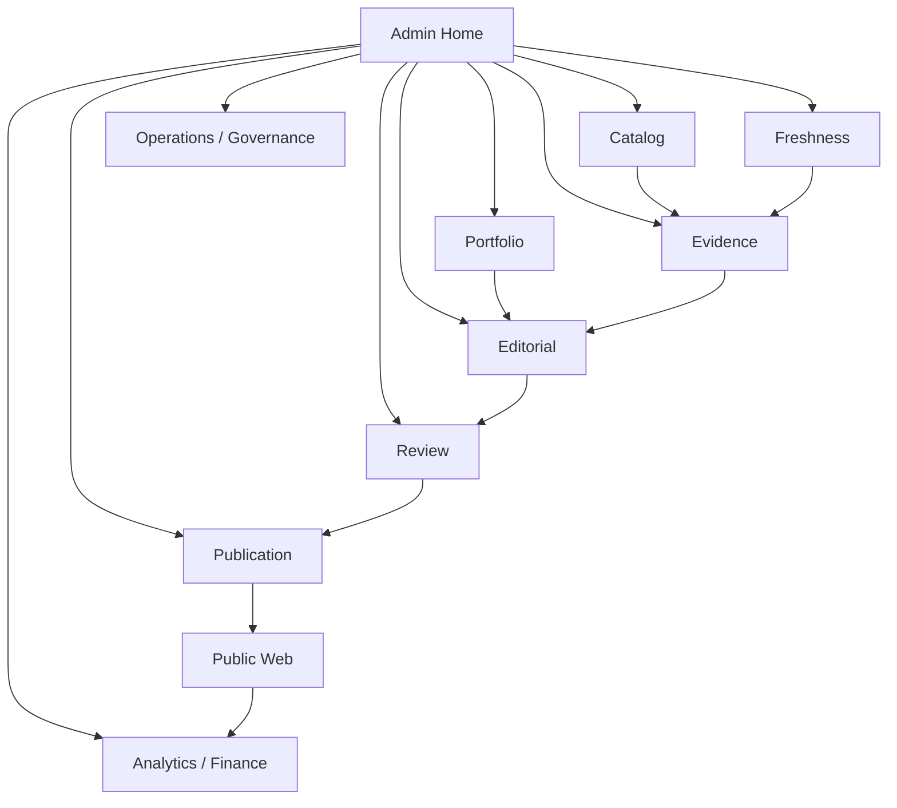

> **状態の読み方**  
> 本書は実装可能な設計として承認済みです。ただし、`IMPLEMENTED`、`VALIDATED`、`DEPLOYED`を意味しません。  
> 特に明記しない限り、アプリケーション実装、実DB適用、外部API実接続、Runtime Test、本番設定は **未実施** です。

# 1. 目的と範囲

本書は、RAOSを運営する人間向け管理画面と、一般利用者向け公開サイトの情報設計、画面、Component、Workflow、状態、権限、アクセシビリティ、性能目標を定義する。Screen catalogは63画面、Component catalogは46件である。

本書はFigma上の完成Visualや実装済みReact Componentを含まない。見た目より先に、誤公開、商品同定ミス、根拠欠落、成果誤認を防ぐInteractionを正本とする。

# 2. UX原則

1. **Evidence first**: ReviewerはClaimから原本へ二操作以内で到達できる。
2. **Unknown is visible**: 不明値を0、空文字、推測値へ変換しない。
3. **Critical action is explicit**: 公開、Rollback、Kill Switch、成果Commitは対象・影響・不可逆性を明示する。
4. **AI is a proposal**: AI出力は人間編集と視覚的に区別し、採用理由と差分を残す。
5. **Finance is not editorial input**: 記事編集・推薦画面へ料率、EPC、利益を表示しない。
6. **Accessible by default**: Mouseや色知覚だけに依存しない。
7. **State is never hidden**: Draft、Stale、Blocked、Published等をText＋Iconで示す。
8. **Safe degradation**: Provider/計測障害でも公開記事の読解と楽天への正規遷移を可能な限り維持する。

# 3. 利用者Role

| Role | 主な責務 | 禁止される代表操作 |
|---|---|---|
| PRODUCT_OWNER | Scope、予算、最終事業判断 | Evidenceなしの公開承認代替 |
| MANAGING_EDITOR | 編集方針、最終承認、公開判断 | 自分の編集を無検証で承認 |
| EDITOR | 商品・Evidence・記事作成 | Final Approval、Kill Switch解除 |
| REVIEWER | 独立レビュー、Finding | Contentの黙示的書換え |
| ANALYST | 検索・行動・成果分析 | Recommendation順位変更 |
| OPERATOR | Job、公開運用、Incident | Editorial Finding解除 |
| SECURITY_AUDITOR | Audit、Security調査 | 通常編集・収益操作 |
| READ_ONLY_AUDITOR | 証跡閲覧 | すべてのWrite |

# 4. Information Architecture

Admin navigationはDomain ownershipに合わせ、画面都合で同じResourceを別名複製しない。Public WebにはAdmin navigationや内部IDを露出しない。

# 5. Article Workspace

Article Workspaceは次のPaneで構成する。

- Header: Article ID、Version、State、Owner、Quality、Freshness、Lock/ETag
- Plan: Primary Intent、Primary Decision、Article Type、Candidate Universe
- Content: Typed AST、Preview、AI Proposal Diff
- Evidence: Source Packet、Fact、Conflict、Claim Coverage
- Comparison: Product Identity、Axis、Unit、Unknown、Tie
- Policy: Finding、Disclosure、Review checklist
- Publication: Approval、Snapshot hash、Preview、History

編集保存はDraft Versionに限定し、公開中Snapshotを直接変更しない。競合更新は`If-Match`で検出し、上書きではなく差分解決を促す。

# 6. Critical Action UX

公開、Rollback、Kill Switch、CSV Commit、Grouping Decisionには、通常の確認Dialogだけでなく次を要求する。

- 対象IDとHuman-readable name
- 影響範囲
- 現在Version/Generation
- Blockerと未解決Finding
- 実行後のRollback可否
- 理由の必須入力
- Step-up authentication
- Idempotency Key
- 実行後のAudit/Correlation ID

# 7. 公開記事UX

公開記事は、広告表示、更新時刻、選び方、比較、向く人・向かない人、Trade-off、Unknown、楽天CTAを明確に分離する。CTAだけが画面上で過度に優勢にならないようにし、比較根拠を読まずに誤認する配置を避ける。

比較表はDesktopの横表だけに依存せず、Mobileでは軸ごとのCardまたは横Scroll＋固定見出しを用意する。いずれもDOM上のheader関係を保持する。

# 8. Accessibility

設計目標はWCAG 2.2 AAとし、ARIAはNative HTMLで表現できない場合に限定する。自動検査だけで適合を宣言せず、Keyboard、Zoom、Screen reader、認知的負荷、破壊的操作を手動確認する。

特に、Data Table、Dialog、Tabs、Combobox、Tree、Toast、Drag-and-dropはARIA APGのPatternとKeyboard interactionを参照するが、実装Componentの挙動を実ブラウザと支援技術で検証する。

# 9. Responsiveと性能

- Public: Mobile-first。320 CSS pxから利用可能にする。
- Admin: Desktopを主対象とするが、Critical Read/Stop ActionはTabletでも実行可能にする。
- Public WebのField目標はLCP 2.5秒以下、INP 200ms以下、CLS 0.1以下を75 percentileで目指す。
- Admin API待機中も状態・取消可否を示し、長時間Jobを同期Requestとして待たせない。
- Imageは寸法を予約し、Affiliate/Analytics ScriptがLayout Shiftを起こさないようにする。

数値は設計目標であり、Real User Monitoringを実装・観測するまでは達成済みとしない。

# 10. ErrorとEmpty State

Errorは技術例外ではなく、利用者が次に取れるActionを提示する。Provider障害、権限不足、Version conflict、Stale data、Kill Switch、Validation errorを別状態とする。Empty Stateも「0件」と「未取得」「取得失敗」「権限なし」を区別する。

# 11. Design Token

最低限のTokenを次に固定する。

- semantic color: surface、text、muted、border、info、success、warning、danger
- typography: display、heading、body、label、mono
- spacing: 4px基準の段階
- radius、shadow、focus ring、z-index
- status/severityは色とText/Iconの組合せ
- Dark modeはMVP任意だが、OS設定追随を導入する場合もContrast Test対象

具体的なBrand colorとFontは`site_name_and_domain`決定後に確定する。未決のまま特定Brand assetを埋め込まない。

# 12. Telemetry

UI TelemetryはRAOS-ANALYTICS-001のEvent catalogだけを送信する。Raw article body、Search query全文、メール、Secret、Source Packet本文をEvent parameterに含めない。Critical admin actionはGA4ではなくAudit Eventへ記録する。

# 13. 受入条件

- Screen catalogのMVP画面がRole/Route/APIに紐付く
- Public routeからAdmin/Evidence/Finance Schemaが取得できない
- Critical actionがStep-up、Reason、Idempotency、Auditを満たす
- Keyboard onlyで主要10 Workflowを完了できる
- Automated a11yにCritical violationがなく、手動ChecklistがPASS
- 主要Public templateがMobile/Desktopで視覚回帰Testに合格
- Snapshot Previewと実公開RendererのContent hashが一致

# 14. 明示的な未実施

- Figma/Canva等でのVisual Design作成
- React/Next.js Component実装
- Storybook、Visual regression baseline
- OIDC/MFA実接続
- Browser E2E、NVDA等による監査
- Core Web Vitals実測
- Brand/Domain/Font/Colorの最終確定
- Production公開サイト

これらはMaster Unimplemented Registerに`NOT_STARTED`または`NOT_EXECUTED`として記録する。
