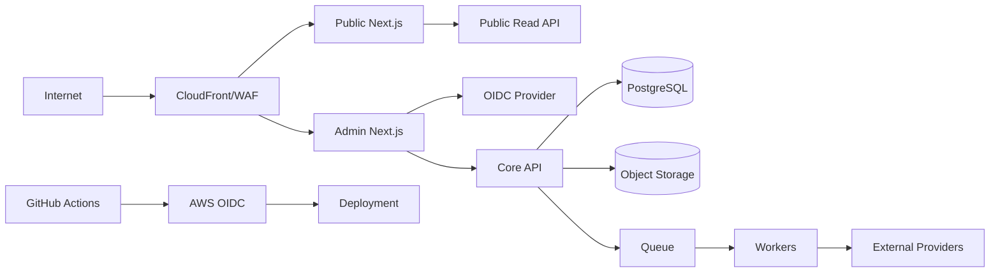

> **状態の読み方**  
> 本書は実装可能な設計として承認済みです。ただし、`IMPLEMENTED`、`VALIDATED`、`DEPLOYED`を意味しません。  
> 特に明記しない限り、アプリケーション実装、実DB適用、外部API実接続、Runtime Test、本番設定は **未実施** です。

# 1. 目的

本書はRAOSのPublic Web、Admin、API、Worker、PostgreSQL、Object Storage、Queue、AI Provider、Analytics Provider、CI/CDを対象に、SecurityとPrivacyの設計Baselineを定義する。Control catalogは83件、Threat registerは30件である。

設計目標は、Admin/APIについてOWASP ASVS 5.0 Level 2相当を基本とし、AI境界にはOWASPのLLM Security Verification観点、実Web試験にはWSTGを参照する。ただし、Control EvidenceとRuntime Testが揃うまでは「準拠済み」「安全」と公称しない。

# 2. Security Objectives

1. 未認証者がAdmin、Evidence、Finance、AI Artifactへ到達できない。
2. 認証済みでもRole/Site/Resource/Stateを越えた操作ができない。
3. AI、Worker、CodexがHuman ApprovalやProduction権限を代替できない。
4. Secret、個人情報、未公開Content、成果情報をPublic/Logへ漏らさない。
5. 公開ContentとProvider FactのIntegrityを検証できる。
6. 侵害・誤公開・規約問題をKill Switch、Credential revocation、Rollbackで封じ込められる。
7. BuildからDeployまでのSupply chainを追跡できる。

# 3. Trust Boundaries

Public、Admin、Internal Workload、Data、External Provider、CI/CDを別Trust Boundaryとする。Public routeからData planeへ直接接続しない。

# 4. Identity and Access

- Production Adminは承認済みOIDCとMFAを必須とする。
- AuthorizationはUIではなくAPI/DB境界で再判定する。
- RoleだけでなくSite/Resource/Stateを含む。
- Final Approval、Publish、Rollback、Kill Switch解除、Revenue CommitはStep-up対象。
- EditorとFinal Approverの分離を標準とし、例外は理由と上位承認を監査する。
- Worker、CI、Migration、Projection、Public Webは異なるWorkload Identityを使う。
- GitHub ActionsはOIDCによる短期Credentialを使用し、長期Cloud keyをRepository secretに保存しない。

OIDC Providerは未決であり、Production認証は`NOT_CONFIGURED`である。

# 5. Application Security

## 5.1 ContentとXSS

ContentはTyped ASTからRendererが生成し、Raw HTML、script、iframe、event handlerを許可しない。管理UIで外部文字列を表示する場合もReact等の既定escapingに依存するだけでなく、URL、Markdown、SVG、Rich text等のContext別Policyを定義する。

## 5.2 SSRFとOutbound

楽天/OpenAI/Google等へのOutboundはAdapterごとの固定Origin allowlist、Timeout、Redirect制限、DNS/IP検査を行う。利用者が入力した任意URLをServerが取得する汎用Fetch機能を設けない。Cloud metadata、loopback、private networkを拒否する。

## 5.3 File/CSV

UploadはQuarantineへ保存し、MIME/拡張子だけでなくMagic、Size、Compression ratio、Encoding、Row/Column limitを検査する。CSVを人間がSpreadsheetで開く可能性があるため、式として解釈されるPrefixを無害化し、Raw Fileの直接配布を制限する。

# 6. Data Protection and Privacy

- Data classが未指定の情報はCONFIDENTIALとして扱う。
- RESTRICTED SecretをDatabase、Prompt、Application Logへ保存しない。
- Public Projectionには公開に必要なFieldだけを複製する。
- Raw IPやUser-Agent全文を長期Product Analyticsへ保存しない。
- Security目的のLogとProduct Analyticsを別Purpose、Access、Retentionで管理する。
- 個人データを新たに収集する機能は、Purpose、Lawful basis相当の確認、Notice、Retention、Deletionを設計Reviewする。
- Retention日数は法務・会計・Privacy確認前のため未確定であり、自動削除のProduction有効化を禁止する。

# 7. AI Security

Source Packet、商品説明、CSV、競合データは命令ではなくUntrusted Dataとして区切る。AI RequestはTaskごとのAllowlistだけを含み、自由なTool、DB、Queue、Web accessを付与しない。Structured Output後もFact、Product Identity、Policy、Secret/PIIを決定論的に再検査する。

Prompt Injection、レビュー本文混入、架空体験、料率Bias、Secret漏えいはZero-toleranceであり、別ModelへのFallbackで回答を強行しない。

# 8. Infrastructure

Reference AWS構成では、RDSとWorker data planeをPrivate subnetへ置き、S3 Public Access Block、Encryption、Versioning、SQS policy、CloudTrail、WAF、CloudWatchを設計する。Production Account、Region、KMS Key、Network、IAMは未作成である。

# 9. Supply Chain

- Default branchをRulesetで保護する。
- Contract、Migration、Security、DeploymentにCODEOWNERS reviewを要求する。
- DependencyをLockし、SCA、SAST、Secret、Container、IaC scanをCIで行う。
- ReleaseにSBOM、Build provenance、Commit SHA、Contract hash、Migration versionを含める。
- Fork/PRからProduction secretへアクセスできないTrust policyにする。
- Production EnvironmentはHuman approvalを要求する。

# 10. Security Logging

記録対象は認証、権限拒否、Critical Command、Secret access metadata、Kill Switch、Revenue Commit、Policy/Prompt release、Migration、Deployment、WAF/abuse、Audit accessである。Raw Secret、Prompt本文、Source本文、個人情報をLogに出さない。

# 11. Incident Response

Security Incidentでは、通常の修正より先に封じ込める。

1. 影響範囲とSeverity判定
2. Affiliate/Publication Kill Switch、Credential失効、Route停止
3. Artifact/Log/Timeline保全
4. Unauthorized accessの遮断
5. Integrity確認と安全なSnapshotへRollback
6. 関係者・法務・Providerへの連絡判断
7. 根本原因、Regression Test、Control改善
8. Human承認後に限定再開

# 12. Verification

Controlごとに、Design Review、Static Test、Integration Test、Cloud Config Test、Browser Test、Manual Test、Penetration Test、TabletopのどれでEvidenceを作るか定義する。自動Scannerが0件でもBusiness logic authorization、Evidence boundary、AI injectionの安全性は保証されない。

# 13. Release Blocker

- Critical/Highの既知脆弱性または未承認Exception
- Public/Internal data isolation Test失敗
- MFA/Step-up/AuthorizationのP0 Case失敗
- Secret scan検出
- Backup暗号化/Access未確認
- Kill Switch/credential revocation未試験
- Dependency provenance不明
- Privacy/RetentionのBlocking decision未解決

# 14. 明示的な未実施

- OIDC/MFA Provider接続
- AWS IAM/WAF/VPC/KMS/S3/RDS/SQS設定
- ASVS Control Evidenceの収集
- SAST/SCA/DAST/Penetration Test
- GitHub Ruleset、CODEOWNERS、Environment protection実設定
- Credential rotation/Break-glass/Incident tabletop
- Privacy/Legal reviewとRetention承認
- Production Secretの発行

本書はこれらの設計を完了するが、実装・検証はすべて未実施である。
