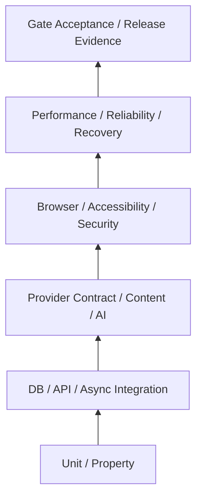

> **状態の読み方**  
> 本書は実装可能な設計として承認済みです。ただし、`IMPLEMENTED`、`VALIDATED`、`DEPLOYED`を意味しません。  
> 特に明記しない限り、アプリケーション実装、実DB適用、外部API実接続、Runtime Test、本番設定は **未実施** です。

# 1. 目的

本書は、RAOSの設計を「動く、安全で、再現可能な実装」へ変換するためのTest Strategyを定義する。Test suiteは32件で、現時点の実行状態はすべて`NOT_EXECUTED`である。既存Packageで行ったYAML/JSON/Checksum等の静的検証は、対応するRuntime Integration Testの代替ではない。

# 2. Test原則

- Requirement、Contract、Story、Test、Release EvidenceをIDで接続する。
- UnitだけでなくDB Role、Queue重複、Provider Error、Browser、Backup Restoreを実行する。
- External ProviderはRecorded FixtureとBounded Live Testを分離する。
- Production dataをCIへ持ち込まない。
- Flaky Testを再実行で隠さず隔離・原因修正する。
- Zero-tolerance違反は平均Scoreで相殺しない。
- Testを未実行のままPASSと記録しない。
- Generated codeもCompilation、Contract、Drift Test対象にする。

# 3. Test Pyramidと横断Suite

Pyramidは「E2Eを少なくする」だけを意味しない。RAOSでは公開、成果、AI、DB権限の境界にE2EとManual Verificationが不可欠である。

# 4. Database Test

PostgreSQL 18系の実ContainerをCIで起動し、次を自動化する。

- 空DBへのBaseline適用
- Seed/Role/Grant適用
- Alignment Patchを正式Migrationへ移植したUp
- 再実行時の安全性
- 前VersionからUpgrade
- Failure途中のRollback/Resume
- FK、CHECK、UNIQUE、Trigger、Immutable guardの違反Case
- Public/API/Worker/Migrator RoleのPositive/Negative Case
- Outbox/Inbox/Idempotencyの競合Case
- Query planとIndexの代表的検査

SQL Parseだけで合格にしない。

# 5. Provider Test

## 5.1 Recorded

Request/Responseを匿名化・Version管理し、成功だけでなく429、5xx、Timeout、Partial、Schema drift、Invalid credential、Empty、Paginationを含める。Fixtureには取得時点のProvider API versionとSanitization記録を持たせる。

## 5.2 Live

専用Credential、低いQuota、Read-onlyまたは安全な範囲でStagingから実行する。Live TestはCIの全PRで実行せず、Release前または定期Jobとする。実APIへの接続がない状態ではAdapterを`VALIDATED`にしない。

# 6. AI Evaluation

RAOS-AI-001のDEV/CALIBRATION/HOLDOUT/ADVERSARIAL/REGRESSION Datasetを利用し、SchemaだけでなくFact、Product identity、Policy、Injection、Bias、Secretを評価する。合成120 CaseはHarness Smoke用であり、Production認証Datasetではない。

Model/Prompt/Routeの変更は、Locked Dataset、Human label、Judge calibration、Cost/Latency、Zero-toleranceを含むRelease Decisionを要する。

# 7. UIとAccessibility

Playwright等で主要WorkflowをBrowser E2E化し、axe等の自動検査に加えてKeyboard、Zoom、Screen reader、Error recoveryを手動確認する。Snapshot PreviewとPublic Rendererが同じManifest/Hashを描画することを確認する。

# 8. Security Test

- Authentication/session/MFA/step-up
- Authorization horizontal/vertical/site boundary
- CSRF、XSS、CSP、SSRF、Open redirect
- File/CSV abuse
- Rate/DoS/cost abuse
- Public/Internal schema isolation
- Secret/PII/log leakage
- AI prompt injection/data exfiltration
- IaC/IAM/S3/RDS/SQS/GitHub configuration

Scannerの結果だけでなく、Business logic abuseとManual Reviewを含める。

# 9. Performance and Reliability

Load Testは平均Latencyだけでなく、p95/p99、Error、Queue age、DB connection、Costを測る。Provider timeout、Queue duplicate、Worker crash、DB failover相当、S3 error、Analytics collector loss、Kill Switchを注入し、安全な縮退を確認する。

# 10. Backup Restore

Backupが存在することと、復元できることを分離する。隔離環境にDB/Object/Configを復元し、Snapshot hash、Row count、Critical reference、Role、Secret再注入、Public read model再構築を検証する。RPO/RTOは実測値を記録する。

# 11. Test Data

- Synthetic factoryを正本とする。
- 実Provider FixtureはSecret/PII/契約禁止情報をSanitizeする。
- 楽天レビュー本文をFixtureへ含めない。
- Production成果FileをそのままRepositoryへCommitしない。
- Time、Currency、Locale、Unicode、Large value、DST/JST、duplicate、out-of-orderを含む。
- Dataset/FixtureのHashとLicense/Originを記録する。

# 12. Flaky Test Policy

同じCommitで非決定的に結果が変わるTestは、Owner、Issue、期限、影響を付けてQuarantineする。Release-blocking境界のTestを単にRetryしてGreenにしない。原因が環境か製品かを分類し、Quarantine中は代替Manual Evidenceを要求する。

# 13. Gate Acceptance

GATE判定は個別Testのリンクだけでなく、対象Version、環境、実行時刻、Data、Artifact hash、未決事項、Exceptionを束ねた不変Evidence Packとする。Gateの判定時点以降にTestやDefinitionが変わっても、当時の判定を再現できるようにする。

# 14. Release Blocking

- Required Suite未実行/FAIL
- Critical/High Security Finding未解決
- Migration zero-to-latest/upgrade失敗
- Public/Internal isolation失敗
- AI Zero-tolerance違反
- Publish/Rollback/Kill Switch E2E失敗
- Backup Restore証跡が期限切れ
- Open DecisionによるBlock

# 15. 明示的な未実施

- Test framework/CIの実装
- PostgreSQL 18実DB適用
- Provider Recorded/Live Fixtureの確定
- Browser/Accessibility/Security/Load Test
- Backup Restore Drill
- Gate Evidence Generator
- Production-like Staging

本書完成時点では、全Runtime SuiteのExecution statusは`NOT_EXECUTED`である。
