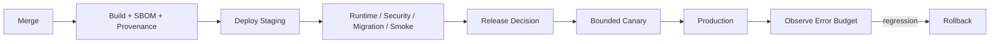

> **状態の読み方**  
> 本書は実装可能な設計として承認済みです。ただし、`IMPLEMENTED`、`VALIDATED`、`DEPLOYED`を意味しません。  
> 特に明記しない限り、アプリケーション実装、実DB適用、外部API実接続、Runtime Test、本番設定は **未実施** です。

# 1. 目的

本書は、RAOSを安全に運用・変更・復旧するためのSLI/SLO、Monitoring、Alert、Incident、Release、Backup/Restore、Cost、Provider/規約変更対応を定義する。初期SLOは14件、Alertは20件、Runbook indexは20件である。

すべてのSLO値は**設計目標**であり、環境・Telemetry・Load/Restore Drillがない現時点では達成済みではない。

# 2. Operational Principles

- 最後の安全なPublication Snapshotを優先する。
- 計測より楽天への直接遷移、生成より正確性、可用性より誤公開防止を優先する。
- Alertは行動可能な条件だけにし、OwnerとRunbookを持つ。
- Retryは無制限にせずCircuit Breaker、Budget、DLQを使う。
- Changeは小さく、観測可能で、Rollback可能にする。
- Backupの存在ではなくRestoreの成功を検証する。
- 外部規約/API変更もSoftware changeとしてVersion、Impact、Test、承認を行う。

# 3. Observability

OpenTelemetry互換のTrace/Metric/Log相関を採用し、`correlation_id`、`causation_id`、`job_id`、`article_id`、`snapshot_id`、`provider_request_id`をContextに持つ。ただしRaw Prompt、Source本文、Secret、個人情報をTelemetry属性へ含めない。

主要観測面は次である。

- Public: availability、latency、CWV、CTA continuity、degradation
- API: request、authz deny、idempotency、ETag conflict
- Worker: queue age、attempt、deadline、retry、DLQ、cost
- DB: connection、lock、slow query、storage、replication/backup
- Provider: latency、status、rate limit、schema drift、spend
- Business safety: stale exposure、link health、quality blocker、revenue reconciliation

# 4. SLOとError Budget

SLOはSystemの重要な利用者Outcomeに限定する。Error budgetの高速Burnと低速Burnを分け、最近のReleaseとの相関を表示する。Safety SLO（誤公開、リンクIntegrity、成果照合）はAvailabilityと別に扱い、違反時はTraffic維持より停止を選択できる。

# 5. Incident Management

Severityは次の考え方を採る。

| Severity | 代表例 | 初動 |
|---|---|---|
| SEV1 | 誤公開、Confidential漏えい、Credential侵害、Affiliate不正 | 即時封じ込め、Incident Commander、Kill/Revocation |
| SEV2 | DB/公開重大障害、AI zero-tolerance、成果不整合 | 迅速な縮退、Rollback、Owner招集 |
| SEV3 | 部分劣化、Freshness、Cost、Import遅延 | 営業影響を抑え計画復旧 |
| SEV4 | 単一DLQ、期限接近、低影響警告 | Backlog化し追跡 |

Incident RecordにはTimeline、Impact、Detection、Decision、Artifact、Customer/Provider communication、Corrective actionを残す。

# 6. Release

Database changeはBackward-compatibleなExpandを先に出し、Data migrationを観測し、旧Codeが不要になってからContractする。Application rollbackで旧Schemaに戻れないMigrationを同時に行わない。

# 7. Public Degradation

- Editorial DB/API障害: 最後のPublic SnapshotをCDN/Read modelから提供
- Analytics Collector障害: Eventを失っても楽天遷移を継続
- 楽天 API障害: 旧値を最新と断定せず、Price/Stockを非表示またはCTA停止
- AI障害: 新規生成を停止し公開済み記事へ影響させない
- GSC/GA4障害: DashboardをStale表示しBusiness dataを捏造しない
- Finance Import障害: CommitせずProvider Factを維持

# 8. Backup and Recovery

PostgreSQLはPITRとSnapshot、ObjectはVersioningとManifest、InfrastructureはIaC/Release artifactを基準にする。Recoveryでは単にServiceが起動しただけでなく、Approval、Snapshot hash、Provider Fact total、Role/Grant、Kill switch generation、Public projectionを検証する。

RPO/RTOは目標値であり、実Restore Drillの最悪値を記録して初めてValidatedとする。

# 9. Cost Operations

AWS、LLM、Provider、Storage、Egress、人件費をCost center/Task/Article/Environmentへ可能な範囲でTaggingする。月次上限、日次Velocity、Job単価、AI Task単価、異常Call数を監視し、Optional workloadを停止できるようにする。Budget額はProduct Owner未決である。

# 10. External Change Management

楽天、Google、OpenAI、AWS、法令/ガイドラインの公式SourceをOwnerと周期付きで確認する。変更を検知した場合は、Reference Snapshot、影響するRule/Adapter/記事、必要なKill/hold、Contract change、Regression Test、Release Decisionを記録する。

自動Web scrapeだけで規約変更の意味を確定せず、人間が公式本文を確認する。

# 11. Routine Operations

- Daily: Critical alert、queue/DLQ、link health、freshness、cost velocity
- Weekly: Provider failure trend、stale queue、Security/Dependency finding、policy due
- Monthly: Access review、confirmed economics、backup status、retention report、SLO/error budget
- Quarterly: Restore drill、Incident tabletop、Runbook review、Threat/risk review
- Releaseごと: Contract/migration/security/evidence/rollback review

周期はMVP開始後に実負荷で調整する。

# 12. Runbook Quality

RunbookはTrigger、Impact、Safety checks、Commands/API、Rollback、Evidence、Escalation、終了条件を持つ。SecretやProduction固有値を文書へ直書きせず、承認済みSecret/Resource referenceを用いる。初回実施後に手順と所要時間を更新する。

# 13. Production Readiness

- Telemetry/Alert/Notificationが実動
- On-call相当のOwner/代替者が決定
- Critical RunbookをTabletop/Drill済み
- Publish/Rollback/Kill SwitchをStagingで試験
- Backup Restoreが目標内で成功
- Cost budgetと自動停止が設定
- Provider/Policy review ownerが設定
- Open blocking decisionが解消

# 14. 明示的な未実施

- AWS Resource/Terraform/CloudWatch/OpenTelemetry実装
- Notification/On-call設定
- SLO実測とError budget運用
- Backup/PITR/S3 Versioning設定とRestore Drill
- Release/Canary/Rollback Pipeline
- Runbookの実コマンド確定・演習
- Cost budget/alert閾値確定
- External policy monitoring運用

本書完成時点ではProduction Operationsは`NOT_CONFIGURED`である。
