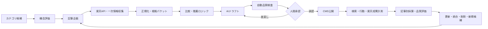

# AI×楽天アフィリエイト運営OS 要件定義書
## 第1部：目的・スコープ・成功条件

**文書ID**: RAOS-RD-001  
**版**: v0.1 Draft  
**基準日**: 2026-07-30（JST）  
**対象読者**: プロダクトオーナー、Codex、開発者、編集責任者、コンプライアンス確認者、運用担当者  
**想定後続文書**: システムアーキテクチャ、データモデル、API仕様、AIエージェント仕様、画面仕様、テスト仕様、運用手順、Codex実装バックログ

---

# 0. 文書の位置づけ

## 0.1 目的

本書は、「AIを使って楽天アフィリエイト記事を大量生成するツール」ではなく、**ユーザーの購買意思決定を支援し、その対価として楽天アフィリエイトの確定成果報酬を得る、コンプライアンス準拠のメディア運営システム**を定義する。

本書では、特に以下を固定する。

1. 何のために作るか
2. 誰に、どのような価値を提供するか
3. 何を作り、何を作らないか
4. 成功を何で測るか
5. どの条件を満たすまで規模を拡大しないか
6. AIに許可する判断と、人間が保持する判断
7. 楽天、Google、法令、著作権、個人情報に関する絶対条件
8. 後続設計・実装を受け入れるための判定基準

## 0.2 要求レベル

本書では次の用語を使用する。

- **MUST**: 未達の場合はリリース不可、または運用停止
- **SHOULD**: 原則必須。例外には理由・承認・記録が必要
- **MAY**: 任意。費用対効果により実装判断
- **WON'T**: 当該フェーズでは明示的に実装しない

## 0.3 優先順位

要求の優先順位は次の順である。

1. 法令・楽天規約・プラットフォーム規約
2. ユーザー安全と誤認防止
3. 情報の正確性と出典追跡性
4. ユーザーの購買意思決定価値
5. 事業採算性
6. 自動化率
7. 記事数・処理量

**記事数は成功指標ではない。** 低品質ページを増やして検索流入を狙う設計は、本プロジェクトの失敗とみなす。

---

# 1. エグゼクティブサマリー

## 1.1 プロジェクト名称

仮称：**Rakuten Affiliate Operating System（RAOS）**

## 1.2 プロダクト定義

RAOSは、以下を一貫して支援する運営基盤である。

- 市場・カテゴリ候補の発見
- 購買意図キーワードの評価
- 楽天公式APIによる商品データ取得
- 商品・ショップ・価格・在庫・レビュー集計値の正規化
- 比較軸、選定基準、記事構成の生成
- 根拠付き記事ドラフトの生成
- 人間による編集・承認
- CMS公開
- 商品情報の定期更新
- Search Console、アクセス解析、楽天成果レポートの統合
- 品質、SEO、収益性、鮮度に基づく改善候補の優先順位付け
- コンプライアンス違反や事実誤認の予防・検出

## 1.3 事業の基本仮説

本事業の基本仮説は次のとおりである。

> 楽天市場内の商品数が多く、選択肢が分散し、比較が難しい領域において、単なる商品一覧ではなく「誰に、なぜ、どれが適するか」を根拠付きで整理し、価格・在庫・仕様を継続更新できれば、ユーザー価値とアフィリエイト収益を同時に成立させられる。

AIは、記事数を増やすためではなく、以下に使う。

- データ収集・正規化の省力化
- 比較軸の網羅性向上
- 根拠の追跡と矛盾検出
- 低価値ページの公開防止
- 更新対象の選別
- 学習サイクルの高速化

## 1.4 暫定経営目標

経営目標は設定値として管理し、コードへ固定しない。

- **基準目標**: 月次確定貢献利益 300,000円を3か月連続で達成
- **ストレッチ目標**: 月次確定貢献利益 1,000,000円を3か月連続で達成
- **絶対条件**: 重大な規約違反、法令違反、検索スパム相当の運用を伴わない
- **拡大条件**: カテゴリ単位・記事単位のユニットエコノミクスが正である

ここで「確定」とは、発生ベースではなく、キャンセル等を反映した楽天側の確定成果報酬を指す。

---

# 2. 背景と課題定義

## 2.1 ユーザー側の課題

楽天市場のユーザーは、商品選択時に次の問題を抱えやすい。

- 同一または類似商品が複数ショップに分散している
- 商品名が長く、型番・容量・セット数・世代差が判別しにくい
- 価格、送料、ポイント、在庫、配送条件が変動する
- レビュー件数と平均点だけでは、自分に合うか判断しにくい
- 比較記事が広告目的に偏り、選定根拠が不透明な場合がある
- 「おすすめ順」が報酬率順なのか、ユーザー価値順なのか分からない
- 古い記事に終売商品・旧価格・リンク切れが残る
- 類似商品の差を調べるため複数サイトを横断する必要がある

## 2.2 運営者側の課題

アフィリエイト運営者は、次の構造的課題を抱える。

- キーワード調査、商品調査、比較、執筆、更新、計測が分断される
- 商品情報が頻繁に変わり、記事の鮮度維持に工数がかかる
- 発生報酬と確定報酬が異なり、真の採算把握が遅れる
- 記事数をKPIにすると低品質化しやすい
- AI生成の誤情報や架空の使用体験がブランド毀損につながる
- 規約や法令の変更を既存記事へ反映しにくい
- どの記事を新規作成・更新・統合・削除すべきか判断しにくい
- SEO流入、外部クリック、成果報酬、制作費が記事単位で結び付かない

## 2.3 解決すべき本質

本プロジェクトが解決する本質は「執筆の自動化」ではない。

**正しい商品データと検索意図を結び付け、ユーザーに独自の意思決定価値を提供し、その品質・鮮度・採算を継続管理すること**である。

---

# 3. ビジョン、ミッション、原則

## 3.1 ビジョン

楽天市場で商品を探す人が、広告に振り回されず、自分の条件に適した商品へ最短で到達できる状態を作る。

## 3.2 ミッション

公式データ、一次情報、明示的な比較基準を使い、更新可能で説明可能な購買支援コンテンツを継続提供する。

## 3.3 プロダクト原則

### PRINCIPLE-01: People First

検索順位ではなく、訪問者の意思決定を第一目的とする。

### PRINCIPLE-02: Evidence Before Generation

LLMへ文章生成を依頼する前に、根拠データと出典を用意する。根拠不足時は生成ではなく保留を返す。

### PRINCIPLE-03: No Fabricated Experience

実際に使用・購入・検証していない商品について、「使った」「試した」「実機レビューした」等の表現を禁止する。

### PRINCIPLE-04: Editorial Independence

商品の記事内順位は、編集上の適合度で決定する。アフィリエイト料率は記事内推薦順位を変更してはならない。

内部では次のスコアを分離する。

- **Editorial Suitability Score**: ユーザー適合性
- **Business Opportunity Score**: 需要、競争、想定収益性
- **Compliance Risk Score**: 表示・法令・規約リスク

### PRINCIPLE-05: Human-Gated Scaling

初期公開は全件人間承認とする。自動公開は、カテゴリ・記事タイプごとに品質実績が蓄積し、明示的に解放された場合のみ許可する。

### PRINCIPLE-06: Freshness Is a Feature

価格、在庫、販売状態、商品仕様の取得日時を保持し、期限切れ情報を表示し続けない。

### PRINCIPLE-07: Traceability

公開文の主要な事実は、どのソースのどの時点の情報から生成されたか追跡できること。

### PRINCIPLE-08: No Scale Without Unit Economics

公開件数を増やす前に、確定報酬、制作・更新費、運用費を含めた採算を確認する。

### PRINCIPLE-09: Reversible Automation

AIが行った変更は差分、理由、使用モデル、プロンプト版、入力ソースを記録し、ロールバック可能とする。

### PRINCIPLE-10: Policy as Code

規約・表示・品質条件を、人間向け文書だけでなく、自動テスト可能なルールとして実装する。

---

# 4. 目的

## 4.1 事業目的

| ID | 要求 | 優先度 | 成功判定 |
|---|---|---:|---|
| OBJ-BIZ-001 | 楽天アフィリエイトの確定成果報酬を継続的に生むメディア運営能力を構築する | MUST | 月次確定成果報酬を記事・カテゴリ・流入元へ帰属できる |
| OBJ-BIZ-002 | 確定報酬から変動費を差し引いた貢献利益を正にする | MUST | 3か月連続で月次貢献利益が正 |
| OBJ-BIZ-003 | 特定記事・特定商品への過度な依存を減らす | SHOULD | 上位10ページの報酬集中率が70%未満、最終目標50%未満 |
| OBJ-BIZ-004 | 新規記事作成より、既存資産改善を優先できる運営モデルを作る | MUST | 改善候補が期待増分利益順に並ぶ |
| OBJ-BIZ-005 | 楽天以外の収益源を将来追加できるデータ構造にする | SHOULD | 収益プロバイダが抽象化されている。ただしMVPでの収益化は楽天のみ |

## 4.2 ユーザー価値目的

| ID | 要求 | 優先度 | 成功判定 |
|---|---|---:|---|
| OBJ-USER-001 | ユーザーが自分に合う商品の条件を理解できる | MUST | 各購買記事に「選び方」「向く人・向かない人」「比較軸」が存在 |
| OBJ-USER-002 | 推薦理由を説明可能にする | MUST | 各推薦に根拠となる属性・条件が紐付く |
| OBJ-USER-003 | 最新の購入可否を判断できる | MUST | 商品カードに最終確認日時を表示し、期限超過時は再取得または非表示 |
| OBJ-USER-004 | 広告関係を明確に理解できる | MUST | 記事上部に広告・アフィリエイト表示、リンク先が楽天であることを明示 |
| OBJ-USER-005 | 不適切な断定や架空体験に誘導されない | MUST | 禁止表現検査と人間承認を通過 |
| OBJ-USER-006 | 商品ページを横断せず主要差分を把握できる | SHOULD | 比較表に主要属性、価格帯、送料条件、レビュー集計値、用途適合を表示 |

## 4.3 運用目的

| ID | 要求 | 優先度 | 成功判定 |
|---|---|---:|---|
| OBJ-OPS-001 | 商品データ取得から公開候補生成までを再現可能なワークフローにする | MUST | 同一入力と版指定で同一構造の成果物を生成 |
| OBJ-OPS-002 | 価格・在庫・販売終了を自動検知する | MUST | 鮮度SLA超過・商品消失をジョブで検出 |
| OBJ-OPS-003 | 人間の確認時間を高リスク箇所へ集中させる | MUST | 変更差分、根拠、不確実箇所をレビュー画面で提示 |
| OBJ-OPS-004 | 規約変更時に影響ページを特定できる | MUST | ポリシールールと対象記事の関連付けが可能 |
| OBJ-OPS-005 | 障害・誤公開から復旧できる | MUST | 記事版管理、ロールバック、公開停止スイッチを実装 |
| OBJ-OPS-006 | LLM・外部API費用を記事単位で計測する | MUST | 生成・更新ジョブごとの費用とトークン数を保存 |

## 4.4 学習目的

| ID | 要求 | 優先度 | 成功判定 |
|---|---|---:|---|
| OBJ-LEARN-001 | どの検索意図が収益へつながるか学習する | MUST | キーワード→記事→流入→クリック→確定報酬を集計 |
| OBJ-LEARN-002 | どの比較軸がクリック・滞在・成果に寄与するか検証する | SHOULD | コンポーネント単位イベント計測 |
| OBJ-LEARN-003 | AI品質と人間修正量の関係を学習する | MUST | 修正理由、修正量、欠陥種別を保存 |
| OBJ-LEARN-004 | カテゴリ撤退判断をデータで行う | MUST | カテゴリ別の採算、品質、更新負荷を算出 |

---

# 5. 非目的

以下は本プロジェクトの非目的である。

| ID | 非目的 |
|---|---|
| NOGOAL-001 | AIで数千記事を短期間に自動公開すること |
| NOGOAL-002 | 楽天の商品説明や他サイトの記事を言い換えて量産すること |
| NOGOAL-003 | 楽天レビュー本文を転載、転用、編集、複製すること |
| NOGOAL-004 | 実体験がない商品を実体験レビューとして見せること |
| NOGOAL-005 | 料率が高い商品をユーザー適合性より上位にすること |
| NOGOAL-006 | 検索順位だけを目的にしたページを作ること |
| NOGOAL-007 | 楽天の公式サイト、ショップ、メーカーになりすますこと |
| NOGOAL-008 | リスティング広告から楽天アフィリエイトURLへ直接送客すること |
| NOGOAL-009 | 初期段階で医療、医薬品、健康効果、金融、法律等の高リスク領域へ参入すること |
| NOGOAL-010 | ログイン必須の会員サービスや大規模な個人情報収集をMVPへ含めること |
| NOGOAL-011 | Google検索結果ページを無許可でスクレイピングすること |
| NOGOAL-012 | 収益保証をユーザーまたはプロジェクトオーナーへ約束すること |

---

# 6. 検証すべき事業仮説

| ID | 仮説 | 検証方法 | 反証条件 |
|---|---|---|---|
| HYP-001 | 購買意図が明確なロングテールでは、大規模総合サイト以外にも検索流入余地がある | 1カテゴリ、複数クラスターの検索表示・順位推移 | 十分な観測後も大半が表示されず、改善で変化しない |
| HYP-002 | 比較軸を明示した記事は、単純な商品一覧より楽天送客率が高い | ページタイプ別の外部クリック率比較 | 比較記事が統計的・実務的に優位でない |
| HYP-003 | 商品データの鮮度がユーザー信頼と収益に寄与する | 更新有無とクリック率・離脱率の比較 | 更新コストが増分利益を継続的に上回る |
| HYP-004 | AIで調査・構造化・更新を支援すると、人間のみより品質当たりコストが下がる | 制作時間、修正量、欠陥率、費用の比較 | 修正工数を含む総費用が人手方式以上 |
| HYP-005 | カテゴリ特化と内部リンク設計により、記事単体よりクラスター全体の評価が高まる | クラスター公開前後の表示・回遊・成果 | クラスター拡張がカニバリゼーションのみを生む |
| HYP-006 | 記事数ではなく、貢献利益予測で制作優先度を決めた方が資本効率が高い | ランダム/検索量順/利益予測順の比較 | 予測が実績を説明せず、優先順位に価値がない |
| HYP-007 | ユーザー価値を保ったまま、一定範囲の更新は自動化できる | 人間承認との差分と事故率を測定 | 自動更新の重大誤り率が許容値を超える |

---

# 7. 対象市場と初期カテゴリ方針

## 7.1 対象市場

- 国・地域: 日本
- 言語: 日本語
- 通貨: 日本円
- タイムゾーン: Asia/Tokyo
- 主流入: Google等の自然検索
- 副流入: 楽天が認める媒体・SNSのうち、個別規約を満たすもの
- 主収益: 楽天アフィリエイト
- 対象デバイス: モバイル優先、デスクトップ対応

## 7.2 初期カテゴリの必須条件

初期カテゴリは、次をすべて満たす必要がある。

1. 医療・健康効果・金融・法務等の高リスク判断を主要価値にしない
2. 商品差を複数の客観属性で比較できる
3. 購入前に「自分に合う条件」を整理する需要がある
4. 楽天内に十分な商品・ショップの選択肢がある
5. 商品データの更新負荷が事業価値に対して過大でない
6. 独自の比較ロジック、計算、用途分類、選定フローを提供できる
7. 商品画像・仕様・リンクを許可された方法で取得できる
8. 1カテゴリ内に最低3つの明確な検索意図クラスターを設計できる
9. 競合記事の単純模倣ではなく、独自の意思決定支援を作れる
10. 想定12か月貢献利益が制作・更新費を上回る合理的仮説がある

## 7.3 初期除外カテゴリ

MVPでは原則として以下を除外する。

- 医薬品、治療目的の商品
- サプリメント、健康食品の効果訴求
- 医療機器、疾病・症状に関する推奨
- 化粧品の効能断定を中心とする記事
- 妊娠、乳幼児安全、介護安全に重大な影響を与える商品
- 金融商品、保険、投資、借入
- 法律相談に準ずる内容
- アルコールの過度な推奨
- 危険物、武器、違法性が疑われる商品
- 中古品の真贋判断が主要価値となるカテゴリ
- 返品・故障・安全性リスクが高く、一次検証なしでは推奨しにくい商品

例外参入には、カテゴリ別法務チェックリスト、専門家レビュー、専用プロンプト、専用禁止表現、追加承認を必要とする。

## 7.4 カテゴリ選定スコア

候補カテゴリを100点で評価する。

| 評価軸 | 配点 |
|---|---:|
| 購買意図需要 | 15 |
| 競争余地 | 15 |
| 楽天内の商品・ショップ充実度 | 10 |
| 客観的比較可能性 | 15 |
| 独自価値を作れる余地 | 15 |
| 想定EPC/RPM | 10 |
| データ取得品質 | 5 |
| 更新負荷の低さ | 5 |
| 季節変動への耐性 | 5 |
| 法令・規約リスクの低さ | 5 |

- 70点以上: パイロット候補
- 60～69点: 追加調査
- 59点以下: 見送り
- ハード除外条件該当: 点数にかかわらず見送り

---

# 8. ステークホルダーと責任

## 8.1 主要ステークホルダー

| 役割 | 主な責任 |
|---|---|
| プロダクトオーナー | 事業目標、予算、カテゴリ、公開方針、最終承認 |
| 編集責任者 | 編集基準、記事品質、推薦ロジック、修正判断 |
| コンプライアンス責任者 | 楽天規約、広告表示、著作権、法令チェック |
| システム管理者 | 外部API、CMS、監視、障害対応、セキュリティ |
| データ/AI担当 | データ品質、プロンプト、評価、モデル変更 |
| Codex | 仕様に基づく実装、テスト、文書化、差分説明 |
| 閲覧ユーザー | 購買条件を整理し、楽天の商品ページへ遷移 |
| 楽天・ショップ・メーカー | 商品・リンク・成果計測・一次情報の提供主体 |

## 8.2 RACI概略

| 意思決定 | PO | 編集 | コンプラ | 開発/Codex |
|---|---:|---:|---:|---:|
| カテゴリ参入 | A | R | C | I |
| 推薦基準 | A | R | C | I |
| 規約解釈 | I | C | A/R | I |
| 自動公開解放 | A | R | R | C |
| モデル変更 | A | C | C | R |
| 緊急公開停止 | A | R | R | R |
| KPI閾値変更 | A/R | C | I | C |

A: Accountable、R: Responsible、C: Consulted、I: Informed

---

# 9. 対象ユーザーとJTBD

## 9.1 ペルソナA: 条件はあるが商品名を決めていない人

- 例: 「狭いキッチン向け」「一人暮らし向け」「手入れが簡単」
- 求めること:
  - 選び方
  - 用途別の違い
  - 避けるべき条件
  - 予算別候補
- 成功:
  - 自分の条件を言語化できる
  - 候補を3件以下に絞れる

## 9.2 ペルソナB: 2～3商品の違いを知りたい人

- 例: 型番違い、旧型・新型、容量違い
- 求めること:
  - 差分だけを短時間で把握
  - 差額に見合うか判断
  - 向く人を比較
- 成功:
  - どちらを選ぶか、またはどちらも選ばないか判断できる

## 9.3 ペルソナC: 買う商品は決まっており、条件の良い購入先を探す人

- 求めること:
  - 楽天内の価格、送料、在庫、ショップ条件
  - セット数・型番の取り違え防止
- 成功:
  - 意図した商品・仕様の楽天ページへ安全に遷移できる

## 9.4 Jobs To Be Done

- 「自分の利用条件に合う製品タイプを理解したい」
- 「候補商品の違いを誤解なく比較したい」
- 「安さだけでなく、失敗しにくい選択をしたい」
- 「古い情報に振り回されず、現在買える商品を確認したい」
- 「広告であることを理解したうえで、根拠のある推薦を見たい」

---

# 10. 提供価値

## 10.1 ユーザーへの価値

- 用途・制約から候補を逆引き
- 明示的な比較軸と選定ルール
- 向く人・向かない人の両方を提示
- 買わない判断も含めた中立的な結論
- 価格・在庫・販売状態の更新
- 楽天への遷移先を明示
- 広告関係と編集基準を開示
- 仕様・価格・推論を区別して表示

## 10.2 運営者への価値

- 調査・記事・商品・計測・収益を一つのID体系で管理
- 記事ごとの採算可視化
- 鮮度低下・販売終了の自動検知
- AI出力の根拠と修正履歴
- 改善・統合・削除候補の優先順位
- 規約変更時の影響範囲特定
- カテゴリ拡大・撤退の再現可能な判断

---

# 11. スコープ

## 11.1 MVPで実装するもの

### SCOPE-MVP-001: 市場・キーワード候補管理

- 候補カテゴリ、クラスター、キーワードの登録
- 検索意図分類
- 商業性、競争、独自価値、リスクのスコア
- 手動入力とCSVインポート
- キーワード重複・カニバリ候補検出

### SCOPE-MVP-002: 楽天商品データ連携

- 楽天市場商品検索API
- 楽天市場ランキングAPI
- 楽天市場ジャンル検索API
- 必要に応じ商品価格ナビ製品検索API
- API資格情報の安全な管理
- 429・5xxの再試行、指数バックオフ
- 取得時刻、API版、リクエスト条件、レスポンス原本の保存
- 商品、ショップ、型番候補、価格、送料、在庫、画像URL、料率、レビュー件数、平均評価等の正規化

### SCOPE-MVP-003: 記事企画

- 記事タイプ選択
- 対象ペルソナ
- 検索意図
- 比較軸
- 必要ソース
- 推薦ルール
- 不足データ
- 公開可否の事前判定

### SCOPE-MVP-004: 根拠付きドラフト生成

- ソースパケットからのみ生成
- 文ごとのclaim ID
- 根拠URL、取得日時、信頼区分
- 事実、推論、編集意見の区別
- 不確実表現
- 禁止表現検査
- 類似文・転載リスク検査

### SCOPE-MVP-005: 人間レビュー

- 差分表示
- 根拠参照
- 重要主張の確認
- 推薦順位の確認
- 広告表示の確認
- 承認、差戻し、却下
- 修正理由の分類

### SCOPE-MVP-006: CMS公開

- 下書き作成
- 予約公開
- 更新
- 公開停止
- リダイレクト
- noindex
- canonical
- 構造化データ
- サイトマップ連携

CMS製品は後続設計で決定する。ドメインロジックはCMSへ密結合させない。

### SCOPE-MVP-007: 商品鮮度管理

- 商品再取得
- 価格変動
- 販売終了
- 在庫なし
- リンク異常
- 送料・ポイント条件変化
- 期限切れ表示の停止
- 更新候補キュー

### SCOPE-MVP-008: 計測

- Search Console
- アクセス解析
- 外部リンククリック
- 記事・商品・配置・CTA単位のイベント
- 楽天レポートの手動または許可された方法でのインポート
- 発生報酬と確定報酬の分離
- 記事・カテゴリ別のEPC、RPM、貢献利益

### SCOPE-MVP-009: ダッシュボード

- 公開記事
- 品質
- 鮮度
- インデックス・検索表示
- クリック
- 確定成果報酬
- 費用
- 重大アラート
- 次に実施すべき上位タスク

### SCOPE-MVP-010: 監査・運用

- 変更履歴
- AIモデル・プロンプト版
- 入力ソース
- 承認者
- ジョブログ
- エラー
- ロールバック
- 緊急停止

## 11.2 MVPの記事タイプ

1. **選び方ガイド**
2. **用途別おすすめ**
3. **A対B比較**
4. **型番・世代・容量差分**
5. **カテゴリ内の条件別絞り込み**

以下は、独自情報量が不足する場合は公開せず、noindexまたは管理画面内のみとする。

- 商品ごとの自動詳細ページ
- ショップごとの自動ページ
- タグ組合せだけで作る一覧ページ
- 価格だけを並べるページ
- APIデータをほぼそのまま表示するページ

## 11.3 Phase 2候補

- 自動内部リンク最適化
- コンテンツ実験
- メールニュースレター
- 認定SNSへの投稿支援
- 商品価格履歴
- 独自アンケート
- 実機テスト管理
- 複数ライター
- 承認ワークフロー高度化
- 競合差分の許可されたデータソースによる分析
- 他ASP・Amazon・Yahoo等の抽象化

## 11.4 Phase 3候補

- 複数サイト・複数ブランド
- 多言語
- ユーザーアカウント
- 保存条件・お気に入り
- パーソナライズ
- メーカー・ショップ向けデータ提供
- API/ホワイトラベル
- AIショッピングアシスタント

## 11.5 MVPで実装しないもの

- 楽天レビュー本文の収集・転載・要約
- Google検索結果の直接スクレイピング
- 無承認のSNS自動投稿
- 自動生成記事の無審査公開
- 会員機能
- コメント欄・UGC
- ネイティブアプリ
- Kubernetes等の過剰な基盤
- 100万記事前提の設計
- 高リスクカテゴリ
- 収益を理由とした推薦順位の操作

---

# 12. システム境界と業務フロー

## 12.1 概念フロー



## 12.2 AIの役割

AIが実行可能なこと:

- 分類
- 要約
- 比較軸候補
- 構成案
- 根拠付きドラフト
- 矛盾検出
- 禁止表現検出
- 更新差分要約
- 改善候補生成
- 異常検知補助

AIが単独決定してはならないこと:

- 高リスクカテゴリへの参入
- 実体験の有無
- 法令適合の最終判断
- 推薦基準の大幅変更
- 初期段階の公開承認
- 重大クレームへの回答
- 広告表示の省略
- 出典のない数値・性能の補完
- 収益のみを理由とする順位変更

---

# 13. コンプライアンス・プラットフォーム制約

## 13.1 楽天アフィリエイト

### COMP-RAK-001: 登録媒体

アフィリエイトリンクを掲載する媒体は、楽天へ登録済みであり、運営者本人が管理し、HTTPSに対応していること。

### COMP-RAK-002: 正規リンク

アフィリエイトリンクは楽天所定の方法または公式APIから取得したURLを使用し、リンク先URLや生成HTMLを許可なく変更しないこと。

### COMP-RAK-003: 遷移先の明示

クリック前に、リンク先が楽天市場、楽天ショップ、楽天グループサービスであるとユーザーが理解できること。

### COMP-RAK-004: 自己購入等の禁止

自己購入、同居親族、知人等と示し合わせた成果発生、成果目的の不自然な購入を行わないこと。

### COMP-RAK-005: クリック誘導

「運営のためにクリックしてください」等、商品紹介と無関係なクリック依頼・嘆願を禁止する。

### COMP-RAK-006: レビュー

「みんなのレビュー」の本文を転載、転用、編集、複製しない。MVPではレビュー本文を取得対象外とし、公式APIで提供されるレビュー件数・平均評価等の集計値のみを利用する。

### COMP-RAK-007: 画像

楽天またはAPIが許可する画像のみを使用する。商品画像への文字・装飾の直接重畳、切り抜き等は行わない。比較図は商品画像と分離した独自図版とする。

### COMP-RAK-008: リスティング

楽天アフィリエイトURLへの直接遷移、楽天・ショップ名等の商標をキーワードにした禁止対象のリスティング運用を行わない。

### COMP-RAK-009: 報酬前提

事業モデルは、楽天市場の通常料率が商品ジャンル別2～4%であること、1商品1個あたりおよび同一ユーザーあたりの報酬上限があることを前提とし、発生売上をそのまま収益とみなさない。

### COMP-RAK-010: 規約変更

規約・ガイドライン・料率・API仕様は変更され得るため、基準日、確認URL、最終確認日を管理し、定期確認タスクを設ける。

## 13.2 楽天Web Service

### COMP-RWS-001: 現行API

実装開始時点の楽天市場商品検索APIは2026-07-01版を基準とする。ただしAPI版は設定値とし、コードへ固定しない。

### COMP-RWS-002: 認証

applicationId、accessKey、affiliateIdをSecret Managerまたは同等の安全な機構で管理し、リポジトリ、ログ、クライアントへ露出しない。

### COMP-RWS-003: クレジット表示

楽天APIを使用する公開サイトでは、楽天指定のクレジット表示を、指定HTMLを改変せず表示する。

### COMP-RWS-004: 制限対応

429、500、503等を正常系の一部として設計し、指数バックオフ、ジッター、再試行上限、サーキットブレーカー、キャッシュを実装する。

### COMP-RWS-005: データ範囲

商品検索APIが提供するレビュー情報は、レビュー件数・平均評価等であり、本文ではない。提供されない情報をAPI由来として生成しない。

### COMP-RWS-006: 取得上限

1リクエストの件数、ページ上限等のAPI制約を考慮し、全商品を無制限に取得できる前提を置かない。

### COMP-RWS-007: 出典時刻

商品情報はAPI名、API版、取得日時、商品コード、ショップコードとともに保存する。

## 13.3 Google検索

### COMP-GOOG-001: 人間向け価値

生成方法にかかわらず、検索順位操作を主目的とした大量・低価値・非独自コンテンツを作成しない。

### COMP-GOOG-002: スケール制御

ページ生成数は、品質、独自価値、インデックス状況、採算のゲートを満たした場合のみ増加する。

### COMP-GOOG-003: コピー禁止

他サイト、検索結果、フィードを結合・軽微変更しただけのページを公開しない。

### COMP-GOOG-004: AI開示

AI利用の説明が合理的に期待されるページまたは編集方針ページにおいて、AIの利用範囲、人間確認、一次情報の扱いを説明する。

### COMP-GOOG-005: 低価値ページ

独自価値が閾値未満の自動ページは、公開しない、またはnoindexとする。

## 13.4 広告表示・景品表示

### COMP-AD-001: 広告表示

すべてのアフィリエイト記事で、記事上部の視認しやすい位置に、広告・アフィリエイトリンクを含む旨を表示する。

推奨標準文:

> 本記事には広告・アフィリエイトリンクが含まれます。掲載情報は記事更新時点のものです。価格・在庫・条件は楽天市場の販売ページでご確認ください。

### COMP-AD-002: PR案件

商品提供、イベント招待、クーポン、金品・便益等がある場合は、通常のアフィリエイト表示とは別に、案件ごとのPR関係を明示する。

### COMP-AD-003: 根拠保存

価格優位、最安、人気、売上、満足度、効果等の主張には、表示時点の合理的根拠を保存する。

### COMP-AD-004: 誤認防止

「絶対」「必ず」「No.1」「最安」「完全」等の断定・最上級表現は、要件を満たす客観的根拠がない限り禁止する。

## 13.5 著作権・商標

- 他サイトの文章、表、画像、ランキング、レビューを複製しない
- 引用は必要最小限とし、引用部、出典、主従関係を明確にする
- 商品名、ブランド名は識別のため必要な範囲で使用する
- 公式・公認・提携先と誤認させる名称、ロゴ、デザインを使用しない
- 競合記事は検索意図・論点の把握に使えても、文章生成ソースとして直接流用しない

## 13.6 個人情報・プライバシー

MVPでは個人アカウントを作らず、必要最小限のアクセスログと管理者情報のみ扱う。

MUST:

- プライバシーポリシー
- Cookie・外部送信に関する表示
- 解析・広告タグの棚卸し
- 保存期間
- IP等の取扱方針
- 管理者アクセス制御
- データ削除手順
- 外部サービス一覧
- 本番データの開発環境持ち込み禁止
- 法令・対象サービスに応じた同意・オプトアウトの法務確認

---

# 14. 上位機能要求

詳細な機能仕様は後続文書で定義するが、本段階の必須境界を以下とする。

| ID | 機能要求 | 優先度 |
|---|---|---:|
| FR-001 | カテゴリ・キーワード・記事企画を一意IDで管理する | MUST |
| FR-002 | 楽天APIから商品・ショップ情報を取得し原本を保存する | MUST |
| FR-003 | 同一商品候補を正規化・グルーピングする | MUST |
| FR-004 | 商品情報の出典・取得時刻・信頼度を保持する | MUST |
| FR-005 | 編集スコアと事業スコアを分離する | MUST |
| FR-006 | ソースパケットなしでは記事生成を開始できない | MUST |
| FR-007 | AI生成文をclaim単位で根拠へ紐付ける | MUST |
| FR-008 | 禁止表現、出典欠落、価格期限切れを自動検査する | MUST |
| FR-009 | 人間承認なしの公開を初期設定で禁止する | MUST |
| FR-010 | CMSへ下書き・公開・更新・停止・ロールバックできる | MUST |
| FR-011 | 楽天リンクの形式・到達性・遷移先明示を検査する | MUST |
| FR-012 | 商品消失・在庫切れ・価格変化を検知する | MUST |
| FR-013 | 検索・行動・外部クリック・成果報酬を記事へ帰属する | MUST |
| FR-014 | 発生報酬と確定報酬を分けて保存する | MUST |
| FR-015 | 記事別のEPC、RPM、費用、貢献利益を計算する | MUST |
| FR-016 | 更新、統合、削除、新規作成の候補を優先順位付けする | MUST |
| FR-017 | 規約・ポリシー版と記事を関連付ける | SHOULD |
| FR-018 | すべてのAIジョブのモデル、プロンプト、費用を記録する | MUST |
| FR-019 | 緊急時に全アフィリエイトリンクまたは公開を停止できる | MUST |
| FR-020 | 管理操作と自動処理の監査ログを保持する | MUST |

---

# 15. 非機能要求

| ID | 非機能要求 | 暫定受入基準 |
|---|---|---|
| NFR-SEC-001 | シークレット保護 | リポジトリ・クライアント・通常ログへの資格情報露出0件 |
| NFR-SEC-002 | 最小権限 | 管理者、編集者、閲覧者の権限分離 |
| NFR-REL-001 | ジョブ再実行性 | 同一ジョブの重複実行で不整合を起こさない |
| NFR-REL-002 | 外部API障害耐性 | 429/5xxで記事データを破壊せず、再試行・保留へ移行 |
| NFR-REL-003 | ロールバック | 公開記事を直前の正常版へ戻せる |
| NFR-PERF-001 | 公開ページ速度 | モバイルで主要操作を妨げない。画像遅延読込、キャッシュを利用 |
| NFR-OBS-001 | 可観測性 | API、生成、公開、更新、計測にメトリクス・ログ・アラート |
| NFR-AUD-001 | 監査性 | 誰が、いつ、何を、なぜ変更したか追跡可能 |
| NFR-DATA-001 | データ系統 | 公開主張からソース原本まで逆引き可能 |
| NFR-COST-001 | 費用管理 | ジョブ・記事・カテゴリ別の外部費用を算出 |
| NFR-PORT-001 | CMS可搬性 | 業務ロジックをCMSプラグインへ閉じ込めない |
| NFR-MAINT-001 | 設定外出し | API版、鮮度期限、閾値、モデル名を設定管理 |
| NFR-TEST-001 | 自動テスト | 主要規約ルール、リンク、計算、公開ゲートをテスト |
| NFR-ACC-001 | アクセシビリティ | キーボード操作、代替テキスト、十分な可読性を確保 |
| NFR-BACKUP-001 | バックアップ | DB、記事、設定の定期バックアップと復元試験 |

---

# 16. 成功の定義

## 16.1 成功の三層構造

本プロジェクトの成功は、以下の順番で判定する。

### 層1: 適法・適正

- 重大な楽天規約違反がない
- 重大な法令・広告表示違反がない
- 著作権侵害、レビュー転載がない
- 検索スパムを目的とした運用がない
- 個人情報・シークレット事故がない

層1未達の場合、収益額にかかわらず失敗。

### 層2: ユーザー価値・品質

- 検索意図に答えている
- 推薦理由が説明できる
- 主要事実に根拠がある
- 架空体験がない
- 商品情報が許容鮮度内
- 広告関係が明瞭
- 買わない選択も含めて公平

層2未達の場合、公開数を増やさない。

### 層3: 事業性

- 検索・その他の適格流入を獲得
- 楽天送客が発生
- 確定報酬が発生
- 変動費・更新費を上回る
- 記事・カテゴリを増やした際にも利益が再現する

## 16.2 ノーススターメトリクス

### Business North Star

**月次確定貢献利益（Monthly Confirmed Contribution Profit）**

```text
月次確定貢献利益
= 月次確定成果報酬
- LLM/API/計測/ホスティング等の月次変動費
- 当月に費用化する制作・編集・更新人件費
```

### Product North Star

**適格購買支援セッション数（Qualified Decision Sessions: QDS）**

次を満たすセッション。

- 購買意図記事へ到達
- ボット・内部アクセスでない
- 比較表、選び方、商品詳細等の主要コンポーネントを閲覧
- 一定のエンゲージメント、または楽天リンククリックがある

QDSは先行指標であり、収益を代替しない。

## 16.3 ガードレールメトリクス

- 重大コンプライアンス事故件数
- 根拠なし主要主張率
- 架空体験表現件数
- 期限切れ商品表示率
- リンクエラー率
- 人間レビュー却下率
- 検索流入依存度
- 上位ページ収益集中率
- LLM費用超過率
- 自動公開ロールバック率
- ユーザーからの訂正・苦情率

---

# 17. KPI定義

## 17.1 集客

| KPI | 定義 |
|---|---|
| Indexed Valid Pages | Search Console等で有効と確認された公開対象ページ |
| Impression Coverage | 公開後の観測期間内に検索表示が発生した記事割合 |
| Organic Sessions | 自然検索からの適格セッション |
| Query Breadth | 表示を獲得した異なる検索クエリ数 |
| Top 20 Page Rate | 主要対象クエリで20位以内となった記事割合 |
| SERP CTR | 検索クリック数 / 検索表示数 |

## 17.2 行動

| KPI | 定義 |
|---|---|
| Affiliate Outbound CTR | ユニーク楽天リンククリック / 適格記事セッション |
| Comparison Engagement | 比較表・選定ツールを操作したセッション割合 |
| Decision Completion Proxy | 比較閲覧後に商品リンクへ進んだ割合 |
| Internal Navigation Rate | 関連記事へ遷移したセッション割合 |
| Return Visit Rate | 一定期間内の再訪率 |

## 17.3 収益

| KPI | 数式 |
|---|---|
| Confirmed Commission | 楽天で確定した成果報酬 |
| Confirmation Rate | 確定成果報酬 / 発生成果報酬 |
| Confirmed EPC | 確定成果報酬 / ユニーク楽天クリック |
| Confirmed RPM | 確定成果報酬 / 適格記事セッション × 1,000 |
| Contribution Profit I | 確定成果報酬 - 外部変動費 |
| Contribution Profit II | 確定成果報酬 - 外部変動費 - 制作・編集・更新費 |
| Contribution Margin II | Contribution Profit II / 確定成果報酬 |
| Article Payback | 累積Contribution Profit IIが初期制作費を回収するまで |
| Revenue Concentration | 上位N記事の確定成果報酬 / 全確定成果報酬 |

## 17.4 品質

| KPI | 定義 |
|---|---|
| Quality Pass Rate | 公開基準を満たしたドラフト割合 |
| First-Pass Approval | 初回人間レビューで承認された割合 |
| Critical Factual Defect | 商品同定、価格、仕様、安全、広告関係等の重大誤り |
| Claim Provenance Coverage | 主要事実claimのうち出典を持つ割合 |
| Fabricated Experience Count | 実体験の捏造または誤認表現件数 |
| Duplication Risk | 既存文・外部文との過度な類似率 |
| Editorial Override Rate | AI推薦順位を人間が変更した割合 |
| Correction Rate | 公開後に訂正が必要となった記事割合 |

## 17.5 鮮度・運用

| KPI | 定義 |
|---|---|
| Fresh Product Exposure | 設定した鮮度期間内の商品表示割合 |
| Stale Exposure Rate | 鮮度期限超過状態で閲覧された商品表示 / 全商品表示 |
| Broken Affiliate Link Rate | 到達不能・不正なリンク / 検査リンク |
| Update Latency | 変更検知から公開反映まで |
| Job Success Rate | 成功ジョブ / 全実行ジョブ |
| Manual Minutes per Article | 調査・レビュー・修正・公開の人間時間 |
| LLM Cost per Published Article | 公開に至った記事の累積LLM費用 |
| Rollback Rate | 更新後にロールバックされた割合 |

---

# 18. 品質スコアと公開ゲート

## 18.1 100点品質スコア

| 評価軸 | 配点 | 主な判定 |
|---|---:|---|
| 検索意図適合 | 15 | ユーザーの主質問へ直接回答 |
| 意思決定価値 | 20 | 選び方、比較軸、向く/向かない、差分 |
| 独自価値 | 15 | 独自分類、計算、判断フロー、整理 |
| 事実正確性・根拠 | 20 | claim出典、型番整合、数値整合 |
| 公平性・説明可能性 | 10 | 推薦理由、欠点、非推奨条件 |
| 鮮度 | 10 | 価格・在庫・販売状態・更新日時 |
| 読みやすさ・UX | 5 | 構成、表、モバイル表示 |
| 広告・規約表示 | 5 | 広告表示、楽天遷移、クレジット |

### 公開条件

- 総合85点以上
- 事実正確性・根拠 18/20以上
- 広告・規約表示 5/5
- MUST違反0件
- 重大事実欠陥0件
- 架空体験0件
- 禁止レビュー利用0件
- リンク検査成功
- 人間承認済み

## 18.2 自動公開の解放条件

自動公開は初期OFFとする。解放には、記事タイプとカテゴリの組合せごとに以下を満たす必要がある。

- 直近100件または全件のうち少ない方で重大欠陥0件
- 初回承認率90%以上
- 人間修正量の中央値が所定閾値以下
- 主要claim出典率99%以上
- 公開後訂正率1%未満
- コンプライアンス責任者とPOの承認
- ロールバック、停止、監査ログが有効

自動公開後も、一定割合をランダム監査する。

---

# 19. 段階別成功ゲート

数値は初期仮説であり、最初の十分なデータ取得後にPO承認で改定する。閾値を下げて規模だけを増やしてはならない。

## GATE-0: コンプライアンス・基盤準備

### 目的

公開前に、規約違反と低品質自動公開を構造的に防ぐ。

### 必須条件

- 登録済みHTTPS媒体
- 楽天APIクレジット表示
- 広告表示テンプレート
- 正規アフィリエイトリンク生成
- 自己購入等を禁止する運用規程
- レビュー本文を取得しない
- 商品画像の許可範囲を実装
- 出典・取得日時保存
- 人間承認必須
- 緊急公開停止
- シークレットスキャン
- 利用規約・プライバシーポリシー・編集方針
- 重大テスト失敗0件

### 合格判定

全MUST項目合格。未達1件でも公開不可。

## GATE-1: 編集・技術パイロット

### 対象規模

- 1カテゴリ
- 3検索意図クラスター
- 30～45記事
- 3～5記事タイプ

### 必須条件

- 全記事が品質85点以上
- 重大事実誤り0件
- claim出典率95%以上、主要claimは100%
- 架空体験0件
- リンクエラー0件
- 初回人間承認率80%以上
- 価格・在庫の最終確認日時表示100%
- 記事・商品・クリック計測が接続
- 1記事の費用と人間時間が計測可能
- 変更履歴・ロールバック確認済み

### 合格後

検索評価の観測へ進む。記事数の増加は最大150記事まで。

## GATE-2: 検索・ユーザー価値検証

### 観測条件

次のいずれか短い方ではなく、**判断に十分な方**を採用する。

- 公開後90日以上
- 合計5,000適格自然検索セッション以上
- 主要ページ群が検索エンジンに認識されたと判断できる状態

### 暫定合格基準

- 公開対象の70%以上が有効インデックス
- インデックス記事の60%以上に検索表示
- 対象記事の20%以上が主要クエリで20位以内
- Affiliate Outbound CTR 5%以上
- 重大なユーザー苦情0件
- Stale Exposure Rate 2%未満
- Broken Affiliate Link Rate 0.5%未満
- 低価値・カニバリページの統合運用が機能
- 自然検索以外でも直接訪問に耐える内容品質

### 不合格時

新規量産を停止し、検索意図、サイト構造、独自価値、技術、カテゴリ選定を再検証する。

## GATE-3: 収益・ユニットエコノミクス検証

### 観測条件

- 累計10,000適格記事セッション以上
- 確定報酬が最低2回の確定サイクルを通過
- 記事別費用が算定可能

### 暫定合格基準

- Confirmed RPM 500円以上
- Confirmed EPCが正かつ安定
- Contribution Profit Iが2か月連続で正
- Contribution Profit IIが直近3か月累計で正、または改善トレンドが合理的
- 有望記事群の推定回収期間12か月以内
- 確定率を考慮した予測誤差が管理可能
- 上位10ページ報酬集中率70%未満
- 更新費が確定報酬の30%未満
- 重大コンプライアンス事故0件

### 合格後

最大500記事まで段階的に拡大可能。1回の拡大量は直前規模の2倍以内とする。

## GATE-4: スケール再現性

### 合格基準

- 月次確定貢献利益が3か月連続で正
- 基準目標30万円/月、またはPOが設定した目標へ到達
- 2カテゴリ以上でContribution Profit IIが正
- 新規記事群の一定割合が既存記事群と同等の採算
- 品質合格率90%以上
- 重大欠陥0件
- 自動更新ロールバック率1%未満
- Stale Exposure Rate 1%未満
- 上位10ページ報酬集中率50%を目標
- 手動時間が新規記事15分、軽微更新5分以内を目標
- 規約変更監視と影響分析が運用されている

### 合格後

1,500記事以上、複数カテゴリ、複数収益プロバイダ等の拡大を検討できる。ただし、品質ゲートは緩和しない。

---

# 20. 経済性モデル

## 20.1 記事単位

```text
Article Revenue
= 当該記事へ帰属する確定成果報酬

Article Variable Cost
= LLM費用
+ 外部API費用
+ 画像・検索・計測等の従量費
+ 更新ジョブ費用
+ 人間レビュー・修正費用

Article Contribution Profit
= Article Revenue - Article Variable Cost
```

## 20.2 カテゴリ単位

```text
Category Contribution Profit
= カテゴリ内確定成果報酬
- カテゴリ内変動費
- 共通費配賦
```

## 20.3 制作判断

記事候補の優先スコア例:

```text
Priority Score
= Expected 12M Confirmed Commission
  × Probability of Ranking
  × Content Confidence
  × Strategic Fit
  - Creation Cost
  - Update Cost
  - Compliance Risk Penalty
  - Cannibalization Penalty
```

料率は機会評価に含められるが、記事内の商品推薦順位には使用しない。

## 20.4 費用上限

固定金額ではなく、期待価値に対する比率で制御する。

- 新規記事制作費 <= 保守的な12か月予想確定報酬の30%
- 継続更新費 <= 直近12か月確定報酬の30%
- 予想不能な記事は小規模実験枠へ限定
- 回収見込みがなくなった記事は統合、noindex、削除を検討

---

# 21. 停止・撤退条件

## 21.1 即時停止

以下が発生した場合は、新規公開と自動更新を直ちに停止する。

- 楽天からの利用停止、重大警告
- アフィリエイトリンクの不正改変
- レビュー本文の無断利用
- 重大な広告表示欠落
- 大量の架空情報
- シークレット漏えい
- 法的請求、著作権侵害の合理的疑い
- Google手動対策または検索スパム相当の重大兆候
- 誤った商品への大規模送客
- 管理者アカウント侵害

## 21.2 カテゴリ停止

十分な観測後、以下の複数が該当する場合はカテゴリ拡大を停止する。

- 150記事規模でも検索表示を獲得できない
- 10,000適格セッション後もConfirmed RPMが200円未満
- 更新費が確定報酬の50%以上
- 重大誤りがカテゴリ特性上避けにくい
- 独自価値を維持できない
- 競争優位が一次検証・専門性なしでは成立しない
- 検索流入はあるが楽天送客が継続的に発生しない
- 商品供給が不安定で鮮度維持が不可能

## 21.3 記事停止

- 12か月予想で回収不能
- 競合・自サイト記事との重複
- 商品群が消滅
- 検索意図が変化
- 主要情報を合法・適正に取得できない
- 更新してもユーザー価値が生まれない

停止時は、削除だけでなく統合、リダイレクト、noindex、アーカイブを選択する。

---

# 22. 主要リスク

| ID | リスク | 予防・軽減 |
|---|---|---|
| RISK-001 | AI量産が検索スパムと評価される | 人間向け価値、段階ゲート、低価値ページ非公開 |
| RISK-002 | 架空スペック・体験 | ソースパケット必須、claim追跡、禁止表現 |
| RISK-003 | 楽天規約違反 | Policy as Code、定期確認、リンク・画像・レビュー検査 |
| RISK-004 | レビュー著作権・規約違反 | 本文をMVP対象外、集計値のみ |
| RISK-005 | 価格・在庫の陳腐化 | 鮮度SLA、期限切れ非表示、再取得 |
| RISK-006 | 検索依存 | 直接価値、回遊、将来の認定SNS・メール |
| RISK-007 | 報酬上限・低料率 | EPC/RPM管理、カテゴリ分散、単価だけに依存しない |
| RISK-008 | 発生と確定の差 | 確定報酬を正本、確認率をモデル化 |
| RISK-009 | API仕様変更 | 版設定、Adapter、契約テスト |
| RISK-010 | 競合コピー | 独自分類、一次情報、類似度検査 |
| RISK-011 | 推薦の利益相反 | 編集スコアと事業スコア分離、方針開示 |
| RISK-012 | 高い人間修正コスト | 修正データを評価・プロンプト改善へ還流 |
| RISK-013 | 商品同定ミス | 型番、JAN候補、ショップコード、容量等の整合検査 |
| RISK-014 | 計測不能 | 記事・商品・配置ID、レポート突合、未帰属率管理 |
| RISK-015 | 収益集中 | カテゴリ・記事・クエリ別集中度を監視 |
| RISK-016 | 規約変更の見落とし | 月次確認、変更差分、影響記事キュー |
| RISK-017 | 個人情報・タグ問題 | MVP非会員、タグ棚卸し、プライバシー表示 |
| RISK-018 | 過剰設計 | 単一サイト・単一カテゴリから開始、管理サービス優先 |

---

# 23. 受入基準

本要件定義フェーズは、以下をすべて満たしたとき完了とする。

## ACPT-001: 目的

- 事業目的、ユーザー価値、運用目的、学習目的が定義済み
- 収益ではなく確定貢献利益を最終指標としている
- 記事数を最終KPIにしていない

## ACPT-002: スコープ

- MVP、Phase 2、Phase 3、対象外が明確
- レビュー本文取得をMVPから除外
- 高リスクカテゴリを除外
- 自動公開を初期OFF

## ACPT-003: コンプライアンス

- 楽天リンク、画像、レビュー、媒体登録、広告表示の条件を記載
- APIクレジット表示を記載
- Googleの大量低価値コンテンツ禁止方針を反映
- 広告・PR、根拠保存、著作権、個人情報を記載
- 規約変更を前提化

## ACPT-004: 成功条件

- ノーススターメトリクスが定義済み
- KPIの式・データ源が後続設計可能
- GATE-0～4が定義済み
- 拡大・停止・撤退条件が定義済み
- 暫定数値と変更権限が明確

## ACPT-005: AI統制

- AIができること・できないことが明確
- 根拠パケット必須
- claim追跡
- 人間承認
- 版管理・監査・ロールバック
- 自動公開解放条件

## ACPT-006: Codex引継ぎ

- 要求IDが一意
- MUST/SHOULD/MAY/WON'Tが判別可能
- 後続設計が要求IDを参照できる
- テストへ変換可能な受入条件がある
- 未決事項が一覧化されている

---

# 24. 暫定決定事項

後続設計では、以下を既定値として扱う。POが変更する場合はDecision Recordを残す。

| ID | 決定 |
|---|---|
| DEC-001 | 日本語・日本市場・JST・JPY |
| DEC-002 | MVPは単一ドメイン、単一ブランド、単一カテゴリ |
| DEC-003 | 主流入は自然検索 |
| DEC-004 | 主収益は楽天アフィリエイトのみ |
| DEC-005 | 初期記事は30～45件 |
| DEC-006 | 自動公開はOFF |
| DEC-007 | レビュー本文は取得しない |
| DEC-008 | 高リスクカテゴリは除外 |
| DEC-009 | CMSは後続設計で比較決定 |
| DEC-010 | 事業KPIは確定報酬ベース |
| DEC-011 | 編集順位へ料率を反映しない |
| DEC-012 | 基準利益目標は月30万円、ストレッチ月100万円 |
| DEC-013 | スケールは段階ゲート方式 |
| DEC-014 | API版・閾値・モデルは設定管理 |
| DEC-015 | 公式API・一次情報を優先し、競合文面を生成ソースにしない |

---

# 25. 未決事項

後続フェーズで、データに基づき決定する。

1. 最初のカテゴリ
2. サイト名・ドメイン
3. CMS
4. ホスティング
5. 検索ボリューム・順位データの合法的な取得方法
6. 楽天成果レポートの連携方法
7. LLMプロバイダとモデルルーティング
8. 人間レビュー担当と時間単価
9. 記事テンプレートの最終種類
10. 商品同一性判定のルール
11. 鮮度SLAのカテゴリ別日数
12. 自動更新の範囲
13. Search Console・解析のイベント命名
14. 記事別成果帰属の精度と未帰属処理
15. 画像・図表生成方式
16. 法務レビューが必要な境界
17. 収益目標・予算・許容赤字期間
18. SNS・メール等の第2流入チャネル
19. バックアップ・監視サービス
20. 税務・法人/個人運用形態

---

# 26. Codexへの後続指示

次の成果物は、本書の要求IDを参照して作成すること。

1. **RAOS-ARCH-001**: システムアーキテクチャ
2. **RAOS-DATA-001**: 論理・物理データモデル
3. **RAOS-API-001**: 内部API・楽天Adapter仕様
4. **RAOS-AI-001**: AIエージェント・プロンプト・評価仕様
5. **RAOS-CONTENT-001**: 記事タイプ・編集・根拠仕様
6. **RAOS-UI-001**: 管理画面・レビュー画面
7. **RAOS-ANALYTICS-001**: イベント・KPI・成果帰属
8. **RAOS-SEC-001**: セキュリティ・権限・秘密管理
9. **RAOS-TEST-001**: テスト戦略・受入テスト
10. **RAOS-OPS-001**: 運用・監視・障害・規約変更対応
11. **RAOS-BACKLOG-001**: Epic、Story、Task、依存関係
12. **RAOS-CODEX-001**: Codex実装プロンプトとPR単位

Codexは、要求を独自判断で緩和してはならない。技術的矛盾、規約上の疑義、未決事項を発見した場合は、実装で隠さず、Decision Record候補として出力すること。

---

# 付録A. 用語

| 用語 | 定義 |
|---|---|
| 発生成果報酬 | 購入発生時点でレポートされる未確定報酬 |
| 確定成果報酬 | キャンセル等を反映し楽天側で確定した報酬 |
| EPC | Earnings Per Click。確定成果報酬 / 楽天クリック |
| RPM | Revenue Per Mille。確定成果報酬 / セッション × 1,000 |
| QDS | 適格購買支援セッション |
| Claim | 記事内の検証可能な事実主張 |
| Provenance | 主張がどの出典・取得時点から作られたかという系統 |
| Source Packet | 記事生成に使用可能な承認済み根拠セット |
| Editorial Score | ユーザー適合性に基づく編集評価 |
| Business Score | 需要・競争・収益性に基づく内部評価 |
| Stale Exposure | 鮮度期限超過情報がユーザーへ表示された状態 |
| Quality Gate | 公開・拡大前に満たすべき品質条件 |
| Policy as Code | 規約・編集基準を自動検査可能なルールとして実装する考え方 |

---

# 付録B. 現行外部条件の要約（2026-07-30確認）

1. 楽天市場の通常成果報酬は商品ジャンル別2～4%で、クリック後24時間以内に買い物かごへ入り、クリック後89日以内に購入完了する条件が示されている。
2. 楽天市場では、1商品1個あたり1,000円、同一ユーザーあたり月3,000円の成果報酬上限が示されている。
3. 楽天アフィリエイトガイドラインは、レビューの転載・転用・編集・複製、リンク改変、特定のクリック依頼、未登録・非HTTPS媒体等を禁止対象としている。
4. 楽天市場商品検索APIの現行文書は2026-07-01版で、applicationIdとaccessKeyを要求し、affiliateIdを付けるとaffiliateUrlを返す。
5. 同APIはレビュー件数と平均評価を返すが、レビュー本文は返さない。
6. 楽天API利用サイトには指定クレジット表示が必要で、指定HTMLや画像の改変は認められていない。
7. Googleは、検索順位操作を主目的とし、生成AI等で独自価値のないページを大量生成する行為をscaled content abuseとして扱う。
8. 日本では、広告であることが一般消費者に分からない表示がステルスマーケティング規制の対象となる。RAOSでは法的な最低線に限定せず、全アフィリエイト記事に明示表示する。

---

# 付録C. 公式参照資料

- 楽天アフィリエイトガイドライン  
  https://affiliate.rakuten.co.jp/guideline/rule/
- 楽天アフィリエイト パートナー規約  
  https://affiliate.rakuten.co.jp/guideline/terms/
- 楽天アフィリエイト 広告掲載基準  
  https://affiliate.rakuten.co.jp/guideline/adrule/
- ステルスマーケティング規制の対応について（楽天）  
  https://affiliate.rakuten.co.jp/guideline/stealth_marketing_regulation/
- 楽天市場商品検索API（2026-07-01）  
  https://webservice.rakuten.co.jp/documentation/ichiba-item-search
- 楽天Web Service 利用規約  
  https://webservice.rakuten.co.jp/guide/rule
- 楽天Web Service クレジット表示  
  https://webservice.rakuten.co.jp/guide/credit
- Google Search spam policies  
  https://developers.google.com/search/docs/essentials/spam-policies
- Google: Creating helpful, reliable, people-first content  
  https://developers.google.com/search/docs/fundamentals/creating-helpful-content
- 消費者庁: ステルスマーケティング規制  
  https://www.caa.go.jp/policies/policy/representation/fair_labeling/stealth_marketing

---

# 付録D. 変更履歴

| 版 | 日付 | 変更 |
|---|---|---|
| v0.1 | 2026-07-30 | 目的、非目的、スコープ、成功条件、規約制約、段階ゲートを初版定義 |
