# AI×楽天アフィリエイト運営OS システムアーキテクチャ設計書
## RAOS-ARCH-001：MVP基準アーキテクチャ

**文書ID**: RAOS-ARCH-001  
**版**: v0.1 Draft  
**基準日**: 2026-07-30（JST）  
**上位文書**: RAOS-RD-001 v0.1  
**対象フェーズ**: GATE-0～GATE-1を成立させ、GATE-2の観測を開始できるMVP  
**対象読者**: プロダクトオーナー、Codex、開発者、編集責任者、コンプライアンス責任者、運用担当者、セキュリティ担当者  
**後続文書**: RAOS-DATA-001、RAOS-API-001、RAOS-AI-001、RAOS-CONTENT-001、RAOS-UI-001、RAOS-ANALYTICS-001、RAOS-SEC-001、RAOS-TEST-001、RAOS-OPS-001、RAOS-BACKLOG-001、RAOS-CODEX-001

---

# 0. 文書の位置づけ

## 0.1 目的

本書は、RAOS-RD-001で定義した目的・スコープ・成功条件を、Codexが実装可能なシステム境界、コンポーネント、データフロー、実行基盤、障害設計、セキュリティ境界、運用方式へ変換する。

本書が固定するのは、主に次の事項である。

1. MVPで採用するアーキテクチャスタイル
2. 公開サイト、管理画面、API、非同期処理、データストアの責務
3. 楽天、Google、LLM、計測基盤との接続境界
4. 根拠データから公開文までのデータ系統
5. 人間承認、品質ゲート、緊急停止を回避不能にする構造
6. 冪等性、再試行、ロールバック、監査、バックアップの方式
7. 開発・検証・本番環境とCI/CD
8. Codexが段階実装するためのモジュール境界と実装スライス
9. 後続のデータモデル、API、AI、UI、テスト設計が従う制約

本書は詳細なテーブル定義、全APIパラメータ、全画面項目、プロンプト本文を確定しない。それらは後続文書で定義する。ただし、後続設計の自由度によって上位要求が破られないよう、責務と禁止事項は本書で固定する。

## 0.2 要求用語

- **MUST**: 未達ではGATE-0またはGATE-1を通過できない
- **SHOULD**: 原則採用。例外はArchitecture Decision Record（ADR）で理由と代替統制を残す
- **MAY**: 費用対効果により採用
- **WON'T**: MVPでは採用しない
- **Source of Truth / 正本**: 競合する値が存在した場合に最終判断へ用いる保存先
- **Projection / 投影**: 正本から生成され、再生成可能な参照用データ
- **Command**: 状態変更を要求する操作
- **Event**: 既に発生した事実を表す不変メッセージ
- **Job**: 非同期に実行される作業単位
- **Claim**: 公開文中で真偽・根拠・責任区分を管理する主張単位
- **Source Packet**: 記事生成に許可された根拠、取得時刻、属性、計算結果を束ねた版管理済み入力

## 0.3 上位要求との優先関係

本書と上位文書が衝突した場合は、RAOS-RD-001を優先する。特に次の順序は変更しない。

1. 法令・楽天規約・プラットフォーム規約
2. ユーザー安全と誤認防止
3. 正確性と出典追跡性
4. 購買意思決定価値
5. 事業採算性
6. 自動化率
7. 記事数・処理量

アーキテクチャ上の便利さ、開発速度、クラウド費用は、上記1～4を下げる理由にしてはならない。

## 0.4 本書で解消する未決事項

RAOS-RD-001の未決事項のうち、本書では次を暫定決定する。

| 項目 | v0.1の決定 |
|---|---|
| CMS | 外部CMSをMVPの正本にせず、RAOSネイティブの構造化コンテンツリポジトリを採用する |
| 公開レンダラー | Next.js系のSSR/静的生成対応Webアプリを採用する |
| バックエンド | Python/FastAPI系のモジュラーモノリスを採用する |
| 非同期処理 | 管理キュー＋コンテナワーカー。AWS基準構成ではSQS＋ECS/Fargate |
| 主DB | PostgreSQL。類似度用途は同DBのpgvectorを任意利用し、別Vector DBは導入しない |
| オブジェクト保存 | S3互換オブジェクトストレージ。原本、ソースパケット、公開スナップショットを保存 |
| ホスティング | AWS東京リージョンを基準構成とし、コンテナと標準プロトコルで可搬性を保つ |
| LLM | OpenAIを初期プロバイダとするが、モデル名・プロバイダをAdapterと設定で交換可能にする |
| 楽天成果連携 | MVPは検証可能なCSV取込を正規経路とし、正式API等が利用可能な場合のみAdapter追加 |
| 検索順位・需要データ | 手動・CSVと許諾済みプロバイダAdapterを用意し、Google検索結果を直接スクレイピングしない |
| クリック計測 | 楽天URLを中継・改変せず、直接リンク＋非同期ビーコンで計測する |
| 自動更新 | 価格、在庫、販売状態、確認日時等の非編集的事実のみを対象とし、推薦順位や本文変更は承認対象 |
| 自動公開 | OFFを固定。解放条件は上位文書のGATEと別途承認に従う |

カテゴリ、ドメイン名、編集者単価、鮮度SLAの具体値、法務レビュー境界、収益予算は未決のままとし、設定・マスタで後から決められる構造にする。

## 0.5 アーキテクチャ受入条件

本工程は、次を満たした時点で完了とする。

- 全FR-001～FR-020とNFRの実現場所が追跡できる
- 公開サイトから下書き、秘密情報、内部根拠原本へ到達できない
- AIが単独で公開状態へ遷移できない
- 楽天URLを改変せずにクリック計測できる
- 同一ジョブが複数回配送されても不整合を起こさない方式が定義されている
- 主要な外部障害時の縮退動作が定義されている
- 公開版を過去の正常版へ戻せる
- 全リンク停止と全公開停止を独立して実行できる
- 原本から公開claimまで逆引きできる
- ローカル、CI、ステージング、本番の環境分離が定義されている
- Codexの実装順序がPR単位へ分解されている

---

# 1. エグゼクティブサマリー

## 1.1 採用する全体像

RAOSのMVPは、**モジュラーモノリス＋非同期ワーカー＋構造化公開スナップショット**として構築する。

```text
利用者
  ├─ 公開サイト
  └─ 管理画面
        ↓
Next.js Web
        ↓ REST/OpenAPI
FastAPI Core API ── PostgreSQL
        │                 │
        │                 └─ Outbox / Audit / Domain Data
        ├─ Object Storage（原本・Source Packet・公開Snapshot）
        └─ Managed Queue ── Worker
                               ├─ 楽天API
                               ├─ 許諾済み外部データ
                               ├─ OpenAI等LLM
                               ├─ Search Console
                               ├─ GA4
                               └─ 成果CSV
```

アプリケーションは物理的には複数コンテナで動作するが、ドメイン機能を独立マイクロサービスには分割しない。単一リポジトリ、単一PostgreSQL、明確なモジュール境界を使う。これにより、30～45記事のMVPで分散トランザクション、サービス間認証、複雑な監視を抱えず、将来分離に必要な境界だけを先に作る。

## 1.2 アーキテクチャの中心原則

### A. RAOSが編集・監査の正本

公開Web、検索インデックス、分析画面は投影であり、記事本文、claim、根拠、承認、プロンプト、品質判定、公開版の正本はRAOSに置く。

### B. 公開物は不変スナップショット

承認済みのArticle VersionからPublication Snapshotを生成し、ハッシュ付きで保存する。公開サイトは下書きテーブルを直接参照しない。更新は既存スナップショットの上書きではなく新規版の作成として扱う。

### C. AIはワークフローの一工程

LLMを自律運営者として扱わない。AIは明示された入力とJSON Schemaに従う処理ステップであり、DB更新、外部公開、規約判断を直接行えない。

### D. 外部連携はすべてAdapter

楽天、OpenAI、Google、検索データ、通知、将来CMSはPort/Adapter境界の外側に置く。外部仕様変更がドメインロジックへ波及しないよう、原本と正規化モデルを分離する。

### E. 配送はat-least-once、処理は冪等

キューが同じメッセージを複数回配送し得る前提で、全Jobにidempotency key、処理記録、排他、再実行安全性を持たせる。exactly-onceを仮定しない。

### F. 失敗時は「古い値を最新として見せない」

外部API障害時に、価格や在庫を推測・延命しない。鮮度期限を超えた事実は非表示または「楽天市場で最新情報を確認」に縮退する。記事本文は閲覧可能でも、危険なCTAだけを停止できる。

### G. 収益計測と編集順位を分離

収益データは事業分析へ使うが、記事内推薦順位を変更する入力にはしない。コード、DB権限、スコアモデルを分離し、意図しない混入を自動テストする。

## 1.3 MVPの物理構成

MVPの基準コンテナは次の3つである。

1. **web**: 公開サイトと管理画面。Next.js/TypeScript
2. **api**: 管理API、公開読取API、ワークフロー制御。FastAPI/Python
3. **worker**: 外部API、AI、集計、検査、公開スナップショット作成。Python

基盤は次のマネージドサービスへ対応させる。

- PostgreSQL
- S3互換オブジェクトストレージ
- SQS互換ジョブキューとDead Letter Queue
- OIDC認証
- Secret Manager
- CDN/WAF
- ログ、メトリクス、トレース
- スケジューラ

AWS基準構成では、ECS/Fargate、RDS PostgreSQL、S3、SQS、EventBridge、Cognito、Secrets Manager、CloudFront/WAF、CloudWatch/OpenTelemetryへ対応させる。

## 1.4 MVPで採用しないもの

- Kubernetes
- 独立マイクロサービス
- Kafka
- 専用Vector DB
- 専用検索クラスタ
- 複数リージョンActive-Active
- 自律型の自由実行エージェント
- 外部CMSを記事正本とする構成
- リダイレクト型アフィリエイトクリック計測
- 楽天レビュー本文の保管・要約
- Google検索結果の直接スクレイピング
- 本番データの開発環境複製

## 1.5 期待する到達状態

本アーキテクチャを実装すると、GATE-0で要求される規約表示、正規リンク、人間承認、監査、停止、秘密管理を構造的に担保できる。GATE-1では30～45記事を、根拠、品質、費用、人間修正時間と結び付けて公開・更新・ロールバックできる。

---

# 2. アーキテクチャドライバ

## 2.1 事業ドライバ

| ID | ドライバ | アーキテクチャへの影響 |
|---|---|---|
| DRV-BIZ-001 | 小規模で需要と採算を検証する | サービス分割を抑え、運用費を可視化する |
| DRV-BIZ-002 | 記事単位の確定貢献利益を測る | 企画、記事、商品、クリック、成果、費用へ安定IDを付与する |
| DRV-BIZ-003 | 有望カテゴリだけ段階拡大する | カテゴリ単位のFeature Flag、停止、集計を持つ |
| DRV-BIZ-004 | AIコストを制御する | Job予算、モデルルーティング、キャッシュ、再利用を持つ |
| DRV-BIZ-005 | 将来プロバイダを追加する | 収益、LLM、CMS、検索データをAdapter化する |

## 2.2 コンプライアンスドライバ

| ID | ドライバ | アーキテクチャへの影響 |
|---|---|---|
| DRV-COMP-001 | 正規の楽天リンクを使用する | URLを改変しない保存・検査・描画経路が必要 |
| DRV-COMP-002 | 広告関係を常時表示する | 開発者・編集者が削除できないテンプレート領域へ置く |
| DRV-COMP-003 | レビュー本文を使わない | 入力スキーマ、収集Adapter、LLM入力で禁止する |
| DRV-COMP-004 | 架空体験を禁止する | claim分類、禁止表現、承認ゲートを設ける |
| DRV-COMP-005 | 規約変更へ追随する | Policy Bundleを版管理し、影響記事を検索可能にする |
| DRV-COMP-006 | 重大時に即時停止する | 公開停止とリンク停止のKill Switchを別系統で持つ |

## 2.3 品質属性ドライバ

優先順位は次のとおりである。

1. データ完全性・追跡性
2. セキュリティ・誤公開防止
3. 可逆性・障害回復性
4. 公開サイト性能
5. 運用容易性
6. コスト効率
7. 水平スケール

MVPでは「非常に高い処理量」より、「一件の誤公開を止め、原因と影響範囲を説明できること」を優先する。

## 2.4 制約

- 1ドメイン、1ブランド、1カテゴリから開始する
- 初期公開は30～45記事
- 自動公開はOFF
- 主市場は日本、言語は日本語、時刻はJST、金額はJPY
- 公式APIまたは一次情報を優先する
- 楽天レビュー本文は対象外
- 直接SERPスクレイピングは対象外
- 高リスクカテゴリは対象外
- 記事内推薦順位に料率を使わない
- API版、閾値、モデル名を設定化する
- Kubernetes等の過剰基盤を導入しない

## 2.5 アーキテクチャ原則

### ARCH-PRINCIPLE-01: Modular First

物理分割より先に、コード、データ所有、イベント、依存方向を分ける。

### ARCH-PRINCIPLE-02: Immutable Evidence

外部原本、Source Packet、Article Version、Publication Snapshotは上書きせず新規版を作る。

### ARCH-PRINCIPLE-03: Explicit State Machines

記事、ジョブ、公開、ポリシー、取込は暗黙のBoolean集合で管理せず、許可遷移を定義する。

### ARCH-PRINCIPLE-04: Fail Closed for Risk

承認状態不明、リンク検査失敗、ポリシー未適用、鮮度不明の場合は公開・リンク表示を許可しない。

### ARCH-PRINCIPLE-05: Deterministic Before Generative

計算、フィルタ、整合検査、重複排除、スコアリングは可能な限り通常コードで行い、LLMは説明、分類、候補作成へ限定する。

### ARCH-PRINCIPLE-06: One-Way Public Boundary

公開サイトは公開Projectionのみを読み、管理系へ書き込まない。公開クリックイベントだけを限定的な収集APIへ送る。

### ARCH-PRINCIPLE-07: Configured, Versioned, Audited

閾値を環境変数だけで散在させず、版管理された設定と承認履歴として扱う。

### ARCH-PRINCIPLE-08: Observable by Default

Job、外部API、AI、公開、計測のすべてにcorrelation ID、メトリクス、構造化ログを付与する。

### ARCH-PRINCIPLE-09: Portable Core

クラウド固有機能はInfrastructure Adapterへ閉じ込め、ドメイン層はPostgreSQL、HTTP、Object Storage、Queueの抽象契約に依存する。

### ARCH-PRINCIPLE-10: Scale by Evidence

件数、負荷、チーム規模が分離条件を満たした場合だけサービスを分割する。


---

# 3. Architecture Decision Records（ADR）サマリー

正式なADRファイルは実装リポジトリの`docs/adr/`へ1件ずつ保存する。本書では初期決定を一覧化する。

| ADR | 決定 | 状態 | 主な理由 |
|---|---|---|---|
| ADR-001 | モジュラーモノリス＋非同期ワーカー | Accepted | MVP規模に対する運用・整合性・開発効率 |
| ADR-002 | RAOSネイティブ構造化コンテンツを記事正本とする | Accepted | claim追跡、品質検査、ロールバック、CMS可搬性 |
| ADR-003 | 公開Webと管理Webは同一Next.jsコードベース内でルート分離 | Accepted | UI共有とデプロイ単純化。ただし認証・キャッシュ境界は分離 |
| ADR-004 | FastAPI/PythonをCore APIとWorkerの共通実装基盤にする | Accepted | AI・データ処理との親和性、型付きAPI、共有ドメイン |
| ADR-005 | PostgreSQLを単一トランザクション正本とする | Accepted | 整合性、監査、集計、MVP運用性 |
| ADR-006 | pgvectorは同一DB内の補助索引としてのみ利用 | Accepted | 別Vector DBの運用を避ける |
| ADR-007 | 原本と不変成果物はS3互換Object Storageへ保存 | Accepted | 大容量JSON、再現性、版管理、DB肥大化抑制 |
| ADR-008 | Transactional Outbox＋管理Queueを採用 | Accepted | DB状態とJob発行の取りこぼし防止 |
| ADR-009 | Queueはat-least-once前提、Consumerを冪等化 | Accepted | 現実的な再試行・障害回復 |
| ADR-010 | AWS東京リージョンを基準デプロイとする | Accepted | 日本向け運用、マネージド基盤、Codex実装容易性 |
| ADR-011 | ECS/Fargateコンテナを基準Computeとする | Accepted | 長時間Job、サーバ管理不要、Docker可搬性 |
| ADR-012 | OIDC認証＋管理者MFA | Accepted | パスワード実装を避け、最小権限を実現 |
| ADR-013 | OpenAIを初期LLMとしProvider Adapterを必須化 | Accepted | 初期実装を具体化しつつモデル変更へ備える |
| ADR-014 | Structured OutputをAI Jobの標準契約とする | Accepted | JSON Schema検証、型安全、再試行制御 |
| ADR-015 | LLMはDB・Queue・公開先へ直接アクセスしない | Accepted | 誤操作、Prompt Injection、監査欠落を防ぐ |
| ADR-016 | Affiliate Clickは直接リンク＋Beacon計測 | Accepted | 楽天URLの改変・中継を避ける |
| ADR-017 | Publication Snapshotを公開単位とする | Accepted | 下書き漏えい防止、再現性、ロールバック |
| ADR-018 | 公開サイトはPublic Read Modelだけを参照 | Accepted | Trust Boundaryを明確化 |
| ADR-019 | 広告表示・APIクレジットは編集不能テンプレート | Accepted | 欠落を構造的に防止 |
| ADR-020 | 楽天成果はCSV取込をMVP基準とする | Accepted | 利用可能性が不確かな自動連携へ依存しない |
| ADR-021 | 検索・順位データはAdapter＋CSV、SERP直接取得なし | Accepted | 規約・保守リスクを回避 |
| ADR-022 | Policy BundleをGitとDBの二重版管理にする | Accepted | レビュー可能性と稼働版追跡を両立 |
| ADR-023 | 重要CommandにIdempotency-KeyとOptimistic Lockを使う | Accepted | 二重操作、競合編集、再送を安全化 |
| ADR-024 | 変更はExpand-Migrate-Contractで展開 | Accepted | ローリング更新中の互換性を保つ |
| ADR-025 | 本番データを非本番へ複製しない | Accepted | 個人・運用情報の不要な拡散を防ぐ |
| ADR-026 | Workerの自動スケールはQueue深度とJob種別で制御 | Accepted | 費用上限と外部API制限を守る |
| ADR-027 | Kill Switchは公開停止とAffiliate Link停止を分離 | Accepted | 内容を残して送客だけ止める縮退を可能にする |
| ADR-028 | WordPressは将来のPublication Adapter候補とする | Accepted | MVPの正本・制約には採用しない |
| ADR-029 | FAQリッチリザルト等の特定検索機能を事業前提にしない | Accepted | 外部表示仕様の変更へ依存しない |
| ADR-030 | 全AI・外部API費用をJob、記事、カテゴリへ配賦する | Accepted | 確定貢献利益の計算に必要 |

ADRを変更する場合は、代替案、理由、影響要求、移行手順、撤回条件を記録する。Codexは既存ADRに反する変更を、暗黙に実装してはならない。

---

# 4. システムコンテキスト

## 4.1 アクター

| アクター | 目的 | 許可される主操作 |
|---|---|---|
| 一般訪問者 | 商品選び、比較、楽天への遷移 | 公開記事閲覧、絞り込み、楽天リンククリック |
| Product Owner | 戦略、ゲート、予算、最終判断 | 設定承認、カテゴリ開始停止、公開承認、Kill Switch |
| Editor | 企画、本文修正、比較基準の編集 | 記事案、Source Packet確認、下書き修正、差戻し |
| Reviewer | 根拠・品質・公平性確認 | claim確認、品質判定、承認・差戻し |
| Compliance Approver | 規約・広告表示・高リスク判断 | Policy承認、例外承認、公開停止 |
| Analyst | 検索・行動・収益分析 | Dashboard閲覧、CSV取込、集計再実行 |
| Operator | 障害対応・再実行・復旧 | Job再実行、DLQ処理、ロールバック、監視 |
| Service Account | 自動処理 | 限定API、Queue、Object Storage、外部Adapter |

最小構成では同一人物が複数ロールを兼務できるが、システム上は権限を分ける。重大操作では、実人数が1名でも再認証と理由入力を要求する。

## 4.2 外部システム

| 外部システム | 受信 | 送信 | 信頼レベル |
|---|---|---|---|
| 楽天Web Service | 商品、ジャンル、ランキング、属性等 | 認証付き検索条件 | 信頼された公式ソース。ただし可用性・鮮度は外部依存 |
| 楽天アフィリエイト成果レポート | 発生・確定成果CSV等 | なし、または将来正式API | 財務正本候補。取込原本を不変保存 |
| Google Search Console | クエリ、ページ、クリック、表示、掲載順位、Index情報 | 認証付きQuery | 外部分析ソース。遅延・集計制約あり |
| Google Analytics | セッション、イベント、ページ、外部クリック | Web計測イベント、Data API Query | 行動分析ソース。プライバシー設定に依存 |
| OpenAI等LLM | 構造化候補、文章、分類 | Source Packet、Prompt、Schema | 非決定的処理系。事実正本ではない |
| 許諾済みKeyword/Rank Provider | 需要、順位、関連語 | Query、認証 | Provider契約と品質に依存 |
| 公式メーカー等一次情報 | 仕様、説明、PDF等 | 許可されたFetchまたは手動登録 | ドメインAllowlistと取得条件が必要 |
| OIDC Identity Provider | ID Token、認証状態 | OAuth/OIDC要求 | 認証正本 |
| 通知先 | Alert、承認依頼 | Webhook/Email | 補助。通知失敗で業務状態を変更しない |

## 4.3 System Context Diagram

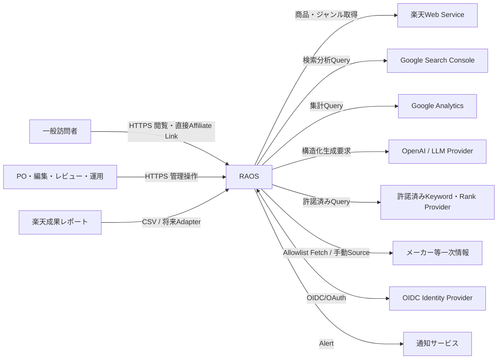

## 4.4 Trust Boundary

### Boundary A: Public Internet

一般訪問者と公開サイトの境界。入力はすべて不正と仮定する。公開ページ、クリックビーコン、公開読取APIだけを露出する。

### Boundary B: Administrative Plane

管理画面と管理APIの境界。OIDC、MFA、RBAC、CSRF対策、再認証、監査が必要。公開サイトとはCookie、キャッシュ、Host、CSPを分離する。

### Boundary C: Private Application Network

API、Worker、DB、Queue、Object Storage間。原則Private Subnetまたは同等の非公開ネットワーク。Service Roleで認証する。

### Boundary D: External Provider Egress

楽天、Google、OpenAI、一次情報への外向き通信。Allowlist、Timeout、Rate Limit、Circuit Breaker、秘密のRedactionを適用する。

### Boundary E: Immutable Evidence

原本、Source Packet、Publication Snapshotの保存境界。通常アプリから削除・上書きできる権限を制限する。

## 4.5 データ分類

| 分類 | 例 | 公開可否 | 保護 |
|---|---|---|---|
| PUBLIC | 公開記事、公開商品カード、編集方針 | 可 | 改ざん防止、CDN |
| INTERNAL | 企画、品質スコア、推定収益 | 不可 | RBAC、暗号化 |
| CONFIDENTIAL | Prompt、未公開記事、根拠パケット、成果詳細 | 不可 | 最小権限、監査 |
| SECRET | API Key、OAuth Token、DB資格情報 | 不可 | Secret Manager、ログ禁止 |
| RESTRICTED | セキュリティIncident、法務資料 | 不可 | 限定Role、個別監査 |

アクセスログ等に含まれる識別子は最小化し、IPアドレスをアプリ正本へ恒常保存しない。

---

# 5. アーキテクチャスタイル

## 5.1 モジュラーモノリス

Core APIとWorkerは、同一ドメインパッケージを利用する。モジュールごとに次を分離する。

- Application Service
- Domain Model
- Repository Interface
- External Port
- Event定義
- Policy
- Tests
- DB所有領域

モジュール間は公開Application InterfaceまたはDomain Eventを介する。他モジュールのRepositoryやテーブルを直接操作しない。

## 5.2 物理プロセス

| プロセス | 責務 | スケール |
|---|---|---|
| web | 公開SSR/Static、管理SPA、公開イベントBeacon | HTTP負荷で水平 |
| api | Command/Query、認証、状態遷移、公開Read API | HTTP負荷で水平 |
| worker-general | 通常Job、取込、検査、集計 | Queue深度で水平 |
| worker-ai | LLM Job、評価、生成 | AI Queueと予算で水平 |
| worker-publish | Snapshot生成、公開反映、Cache Purge | 低並列、順序重視 |
| scheduler | 定期JobのCommand発行 | 単一論理実行 |

MVPでは`worker-general`、`worker-ai`、`worker-publish`を同一イメージの異なるCommandとして起動できる。負荷が小さい間は同一Serviceに統合してよいが、QueueとConcurrency Limitは分ける。

## 5.3 Hexagonal Architecture

ドメイン中心から外側への依存方向を固定する。

```text
Domain
  ↑
Application
  ↑
Ports
  ↑
Adapters
  ↑
Framework / Cloud / Provider
```

Domain層はFastAPI、SQLAlchemy、AWS SDK、OpenAI SDKをimportしてはならない。外部SDKの型をドメインモデルへ漏らさない。

## 5.4 一貫性モデル

### 強整合

同一Commandで次を同時に更新する場合はPostgreSQL Transactionを使う。

- Aggregate状態
- Version
- Audit Entry
- Outbox Event
- Idempotency Record

### 結果整合

次はEvent/Jobで投影する。

- Public Read Model
- Search/Analytics集計
- Publication Snapshot
- 外部CMS将来Adapter
- 通知
- 類似度索引
- Dashboard集計

### 禁止

- DB Commit前に外部API成功を正本化する
- Queue送信とDB更新を別々の無保証操作として実装する
- LLM応答受信だけで記事状態をApprovedへ変更する
- 公開HTMLを正本として逆解析する

## 5.5 CommandとQueryの分離

完全なCQRS基盤は導入しないが、コード上はCommandとQueryを分離する。

- Commandは状態遷移、認可、監査、冪等性を伴う
- Queryは副作用を持たず、Roleに応じたProjectionを返す
- Public Queryは公開Projectionだけを返す
- 高コスト集計は非同期Materialized Viewへ投影する

## 5.6 State Machine

記事、公開、Job、取込、Policyは許可遷移表で管理する。不正遷移はAPI、Worker、DB制約の複数層で拒否する。

---

# 6. Container Architecture

## 6.1 Container Diagram

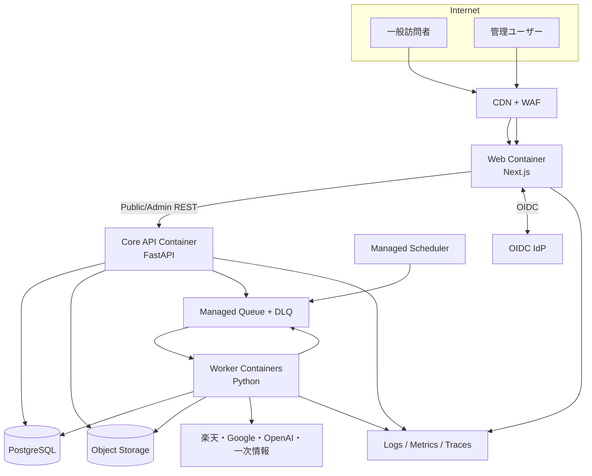

## 6.2 Web Container

### 責務

- 公開記事、カテゴリ、比較ページのSSRまたは静的生成
- 管理画面
- 認証開始・Callback
- 公開Read APIの利用
- クリックBeacon送信
- SEO Metadata、canonical、robots、sitemap表示
- Core Web VitalsのReal User Monitoring
- Error Boundaryと安全な縮退表示

### 非責務

- 楽天API秘密情報の保持
- LLM呼出し
- 記事承認ロジック
- 財務集計
- 原本・Source Packetの直接読取
- Affiliate URL生成・改変

### ルート分離

- `www.<domain>`: 公開
- `admin.<domain>`: 管理
- 可能なら別Deployment/Hostとし、少なくともCookie、CSP、cache-control、robotsを分離する
- 管理Hostは`noindex, nofollow`、認証前コンテンツを最小化する

## 6.3 Core API Container

### 責務

- REST/OpenAPI
- 認証・認可
- Command State Transition
- Transaction、Outbox、Audit
- 管理Query
- Public Read Query
- File Importの受付
- Job発行
- Feature Flag/Kill Switch評価
- Idempotency-Key
- Optimistic Concurrency

### API面

- `/api/v1/admin/*`
- `/api/v1/public/*`
- `/api/v1/events/click`
- `/api/v1/health/live`
- `/api/v1/health/ready`
- `/api/v1/internal/*`はPrivate NetworkとService Identityのみ

公開、管理、内部を同一プロセスに置いてもRouter、Dependency、Rate Limit、OpenAPI文書を分離する。

## 6.4 Worker Container

### 責務

- 楽天API取得
- 外部Source取得
- 原本保存と正規化
- Source Packet生成
- AI Job
- Quality/Policy Check
- Product Freshness
- Link Check
- Publication Snapshot生成
- Analytics Import
- Finance Reconciliation
- Materialized Projection更新
- 通知
- Restore/Replay補助

Workerは管理画面Sessionを持たない。Service RoleごとにQueueとデータ権限を制限する。

## 6.5 Scheduler

Schedulerは時刻に応じて直接業務処理をしない。`ScheduleDue`等のCommandまたはJob MessageをQueueへ発行する。

- 楽天商品更新
- Link Check
- Search Console取込
- GA4取込
- 成果CSV未処理検知
- Policy確認Reminder
- Backup検証Reminder
- Quality Random Audit

Schedule IDと対象期間をidempotency keyへ含め、二重発火を安全にする。

## 6.6 PostgreSQL

### 用途

- 業務状態
- Stable ID
- Transaction
- Audit Index
- Outbox
- Idempotency
- Projection
- 集計
- pgvector補助索引

### 禁止

- 大容量外部原本を無制限にJSONBへ保存
- 秘密値の平文保存
- 公開Webへ広範なDB権限を付与
- 複数モジュールによる同一テーブルの無秩序な更新

## 6.7 Object Storage

### Prefix例

```text
raw/rakuten/{api}/{yyyy}/{mm}/{dd}/{request_id}.json
raw/google/{source}/{yyyy}/{mm}/{dd}/{import_id}.json
raw/revenue/{yyyy}/{mm}/{import_id}/original.csv
source-packets/{article_plan_id}/{version}.json
ai-inputs/{job_id}/input.json
ai-outputs/{job_id}/output.json
publication/{article_id}/{publication_version}.json
exports/audit/{yyyy}/{mm}/...
```

各ObjectにSHA-256、content type、source、acquired_at、retention classをメタデータとして記録する。原本BucketはVersioningを有効にし、削除権限を運用Roleから分離する。

## 6.8 QueueとDLQ

QueueはJob Classごとに分ける。

- `ingestion`
- `ai`
- `quality`
- `publication`
- `freshness`
- `analytics`
- `notification`
- 各DLQ

Message本文には大きなSourceを入れず、Job IDとObject URI、期待Versionを入れる。個人情報、Token、Prompt本文、Affiliate URL全体を不要に載せない。

## 6.9 Identity Provider

管理ユーザーのPasswordをRAOSで保持しない。OIDC Providerで認証し、RAOS DBでRoleとScopeを管理する。

MFAを必須にするRole:

- Owner
- Compliance Approver
- Operator
- Service Credential管理者

## 6.10 Observability Platform

- OpenTelemetry Trace
- JSON Structured Log
- Time-series Metrics
- Error Tracking
- Alert Routing
- Audit Logは一般Logと別系統

一般Logは削除・サンプリング可能だが、Audit Logは改変防止と長期保持を優先する。

---

# 7. Domain Module Architecture

## 7.1 モジュール一覧

| Module | 責務 | 主な要求 |
|---|---|---|
| IAM | Role、Scope、Service Identity | NFR-SEC-002、FR-020 |
| Portfolio | Category、Cluster、Keyword、Opportunity | FR-001、FR-005、FR-016 |
| Catalog | Product、Shop、Offer、Grouping、Rakuten取込 | FR-002～004、FR-012 |
| Evidence | Source、Fact、Claim、Source Packet、Lineage | FR-004、FR-006、FR-007 |
| Editorial | Article Plan、Version、Block、Recommendation | FR-001、FR-005、FR-009 |
| AI Orchestration | Prompt、Model Route、AI Job、Evaluation | FR-006～008、FR-018 |
| Quality & Policy | Rule、Quality Score、Policy Bundle、Gate | FR-008、FR-017、FR-019 |
| Publishing | Approval、Snapshot、Public Projection、Rollback | FR-009～011、FR-019 |
| Freshness | Refresh Schedule、Stale State、Link Health | FR-011、FR-012 |
| Analytics | Event、GSC、GA4、Attribution | FR-013 |
| Finance | Commission、Cost、EPC、RPM、Profit | FR-014～016、FR-018 |
| Operations | Job、Outbox、Audit、Alert、Incident | FR-019、FR-020、全NFR |

## 7.2 IAM Module

### 所有する概念

- User
- Role
- Permission
- UserRoleAssignment
- ServicePrincipal
- Session Metadata
- Break-glass Access Record

### 主要ルール

- 認証はIdP、認可はRAOS
- Roleは複数付与可能
- PermissionはAction×Resource Scope
- CategoryまたはSite Scopeを将来付与可能
- OwnerでもAudit Logを改変できない
- Service Principalは人間用Endpointへアクセスできない
- Break-glass操作は再認証、理由、期限、Alertを必須化

### 代表Permission

```text
portfolio.read
portfolio.write
catalog.refresh
evidence.read
article.edit
article.review
article.approve
publication.publish
publication.rollback
policy.approve
finance.import
incident.kill_links
incident.stop_publication
audit.read
secret.rotate
```

## 7.3 Portfolio Module

### 所有する概念

- Category Candidate
- Category
- Intent Cluster
- Keyword
- Keyword Metric Observation
- Article Opportunity
- Business Opportunity Score
- Editorial Feasibility Score
- Compliance Risk Score
- Cannibalization Candidate

### 不変条件

- 編集適合度と事業機会スコアを別Field・別Serviceで計算する
- Affiliate RateをEditorial Suitabilityへ入力しない
- 記事企画はStable IDを持ち、Keyword文字列変更でIDを変えない
- データ由来、手動入力、推定を区別する
- Provider未取得値を0として扱わずUnknownとする

### Event

- `portfolio.category_approved`
- `portfolio.keyword_imported`
- `portfolio.opportunity_scored`
- `portfolio.article_plan_requested`
- `portfolio.category_paused`

## 7.4 Catalog Module

### 所有する概念

- Rakuten Genre
- Product Candidate
- Canonical Product
- Offer
- Shop
- Product Identifier
- Product Attribute
- Image Reference
- Price Observation
- Availability Observation
- Affiliate Link Observation
- Product Grouping Decision
- Raw Ingestion Record

### 分離

- **Product**: 型番・容量等を代表する正規化対象
- **Offer**: Shop単位の販売条件
- **Observation**: 時点付き外部事実
- **Current Projection**: 有効期限内の最新安全値

価格や在庫はProduct本体へ上書きせずObservationとして追加し、Current Projectionを再計算する。

### 主要ルール

- 楽天Item Code、Shop Code、API Version、Acquired Atを保持
- Raw ResponseのhashとObject URIを保持
- 同一性判定はルール版と信頼度を保存
- 自動Mergeは高信頼条件のみ
- 低信頼候補は人間確認
- 画像は許可されたURLと利用条件を保持し、加工版を生成しない
- Affiliate URLは秘密ではないが、正規値として改変禁止

### Event

- `catalog.raw_ingested`
- `catalog.offer_observed`
- `catalog.product_candidate_created`
- `catalog.product_grouped`
- `catalog.product_changed`
- `catalog.offer_stale`
- `catalog.offer_unavailable`

## 7.5 Evidence Module

### 所有する概念

- Source
- Source Snapshot
- Fact
- Derived Fact
- Claim
- Evidence Link
- Source Packet
- Confidence
- Source Classification
- Acquisition Policy

### Source Classification

1. Official API
2. Manufacturer/Official Primary Source
3. Operator-entered Verified Fact
4. Permitted Third-party Dataset
5. Derived Deterministic Calculation
6. Editorial Judgment
7. Unsupported / Prohibited

`Unsupported / Prohibited`は公開Claimへ紐付けられない。

### Source Packet

Source Packetは記事企画と版に紐付き、次を含む。

- 対象PersonaとSearch Intent
- 比較対象Product/Offer ID
- 許可されたFacts
- Derived Factsと計算式
- 不足情報
- 使用禁止情報
- Freshness
- Recommendation Rule Version
- Policy Bundle Version
- Packet Hash

一度AI Jobへ使ったPacketは上書きしない。

### Claim Type

- `EXTERNAL_FACT`
- `DERIVED_FACT`
- `EDITORIAL_JUDGMENT`
- `DISCLOSURE`
- `UNCERTAINTY`
- `EXPERIENCE`（実証記録がない場合は禁止）

## 7.6 Editorial Module

### 所有する概念

- Article Plan
- Article
- Article Version
- Structured Block
- Comparison Axis
- Recommendation Set
- Recommendation Rationale
- Editorial Score
- Human Edit
- Review Comment

### Article Version

Articleは識別子、Article Versionは内容版である。編集のたびに全版を複製する必要はないが、公開候補作成時に不変版を確定する。

### Structured Block例

- Heading
- Paragraph
- Summary
- Selection Criteria
- Comparison Table
- Product Card
- Pros/Cons
- Suitable/Unsuitable
- Warning
- FAQ Content
- Disclosure Reference
- Source Note
- Call To Action

任意HTMLを正本にしない。Rich Textは許可MarkとLink Schemeを限定したAST/JSONとして保存する。

### Recommendation

推薦順位は、承認済みComparison AxisとEditorial Ruleから決定する。LLMは説明文を提案できるが、順位の正本を直接決めない。

## 7.7 AI Orchestration Module

### 所有する概念

- AI Task Definition
- Prompt Template
- Prompt Version
- Model Route
- AI Job
- AI Attempt
- Schema Version
- Token Usage
- Cost Observation
- Evaluation Result
- Human Correction Signal

### 主要ルール

- Source PacketがApprovedでなければ生成不可
- Model IDは設定値
- Provider固有応答をCanonical AI Resultへ変換
- JSON Schema検証に失敗した出力は業務結果として採用しない
- 自動再試行は同一Promptの無限再送をしない
- 事実不足時は`insufficient_evidence`を返せるSchemaにする
- LLM出力はUntrusted Inputとして再検査する
- ModelからのTool CallをMVPでは許可しない
- ProviderへSecret、個人情報、成果レポートを不要に送らない

## 7.8 Quality & Policy Module

### 所有する概念

- Policy Bundle
- Rule
- Rule Version
- Quality Check
- Check Finding
- Quality Score
- Waiver
- Gate Decision
- Affected Content Query

### Rule Class

- Deterministic Blocking Rule
- Deterministic Scoring Rule
- AI-assisted Review Rule
- Manual Checklist
- External Contract Test

Blocking Ruleの例:

- 広告表示欠落
- APIクレジット欠落
- Source Packet未承認
- 主要ClaimのEvidence欠落
- 架空体験表現
- レビュー本文由来入力
- Affiliate URL不正
- Price Stale
- 人間承認なし
- Policy Bundle旧版で再確認期限超過

AI-assisted RuleだけでBlocking判定を確定する場合は、人間確認経路を必要とする。

## 7.9 Publishing Module

### 所有する概念

- Review Assignment
- Approval
- Publication Candidate
- Publication Snapshot
- Publication
- Public Route
- Redirect
- Canonical
- Noindex State
- Rollback Record
- Cache Invalidation

### 不変条件

- Approved Article VersionのみSnapshot化可能
- Snapshot hashと入力Version hashを保存
- 同一内容の二重公開は冪等
- 公開後にArticle Versionを編集しても公開Snapshotは変わらない
- Rollbackは新しいPublication Actionとして記録
- Kill SwitchはSnapshotを削除せず表示Projectionを制御
- 広告表示とAPIクレジットはRendererが必ず挿入

## 7.10 Freshness Module

### 所有する概念

- Freshness Policy
- Refresh Schedule
- Refresh Attempt
- Staleness Assessment
- Link Check
- Product Impact
- Article Impact
- Update Candidate

### 主要ルール

- SLAはCategory×Field×Placementで設定
- 失敗回数だけで値を削除せず、期限と信頼状態で判断
- Stale Priceは公開しない
- Product Cardに価格を出さずCTAだけ残す縮退を選べる
- Offerが消えた場合は代替Offer候補を作るが自動推薦変更しない
- 変更影響記事を逆引きする

## 7.11 Analytics Module

### 所有する概念

- Anonymous Event
- Page View Aggregate
- Affiliate Click Event
- GSC Observation
- GA4 Observation
- Attribution Key
- Attribution Estimate
- Data Quality Finding

### 重要な分離

- Provider Fact: 楽天で確定した成果
- First-party Fact: 記録したOutbound Click
- External Analytics Fact: GSC/GA4集計
- Estimate: 記事別成果配賦推定

推定値を確定成果として表示しない。

## 7.12 Finance Module

### 所有する概念

- Revenue Import
- Commission Event
- Commission Status
- External Cost
- Human Cost
- Allocation Rule
- Article Unit Economics
- Category Unit Economics
- Forecast
- Payback Assessment

### 主要ルール

- 発生報酬と確定報酬を別状態で保存
- 原CSVとParser Versionを保持
- 同一レポートの二重取込を防ぐ
- 手動補正は元値を上書きせずAdjustmentを追加
- Article Revenueが推定の場合は明示
- LLM/API費用はJob IDから記事・カテゴリへ追跡
- JPY換算時は為替レートSourceと時点を保持

## 7.13 Operations Module

### 所有する概念

- Job
- Job Attempt
- Outbox Event
- Inbox Receipt
- Idempotency Record
- Audit Event
- Alert
- Incident
- Kill Switch
- Feature Flag
- Configuration Version

### 主要ルール

- AuditはAppend-only
- Job再実行は元Attemptを残して新Attempt
- DLQからの再投入はOperator理由必須
- Kill Switch変更は高優先Alert
- Configuration変更は差分・承認者・有効時刻を記録
- Feature FlagはCompliance Blocking Ruleを無効化できない


---

# 8. Data Architecture

## 8.1 正本の定義

| データ | 正本 | 補足 |
|---|---|---|
| Article Plan / Article / Approval | PostgreSQL | 業務状態の正本 |
| 外部API原本 | Object Storage | DBにはURI、hash、metadata |
| 正規化Product/Offer | PostgreSQL | 原本から再構築可能だが業務判断を含む |
| Source Packet | Object Storage＋DB Registry | 不変JSONと版情報 |
| Prompt / Policy定義 | Git | Review可能な定義 |
| 稼働Prompt / Policy Version | PostgreSQL | どの版がいつ有効か |
| AI応答原本 | Object Storage | Canonical ResultはDB |
| Publication Snapshot | Object Storage＋DB Registry | 公開内容の不変正本 |
| Public Read Model | PostgreSQL/Cache | Snapshotから再生成可能 |
| 楽天成果原本 | Object Storage | 財務取込原本 |
| Commission Canonical Record | PostgreSQL | ParserとAdjustment履歴付き |
| Audit Event | PostgreSQL＋定期Export | Append-only |
| Secret | Secret Manager | DB・Gitへ保存しない |
| Code / IaC | Git | Commit SHAとReleaseを紐付ける |

## 8.2 PostgreSQL論理Schema

MVPでは単一DB内を論理Schemaで分離する。物理分割は後続の負荷・組織条件で判断する。

```text
iam
portfolio
catalog
evidence
editorial
ai
policy
publishing
freshness
analytics
finance
ops
public
```

`public`はPostgreSQL予約語との混同を避けるため、実装では`readmodel`等の名称を採用してよい。

### 所有ルール

- 各SchemaにOwner Moduleを1つだけ設定
- 他ModuleはView、Repository Interface、Application APIを介する
- Foreign Keyは整合性に有効な範囲で使用する
- Cross-schema更新TransactionはApplication Serviceが調停する
- 将来分離を妨げる巨大Joinを公開Queryへ常用しない

## 8.3 ID方針

### Internal ID

- UUIDv7または時系列ソート可能な128-bit IDを標準とする
- DB Sequenceを外部公開IDへ使用しない
- ID生成はApplication側またはDB標準機構で一貫させる

### External ID

- 楽天Item Code、Shop Code、Genre ID等は専用Columnへ保存
- Provider名、Provider Version、External IDの複合一意性を定義
- External IDを内部Primary Keyにしない

### Human-readable ID

- Article: `ART-...`
- Plan: `PLAN-...`
- Source Packet: `SP-...`
- Job: `JOB-...`
- Incident: `INC-...`

表示用IDは不変とし、Slugとは分離する。

## 8.4 時刻

- DB保存はUTC
- UI表示はJST
- 外部Sourceの元時刻と取込時刻を別々に持つ
- `occurred_at`, `observed_at`, `ingested_at`, `effective_at`, `expires_at`を混同しない
- 日次集計のBusiness DateはAsia/Tokyoで切る
- Clock Skewを考慮し、外部時刻だけで順序を決めない

## 8.5 金額と数値

- JPY金額は整数円
- 外貨費用は元通貨、換算レート、換算時刻、換算後JPYを保存
- RateはDecimalで保存しBinary Floatを財務計算に使わない
- Null、0、不明、取得失敗を区別する
- Percentは分母と計算版を保持する
- 丸め規則をFinance Policyとして版管理する

## 8.6 Observation Pattern

変動する外部事実はCurrent Valueへ直接上書きせずObservationとして保持する。

```text
PriceObservation
- offer_id
- observed_price_jpy
- shipping_condition
- observed_at
- ingested_at
- source_snapshot_id
- confidence
- valid_until
```

Current Projectionは次を評価して生成する。

- Source Priority
- Freshness
- Completeness
- Validation Status
- Conflict
- Policy Version

これにより、「過去に何が表示されていたか」「いつ変化したか」「なぜ非表示になったか」を説明できる。

## 8.7 Immutability

次のレコードは論理的に不変とする。

- Raw Source Snapshot
- Source Packet Version
- AI Attempt Input/Output
- Article Review Decision
- Publication Snapshot
- Revenue Import Original
- Commission Adjustment
- Audit Event
- Policy Bundle Version

誤りを訂正する場合は、新版またはCorrection Eventを追加する。

## 8.8 Optimistic Concurrency

編集可能Aggregateに`version`を持たせる。更新APIは`If-Match`または同等のexpected versionを要求する。

競合時:

- 409 Conflict
- 現在版と差分を返す
- 暗黙のlast-write-winsを禁止
- 管理画面はMergeまたは再読込を促す

## 8.9 Idempotency

状態変更APIは、二重送信の影響が大きい操作で`Idempotency-Key`を必須にする。

対象例:

- Article Generate
- Approve
- Publish
- Rollback
- Revenue Import
- Refresh Batch
- Kill Switch変更

`idempotency_record`にはActor、Route、Payload Hash、Response、期限を保存する。同一KeyでPayloadが違う場合は409とする。

## 8.10 Outbox / Inbox

### Outbox

同一DB Transactionで業務更新と`outbox_event`を保存する。DispatcherがQueueへ送信し、成功後に送信状態を記録する。

### Inbox

Consumerは`event_id`または`job_id + handler_version`を`inbox_receipt`へ保存し、処理済みを判定する。処理とReceiptを同一Transactionに入れる。

### 保証

- Eventの喪失を最小化
- 重複配送を許容
- 順序はAggregate Versionで検証
- 期限切れ・古いEventはNo-opまたは再構築要求

## 8.11 Public Read Model

公開サイトが必要とする最小項目だけを投影する。

- Public Article Metadata
- Renderable Blocks
- Approved Product References
- Safe Current Offer Projection
- Disclosure
- Credit
- Canonical/Index State
- Publication Version
- Freshness Status
- Kill Switch Status

含めてはならないもの:

- Prompt
- 未公開Comment
- Revenue
- Affiliate Rate比較
- Source Packet全文
- Internal Score
- User/Role
- Secret
- Incident詳細

## 8.12 Vector/Similarity Data

pgvectorを次へ限定利用する。

- Keyword重複候補
- Article Cannibalization候補
- 自サイト本文類似度
- Human Correction類似検索
- Source Fact候補照合

Vector検索結果は候補であり、公開判断の正本にしない。Embedding Model、Dimension、Input Hash、Created Atを保存し、モデル変更時に再計算可能にする。

## 8.13 データ系統

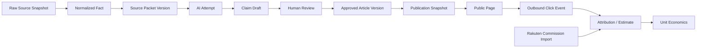

公開Claimから逆方向に、Publication Snapshot、Article Version、Claim、Evidence Link、Fact、Raw Snapshotへ到達できることを`NFR-DATA-001`の受入条件とする。

## 8.14 Retention Class

具体日数はRAOS-OPS-001で最終決定するが、Architecture上は次のClassを持つ。

| Class | 対象 | 方針 |
|---|---|---|
| R0 Temporary | Upload一時領域、失敗Chunk | 短期自動削除 |
| R1 Operational | Job Log、一般Metric | 運用上必要な期間 |
| R2 Reproducibility | Raw API、AI入出力、Source Packet | 少なくとも主要公開版の再現期間 |
| R3 Audit | Approval、Policy、Kill Switch、Admin操作 | 長期・改変防止 |
| R4 Financial | Commission、費用、Adjustment | 税務・会計方針に従う |
| R5 Legal Hold | Incident、請求関連 | 明示解除まで削除禁止 |

RetentionはObject TagまたはDB Fieldで管理し、アプリコードへ日数を散在させない。

## 8.15 Backup対象

- PostgreSQL全Schema
- Object StorageのVersion/Metadata
- Prompt/Policy/Config Git Repository
- Terraform State
- OIDC/RBAC Export
- Secret自体ではなく復旧・再発行手順
- Monitoring設定
- Domain/DNS設定

Backupが存在するだけでなく、定期Restore Testを行う。

---

# 9. Integration Architecture

## 9.1 Adapter共通契約

各外部Adapterは次を実装する。

```text
capabilities()
health_check()
execute(request, idempotency_context)
normalize(raw_response)
classify_error(error)
rate_limit_state()
```

共通要件:

- Timeout
- Retry Policy
- Exponential Backoff＋Jitter
- Circuit Breaker
- Rate Limit Budget
- Request/Response Metadata
- Credential Redaction
- Correlation ID
- Contract Test Fixture
- Provider Version
- Cost Observation
- Terms/Policy Metadata
- Kill Switch

## 9.2 楽天Web Service Adapter

### 入力

- API Operation
- API Version
- Query Parameters
- Output Fields
- Pagination
- Request Purpose
- Category/Plan Context

### 出力

- Raw Snapshot URI/hash
- Provider Request IDがあれば保持
- Normalized Result
- Pagination State
- Rate Limit/Retry Metadata
- Validation Findings

### 秘密管理

`applicationId`, `accessKey`, `affiliateId`はSecret ManagerからRuntime Injectionする。Request Logには値を残さず、Query Stringを構造化して秘密Fieldをredactする。

### API Version

API Versionは`provider_configuration`で有効期間を持たせる。新Version導入は次を経る。

1. Fixture取得
2. Schema差分
3. Contract Test
4. Shadow Run
5. Normalization比較
6. PO/Operator承認
7. 段階切替
8. 旧Version撤去

### Rate Limit

Providerから明示された制約と実測を設定に持ち、Token BucketまたはLeaky Bucketで送信を制御する。429/5xxは通常の障害経路として扱い、記事データを消さない。

### 禁止

- 全商品を無制限にCrawlする
- Affiliate URLに任意Queryを追加する
- APIで提供されないレビュー本文を推測する
- 生のSDK ResponseをDomain Modelとして使う

## 9.3 楽天成果レポートAdapter

MVPではCSV Uploadを基準経路とする。

### Upload Flow

1. 管理者がProvider、対象期間、Fileを指定
2. 一時BucketへUpload
3. Malware/Format/Size Check
4. File Hashで重複検出
5. Parser Versionを選択
6. Dry Run Preview
7. 人間確認
8. Canonical Import
9. Reconciliation Summary
10. 原本をFinancial Retentionへ移動

### CSV対策

- Encoding検出は限定候補から行い、不明時は拒否
- Spreadsheet Formula Injection対策
- 列名・型・期間・通貨検査
- 合計値と行集計の整合
- Parserが認識しないColumnを記録
- 取込済み原本を上書きしない

将来正式APIを追加しても、Canonical Import InterfaceはCSVと同じにする。

## 9.4 Search Console Adapter

対象はSearch Analytics、Sitemaps、URL Inspection等の許可されたAPI機能である。

### 取込

- 日次または遅延を考慮した定期Batch
- Date RangeとDimensionを明示
- Row Limit/Pagination管理
- Query結果原本の保存
- Data Stateを`preliminary`、`finalized`等で区別可能にする
- ページURLをPublic Route IDへ正規化
- Property、Search Type、Country、Deviceを保持
- API Quotaを監視

URL Inspectionは全URLを高頻度実行せず、公開、新規、異常、Sampleへ限定する。

## 9.5 GA4 Adapter

GA4は行動分析の一Sourceであり、RAOSの財務正本ではない。

### 用途

- Session/Page Aggregate
- Affiliate Click Event Aggregate
- Engagement
- Landing Page
- Device等の非個人集計
- Dashboard整合確認

### 注意

- GA4 Reporting値は設定、集計、しきい値、近似等の影響を受け得る
- First-party Beaconと完全一致する前提を置かない
- 差分率をData Quality Metricとして監視する
- User-levelの不要なExportをMVPでは取得しない

## 9.6 First-party Click Event

### 原則

Anchorの`href`は楽天から取得した正規Affiliate URLをそのまま使用する。

```html
<a
  href="[official affiliate URL]"
  rel="sponsored nofollow"
  data-article-id="..."
  data-product-id="..."
  data-placement-id="..."
>
  楽天市場で最新情報を見る
</a>
```

クリック時は`sendBeacon`またはkeepalive FetchでRAOSへEventを送り、Navigationを阻害しない。Beacon失敗時もリンクは動作する。

### Event項目

- event_id
- occurred_at
- publication_id
- article_id
- product_id
- offer_id
- placement_id
- page_path
- anonymous_session_id（同意・プライバシー方針に従う）
- client_event_version
- consent_state
- user_agent_class等の最小情報

Affiliate URL、検索語、個人識別情報をEventへ不要に含めない。

### 禁止

- RAOSのRedirect Endpoint経由で楽天へ飛ばす
- クリック前に同期API成功を待つ
- Destinationを隠す
- 任意Tracking Parameterを楽天URLへ追加する
- クリック失敗時に購入導線を止める

## 9.7 Keyword/Rank Provider Adapter

Interfaceは次を返す。

- Keyword
- Locale
- Device
- Observation Date
- Metric Type
- Value
- Unit
- Provider
- Confidence
- Raw Reference

Provider未契約時はCSV Importを使う。SERP HTMLを自前取得する実装はWON'T。

## 9.8 Primary Source Adapter

自動取得するDomainはAllowlist制とする。

### Guardrail

- HTTPSのみ
- Private IP、localhost、metadata endpointを拒否
- Redirect回数制限
- MIME/Size/Timeout制限
- robots/Termsの運用確認
- Script実行を原則しない
- HTML/PDFをUntrustedとしてSandbox解析
- 原文を公開コンテンツへ自動転載しない
- Source Typeと取得条件を記録
- 禁止命令やPrompt文をデータとして扱い、実行指示と解釈しない

Allowlist外Sourceは手動登録し、Editorが必要Factsだけを転記・検証する。

## 9.9 LLM Provider Adapter

### Canonical Request

- task_type
- prompt_version
- model_route
- source_packet_uri/hash
- JSON Schema
- locale
- policy_version
- max_cost
- max_tokens
- timeout
- correlation_id

### Canonical Response

- provider
- model
- provider_request_id
- status
- structured_output
- refusal
- usage
- estimated_cost
- latency
- raw_output_uri
- validation_findings
- finish_reason
- created_at

### Provider変更

PromptをProvider固有形式へ直接埋め込まず、Canonical Prompt TemplateとAdapter Rendererを分ける。モデル変更はEvaluation Datasetで比較してから有効化する。

## 9.10 Notification Adapter

通知は業務状態の正本ではない。承認依頼やAlertを送っても、受信確認だけで承認済みにしない。

Priority:

- P0: Security、規約、誤送客、Kill Switch
- P1: Publication failure、Stale exposure、DLQ増加
- P2: Import失敗、Quality degradation
- P3: Scheduled report、低優先改善

P0は複数経路を利用可能にする。

## 9.11 Publication Adapter

MVPのPrimary RendererはRAOS Webである。将来WordPress等へ出すため、次のPortを定義する。

```text
create_draft(snapshot)
publish(snapshot, expected_remote_version)
unpublish(publication_id)
rollback(target_version)
set_index_state(...)
set_redirect(...)
health_check()
```

MVPではLocal Publication AdapterがPublic Read ModelとCacheを更新する。外部CMS Adapterは後続Phaseで追加する。

## 9.12 外部エラー分類

| Class | 例 | 動作 |
|---|---|---|
| TRANSIENT | Timeout、429、5xx | Backoff再試行 |
| AUTH | 401、Token失効 | Circuit Open、P1/P0通知 |
| CONTRACT | Schema変更、必須Field欠落 | Quarantine、Contract Incident |
| POLICY | 禁止Source、規約停止 | 即時Blocking |
| DATA | 不正値、文字化け、型不一致 | 行/Batch隔離 |
| PERMANENT | 404終売、権限なし | Domain Stateへ反映 |
| BUDGET | Cost上限、Quota上限 | Queue保留、PO通知 |
| UNKNOWN | 未分類 | 安全側で停止し調査 |

---

# 10. Event and Job Architecture

## 10.1 Event Envelope

```json
{
  "event_id": "UUIDv7",
  "event_type": "catalog.offer_observed",
  "event_version": 1,
  "occurred_at": "UTC ISO-8601",
  "producer": "catalog",
  "aggregate_type": "offer",
  "aggregate_id": "UUID",
  "aggregate_version": 12,
  "correlation_id": "UUID",
  "causation_id": "UUID",
  "actor": {
    "type": "user|service|schedule",
    "id": "..."
  },
  "payload": {},
  "metadata": {
    "schema_hash": "...",
    "trace_id": "...",
    "environment": "production"
  }
}
```

Event TypeとSchemaはVersion管理し、互換性検査をCIに入れる。

## 10.2 Job Message

```json
{
  "job_id": "UUIDv7",
  "job_type": "ai.generate_article_draft",
  "job_version": 1,
  "idempotency_key": "...",
  "requested_at": "...",
  "not_before": "...",
  "priority": "normal",
  "resource_ref": {
    "type": "article_version",
    "id": "...",
    "expected_version": 4
  },
  "input_ref": {
    "uri": "s3://.../source-packets/...",
    "sha256": "..."
  },
  "budget": {
    "max_attempts": 3,
    "max_cost_jpy": 300,
    "deadline_at": "..."
  },
  "correlation_id": "...",
  "requested_by": "..."
}
```

## 10.3 Job State

```text
REQUESTED
  → QUEUED
  → RUNNING
  → SUCCEEDED
  → FAILED_RETRYABLE → RETRY_SCHEDULED → QUEUED
  → FAILED_TERMINAL
  → QUARANTINED
  → CANCELLED
  → EXPIRED
```

`RUNNING`にはLeaseとHeartbeatを持つ。Worker消失時はLease Expiry後に再実行可能にする。

## 10.4 Retry Policy

- AttemptごとにError Classを保存
- 同一Errorを無限再試行しない
- Backoffは指数＋Jitter
- Deadlineを超えたJobはExpired
- Auth/Policy/Contractは自動再試行しない
- AI Schema FailureはPrompt/Model Routeに応じた限定再試行
- Publicationは重複公開を防ぐIdempotency Key必須
- DLQ移行時は対象記事・公開影響を算出

## 10.5 Concurrency Control

- Provider×Operation単位の最大同時数
- Category×Job Type単位の最大同時数
- Article単位のGeneration Lock
- Publication Route単位のSerialisation
- Revenue Period単位のImport Lock
- Kill Switch時は新規Publication JobをCancel/Reject

DB Advisory Lockへ過度に依存せず、Job LeaseとUnique Constraintを併用する。

## 10.6 Workflow 1：商品取得

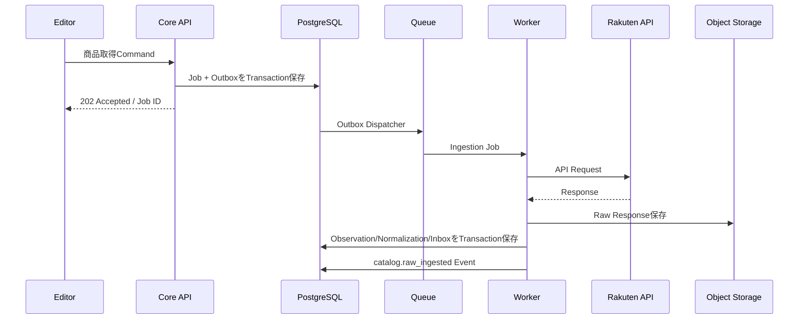

### 受入条件

- 同一Job再実行でObservationが重複しない
- Raw Snapshot hashが一致する
- SecretがLog/Objectへ含まれない
- 429/5xxで既存Current Projectionを破壊しない
- Schema異常はQuarantineへ移る

## 10.7 Workflow 2：Source Packet生成

1. Article PlanをFreeze
2. 対象Product/Offer、Source、Factを選定
3. Deterministic Derived Factを計算
4. FreshnessとPolicyを検査
5. Missing Evidenceを列挙
6. Packet JSONを生成
7. Schema Validation
8. Object Storageへ不変保存
9. HashとVersionをDB登録
10. ReviewerがApprove

Missing EvidenceがBlockingならAI Generation Jobを発行しない。

## 10.8 Workflow 3：AI Draft生成

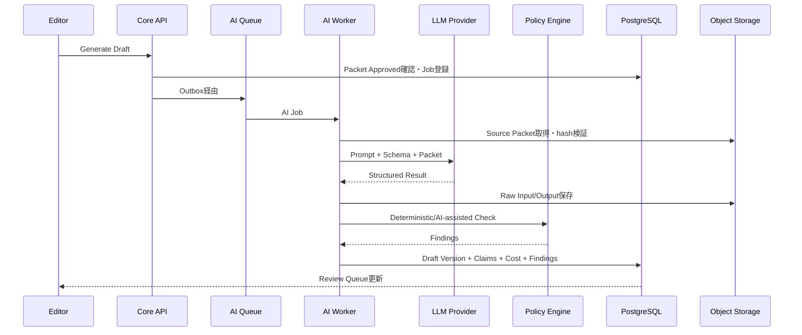

### 失敗時

- LLM拒否: `REFUSED`
- Schema不一致: `INVALID_OUTPUT`
- Evidence不足: `INSUFFICIENT_EVIDENCE`
- Cost超過: `BUDGET_EXCEEDED`
- Policy違反: `BLOCKED`
- Provider障害: RetryまたはFallback Route

Fallbackはモデル変更を自動で行ってもよいが、Provider、Model、結果差を記録する。

## 10.9 Workflow 4：人間レビューと承認

- ReviewerはClaimごとにEvidenceを開ける
- AI Draftと前版の差分を表示
- Blocking Findingを解消しない限りApprove不可
- Recommendation順位変更は理由必須
- Affiliate RateはReview画面のEditorial領域へ表示しない
- Approval時にArticle Version、Source Packet、Policy Bundle、Quality ResultをFreeze
- ApprovalはActor、時刻、Role、理由、MFA状態を記録

同一人物の自己承認を禁止するかはチーム規模に応じた設定とする。1名運用時でも、Generation直後の自動承認は不可とし、明示操作を要求する。

## 10.10 Workflow 5：公開

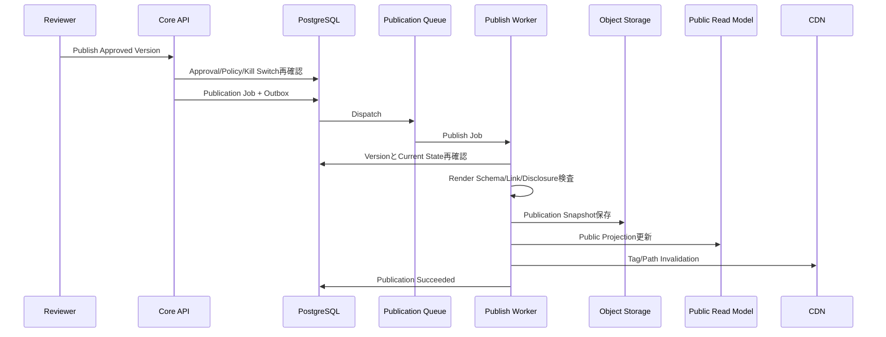

公開直前に再確認する項目:

- Approvalが失効していない
- Policy Bundleが許容版
- Blocking Findingが0
- Affiliate Linkが正規かつ許可状態
- Price等の表示値がFresh
- DisclosureとAPI CreditがRendererに存在
- Route/Canonical/Noindexの整合
- Kill Switch OFF
- Expected Article Version一致

## 10.11 Workflow 6：商品鮮度更新

1. Schedulerが対象OfferをPriority Queue化
2. Freshness Policyで再取得優先度を算出
3. Rakuten Adapter取得
4. Observation追加
5. Change Detection
6. Current Projection再計算
7. Affected Publication検索
8. 非編集的Fieldだけ自動投影
9. Recommendation/本文影響はUpdate Candidateへ
10. Stale/Unavailable時はSafe Degradation
11. Cache Invalidation
12. Metric更新

## 10.12 Workflow 7：リンク検査

HTTP到達性だけで正常としない。

- URL Scheme
- Host Allowlist
- URL改変有無
- Affiliate URL形式
- Redirect Host Chain
- Status
- Content Type
- 最終遷移が楽天系か
- Product/Shop識別整合
- Timeout
- 検査時刻

過度なアクセスにならない頻度とし、Providerルールに従う。Link Check失敗時は再試行後にCTAを停止し、記事本文は残せる。

## 10.13 Workflow 8：Search/Analytics取込

- 対象日をJSTで決定
- Providerのデータ遅延を考慮
- 原本保存
- Canonical Dimensionへ変換
- Route/Article IDへMap
- 重複Import防止
- 前回値との差分・欠損検知
- Aggregate再計算
- Dashboard Projection更新

Providerの過去値が更新された場合に再取込できるよう、ObservationをUpsertする際もImport RunとRaw hashを残す。

## 10.14 Workflow 9：成果取込と採算

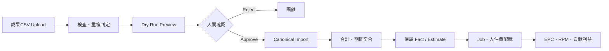

確定成果が記事へ直接紐付かない場合、次を分ける。

- Confirmed Provider Total
- Directly Attributed Confirmed Amount
- Estimated Allocated Amount
- Unattributed Amount

合計の不変条件:

```text
Provider Total
= Directly Attributed
+ Estimated Allocated
+ Unattributed
+ Explicit Adjustment
```

## 10.15 Workflow 10：Policy変更

1. Policy Source確認
2. Git上でPolicy Bundle変更
3. Review/Approval
4. CI Rule Test
5. DBへVersion登録
6. Shadow Evaluation
7. 影響記事一覧生成
8. Blocking度に応じて公開継続/CTA停止/記事停止
9. Re-review Queue
10. 有効化
11. Audit/Notification

Policyを有効化した結果、過去記事が直ちに非準拠となる場合は、利益や検索流入より安全側を優先する。

## 10.16 Workflow 11：Kill Switch

Kill Switchレベル:

- `GLOBAL_PUBLICATION_FREEZE`: 新規公開・更新を停止
- `GLOBAL_AFFILIATE_LINKS_OFF`: 全Affiliate CTAを非表示または無効化
- `SITE_OFFLINE`: 公開サイトをMaintenanceへ
- `CATEGORY_PAUSED`
- `ARTICLE_PAUSED`
- `PROVIDER_DISABLED`
- `AI_DISABLED`
- `AUTO_REFRESH_DISABLED`

Affiliate Link停止はPublic RendererがRequest時または短TTL Cacheで確認し、障害時はfail closedでCTAを出さない。管理操作にはMFA再認証、理由、Incident IDを必須とする。

## 10.17 Workflow 12：Rollback

- 対象Publication Versionを選択
- 現在状態と差分表示
- Blocking Policyを再評価
- 古い版が現在の規約に違反する場合はRollback不可
- 新しいPublication ActionとしてSnapshotを再投影
- Cache Invalidation
- Search Metadata確認
- Audit
- IncidentまたはChange Reasonを紐付け

DB全体のRollbackではなく、Article単位のApplication Rollbackを標準とする。


---

# 11. Content and Publication Architecture

## 11.1 ネイティブ構造化コンテンツ採用理由

外部CMSを記事正本にすると、claim、根拠、品質Finding、AI Job、Source Packet、公開版の対応が崩れやすい。MVPではRAOSが構造化コンテンツを保持し、公開WebがRendererとして動く。

利点:

- Claim単位のEvidence Link
- Product Cardの型安全
- Disclosureの強制挿入
- Stale Fieldの選択的非表示
- HTML Injection防止
- 差分とReviewの明確化
- 複数Channelへの将来出力
- Snapshot再生成
- 自動テスト

欠点:

- 初期Editor UIを自作する必要
- 汎用CMS Plugin資産を直接使えない
- 自由レイアウトの制約

MVPでは自由度より検証可能性を優先する。

## 11.2 Content AST

記事本文はVersioned JSON Schemaに従う。

```json
{
  "schema_version": 1,
  "article_id": "...",
  "article_version_id": "...",
  "locale": "ja-JP",
  "title": "...",
  "lead": {
    "block_id": "...",
    "nodes": []
  },
  "blocks": [
    {
      "block_id": "...",
      "type": "paragraph",
      "nodes": [],
      "claim_ids": ["..."]
    },
    {
      "block_id": "...",
      "type": "product_card",
      "product_selection_id": "...",
      "display_policy_id": "..."
    }
  ]
}
```

### 許可Rich Text

- Text
- Strong
- Emphasis
- Inline Code（必要時）
- Internal Link
- Approved External Citation Link
- Line Break

### 禁止または限定

- 任意Script
- Inline Event Handler
- iframe
- 任意Style
- data URI
- 未検査HTML
- Affiliate URLの手入力
- 外部画像の自由埋込

## 11.3 Claim Rendering

公開文はClaim IDを画面に直接表示する必要はないが、HTMLまたはSnapshot内に追跡可能な内部対応を保持する。

例:

```html
<p data-block-id="..." data-claim-ids="CLM-1,CLM-2">
  ...
</p>
```

公開HTMLへ内部Source URIや秘密情報を出さない。管理画面では同じBlockからClaim Drawerを開ける。

## 11.4 Product Card

Product Cardは本文文字列へ埋め込まず、Product Selection IDからRendererが生成する。

表示候補:

- 商品名
- ブランド/型番/容量等
- 選定理由
- 向く条件
- 注意点
- 価格（Fresh時のみ）
- 在庫/販売状態（表現ルールに従う）
- 取得・確認日時
- 楽天遷移ラベル
- 商品画像
- Affiliate Link
- Source/更新注記

### Safe Degradation

| 状態 | 表示 |
|---|---|
| Fresh | 許可Fieldを通常表示 |
| Near Expiry | 最終確認日時を強調し更新Queue |
| Stale Price | 価格を非表示。「最新価格は楽天市場で確認」 |
| Stale Availability | 在庫断定を非表示 |
| Link Unverified | CTA非表示 |
| Offer Unavailable | 代替候補を管理画面に提示。公開順位は自動変更しない |
| Global Links Off | 全CTA非表示。記事本文は表示可能 |

## 11.5 Disclosure

DisclosureはArticle ContentではなくSite PolicyとRenderer Templateから生成する。

必須位置:

- 記事上部
- Product CTA周辺で楽天遷移が明確
- 編集方針ページへのLink
- API Creditは楽天仕様に従う共通領域

Editorは文言候補を編集できても、必須表示を削除・非表示にできない。Policy Bundleが標準文を指定する。

## 11.6 SEO Metadata

RAOSは次を構造化管理する。

- Slug
- Title
- Meta Description
- Canonical
- Index State
- Robots
- Open Graph
- Breadcrumb
- Updated At
- Author/Reviewer表示方針
- Structured Data
- Redirect
- Sitemap Inclusion

### 原則

- canonicalとredirectの循環を禁止
- noindexページをSitemapへ含めない
- Draft/PreviewをIndex不可
- Tag組合せだけの低価値URLを生成しない
- Published SnapshotとMetadata Versionを一致させる
- 検索機能固有の装飾を成功条件にしない

## 11.7 Structured Data

JSON-LDはContent Blockから決定的に生成し、LLMに自由生成させない。

- BreadcrumbList
- Article等、内容に適合する型
- Product/Offerは表示内容と一致する場合のみ
- 存在しないRating、Review、Priceを補完しない
- Structured Dataと可視本文の不一致をBlocking Findingにする

## 11.8 Preview

Previewは次を満たす。

- OIDC認証
- Short-lived Signed URLまたはSession
- `noindex, nofollow`
- Public CDN Cache禁止
- Draft Watermark
- Affiliate CTAは原則無効化または明示的Test Mode
- Source/Claim Overlayを切替可能
- Screenshot/共有の取扱注意

## 11.9 Publication Snapshot

Snapshotは次を含む。

```text
publication_id
publication_version
article_id
article_version_id
content_schema_version
renderable_content
product_selection_refs
safe_offer_projection_version
disclosure_version
policy_bundle_version
quality_result_id
approval_ids
seo_metadata
created_at
created_by
input_hashes
snapshot_sha256
```

SnapshotそのものにSecretや成果情報を入れない。

## 11.10 Rendering

Public WebはSnapshotを読み、次を行う。

1. Schema Validation
2. Kill Switch Evaluation
3. Public Product Projection結合
4. Disclosure/API Credit挿入
5. Safe HTML Render
6. CSP Nonce等のSecurity Header
7. Cache Header
8. RUM Instrumentation
9. Affiliate Click Beacon属性
10. Error Boundary

Snapshot Schemaが未知の場合、推測Renderせず安全なError Pageまたは直前正常版へFallbackする。

## 11.11 Cache

Cache階層:

- CDN Page Cache
- Web Server Data Cache
- Public API Cache
- DB Projection

Cache KeyにSite、Locale、Route、Publication Version、Kill Switch Generationを含める。価格等の変動Fieldは短TTLまたはTag Invalidationを使う。

### Invalidation Event

- publication.published
- publication.rolled_back
- catalog.public_projection_changed
- policy.public_disclosure_changed
- ops.kill_switch_changed
- route.redirect_changed

Cache障害時に古い価格を長時間残さないよう、変動FieldはSnapshot本文と別Projectionにする。

## 11.12 Sitemap

SitemapはPublic Route Projectionから生成する。

- Sitemap Index
- Content Type/Category単位分割
- lastmodは実質的変更時のみ
- noindex、paused、redirect元を除外
- 生成後Schema/URL検査
- Search Consoleへの提出はAdapter Job
- 失敗しても公開Transaction自体をRollbackしないがAlertする

## 11.13 Rollbackの粒度

- Article Publication
- Product Card Projection
- Disclosure Version
- Site Theme Release
- API Release
- DB Migration

記事RollbackとCode Rollbackを混同しない。Code障害時はDeployment Rollback、内容誤りはPublication Rollbackを使う。

## 11.14 Authoring UX制約

管理画面EditorはWYSIWYGの自由度を優先せず、次を優先する。

- Block追加・並べ替え
- Claim/Evidenceの可視化
- Product Selection
- Comparison Axis
- Recommendation Rationale
- Quality Finding修正
- Before/After Diff
- Preview
- Approval

HTML Source編集機能はMVPでは提供しない。

---

# 12. AI Architecture

## 12.1 基本思想

RAOSのAIは「Agentが自由に目標を追う」構成ではなく、**再現可能なWorkflow Step**として設計する。

各AI Taskは次を固定する。

- Input Schema
- Source Packet
- Prompt Version
- Output Schema
- Model Route
- Budget
- Timeout
- Retry
- Validation
- Evaluation
- Human Review Requirement

## 12.2 AI Task分類

| Task | AIの役割 | 自動採用 |
|---|---|---|
| Intent Classification | Keyword/Plan分類 | 候補として可。低信頼は人間 |
| Attribute Normalization | 表記揺れ候補 | 高信頼Ruleと一致時のみ |
| Comparison Axis Proposal | 比較軸候補 | 人間承認必須 |
| Outline Generation | 構成案 | 人間修正可 |
| Draft Generation | Claim付き本文候補 | 人間承認必須 |
| Pros/Cons Wording | Factから表現 | Evidence検査必須 |
| Update Diff Summary | 変更要約 | 運用補助 |
| Policy Finding Assist | 文脈判断候補 | Blocking最終判断はRule/人間 |
| Cannibalization Assist | 類似候補 | 統合判断は人間 |
| Improvement Proposal | 改善候補 | 自動公開不可 |
| Revenue Insight | 分析要約 | 編集順位へ接続しない |

## 12.3 Prompt Registry

PromptはGitで管理する。

```text
prompts/
  draft/
    article_v1/
      system.md
      user_template.md
      output.schema.json
      eval.yaml
      changelog.md
```

DBには次を登録する。

- prompt_id
- semantic_version
- git_commit_sha
- template_hash
- schema_hash
- effective_from/to
- approved_by
- model_compatibility
- policy_bundle_version

本番で未登録Promptを実行しない。

## 12.4 Source Packet Boundary

LLM入力は原則としてSource Packetに限定する。外部Webを直接探索させない。

Packet内には命令と見なしてはならないSource文字列が含まれる可能性があるため、Promptで境界を明示し、構造化Fieldとして渡す。Source中の「前の指示を無視せよ」等を実行しない。

## 12.5 Structured Output

AI応答はJSON Schemaへ適合させる。Schema例:

```json
{
  "status": "ok | insufficient_evidence | refused",
  "sections": [],
  "claims": [
    {
      "claim_key": "...",
      "type": "EXTERNAL_FACT | DERIVED_FACT | EDITORIAL_JUDGMENT",
      "text": "...",
      "evidence_fact_ids": ["..."],
      "confidence": "high | medium | low",
      "uncertainty_note": null
    }
  ],
  "missing_evidence": [],
  "warnings": []
}
```

`ok`であっても、Evidence IDがPacketに存在するか通常コードで検査する。

## 12.6 Validation Pipeline

1. Provider Response受信
2. Raw保存
3. JSON/Schema Parse
4. Refusal検出
5. Reference Integrity
6. Claim Type検査
7. Numeric Consistency
8. Product Identity
9. Prohibited Phrase
10. Review/Review-body Leakage
11. Similarity/Copy Risk
12. Policy Rules
13. Cost/Usage記録
14. Draft保存

どこかで失敗した出力をApproved Versionへ昇格させない。

## 12.7 Model Routing

Model名は設定値とし、TaskごとにRouteを定義する。

例:

```text
classification → low_cost_structured
draft → high_quality_structured
policy_assist → high_precision_structured
embedding → embedding_default
```

RouteはProvider、Model、Reasoning設定、Temperature、Token上限、Fallbackを含む。モデル変更は評価結果と費用差を記録する。

## 12.8 AI Cost Control

- Jobごとのmax cost
- Articleごとの累積上限
- Categoryごとの日次/月次上限
- Provider全体のHard Cap
- Prompt/Input Hash Cache
- 同一Packet×Prompt×Modelの重複実行抑止
- 低優先Batch処理
- Retry時のBudget消費
- Token UsageのProvider値と推定値
- 異常単価Alert

Budget超過時は新規生成を保留し、公開済み安全更新を優先できる。

## 12.9 AI Failure Strategy

| Failure | 動作 |
|---|---|
| Timeout | 限定Retry |
| Rate Limit | Backoff、別時間帯 |
| Provider Down | Fallback Routeまたは保留 |
| Invalid Schema | 1回のRepairまたは再生成、以降Quarantine |
| Unsupported Claim | Findingとして除去/差戻し |
| Hallucinated Evidence ID | Blocking |
| Refusal | 人間へ理由表示 |
| Cost Exceeded | Cancel、PO通知 |
| Prompt Injection兆候 | Quarantine、Security Finding |
| Repeated Low Quality | Prompt Route停止 |

## 12.10 AI Data Governance

- PromptへSecretを入れない
- 成果CSV、管理者個人情報を送らない
- Providerへの送信FieldをTask SchemaでAllowlist
- Data Retention/Training設定を契約・Provider Configurationへ記録
- Request IDと送信hashを保持
- 削除要求に対応できるIndex
- Provider変更時に残存データ方針を確認

## 12.11 Human Feedback

人間修正を次のLabelで記録する。

- factual_correction
- unsupported_claim
- tone
- structure
- recommendation_rationale
- product_identity
- compliance
- outdated
- duplicate
- disclosure
- no_change_needed

修正前後をEvaluation Datasetへ匿名化・選別して追加する。Human EditをそのままPromptへ自動学習させず、ReviewしたDatasetだけを使う。

## 12.12 Evaluation

### Offline

- Golden Source Packet
- Expected Claims
- Forbidden Claims
- Structure
- Citation Coverage
- Product Identity
- Policy Findings
- Cost
- Latency

### Online

- First-pass Approval Rate
- Human Edit Distance
- Critical Defect
- Post-publication Correction
- Rollback
- Cost per Published Article
- Model Route別成績

Modelの平均点だけでなく、ゼロ許容違反を別Metricで見る。

## 12.13 AI権限の禁止事項

AI AdapterやWorker Roleに次を与えない。

- `publication.publish`
- Kill Switch変更
- User/Role変更
- Secret取得全般
- Revenue Adjustment
- Policy Approval
- Article Approval
- 任意URL Fetch
- 任意SQL
- 任意Shell

---

# 13. Security Architecture

## 13.1 Security Goal

1. 誤公開・不正公開を防ぐ
2. Affiliate Link改変を防ぐ
3. Secret漏えいを防ぐ
4. 原本・監査を改ざんから守る
5. 管理者侵害時の被害範囲を限定する
6. 外部SourceとLLM由来の入力を信用しない
7. 重大時に送客と公開を迅速に止める

## 13.2 Threat Model概要

| Threat | 主な対策 |
|---|---|
| Credential Theft | OIDC、MFA、短期Token、Secret Manager |
| Admin Session Hijack | Secure Cookie、SameSite、再認証、Session失効 |
| CSRF | SameSite、CSRF Token、Origin検査 |
| XSS | Structured AST、Sanitize、CSP、任意HTML禁止 |
| SQL Injection | ORM/Parameterized Query、権限制限 |
| SSRF | URL Allowlist、Private IP拒否、Sandbox Fetcher |
| Prompt Injection | Source/Instruction分離、Tool禁止、Schema検査 |
| Malicious CSV | Size/MIME/Schema/Formula対策、隔離 |
| Dependency Compromise | Lockfile、SBOM、署名/Scan、最小Base Image |
| Secret in Log | Structured Redaction、CI Secret Scan |
| Unauthorized Publish | RBAC、State Machine、Approval、MFA |
| Link Tampering | 正規URLhash、Renderer制御、Contract Test |
| Audit Tampering | Append-only、別権限、定期Export |
| Data Exfiltration | Egress制御、Field Allowlist、Private Network |
| DDoS/Bot | CDN/WAF、Rate Limit、Cache |
| Insider Error | Least Privilege、Diff、Reason、Rollback |
| Supply Chain Code Change | Protected Branch、Review、CI、OIDC Deploy |

## 13.3 Authentication

- OIDC Authorization Code Flow with PKCE
- 管理画面はMFA
- Sessionは短寿命
- Refresh TokenはSecure HttpOnly CookieまたはIdP推奨方式
- Logout/Revocation
- 管理Role変更時にSession再評価
- Service AccountはWorkload Identityを優先
- 長期AWS Access KeyをCIに置かない

## 13.4 Authorization

API EndpointだけでなくApplication Serviceで認可する。

### Resource Scope

- Site
- Category
- Article
- Financial Data
- Incident

### Separation of Duties

- Editorは自分のDraftを編集できる
- ReviewerはReviewできる
- Compliance ApproverだけがPolicy Waiverを承認
- OperatorはJob再実行できるが本文を編集しない
- AnalystはFinancial Import可能でもPublication不可
- OwnerはBreak-glass可能だがAudit必須

1名運用時の兼務は許すが、Role切替と明示操作を残す。

## 13.5 Network

AWS基準:

- CloudFront/WAFのみPublic Entry
- ALBでWeb/APIへ
- API、Worker、DBはPrivate Subnet
- DB Public Access無効
- Security Group最小化
- VPC Endpointを利用可能
- Worker EgressはNAT/Proxy経由
- Admin Endpointへ追加Rate Limit
- Object Storage BucketはPublic Access Block

## 13.6 Secrets

- Secret Manager
- Environmentへ必要最小限注入
- Secret値をConfig Dumpに含めない
- Rotation手順
- SecretごとにService Role
- Localは`.env.example`のみCommit
- CI Secret Scan
- Log Redaction Test
- Error Trackingへ送らない

## 13.7 Encryption

- Transit: TLS
- At Rest: DB、Object Storage、Queue、Logs、Backupを暗号化
- KMS Keyは用途別に分離可能
- Application-level Encryptionは特に機密なToken等へ限定
- 暗号鍵のRotationと復旧を運用手順化

## 13.8 Input Security

### HTML/Rich Text

Allowlist ASTからRenderし、入力HTMLはSanitize後も正本にしない。

### URL

- `https`のみ
- Host Allowlist
- Punycode/Unicode表示に注意
- Private/Link-local IP拒否
- Redirect先再検査
- 最大長
- CRLF拒否

### File

- Size Limit
- Content Sniff
- Extensionだけを信用しない
- Quarantine Bucket
- Parser Sandbox
- CSV Formula Injection
- Zip Bomb拒否

## 13.9 Web Security Headers

- Content-Security-Policy
- Strict-Transport-Security
- X-Content-Type-Options
- Referrer-Policy
- Permissions-Policy
- frame-ancestors
- Cache-Control
- Cross-Origin設定

Affiliate Link先に必要なReferrer/計測との整合はテストする。

## 13.10 Audit

Audit Event項目:

- audit_id
- occurred_at
- actor
- role
- action
- resource
- before_hash
- after_hash
- reason
- request_id
- correlation_id
- ip/risk metadata（最小化）
- auth_strength
- result
- incident_id

対象:

- Login/Failed Login
- Role変更
- Article Approval
- Publish/Rollback
- Policy変更/Waiver
- Kill Switch
- Revenue Import/Adjustment
- Job Manual Retry
- Config変更
- Secret Rotation
- Data Export

## 13.11 Public Click Endpoint Security

- 認証不要
- 厳格Schema
- 小さいPayload
- Rate Limit
- Bot/Replay識別
- Event ID重複排除
- CORS/Origin方針
- Cookie Consent反映
- 成功応答を最小化
- Affiliate Navigationと独立

## 13.12 Incident Response Hooks

P0 Eventで自動可能な処理:

- 新規Publication Freeze
- AI Job停止
- Provider Circuit Open
- Affiliate CTA Off
- Admin Session一括失効
- Secret Rotation Workflow開始
- Evidence Snapshot保全
- Alert多重送信

自動処理後もIncident Commanderが状態を確認する。

## 13.13 Privacy

MVPは会員機能を持たない。

- Anonymous IDは必要最小限
- IPを業務DBに恒常保存しない
- User Agentを粗いClassへ変換可能
- Consent StateをEventへ記録
- GA4等外部送信を台帳化
- Data Deletion手順
- 本番Eventを開発へ持ち込まない
- Dashboardは少数ユーザーの再識別を目的にしない

## 13.14 Security Verification

- SAST
- Dependency Scan
- Container Scan
- IaC Scan
- Secret Scan
- DAST
- Authentication/Authorization E2E
- SSRF Test
- XSS Test
- CSV Test
- Prompt Injection Eval
- Backup Access Test
- Incident Game Day

---

# 14. Deployment Architecture

## 14.1 環境

| 環境 | 用途 | データ | 外部連携 |
|---|---|---|---|
| local | 開発 | Synthetic/Fixture | Mock、Sandbox |
| ci | 自動テスト | Ephemeral | Mock/Contract Fixture |
| dev | 統合検証 | Synthetic | Sandbox/限定 |
| staging | 本番相当検証 | Sanitized Fixture | Sandbox/限定本番Read |
| production | 実運用 | 本番 | 本番Credential |

ProductionとNon-productionはCloud Account/Projectを分離することをSHOULDとする。少なくともSecret、DB、Bucket、OIDC Client、Analytics Propertyを分ける。

## 14.2 AWS基準Topology

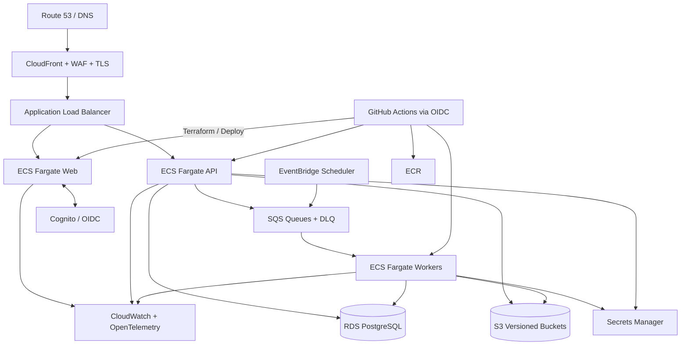

## 14.3 Compute

### Web

- 最低1 Task
- HTTP Auto Scaling
- Read-only Root Filesystemを推奨
- Static AssetはCDN
- Graceful Shutdown
- Health Check

### API

- 最低1 Task
- RollingまたはBlue/Green
- DB Connection Pool制御
- ReadinessはMigration/Dependency状態を確認
- Public/Admin Rate Limitを分離

### Worker

- Queue別Concurrency
- Scale-to-zeroまたは低最小数を選択
- Fargate Spotは中断許容JobだけMAY
- Publication/Financial Jobは通常Capacity
- Graceful Stop時にVisibility/Leaseを延長または解放

## 14.4 Database

Production:

- Managed PostgreSQL
- Encryption
- Automated Backup/PITR
- Parameter監視
- Connection Pool
- Major Version Upgrade手順
- Read Replicaは負荷に応じて後続
- Multi-AZは事業段階と費用で有効化するが、GATE-2以降を推奨

Stagingは小規模でもRestore Testを実行できる構成にする。

## 14.5 Object Storage

Bucket分離例:

- `raos-prod-raw`
- `raos-prod-publication`
- `raos-prod-uploads-quarantine`
- `raos-prod-exports`
- `raos-prod-logs-audit`

Versioning、Encryption、Lifecycle、Public Access Blockを設定する。Public商品画像をProxy保存するかは利用条件に従い、MVPでは許可URLをそのまま使用することを基本とする。

## 14.6 Queue

AWS SQS Standard Queueを基準とし、順序が必要なPublication処理はApplication Lockまたは必要に応じFIFOを検討する。Standard Queueは重複配送を前提とするため、Consumer冪等性を必須とする。

DLQ Alarm:

- visible message count > 0
- oldest message age
- redrive rate
- repeated error class
- affected published articles

## 14.7 Scheduler

EventBridge等のManaged Schedulerを使用し、Scheduler自体に業務Secretを持たせない。QueueへSchedule Jobだけを送る。

## 14.8 CI/CD

### Pull Request

1. Format/Lint
2. Type Check
3. Unit Test
4. Schema/Contract Compatibility
5. Policy Test
6. Security Scan
7. Container Build
8. Integration Test
9. Preview/Artifact
10. Required Review

### Main Merge

1. Immutable Image Build
2. SBOM
3. Image Scan
4. Sign/Attest
5. Deploy Dev
6. Smoke
7. Deploy Staging
8. Migration Dry Run
9. E2E/Contract
10. Manual Production Approval
11. Production Deploy
12. Post-deploy Verification

GitHub ActionsからAWSへはOIDCを利用し、長期Access Keyを置かない。

## 14.9 Database Migration

- Alembic等のMigration Tool
- MigrationはCode Review必須
- Expand-Migrate-Contract
- 破壊的変更は複数Release
- Production MigrationをOne-off Taskで実行
- Lock時間を事前測定
- Down Migrationを盲信せず、Backup/Forward Fixを準備
- Schema VersionをHealth/Telemetryへ出す

## 14.10 Deployment Rollback

### Application

直前Imageへ戻す。Migration互換性を保つ。

### Publication

Publication Snapshot Versionを戻す。

### Configuration

Configuration Versionを戻す。

### Provider

Adapter Version/Model Routeを旧版へ切替。

### Database

PITRは重大災害時に使用し、通常の内容誤りには使わない。

## 14.11 Infrastructure as Code

Terraformを基準とし、次をコード化する。

- Network
- IAM
- ECS/ECR
- ALB/CloudFront/WAF
- RDS
- S3
- SQS/DLQ
- Scheduler
- Secret Metadata
- Monitoring/Alert
- DNS/TLS
- Backup
- Budget

Terraform Stateは暗号化・Lock・アクセス監査を行う。

## 14.12 Cost Profiles

### Profile A: Local/CI

Docker Compose、PostgreSQL、MinIO、LocalStackまたはQueue Fake。

### Profile B: MVP Production

最小Web/API、需要駆動Worker、Managed DB、S3、SQS、CDN。処理量より固定費を抑える。

### Profile C: GATE-2/3

Multi-AZ、Worker分離、強化監視、Read Scaling、WAF Rule拡張。

### Profile D: GATE-4

複数カテゴリ、Queue Shard、Read Model分離、分析Warehouse検討。

具体費用はRAOS-OPS-001で算定し、月次Budget Alertを設ける。

## 14.13 Disaster Recovery

暫定目標:

- Public Content RTO: 4時間以内
- Core Admin RTO: 8時間以内
- PostgreSQL RPO: 15分以内を目標
- Immutable Object RPO: ほぼ0を目標
- Audit Export RPO: 24時間以内

手順:

1. Incident宣言
2. Affiliate Links Off
3. DNS/CDN状態確認
4. DB PITRまたはSnapshot Restore
5. Object Version確認
6. Application再Deploy
7. Publication Projection再構築
8. Integrity Check
9. 限定公開
10. 全面復旧
11. Postmortem

RTO/RPOはRestore Test実績で更新する。

## 14.14 Local Development

`docker compose up`で次を起動できる。

- web
- api
- worker
- postgres
- object store emulator
- queue emulator/fake
- oidc dev providerまたはtest auth
- mail/notification sink
- telemetry collector

外部APIはRecorded FixtureとFake Adapterを標準とし、誤って本番Credentialを使えないGuardを入れる。

---

# 15. Quality Attributes and SLOs

## 15.1 可用性

| 対象 | MVP SLO |
|---|---|
| 公開サイト | 月間99.5% |
| 管理画面/API | 月間99.0% |
| Affiliate CTA安全評価 | 不明時は非表示 |
| Publication成功 | 99%超、再実行含む |
| Scheduled Critical Job | 期限内98%超 |

検索流入の少ないMVPで過剰な高可用性投資をしないが、安全統制は可用性低下時も維持する。

## 15.2 性能

公開ページはCore Web Vitalsの良好基準を目標とする。

- LCP: p75 2.5秒以下
- INP: p75 200ms以下
- CLS: p75 0.1以下

追加目標:

- Public API cached p95: 300ms以下
- Admin Query p95: 1秒以下
- Command受付 p95: 500ms以下
- Click Beacon受付 p95: 300ms以下
- Publish反映: 通常5分以内
- Global Affiliate Link Off: 通常5分以内、目標1分

数値は実測で調整するが、公開性能を維持するため巨大Client Bundleと無制限画像を禁止する。

## 15.3 信頼性

- Job handlerは冪等
- 重複Eventで最終状態不変
- Blocking Rule未評価でPublish不可
- Raw Snapshot保存失敗時はNormalization確定不可
- Publication Snapshot保存失敗時はPublic Projection更新不可
- Revenue Import合計不整合時は確定不可
- Audit保存失敗時は重大Command失敗

## 15.4 データ完全性

- 主要Claim Evidence Coverage 100%
- 全Claim Evidence Coverage 95%以上
- Public Snapshot hash検証
- Commission Reconciliation差異0または明示Adjustment
- Article VersionとPublication Versionの対応100%
- Source Packet hash不一致0
- Orphan Public Route 0

## 15.5 セキュリティ

- Secret Repository露出0
- Unauthorized Publish 0
- MFA対象Role 100%
- Critical Vulnerability未対処でProduction Deploy不可
- Audit対象重大操作Coverage 100%
- Admin Endpointの認可E2E 100%

## 15.6 運用性

- P0/P1 AlertにRunbook
- JobのCorrelation ID Coverage 100%
- Manual Retry理由Coverage 100%
- Restore Testを定期実行
- DeploymentのCommit/Image/Schema/Policy Versionを追跡
- One-clickではなくOne-commandで安全なLocal Setup

## 15.7 コスト

- 全LLM JobにUsage/Cost
- Published ArticleへAI/API費用配賦
- Daily/Monthly Budget Alert
- Hard Cap超過時に低優先AI Job停止
- Queue Backlogによる想定費用をDashboard表示
- 未使用環境の自動停止を検討

## 15.8 保守性

- Module Dependency RuleをCIで検査
- Domain層からFramework import禁止
- OpenAPI/JSON SchemaからClient生成
- Config/Policy/PromptをVersion管理
- 主要関数の型Coverage
- MigrationとFixtureの再現性
- ADRなしの重大技術変更を禁止

## 15.9 アクセシビリティ

- Keyboard Navigation
- Visible Focus
- Semantic Heading
- Link Destination明示
- Product Image alt
- Comparison TableのHeader
- Colorだけに依存しない状態表示
- 管理画面のReview操作もKeyboard対応
- 自動検査＋手動検査

## 15.10 可搬性

- Docker Image
- PostgreSQL標準機能優先
- S3/Queue/IdentityはPort
- Provider SDKをAdapterへ限定
- Public Snapshot SchemaをProvider非依存
- Terraform ModuleをCloud固有層へ隔離
- Business LogicをCMS Pluginへ置かない


---

# 16. Observability and Operations Architecture

## 16.1 三本柱

### Logs

JSON形式で、次を標準Fieldとする。

```text
timestamp
level
service
environment
release
trace_id
span_id
request_id
correlation_id
job_id
article_id
category_id
provider
operation
event
result
duration_ms
error_class
retry_count
```

秘密、Token、Prompt全文、成果CSV行、Affiliate URLの不要な全文をLogへ出さない。

### Metrics

- HTTP request count/latency/error
- Queue depth/age
- Job success/retry/DLQ
- Provider latency/error/rate limit
- LLM token/cost/schema failure
- Publication success/latency/rollback
- Stale exposure
- Broken link
- Claim evidence coverage
- Quality pass
- Click beacon loss estimate
- Import reconciliation
- Budget
- DB connections/locks
- Cache hit
- Core Web Vitals

### Traces

HTTP CommandからOutbox、Queue、Worker、Provider、DB、Object Storageまでcorrelationを維持する。ProviderがTrace Headerを受けない場合もProvider Request IDをSpan Attributeにする。

## 16.2 Health Check

### Liveness

プロセスが動作しているかのみ。外部Provider障害でLivenessを落とさない。

### Readiness

- DB接続
- 必須Config
- Schema互換
- Queue発行
- Kill Switch Cache
- Public Snapshot Schema

外部楽天/OpenAI障害はDependency Statusへ出すが、公開Read APIを全面停止しない。

## 16.3 Dashboard

### Executive

- Confirmed Contribution Profit
- Confirmed RPM/EPC
- Published Articles
- Gate Status
- Critical Alerts
- Budget

### Editorial

- Review Queue
- Quality Distribution
- Evidence Coverage
- First-pass Approval
- Human Minutes
- Correction/Rollback

### Catalog/Freshness

- Fresh/Stale Offers
- Refresh Backlog
- Provider Error
- Link Health
- Affected Articles

### AI

- Job Volume
- Model Route
- Cost
- Schema Failure
- Evidence Failure
- Human Edit
- Critical Defect

### Operations

- Service Health
- Queue/DLQ
- Error Budget
- Deploy
- DB/Storage
- Backup/Restore
- Security Events

## 16.4 Alert

| Priority | 条件例 | 初動 |
|---|---|---|
| P0 | Secret漏えい、管理者侵害、誤送客、重大規約、全CTA不正 | Kill Switch、Incident |
| P1 | Publication失敗継続、Stale Exposure超過、DLQ、Auth失敗 | Freeze対象処理、調査 |
| P2 | Provider高Error、AI品質低下、Import不整合 | Queue抑制、修正 |
| P3 | Budget予告、Backup遅延、低優先Job滞留 | 営業時間対応 |

Alertは一時的な単発ErrorでNoiseを出さず、Rate、Duration、Impactを使う。ただしP0は単発でも通知する。

## 16.5 Runbook

最低限作成するRunbook:

- RB-001 Global Affiliate Links Off
- RB-002 Publication Freeze
- RB-003 Wrong Product/Link
- RB-004 Rakuten API Auth/Schema Failure
- RB-005 LLM Provider Failure
- RB-006 Queue/DLQ Recovery
- RB-007 Revenue Import Reconciliation
- RB-008 DB Restore
- RB-009 Object Snapshot Recovery
- RB-010 Admin Account Compromise
- RB-011 Secret Rotation
- RB-012 Policy Change Impact
- RB-013 Search/Analytics Import Failure
- RB-014 Rollback Article
- RB-015 Public Performance Regression

## 16.6 Audit Export

Audit Eventを定期的にObject StorageへExportし、日次Manifestとhashを作る。DB管理者だけで過去Auditを消せない防御層を設ける。

## 16.7 Synthetic Monitoring

- Public Top Page
- Sample Article
- Disclosure存在
- API Credit存在
- Affiliate CTA host/label
- Global Kill Switch動作
- Admin Login
- Publish Dry Run
- Public Snapshot hash
- Sitemap
- robots
- Click Beacon
- Backup freshness

Production Syntheticは購入や成果を発生させない。

## 16.8 Capacity Management

監視する閾値:

- Queue oldest age
- Worker utilization
- DB CPU/connection/IO
- Object growth
- API Provider budget
- LLM spend
- CDN hit ratio
- Web p95
- Publication queue serial delay

Scaleは記事数だけでなく、Job数、Observation数、Sourceサイズ、Analytics rowsで判断する。

## 16.9 Postmortem

P0/P1はBlameless Postmortemを作る。

- Timeline
- Detection
- User/Revenue/Compliance Impact
- Root Cause
- Contributing Factors
- Why safeguards failed
- Recovery
- Corrective actions
- Test/Runbook update
- Requirement/ADR impact

---

# 17. Testing Architecture

## 17.1 Test Pyramid

| Layer | 対象 | 実行 |
|---|---|---|
| Static | Type、Lint、Dependency、Schema | 全PR |
| Unit | Domain Rule、計算、State Machine | 全PR |
| Property | 冪等性、財務不変条件、URL Rule | 全PR |
| Integration | DB、Object、Queue、Adapter | 全PR/定期 |
| Contract | 楽天、Google、LLM Schema | Fixture＋定期Live |
| Component | API/Worker単位 | 全PR |
| E2E | 企画→公開→計測 | Staging |
| Security | Auth、XSS、SSRF、Secret、File | PR/定期 |
| Performance | Public/API/Queue | Release/定期 |
| Resilience | Timeout、重複、Provider停止 | 定期 |
| Restore | DB/Object/Publication | 定期 |
| AI Eval | Golden Dataset | Prompt/Model変更 |

## 17.2 Unit Test重点

- Editorial ScoreにAffiliate Rateが入らない
- Article State Machine
- Publication条件
- Freshness判定
- Safe Degradation
- Claim Evidence
- Quality Score
- Commission計算
- Attribution合計
- Idempotency
- URL Host Allowlist
- Disclosure挿入
- Retention Class
- Role Permission

Critical Domain RuleはBranch Coverage 100%を目標とする。

## 17.3 Property-based Test

### 財務

```text
provider_total
= directly_attributed
+ estimated_allocated
+ unattributed
+ adjustments
```

### Publication

- 同一CommandをN回実行してもPublication Versionが不必要に増えない
- 未承認Versionはどの入力組合せでも公開できない
- Global Link Off中はCTAが出ない

### Catalog

- Observation順序が入れ替わってもCurrent ProjectionがPolicyに従う
- Stale値はFresh値として出ない

### URL

- 許可HostのSubdomain判定
- Unicode/Redirect/Port/Private IP
- 不正Scheme拒否

## 17.4 Contract Test

### 楽天

- API Version Fixture
- Required Field
- Optional/Null
- Pagination
- Error Response
- 429/5xx
- Affiliate URL
- Image URL
- Review Aggregateのみ
- Secret Redaction

### Search Console/GA4

- Auth Scope
- Dimension/Metric
- Pagination/Row Limit
- Empty Result
- Data Revision
- Quota Error

### LLM

- Structured Output
- Refusal
- Schema Violation
- Usage
- Timeout
- Rate Limit
- Provider Error
- Model Route

Live Contract Testは低頻度・低負荷で実行し、CredentialとCostを制御する。

## 17.5 Golden Source Dataset

MVPカテゴリから最低限次を含む。

- 正常な同一商品複数Offer
- 型番差
- 容量差
- セット数差
- 終売
- 在庫不明
- Price欠損
- 誤同一性候補
- Source競合
- Unsupported claim誘発
- 架空体験誘発
- Review本文混入
- 最上級表現
- Stale Source
- Affiliate URL異常

## 17.6 AI Eval Gate

Prompt/Model Route変更時に次を比較する。

- Schema success
- Claim precision
- Evidence coverage
- Unsupported claim
- Product identity
- Prohibited phrase
- Edit distance
- Cost
- Latency
- Refusal
- Critical defect

Critical defectがBaselineより増える変更は、平均品質が上がってもRejectする。

## 17.7 E2E Scenario

### E2E-001 Happy Path

Category→Keyword→Plan→Rakuten Import→Source Packet→AI Draft→Quality→Review→Approve→Publish→Public View→Click Event。

### E2E-002 Missing Evidence

Packetが不足しGeneration不可。

### E2E-003 Stale Price

公開中にPrice期限切れとなり価格だけ非表示。

### E2E-004 Wrong Link

Link Check失敗でCTA Off、本文継続。

### E2E-005 Kill Switch

Global Affiliate Offが全Sample Pageへ反映。

### E2E-006 Rollback

新版公開後に旧正常版へ戻り、Auditが残る。

### E2E-007 Duplicate Job

同一Jobを複数配送して最終状態が1件。

### E2E-008 Provider Failure

楽天/OpenAI停止で既存公開を壊さない。

### E2E-009 Revenue Import

Duplicate CSV、Dry Run、承認、Reconcile、Profit。

### E2E-010 Policy Change

新Ruleで影響記事がQueue化される。

## 17.8 Security Test

- 未認証Admin
- Role横断
- IDOR
- CSRF
- Stored/Reflected XSS
- CSP
- SSRF
- Open Redirect
- Affiliate URL Tamper
- CSV Formula
- Zip Bomb
- Secret in Log
- Prompt Injection
- Session Revocation
- MFA Bypass
- Service Account Misuse

## 17.9 Performance Test

- Cached Article
- Uncached Article
- Product Projection Join
- Admin Article List
- Review Diff
- Click Beacon Burst
- Queue Batch
- Publication Batch
- Import 1年分想定
- DB Connection Exhaustion

MVP想定の10倍まで基本機能が安全に縮退することを確認する。大量処理時もProvider Rate Limitを超えない。

## 17.10 Resilience Test

- Queue重複
- Queue遅延
- Worker Kill
- DB短時間切断
- Object Storage失敗
- Provider Timeout
- DNS失敗
- Clock Skew
- Partial Publish
- Cache Purge失敗
- Audit書込失敗
- Budget超過

## 17.11 Restore Test

- RDS Snapshot/PITRから別環境へ復元
- Object VersionからSnapshot復元
- Public Projection再構築
- Audit Manifest検証
- Secret再発行
- DNS切替Dry Run
- RTO/RPO実測

## 17.12 GATE-0 Test Pack

- 媒体/HTTPS Checklist
- Disclosure Template
- API Credit
- 正規Link
- Review本文禁止
- Image Rule
- Provenance
- Human Approval
- Kill Switch
- Secret Scan
- Policy/Privacy Page
- Critical Test 0

## 17.13 GATE-1 Test Pack

- 30～45記事全件Quality
- Claim coverage
- Product identity
- Link
- Freshness timestamp
- Click measurement
- Cost attribution
- Human time
- Rollback
- Audit
- First-pass approval

---

# 18. Repository and Code Architecture

## 18.1 Monorepo

```text
raos/
├─ AGENTS.md
├─ README.md
├─ Makefile
├─ docker-compose.yml
├─ .github/
│  └─ workflows/
├─ apps/
│  ├─ web/
│  ├─ api/
│  └─ worker/
├─ packages/
│  ├─ web-ui/
│  ├─ web-contracts/
│  └─ policy-schemas/
├─ python/
│  └─ raos/
│     ├─ domain/
│     │  ├─ iam/
│     │  ├─ portfolio/
│     │  ├─ catalog/
│     │  ├─ evidence/
│     │  ├─ editorial/
│     │  ├─ ai/
│     │  ├─ policy/
│     │  ├─ publishing/
│     │  ├─ freshness/
│     │  ├─ analytics/
│     │  ├─ finance/
│     │  └─ ops/
│     ├─ application/
│     ├─ ports/
│     ├─ adapters/
│     ├─ api/
│     ├─ workers/
│     └─ shared/
├─ prompts/
├─ policies/
├─ schemas/
│  ├─ openapi/
│  ├─ events/
│  ├─ content/
│  └─ ai/
├─ migrations/
├─ infra/
│  ├─ terraform/
│  └─ docker/
├─ tests/
│  ├─ fixtures/
│  ├─ contract/
│  ├─ e2e/
│  ├─ security/
│  └─ evals/
├─ docs/
│  ├─ adr/
│  ├─ runbooks/
│  └─ architecture/
└─ scripts/
```

実際のPython package managerやNode package managerは実装時の安定版を選ぶが、LockfileをCommitする。

## 18.2 Dependency Rule

許可:

```text
domain <- application <- adapters/framework
ports are defined inward and implemented outward
```

禁止:

- DomainがSQLAlchemy Modelへ依存
- DomainがFastAPI HTTPExceptionを返す
- DomainがOpenAI/AWS SDKをimport
- WebがDBへ直接書込
- PublishingがFinance Tableを直接更新
- EditorialがAffiliate Rate Fieldを参照
- Public RendererがInternal SchemaをQuery

Architecture Testでimport graphを検査する。

## 18.3 Domain ModelとPersistence Model

Domain EntityとORM Modelを分離する。単純なCRUD領域ではMappingコストを抑えてよいが、Article、Approval、Publication、Commission、Job等の重要Aggregateは明示Mappingする。

## 18.4 API Contract

- OpenAPI 3.1
- `/api/v1`
- JSON
- UTC timestamp
- Problem Details形式のError
- Request ID
- Idempotency-Key
- ETag/If-Match
- Cursor Pagination
- Stable enum
- Deprecation Header
- Generated TypeScript Client

詳細はRAOS-API-001で定義する。

## 18.5 Error Model

```json
{
  "type": "https://errors.raos.local/policy-blocked",
  "title": "Publication blocked",
  "status": 409,
  "code": "POLICY_BLOCKED",
  "detail": "...",
  "instance": "...",
  "request_id": "...",
  "correlation_id": "...",
  "violations": []
}
```

User-facing detailとInternal detailを分ける。

## 18.6 Configuration

分類:

- Build Config
- Environment Config
- Runtime Config
- Policy Config
- Secret
- Feature Flag
- Kill Switch

Runtime ConfigはVersion、Effective Time、Approverを持つ。Secret値をRuntime Configへ混ぜない。

## 18.7 Feature Flag

用途:

- 新Adapter
- 新Prompt Route
- 新UI
- Shadow Evaluation
- Limited Category
- Auto Refresh範囲

禁止:

- Disclosureを消す
- Human Approvalを迂回
- Auditを無効
- Secret Scanを回避
- Blocking Policyを無承認解除

## 18.8 Coding Standards

Python:

- 型注釈
- Pydantic/Dataclass境界
- AsyncはI/O境界に限定
- Decimal
- UTC-aware datetime
- Result/Error class
- Structured Log
- No bare except
- Provider SDK exceptionを外へ漏らさない

TypeScript:

- strict
- Runtime Schema Validation
- Server/Client Component境界
- Accessibility
- No dangerous HTML
- Generated API Types
- Error Boundary
- Stable test selectors

## 18.9 AGENTS.md

Codex向けに次を明記する。

- 上位文書とADRの優先
- 変更可能Directory
- 禁止依存
- Test command
- Migration rule
- Secret禁止
- 実装前に参照するRequirement ID
- 1 PR 1 Scope
- 完了条件
- 未決事項を勝手に固定しない
- Policy/Financial/Publication変更は追加Review

## 18.10 Pull Request Template

- Requirement IDs
- ADR
- Scope
- Design
- Security/Compliance
- Migration
- Rollback
- Tests
- Observability
- Cost
- Screenshots
- Open Issues
- Generated/AI-assisted code確認

## 18.11 Release Metadata

各Serviceは次を返せる。

- git_sha
- image_digest
- build_time
- schema_version
- active_policy_bundle
- active_prompt_routes
- config_version
- environment

Public Endpointへは必要最小限だけ出す。

## 18.12 Database Fixture

- Synthetic only
- Deterministic seed
- No production copy
- Provider raw fixtures
- Golden content
- Security malicious fixtures
- Japanese文字・Encoding
- Timezone boundary
- Financial rounding

## 18.13 Local Commands

例:

```text
make bootstrap
make dev
make test
make test-contract
make test-e2e
make lint
make migrate
make seed
make policy-test
make eval
make build
```

コマンド名は実装で調整可能だが、開発者が複数の手動手順を覚えなくてよい入口を作る。

---

# 19. Scalability and Evolution

## 19.1 GATE別の構成

### GATE-0～1：0～45記事

- 単一DB
- 3 Application Container
- 単一Site
- Queue分離は論理中心
- Native Renderer
- CSV Import
- Human Approval 100%

### GATE-2：最大150記事

- Worker Queue別Auto Scaling
- Search/Analytics定期取込
- Stronger Alert
- Multi-AZ検討
- Read Model Cache強化
- Random Audit

### GATE-3：最大500記事

- AI/Publication/Analytics Worker物理分離
- DB Query最適化
- Aggregate Table
- Source/Observation Lifecycle
- Provider Rate Budget
- Data Warehouseの必要性評価
- 複数カテゴリ準備

### GATE-4：1,500記事以上検討

- Site/Category Tenant境界
- Analytics Warehouse
- Search Index
- Service分割候補
- 複数収益Provider
- 複数Reviewer
- Queue Shard
- Dedicated Read Model

## 19.2 Service分割トリガー

次の複数が成立する場合だけ分割する。

- Moduleごとに独立したRelease頻度が必要
- Team所有が分かれる
- DB負荷特性が大きく異なる
- Security Boundaryが必要
- Queue処理量がAPIへ影響
- 障害分離の事業価値が運用コストを上回る
- Schema Ownershipが安定
- Event Contract Testが成熟

最初の候補はAnalytics/FinanceまたはAI Workerであり、Article/PublishingのTransaction Coreは最後まで一体でもよい。

## 19.3 Dedicated Vector DBトリガー

- pgvector indexがDB主負荷を阻害
- Vector件数・更新量が増大
- Advanced Filtering/Hybrid Searchが必要
- 別Scalingが費用合理的
- Rebuild/Backup運用が確立

MVPでQdrant等を先行導入しない。

## 19.4 Search Engineトリガー

Public Siteの全文検索はMVP必須ではない。導入条件:

- 500記事以上
- ユーザー検索需要
- PostgreSQL FTSで不足
- Facet/Typo/Rankingが必要
- 運用費回収見込み

## 19.5 Data Warehouseトリガー

- 日次集計がOLTPへ影響
- GA/GSC/Click/Commissionの長期分析が複雑
- イベント量増加
- BI User増加
- 再計算コスト増加

それまではPostgreSQL集計とMaterialized Projectionを使う。

## 19.6 Multi-site

MVPでもStable IDとSite IDを主要Aggregateへ持たせることはMAYだが、全Queryを無理にMulti-tenant化しない。GATE-4前にTenant Isolation Designを別途作る。

## 19.7 Kubernetes

採用条件:

- 多数Service
- 高いDeployment頻度
- 専任Platform運用
- ECS制約が明確
- 費用・複雑性を回収

記事数だけを理由に採用しない。

---

# 20. Alternatives and Trade-offs

## 20.1 Microservices

### 却下理由

- MVP規模に対し運用面が過剰
- 分散Transaction
- Service間認証
- Event Contract
- Local開発複雑化
- Observability負担

### 将来

Module境界、Outbox、Portを先に作るため、必要時に分離可能。

## 20.2 WordPressを正本

### 利点

- 編集UI
- Plugin
- SEO運用
- 人材

### 却下理由

- Claim/Evidenceの構造化が難しい
- 公開状態とRAOS状態の二重正本
- 任意HTMLとPluginでPolicyを迂回しやすい
- Product Card鮮度制御が分散
- Rollback/AI provenanceが弱い

将来はPublication Adapterとして利用可能。

## 20.3 Headless WordPress

Traditional WordPressより分離しやすいが、RAOSとWordPressのContent Model同期が増える。MVPではNative Repositoryが簡潔。

## 20.4 Next.js単体Full-stack

小規模なら可能だが、AI/Data Processing、Python ecosystem、長時間Job、Domain再利用のためFastAPI/Workerを分離する。

## 20.5 Serverless Functions中心

### 利点

- Scale-to-zero
- 小規模費用
- Managed

### 却下理由

- 長時間AI/Import
- 実行制限
- Local差
- 大量Source
- Workflow可視性

HTTPの一部は将来Serverlessへ移せるが、基準はContainer。

## 20.6 Temporal等Workflow Engine

高度な長期Workflow、Retry、Visibilityに有効。ただしMVPでは学習・運用コストが大きい。Job State＋SQS＋Outboxで開始し、複雑なWorkflowが増えた場合に再評価する。

## 20.7 Celery＋Redis

Pythonで一般的だが、Redis運用、Broker/Result Backend、重複/監視の追加が必要。AWS基準ではSQSをManaged Queueとして選ぶ。LocalではQueue PortにFakeを使う。

## 20.8 Kafka

順序・Stream処理の要件がなく、MVPには過剰。Outbox＋SQSで十分。

## 20.9 Qdrant/専用Vector DB

MVPの類似検索量ではPostgreSQL/pgvectorで十分。別Backup、Auth、Monitoringを避ける。

## 20.10 完全静的サイト

性能・安全性は高いが、価格/在庫/Link/Kill Switchの迅速な反映が難しい。静的/ISRと動的Public Projectionを組み合わせる。

## 20.11 Affiliate Redirect

Click計測は容易だが、Destination明示、Link改変、Tracking故障のリスクがある。直接Affiliate Link＋Beaconを選ぶ。

## 20.12 自律型Multi-agent

柔軟だが、再現性、費用、権限、Prompt Injection、監査が難しい。明示Workflowを採用する。

## 20.13 Multi-cloud

可用性より複雑性が上回る。Portabilityをコードで保ち、運用は単一Cloud。


---

# 21. Requirement Traceability

## 21.1 Functional Requirements

| Requirement | 実現Module/Component | 主な統制 | 受入Test |
|---|---|---|---|
| FR-001 | Portfolio、Editorial、PostgreSQL | Stable ID、Version、重複候補 | UT-PORTFOLIO、E2E-001 |
| FR-002 | Catalog、Rakuten Adapter、Object Storage | Raw保存、API Version、Contract | CT-RAKUTEN、E2E-001 |
| FR-003 | Catalog | Candidate/Canonical分離、Rule Version、Human Queue | UT-IDENTITY、GOLDEN-PRODUCT |
| FR-004 | Catalog、Evidence | Observation、Source Snapshot、Acquired At | UT-PROVENANCE |
| FR-005 | Portfolio、Editorial、Finance | Score Model分離、Dependency Test | UT-SCORE-SEPARATION |
| FR-006 | Evidence、AI Orchestration | Approved Source Packet Guard | E2E-002 |
| FR-007 | Evidence、Editorial、AI | Claim/Evidence Link、Integrity Check | UT-CLAIM、E2E-001 |
| FR-008 | Quality & Policy | Blocking Rule、Quality Score、Policy Version | POLICY-TEST、AI-EVAL |
| FR-009 | Editorial、Publishing、IAM | State Machine、Role、Approval | E2E-UNAPPROVED-PUBLISH |
| FR-010 | Publishing、Public Web | Snapshot、Publication Action、Rollback | E2E-006 |
| FR-011 | Catalog、Freshness、Publishing | URL検査、Host、Direct Link、CTA State | SEC-LINK、E2E-004 |
| FR-012 | Catalog、Freshness | Observation、Schedule、Impact Query | E2E-003 |
| FR-013 | Analytics | Stable IDs、Beacon、GSC/GA4 Adapter | E2E-CLICK、DATA-QUALITY |
| FR-014 | Finance | Commission Status、Immutable Import | UT-COMMISSION |
| FR-015 | Finance | Decimal、Allocation、Cost Join | UT-ECONOMICS |
| FR-016 | Portfolio、Freshness、Finance | Priority Projection、理由付き候補 | UT-PRIORITY |
| FR-017 | Quality & Policy | Policy Bundle、Affected Article Query | E2E-010 |
| FR-018 | AI、Finance、Operations | AI Attempt、Usage、Cost | UT-AI-COST |
| FR-019 | Operations、Publishing、Public Web | Kill Switch、Fail Closed | E2E-005 |
| FR-020 | Operations、IAM | Append-only Audit、Export | AUDIT-E2E |

## 21.2 Non-functional Requirements

| Requirement | アーキテクチャ対応 | Evidence |
|---|---|---|
| NFR-SEC-001 | Secret Manager、Redaction、CI Secret Scan、OIDC Deploy | Security Test、Scan Report |
| NFR-SEC-002 | RBAC、Resource Scope、Service Principal | Authorization E2E |
| NFR-REL-001 | Idempotency、Inbox、Unique Constraint、Job Lease | Duplicate Job Test |
| NFR-REL-002 | Retry、Circuit Breaker、Quarantine、Safe Projection | Provider Failure Test |
| NFR-REL-003 | Publication Snapshot、Deployment Rollback | Rollback E2E |
| NFR-PERF-001 | CDN、SSR/Static、Cache、RUM | CWV Dashboard |
| NFR-OBS-001 | OTel、JSON Log、Metrics、Alert | Telemetry Coverage |
| NFR-AUD-001 | Append-only Audit、Reason、Actor、Hash Export | Audit Test |
| NFR-DATA-001 | Raw→Fact→Packet→Claim→Snapshot Lineage | Provenance Query Test |
| NFR-COST-001 | Job Cost、Article Allocation、Budget | Cost Reconciliation |
| NFR-PORT-001 | Native Repository、Publication Port | Adapter Contract |
| NFR-MAINT-001 | Config/Prompt/Policy Version | Config Audit |
| NFR-TEST-001 | Test Pyramid、Policy-as-code、CI | GATE Test Packs |
| NFR-ACC-001 | Semantic Renderer、Keyboard、Automated/Manual | Accessibility Report |
| NFR-BACKUP-001 | RDS PITR、S3 Version、Restore Test | Restore Evidence |

## 21.3 Compliance Requirements

| Requirement | 構造的実現 |
|---|---|
| COMP-RAK-001 | Site Configurationに登録状態とHTTPS Gate |
| COMP-RAK-002 | Affiliate URLはCatalog Adapterのみ生成、Editor入力不可、hash検査 |
| COMP-RAK-003 | CTA Templateで「楽天市場」を明示 |
| COMP-RAK-004 | 運用Policy、自己購入を計測試験に使わない |
| COMP-RAK-005 | CTA文言Allowlist、禁止誘導Rule |
| COMP-RAK-006 | Adapter SchemaにReview本文Fieldなし、Source/Prompt検査 |
| COMP-RAK-007 | Image Referenceを許可URLとして保持、加工Pipelineなし |
| COMP-RAK-008 | Paid SearchはMVP外、Configで禁止 |
| COMP-RAK-009 | Finance Modelに上限・確定概念、ただし値は設定 |
| COMP-RAK-010 | Policy Bundle、定期確認、影響Query |
| COMP-RWS-001 | API Version Config、Contract Test |
| COMP-RWS-002 | Secret Manager |
| COMP-RWS-003 | Renderer固定Credit |
| COMP-RWS-004 | Rate Limit、Retry、Circuit |
| COMP-RWS-005 | Review Aggregateのみ |
| COMP-RWS-006 | Pagination/Limit Budget |
| COMP-RWS-007 | Source Snapshot metadata |
| COMP-GOOG-001 | Native Decision Value、Quality Gate |
| COMP-GOOG-002 | GATE Scale Limit |
| COMP-GOOG-003 | Similarity/Copy Risk、Source Boundary |
| COMP-GOOG-004 | Editorial Policy Page |
| COMP-GOOG-005 | Public Route/Noindex Gate |
| COMP-AD-001 | Renderer固定Disclosure |
| COMP-AD-002 | Benefit/PR Relationship FieldとTemplate |
| COMP-AD-003 | Claim EvidenceとSnapshot |
| COMP-AD-004 | Prohibited Superlative Rule |

## 21.4 GATE対応

### GATE-0

| 条件 | Architecture Evidence |
|---|---|
| HTTPS媒体 | CDN/TLS、Site Config |
| API Credit | Renderer Template |
| Affiliate Disclosure | Renderer Template |
| Official Link | Catalog Adapter |
| No Review Body | Schema/Policy |
| Image Handling | Image Reference Rule |
| Provenance | Evidence Module |
| Human Approval | State Machine |
| Emergency Stop | Kill Switch |
| Secret Scan | CI |
| Policy Pages | Structured Site Pages |
| Zero Critical Test | GATE-0 Test Pack |

### GATE-1

| 条件 | Architecture Evidence |
|---|---|
| 30～45記事 | Portfolio/Editorial |
| Quality 85 | Quality Engine |
| Critical factual 0 | Blocking Finding |
| Claim provenance | Evidence Query |
| Fabricated experience 0 | Claim Type/Rule |
| Broken links 0 | Freshness/Link Check |
| First-pass approval | Review Analytics |
| Freshness timestamp | Public Product Projection |
| Measurement connected | Analytics Module |
| Cost/time measurable | Finance/Operations |
| Rollback | Publication Snapshot |

---

# 22. Architecture Risk Register

| ID | Risk | Likelihood | Impact | Mitigation | Trigger |
|---|---|---:|---:|---|---|
| ARCH-RISK-001 | Native Editor開発が想定以上 | M | M | Block範囲限定、Markdownではなく必要Block優先 | GATE-0遅延 |
| ARCH-RISK-002 | 商品同一性誤判定 | H | H | 自動Merge閾値、人間Queue、Rule Version | 誤商品Finding |
| ARCH-RISK-003 | 楽天API仕様変更 | M | H | Adapter、Raw、Contract、Shadow | Schema failure |
| ARCH-RISK-004 | Affiliate URLの規約解釈不足 | M | H | 直接Link、公式確認、Link Policy | Warning/異常 |
| ARCH-RISK-005 | 成果のArticle帰属精度不足 | H | M | FactとEstimate分離、Unattributed表示 | 不帰属率高 |
| ARCH-RISK-006 | GA/GSCとFirst-party値の差 | H | L/M | Data Quality Metric、正本分離 | 差分率上昇 |
| ARCH-RISK-007 | LLM品質の非決定性 | H | H | Schema、Evidence、Eval、Human Gate | Defect増加 |
| ARCH-RISK-008 | Prompt Injection | M | H | Tool禁止、Source分離、Allowlist | Injection eval |
| ARCH-RISK-009 | AI費用暴走 | M | M | Hard Cap、Queue Budget、Cache | Spend anomaly |
| ARCH-RISK-010 | SQS重複で二重公開 | M | H | Idempotency、Expected Version、Unique | Duplicate test |
| ARCH-RISK-011 | CacheにStale価格残存 | M | H | Separate Projection、TTL、Invalidation | Stale exposure |
| ARCH-RISK-012 | Kill Switch反映遅延 | L/M | H | Generation key、short TTL、synthetic | Drill failure |
| ARCH-RISK-013 | 1名運用で職務分離不能 | H | M | Role切替、再認証、理由、Random audit | Self approval |
| ARCH-RISK-014 | AWS固定費が収益前に大きい | M | M | Minimal profile、scale-to-zero、Budget | 月次上限 |
| ARCH-RISK-015 | PostgreSQLに集計負荷集中 | L/M | M | Materialized View、Job、後続Warehouse | p95/CPU |
| ARCH-RISK-016 | Object Storage原本が肥大 | M | L/M | Lifecycle、Compression、Retention class | Growth budget |
| ARCH-RISK-017 | Policy Rule誤検出で公開停止 | M | M | Shadow、Severity、Waiver手順 | false positive |
| ARCH-RISK-018 | Policy Rule見逃し | L/M | H | Layered checks、manual checklist、audit | incident |
| ARCH-RISK-019 | 外部Source取得のSSRF/著作権 | M | H | Allowlist、manual first、sandbox | source request |
| ARCH-RISK-020 | CSV Parser誤取込 | M | H | Dry Run、hash、reconcile、version | mismatch |
| ARCH-RISK-021 | DB Migrationで停止 | L/M | H | Expand-contract、dry run、backup | lock duration |
| ARCH-RISK-022 | 管理者アカウント侵害 | L/M | Critical | MFA、session revoke、WAF、audit | anomaly |
| ARCH-RISK-023 | SecretがAI/Logへ送信 | L/M | Critical | Field allowlist、redaction tests | scan finding |
| ARCH-RISK-024 | Public SnapshotとDB不一致 | M | H | hash、version、rebuild check | integrity alert |
| ARCH-RISK-025 | Next.js/Framework更新影響 | M | M | Lock、LTS/Stable、staging、ADR | upgrade |
| ARCH-RISK-026 | 人間レビュー時間が高止まり | H | M | Correction labels、eval、UI改善 | > target |
| ARCH-RISK-027 | 過剰な自動更新が推薦を変える | M | H | Non-editorial field allowlist | diff finding |
| ARCH-RISK-028 | Public Click Beacon欠損 | H | L/M | GA4比較、Beacon nonblocking、推定 | gap |
| ARCH-RISK-029 | Attribution推定を確定と誤認 | M | H | UI/Schema分離、label、test | reporting bug |
| ARCH-RISK-030 | 早期Microservice化 | L/M | M | ADR-001、split triggers | proposal |

Risk OwnerとReview DateはRAOS-OPS-001で設定する。

---

# 23. Codex Implementation Slices

本節は詳細Backlogではなく、Architecture Skeletonを安全に実装する順序である。各Sliceは原則1～数PRに限定し、次のSliceへ進む前に受入条件を通す。

## SLICE-001 Repository Bootstrap

**目的**: Monorepo、開発規約、CIの土台。

**成果**:

- Repository構造
- AGENTS.md
- Python/TypeScript strict設定
- Formatter/Linter/Type/Test
- Docker Compose skeleton
- PR Template
- ADR directory
- Architecture dependency check skeleton

**受入**:

- `make bootstrap && make test`相当が成功
- Secret sampleのみ
- CIが空実装でも動作
- Requirement IDをPRへ記載可能

## SLICE-002 Local Infrastructure

**目的**: 外部本番へ接続せず開発可能。

**成果**:

- PostgreSQL
- S3 emulator
- Queue fake/emulator
- OIDC test auth
- Telemetry collector
- Health endpoints

**受入**:

- One-command起動
- Synthetic seed
- 本番Credential検知で起動拒否
- Clean reset可能

## SLICE-003 Shared Kernel and IDs

**成果**:

- UUID/Display ID
- UTC/JST utility
- Money/Decimal
- Domain Error
- Correlation
- Config
- Hash
- Audit interface

**受入**:

- Property tests
- No framework dependency in domain
- Type coverage

## SLICE-004 PostgreSQL, Migration, Outbox, Inbox

**成果**:

- Schema bootstrap
- Migration workflow
- Transactional outbox
- Dispatcher
- Inbox receipt
- Idempotency record
- Job state/lease

**受入**:

- Duplicate delivery test
- DB commit/queue failure simulation
- Retry safe
- Migration CI

## SLICE-005 IAM and Admin Shell

**成果**:

- OIDC integration
- User/Role/Permission
- Admin route
- MFA claim handling
- Audit login/role
- noindex admin

**受入**:

- Authorization matrix E2E
- Session revoke
- Unauthenticated access rejected
- Public/admin cookie separation

## SLICE-006 Portfolio Module

**成果**:

- Category/Cluster/Keyword/Opportunity
- CSV import
- Score separation
- Article plan
- Cannibalization candidate skeleton

**受入**:

- Affiliate rate cannot enter editorial score
- Stable IDs
- Unknown vs zero
- Import dry run

## SLICE-007 Object Storage and Raw Registry

**成果**:

- Raw Snapshot writer
- SHA-256
- Metadata
- Retention class
- Versioning config
- Upload quarantine

**受入**:

- Object write failure blocks canonical commit
- Secret redaction
- Hash verification
- Immutable path

## SLICE-008 Rakuten Adapter

**成果**:

- Configurable API version
- Secret injection
- Item/Genre/Ranking operation baseline
- Retry/rate/circuit
- Raw fixture
- Canonical error

**受入**:

- Official fixture contract
- 429/5xx
- Review body absent
- Affiliate URL untouched
- Request secret absent from logs

## SLICE-009 Catalog Normalization

**成果**:

- Product Candidate
- Offer
- Shop
- Observation
- Current Projection
- Grouping candidate
- Manual merge review

**受入**:

- Time-series observation
- Stale handling
- Grouping confidence
- Golden products

## SLICE-010 Evidence and Source Packet

**成果**:

- Source/Fact/Derived Fact
- Claim
- Evidence Link
- Packet Builder
- Packet Schema
- Approval

**受入**:

- Packet immutable/hash
- Missing evidence blocks
- Unsupported source excluded
- Lineage query

## SLICE-011 LLM Provider and Prompt Registry

**成果**:

- LLM Port
- OpenAI Adapter
- Prompt registry
- Model routes
- Structured output
- Usage/cost
- Recorded fake

**受入**:

- Schema/refusal/error tests
- No tool access
- Budget
- Prompt/Schema hash
- Provider raw saved

## SLICE-012 Draft Workflow

**成果**:

- Outline/draft tasks
- Article Version/Blocks
- Claim references
- AI validation
- Job UI

**受入**:

- Approved packet required
- Hallucinated Evidence ID blocks
- Product identity validation
- Retry state visible

## SLICE-013 Quality and Policy Engine

**成果**:

- Policy Bundle
- Rule engine
- Blocking/scoring
- Quality 100 point
- Waiver
- Affected article query

**受入**:

- Disclosure, experience, review, stale, link rules
- Policy version
- Shadow mode
- Gate tests

## SLICE-014 Review and Approval UI

**成果**:

- Structured editor
- Diff
- Claim drawer
- Finding resolution
- Approval/difference reason
- Preview

**受入**:

- Keyboard
- Conflict handling
- No arbitrary HTML
- Approval audit
- Blocking finding prevents approval

## SLICE-015 Publication Snapshot

**成果**:

- Candidate
- Snapshot schema/hash
- Public projection
- Publication state
- Idempotent publish
- rollback

**受入**:

- Unapproved publish impossible
- Duplicate command safe
- Snapshot immutable
- Rollback E2E

## SLICE-016 Public Web Renderer

**成果**:

- Article/category routes
- Product cards
- Disclosure/API credit
- SEO metadata
- Sitemap/robots
- Safe degradation
- RUM

**受入**:

- Public boundary test
- No internal data leak
- Core Web Vitals budget
- Stale price hidden
- CTA destination clear

## SLICE-017 Affiliate Click Analytics

**成果**:

- Direct anchor
- Beacon endpoint
- Event schema
- Idempotency/bot/rate
- GA4 event mapping

**受入**:

- Link works if beacon fails
- No redirect
- No URL modification
- Consent state
- Event identifiers

## SLICE-018 Freshness and Link Health

**成果**:

- Freshness policy
- Scheduler
- Refresh queue
- link check
- affected articles
- public invalidation

**受入**:

- Provider failure safe
- stale exposure test
- unavailable offer
- CTA off
- no automatic recommendation reorder

## SLICE-019 Search Console and GA4 Imports

**成果**:

- OAuth/service account config
- raw import
- canonical observations
- route mapping
- data quality
- dashboard projection

**受入**:

- quota/error
- duplicate import
- revised data
- missing route
- source distinction

## SLICE-020 Revenue CSV and Finance

**成果**:

- Upload/quarantine
- parser version
- dry run/approval
- commission status
- reconciliation
- cost allocation
- EPC/RPM/profit

**受入**:

- duplicate file
- formula injection
- total invariant
- adjustment
- confirmed vs generated
- estimated vs fact

## SLICE-021 Dashboard and Priority Queue

**成果**:

- Executive/editorial/catalog/AI/ops dashboard
- update/merge/delete/create candidates
- reason/explanation
- Gate status

**受入**:

- source and freshness displayed
- score separation
- data quality warning
- no unlabelled estimate

## SLICE-022 Kill Switch and Incident

**成果**:

- global/site/category/article/provider switches
- MFA/reason
- public fail-closed
- incident record
- session revoke hook
- alerts

**受入**:

- synthetic drill
- all CTA off within target
- publish freeze
- audit/export
- recovery procedure

## SLICE-023 Observability and Runbooks

**成果**:

- OTel
- structured logs
- metrics
- dashboards
- alerts
- runbooks
- synthetic checks

**受入**:

- correlation across queue
- no secrets
- P0 test
- DLQ alert
- cost metrics

## SLICE-024 AWS Infrastructure and CI/CD

**成果**:

- Terraform
- VPC
- ECS/ECR
- RDS
- S3
- SQS
- scheduler
- IdP
- secrets
- CDN/WAF
- GitHub OIDC

**受入**:

- staging deploy
- no public DB
- IaC scan
- immutable image
- rollback
- budget alarm

## SLICE-025 Backup, Restore, GATE Packs

**成果**:

- PITR/snapshot config
- object version
- restore script/runbook
- audit export
- GATE-0 and GATE-1 report

**受入**:

- restore drill
- RTO/RPO measured
- 30～45 article pilot readiness
- critical test zero
- architecture acceptance signed

## 23.1 Codex実行ルール

Codexへ各Sliceを依頼する際は、最低限次を渡す。

```text
対象Slice
Requirement IDs
ADR IDs
変更可能範囲
非対象
Acceptance Criteria
Test Commands
Migration/Rollback
Security/Compliance Notes
```

Codexは次をしてはならない。

- 未決のカテゴリやドメインを仮定して本番固定
- Secretをコード化
- Testを削除して通す
- Human Approvalを迂回
- Affiliate URLを書き換える
- Review本文をFixtureに持ち込む
- Architecture境界を暗黙に変更
- 巨大な一括PR
- 未使用のKubernetes/Qdrant/Kafka等を追加
- 「後で直す」としてBlocking Ruleを無効化

---

# 24. Architecture Acceptance Checklist

## 24.1 構造

- [ ] Module Boundaryがコードで検査可能
- [ ] Public/Admin/Internal APIが分離
- [ ] Public WebはPublic Projectionのみ参照
- [ ] Single DBの所有Schemaが定義
- [ ] External ProviderがAdapter化
- [ ] Object Storageの原本方針が実装可能
- [ ] Queue/Outbox/Inboxが定義
- [ ] State Machineが定義

## 24.2 コンプライアンス

- [ ] Affiliate URL非改変
- [ ] 直接リンク＋Beacon
- [ ] Disclosure固定
- [ ] API Credit固定
- [ ] Review本文Fieldなし
- [ ] Image加工Pipelineなし
- [ ] Fabricated Experience Blocking
- [ ] Policy Bundle
- [ ] Kill Switch

## 24.3 AI

- [ ] Approved Packet必須
- [ ] Structured Output
- [ ] Evidence Integrity
- [ ] Prompt/Model Version
- [ ] Cost/Budget
- [ ] Tool/DB/Public access禁止
- [ ] Human Approval
- [ ] Eval Dataset

## 24.4 Reliability

- [ ] Idempotency
- [ ] Duplicate delivery
- [ ] Retry/Error class
- [ ] DLQ
- [ ] Snapshot
- [ ] Rollback
- [ ] Safe degradation
- [ ] Restore test

## 24.5 Security

- [ ] OIDC/MFA
- [ ] RBAC
- [ ] Secret Manager
- [ ] Private DB
- [ ] CSP/XSS
- [ ] SSRF
- [ ] CSV quarantine
- [ ] Audit append-only
- [ ] Supply-chain scan
- [ ] Incident hooks

## 24.6 Operations

- [ ] Logs/Metrics/Traces
- [ ] Dashboard
- [ ] Alert priorities
- [ ] Runbooks
- [ ] Release metadata
- [ ] Config version
- [ ] Budget alert
- [ ] Backup/restore
- [ ] GATE report

---

# 25. Remaining Open Decisions

| ID | 未決事項 | 決定期限 | Architecture上の扱い |
|---|---|---|---|
| OPEN-001 | 初期カテゴリ | SLICE-006前後 | Category master/config |
| OPEN-002 | サイト名・ドメイン | Public staging前 | Site config |
| OPEN-003 | AWS Account/予算 | SLICE-024前 | Terraform variables |
| OPEN-004 | Keyword/Rank Provider | GATE-2前 | Adapter＋CSV |
| OPEN-005 | 楽天成果CSV形式の実サンプル | SLICE-020前 | Versioned parser |
| OPEN-006 | 人間Reviewerと単価 | GATE-1計測前 | Finance config |
| OPEN-007 | Product Identity Rule詳細 | RAOS-DATA-001 | Rule engine |
| OPEN-008 | Category別Freshness SLA | Public pilot前 | Runtime policy |
| OPEN-009 | Auto refresh field一覧 | SLICE-018前 | Allowlist |
| OPEN-010 | Analytics event taxonomy詳細 | RAOS-ANALYTICS-001 | Versioned event |
| OPEN-011 | 成果帰属方式 | RAOS-ANALYTICS-001 | Fact/estimate split |
| OPEN-012 | 法務Review境界 | GATE-0前 | Policy workflow |
| OPEN-013 | 許容月次固定費/AI費 | SLICE-011/024前 | Budget config |
| OPEN-014 | Retention具体日数 | RAOS-OPS-001 | Retention class |
| OPEN-015 | Multi-AZ開始条件 | GATE-2前 | Infrastructure profile |
| OPEN-016 | OIDC Provider最終選択 | SLICE-005前 | OIDC Port |
| OPEN-017 | 通知Channel | SLICE-023前 | Notification Adapter |
| OPEN-018 | 一次情報Allowlist | Source取込前 | Acquisition policy |
| OPEN-019 | Structured Data適用範囲 | Public pilot前 | Renderer config |
| OPEN-020 | 独自図表生成方式 | RAOS-CONTENT-001 | Separate media pipeline |

未決事項を理由にArchitectureを停止しない。CodexはInterface、Config、Fakeを先に実装し、実値を後から注入可能にする。


---

# 付録A. Port Interface Sketch

以下は詳細API仕様ではなく、依存方向を固定するための概念契約である。

## A.1 RakutenCatalogPort

```python
class RakutenCatalogPort(Protocol):
    async def search_items(
        self,
        request: RakutenItemSearchRequest,
        context: ProviderCallContext,
    ) -> ProviderResult[RakutenRawPage]: ...

    async def search_genres(
        self,
        request: RakutenGenreRequest,
        context: ProviderCallContext,
    ) -> ProviderResult[RakutenRawGenre]: ...

    async def get_ranking(
        self,
        request: RakutenRankingRequest,
        context: ProviderCallContext,
    ) -> ProviderResult[RakutenRawRanking]: ...
```

Domainへは`RakutenRaw*`を直接渡さず、Adapter内でRaw保存後、Canonical DTOへ変換する。

## A.2 ObjectStorePort

```python
class ObjectStorePort(Protocol):
    async def put_immutable(
        self,
        key: ObjectKey,
        content: bytes,
        metadata: ObjectMetadata,
        expected_sha256: str,
    ) -> StoredObject: ...

    async def get_verified(
        self,
        ref: ObjectRef,
        expected_sha256: str,
    ) -> bytes: ...

    async def tag_retention(
        self,
        ref: ObjectRef,
        retention_class: RetentionClass,
    ) -> None: ...
```

## A.3 QueuePort

```python
class JobQueuePort(Protocol):
    async def enqueue(self, message: JobMessage) -> EnqueueReceipt: ...
    async def cancel(self, job_id: JobId) -> CancelResult: ...
```

Queue receive/deleteはWorker Adapterが担当し、Application HandlerにはCanonical Job Contextだけを渡す。

## A.4 LLMPort

```python
class LLMPort(Protocol):
    async def generate_structured(
        self,
        request: CanonicalLLMRequest,
    ) -> CanonicalLLMResponse: ...
```

`CanonicalLLMResponse`を業務結果とみなす前にApplication層のValidationを通す。

## A.5 PublicationPort

```python
class PublicationPort(Protocol):
    async def publish(
        self,
        snapshot: PublicationSnapshot,
        expected_current_version: int | None,
    ) -> PublicationReceipt: ...

    async def rollback(
        self,
        article_id: ArticleId,
        target_publication_version: int,
    ) -> PublicationReceipt: ...

    async def set_index_state(
        self,
        route_id: RouteId,
        state: IndexState,
    ) -> None: ...
```

## A.6 AnalyticsSourcePort

```python
class AnalyticsSourcePort(Protocol):
    async def fetch(
        self,
        query: AnalyticsQuery,
        context: ProviderCallContext,
    ) -> AnalyticsRawResult: ...
```

## A.7 IdentityPort

```python
class IdentityPort(Protocol):
    async def verify_token(self, token: str) -> AuthenticatedPrincipal: ...
    async def revoke_sessions(self, subject_id: str) -> None: ...
```

## A.8 NotificationPort

```python
class NotificationPort(Protocol):
    async def send(self, notification: Notification) -> DeliveryReceipt: ...
```

---

# 付録B. Event Catalog

| Event | Producer | Consumer例 | Versioning注意 |
|---|---|---|---|
| iam.role_assigned | IAM | Audit、Alert | Permission schema |
| portfolio.category_approved | Portfolio | Scheduler、Dashboard | Category policy |
| portfolio.article_plan_created | Portfolio | Editorial | Plan snapshot |
| catalog.raw_ingested | Catalog | Normalizer、Audit | Provider version |
| catalog.offer_observed | Catalog | Freshness、Public Projection | Observation fields |
| catalog.product_grouped | Catalog | Evidence、Editorial | Grouping rule |
| catalog.product_changed | Catalog | Freshness、Publishing | Change class |
| evidence.source_packet_created | Evidence | Review | Packet schema |
| evidence.source_packet_approved | Evidence | AI | Immutable hash |
| ai.job_completed | AI | Editorial、Finance | Output schema |
| ai.job_blocked | AI | Review、Alert | Finding codes |
| editorial.draft_created | Editorial | Quality | Content schema |
| editorial.version_approved | Editorial | Publishing | Approval bundle |
| policy.bundle_activated | Policy | Quality、Publishing | Rule compatibility |
| policy.article_affected | Policy | Review Queue | Severity |
| publishing.snapshot_created | Publishing | Public Projection | Snapshot schema |
| publishing.published | Publishing | Cache、Sitemap、Analytics | Route/version |
| publishing.rolled_back | Publishing | Cache、Audit | Target version |
| freshness.offer_stale | Freshness | Publishing、Alert | SLA version |
| freshness.link_failed | Freshness | Public Projection | Failure class |
| analytics.click_recorded | Analytics | Aggregation | Event version |
| analytics.gsc_imported | Analytics | Dashboard | Dimension schema |
| finance.commission_imported | Finance | Economics | Parser version |
| finance.economics_recalculated | Finance | Dashboard、Portfolio | Formula version |
| ops.kill_switch_changed | Operations | All relevant | Generation/version |
| ops.job_quarantined | Operations | Alert、Operator UI | Error taxonomy |
| ops.incident_declared | Operations | Notification、Audit | Severity |

Eventを削除・改名する場合は新Versionを発行し、Consumer Migration期間を設ける。

---

# 付録C. State Machines

## C.1 Article

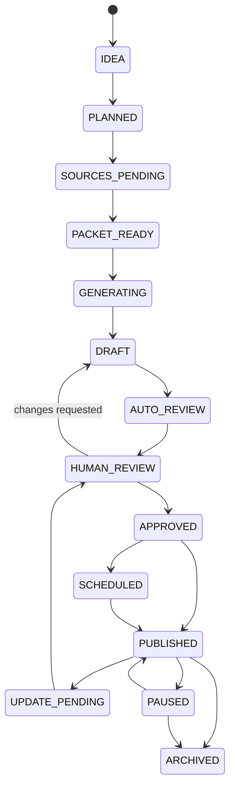

不正例:

- IDEA→PUBLISHED
- DRAFT→PUBLISHED
- AUTO_REVIEW→APPROVED without human
- ARCHIVED→PUBLISHED without new version/review

## C.2 Source Packet

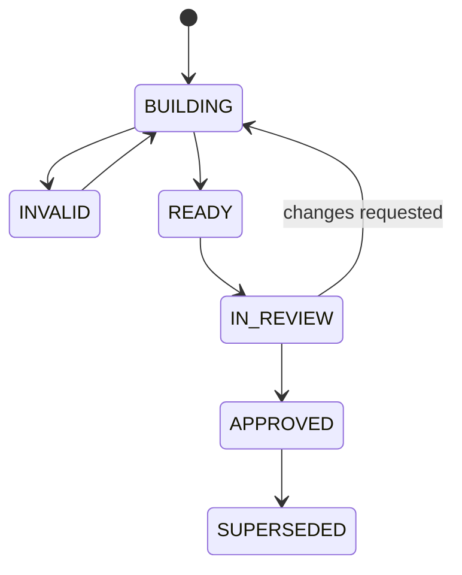

## C.3 Publication

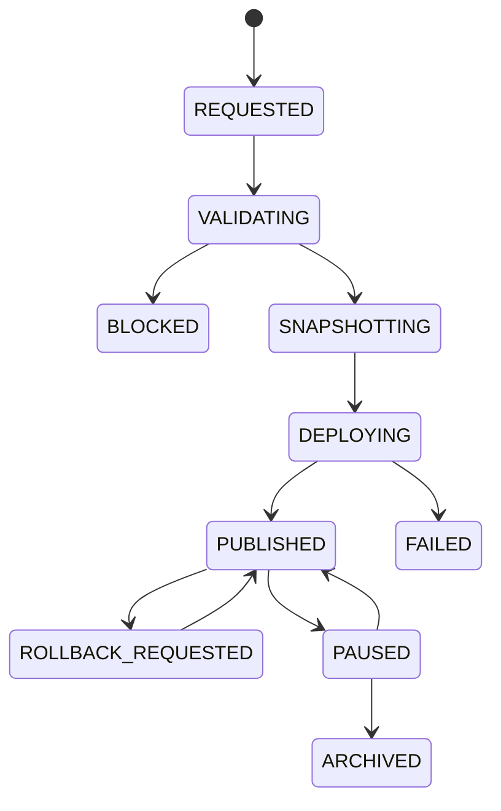

## C.4 Commission

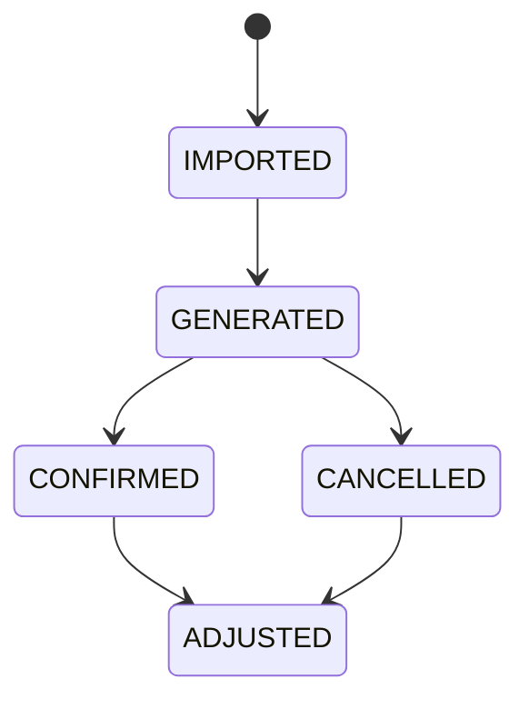

Providerの用語へ合わせつつ、発生と確定を別状態として保持する。

## C.5 Incident

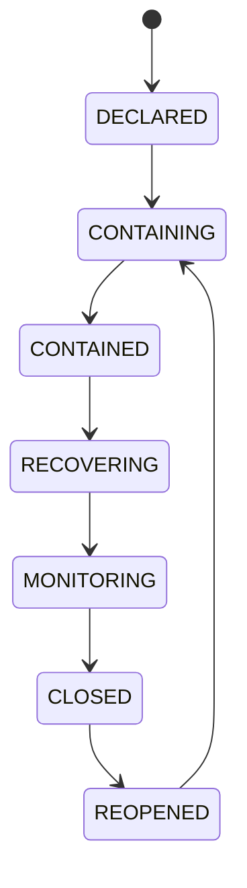

---

# 付録D. Failure Mode Matrix

| Component | Failure | User impact | Automatic action | Human action |
|---|---|---|---|---|
| Web | Container down | 一部閲覧不可 | CDN/Task再起動 | Deploy確認 |
| API | Down | 管理不可、公開Cacheは継続 | Restart/Alarm | Rollback |
| DB | Down | 管理・更新不可 | Read cache継続、publish freeze | Restore/Failover |
| Queue | Down | Job遅延 | Outbox蓄積 | Provider確認 |
| Worker | Down | 更新遅延 | Redelivery/scale | Image/bug確認 |
| S3 | Write failure | 新取込/公開停止 | Retry、commit拒否 | Storage incident |
| Rakuten | 429/5xx | 更新遅延 | Backoff、circuit | SLA判断 |
| OpenAI | Down | Draft遅延 | Retry/fallback/hold | Route変更 |
| GSC/GA4 | Down | Dashboard遅延 | Retry | 影響注記 |
| CSV parser | Contract mismatch | 成果反映遅延 | Quarantine | Parser更新 |
| CDN purge | Failure | 旧表示 | Short TTL/retry | Manual purge |
| Link check | False positive | CTA停止 | retry | waiver/調査 |
| Policy engine | Bug | 過剰/不足Blocking | shadow/rollback | hotfix |
| Kill switch store | Unreachable | CTA risk | fail closed | restore |
| OIDC | Down | 管理Login不可 | existing short session | IdP incident |
| Telemetry | Down | 可観測性低下 | local buffer | restore |

---

# 付録E. Configuration Catalog

| Config | Scope | Change approval |
|---|---|---|
| active_rakuten_api_version | provider | Operator＋PO |
| rakuten_rate_limits | provider | Operator |
| active_prompt_route | task/category | AI owner＋PO |
| quality_pass_score | site/category | PO＋Compliance |
| blocking_rules | policy | Compliance |
| freshness_sla | category/field | Editor＋Operator |
| auto_refresh_fields | category | PO＋Compliance |
| affiliate_links_enabled | site/category/article | Incident role |
| publication_enabled | site/category | PO/Incident |
| monthly_ai_budget | site/category | PO |
| retention_policy | data class | Security/Legal |
| search_provider | site | PO |
| analytics_property | environment | Operator |
| oidc_client | environment | Security |
| public_cache_ttl | content class | Operator |
| model_fallback | task | AI owner |
| human_review_required | article type | Cannot be disabled in MVP |

---

# 付録F. Official Reference Baseline

基準日2026-07-30時点で、設計時に確認した主要な公式資料。実装開始・Release前に再確認する。

1. 楽天市場商品検索API 2026-07-01  
   `https://webservice.rakuten.co.jp/documentation/ichiba-item-search`
2. 楽天市場ジャンル検索API 2026-07-01  
   `https://webservice.rakuten.co.jp/documentation/ichiba-genre-search`
3. 楽天市場属性検索API 2026-07-01  
   `https://webservice.rakuten.co.jp/documentation/ichiba-attribute-search`
4. Google Search Console API Reference  
   `https://developers.google.com/webmaster-tools/v1/api_reference_index`
5. Search Analytics Query  
   `https://developers.google.com/webmaster-tools/v1/searchanalytics/query`
6. URL Inspection API  
   `https://developers.google.com/webmaster-tools/v1/urlInspection.index/inspect`
7. Google Analytics Data API  
   `https://developers.google.com/analytics/devguides/reporting/data/v1`
8. OpenAI Structured Outputs  
   `https://developers.openai.com/api/docs/guides/structured-outputs`
9. OpenAI Batch API  
   `https://developers.openai.com/api/docs/guides/batch`
10. OpenAI Production Best Practices  
    `https://developers.openai.com/api/docs/guides/production-best-practices`
11. Amazon SQS at-least-once delivery  
    `https://docs.aws.amazon.com/AWSSimpleQueueService/latest/SQSDeveloperGuide/standard-queues-at-least-once-delivery.html`
12. AWS Fargate for ECS  
    `https://docs.aws.amazon.com/AmazonECS/latest/developerguide/AWS_Fargate.html`
13. Amazon RDS Point-in-time Recovery  
    `https://docs.aws.amazon.com/AmazonRDS/latest/UserGuide/USER_PIT.html`
14. Amazon S3 Versioning  
    `https://docs.aws.amazon.com/AmazonS3/latest/userguide/Versioning.html`
15. Amazon S3 Object Lock  
    `https://docs.aws.amazon.com/AmazonS3/latest/userguide/object-lock.html`
16. Core Web Vitals  
    `https://web.dev/articles/vitals`

外部仕様を本書へ転記した数値・挙動は、実装時の公式資料を正本とする。特にAPI版、認証、Quota、モデル機能、検索機能は変更され得る。

---

# 付録G. 用語

| 用語 | 定義 |
|---|---|
| Article | 論理的な記事 |
| Article Version | 編集内容の版 |
| Publication | 公開行為と公開状態 |
| Publication Snapshot | 公開可能な不変データ |
| Product | 正規化された商品概念 |
| Offer | Shop単位の販売条件 |
| Observation | 特定時点で観測した外部事実 |
| Source | 根拠の出所 |
| Fact | Sourceから正規化した事実 |
| Claim | 公開文の主張 |
| Source Packet | AI/編集へ渡す許可済み根拠集合 |
| Policy Bundle | 規約・品質Ruleの版付き集合 |
| Projection | 正本から再生成可能な読取データ |
| Outbox | DB TransactionとEvent発行を接続する記録 |
| Inbox | 重複Event処理を防ぐ受領記録 |
| Kill Switch | 公開・リンク・Provider等を緊急停止する統制 |
| Fact Attribution | Providerが直接紐付け可能な成果 |
| Estimated Attribution | 観測から推定した配賦 |
| Safe Degradation | 不確かな情報だけを隠し、安全に機能縮退すること |

---

# 付録H. 変更履歴

| 版 | 日付 | 変更 |
|---|---|---|
| v0.1 Draft | 2026-07-30 | 初版。MVP基準アーキテクチャ、ADR、Module、Deployment、Security、Codex Sliceを定義 |

---

# 結論

RAOSのMVPは、記事生成エージェント群を先に増やすのではなく、次の順序で価値と安全性を積み上げる。

1. Stable ID、原本、監査、Outbox
2. 楽天データの正規取得と商品正規化
3. Source PacketとClaim Provenance
4. Structured AI OutputとQuality Policy
5. 人間ReviewとApproval
6. Publication SnapshotとPublic Renderer
7. Freshness、Link、Kill Switch
8. Search/Behavior/Confirmed Commissionの統合
9. Unit Economics
10. GATEに基づく段階拡大

この順序を崩して「まず大量の記事を生成する」実装に進んではならない。RAOSの競争力は生成量ではなく、正しい根拠、更新可能性、説明可能性、費用・成果の閉ループを一つの運営基盤として持つことにある。
